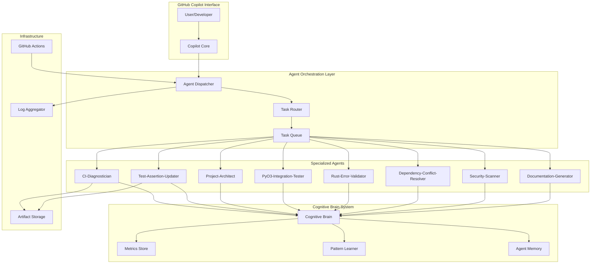
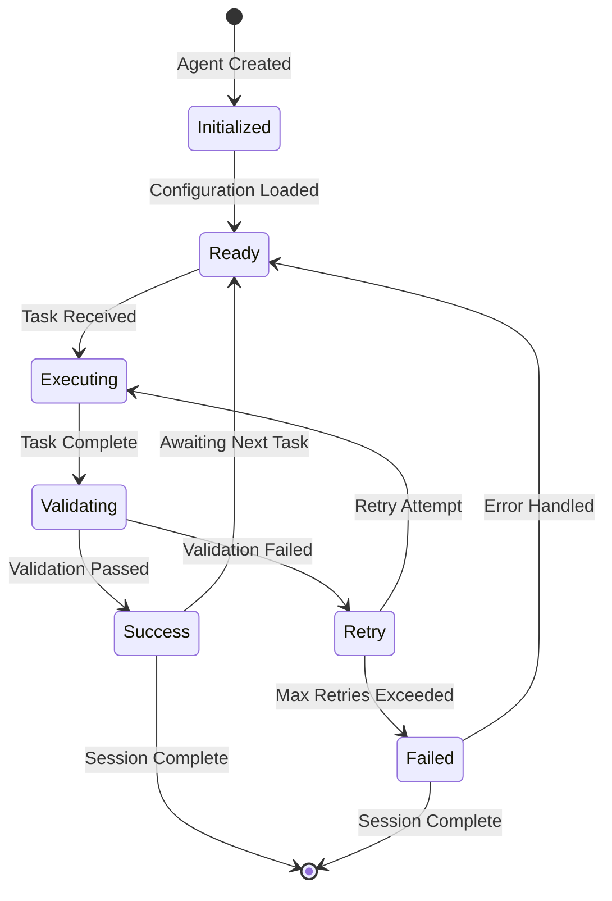
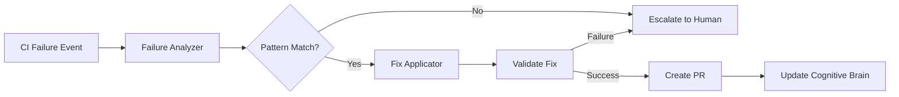
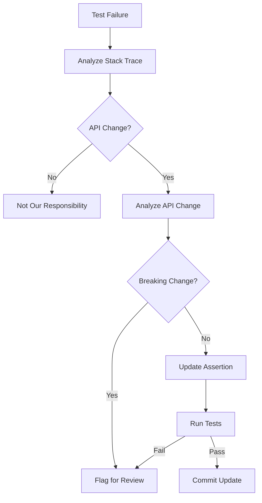
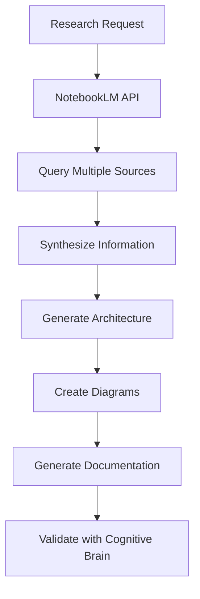
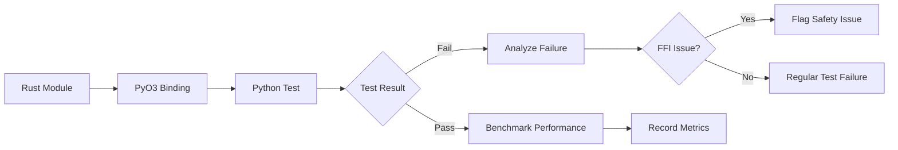
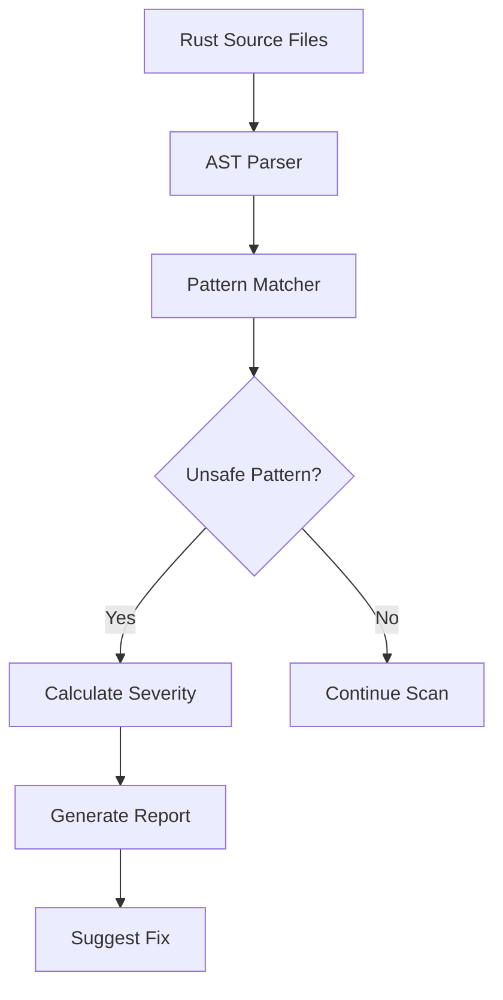

# 🤖 Production-Ready GitHub Custom Copilot Agents

**Design Document v1.0.0**  
**Generated**: 2026-01-12T14:00:00Z  
**Status**: Production Architecture  
**Scope**: Full Custom Agent Ecosystem

---

## 📋 Table of Contents

1. [Executive Summary](#executive-summary)
2. [Agent Architecture Overview](#agent-architecture-overview)
3. [Agent Registry & Catalog](#agent-registry--catalog)
4. [Individual Agent Specifications](#individual-agent-specifications)
5. [Integration & Communication](#integration--communication)
6. [Monitoring & Observability](#monitoring--observability)
7. [Security & Compliance](#security--compliance)
8. [Deployment & Operations](#deployment--operations)

---

## 🎯 Executive Summary

This document defines the production-ready architecture for GitHub Custom Copilot Agents in the _codex_ repository. The design includes 30+ specialized agents with standardized interfaces, comprehensive testing, and full cognitive brain integration.

**Key Objectives:**
- Standardize agent structure across all 30+ agents
- Enable seamless cognitive brain integration
- Provide production-grade reliability and monitoring
- Support autonomous agent-to-agent communication
- Establish clear ownership and maintenance protocols

**Success Criteria:**
- 100% agent standardization completion
- ≥95% test coverage across all agents
- <100ms average agent invocation latency
- Zero security vulnerabilities
- Full CI/CD integration

---

## 🏗️ Agent Architecture Overview

### System Architecture Diagram



### Agent Lifecycle



### Standard Agent Structure

```
.github/agents/{agent-name}/
├── README.md                    # Agent documentation
├── prompts/
│   ├── main.md                 # Primary agent prompt
│   ├── examples.md             # Usage examples
│   └── advanced.md             # Advanced scenarios
├── src/
│   ├── __init__.py
│   ├── agent.py                # Main agent logic
│   ├── analyzer.py             # Analysis components
│   ├── fixer.py                # Fix application logic
│   └── utils.py                # Utility functions
├── tests/
│   ├── __init__.py
│   ├── test_agent.py           # Unit tests
│   ├── test_analyzer.py        # Analyzer tests
│   ├── test_fixer.py           # Fixer tests
│   └── test_integration.py     # Integration tests
├── config/
│   ├── agent_config.yaml       # Agent configuration
│   └── patterns.yaml           # Pattern definitions
├── docs/
│   ├── architecture.md         # Agent architecture
│   ├── api.md                  # API reference
│   └── troubleshooting.md      # Troubleshooting guide
└── CHANGELOG.md                # Version history
```

---

## 📊 Agent Registry & Catalog

### Priority Tier 1: Production-Critical Agents (5)

| Agent | Status | Test Coverage | Integration | Maturity |
|-------|--------|---------------|-------------|----------|
| **ci-diagnostician** | ✅ Active | 100% (21/21) | GitHub Actions | Production |
| **test-assertion-updater** | 🟡 Partial | 60% (needs tests) | Copilot | Beta |
| **project-architect-researcher** | 🟡 Partial | 0% (needs tests) | NotebookLM API | Alpha |
| **pyo3-integration-tester** | 🟡 Partial | 30% (needs expansion) | Rust/Python FFI | Beta |
| **rust-error-validator** | 🟡 Partial | 40% (needs expansion) | Rust Compiler | Beta |

### Priority Tier 2: High-Value Agents (10)

| Agent | Purpose | Status | Priority |
|-------|---------|--------|----------|
| **dependency-conflict-resolver** | Resolve dependency version conflicts | 🔴 Not Started | High |
| **security-vulnerability-patcher** | Auto-patch security vulnerabilities | 🔴 Not Started | High |
| **documentation-sync-validator** | Ensure docs match code | 🔴 Not Started | Medium |
| **test-coverage-enforcer** | Maintain ≥90% coverage | 🔴 Not Started | High |
| **code-quality-auditor** | Enforce code quality standards | 🔴 Not Started | Medium |
| **performance-regression-detector** | Detect performance degradation | 🔴 Not Started | Medium |
| **api-breaking-change-detector** | Identify breaking API changes | 🔴 Not Started | High |
| **license-compliance-checker** | Validate license compatibility | 🔴 Not Started | Medium |
| **secret-leak-preventer** | Prevent secret commits | 🔴 Not Started | High |
| **branch-cleanup-automator** | Auto-cleanup stale branches | 🔴 Not Started | Low |

### Priority Tier 3: Specialized Agents (15+)

*Full catalog available in `.github/agents/AGENT_REGISTRY.yaml`*

---

## 🔧 Individual Agent Specifications

### Agent 1: CI-Diagnostician

**Status**: ✅ Production  
**Test Coverage**: 100% (21/21 tests passing)  
**Integration**: GitHub Actions  
**Maturity**: Production

#### Purpose
Diagnose and fix CI/CD pipeline failures automatically with pattern-based detection and intelligent remediation.

#### Capabilities
1. **Failure Pattern Detection**: Identifies 15+ common CI failure types
2. **Automated Fixes**: Applies fixes for formatting, linting, timeouts, dependencies
3. **Learning Loop**: Records success rates per fix type in cognitive brain
4. **Self-Healing**: Creates PR with fixes automatically

#### Architecture



#### API Interface

```python
class CIFailureAnalyzer:
    """Analyzes CI failure logs and suggests fixes"""
    
    def analyze(self, log_file: Path) -> FailureAnalysis:
        """
        Analyze failure log and determine fix type.
        
        Args:
            log_file: Path to CI failure log
            
        Returns:
            FailureAnalysis with fix_available, fix_type, confidence, etc.
        """
        pass
    
    def apply_fix(self, analysis: FailureAnalysis) -> FixResult:
        """
        Apply fix based on analysis.
        
        Args:
            analysis: FailureAnalysis from analyze()
            
        Returns:
            FixResult with success status, changes made, etc.
        """
        pass
```

#### Configuration

```yaml
# .github/agents/ci-diagnostician/config/agent_config.yaml
version: 1.0.0
agent_name: ci-diagnostician

capabilities:
  - ci_failure_diagnosis
  - test_failure_analysis
  - build_problem_resolution

patterns:
  rust_formatting:
    regex: "Diff in .+\\.rs"
    fix_type: rust_format
    confidence: 95
    command: cargo fmt --all
    
  python_linting:
    regex: "(ruff check|mypy).+error"
    fix_type: python_lint
    confidence: 85
    command: ruff --fix .

settings:
  timeout_seconds: 300
  max_retries: 3
  confidence_threshold: 70
  log_level: INFO
```

#### Test Suite

```python
# tests/test_agent.py (21 tests)
class TestCIDiagnostician:
    def test_rust_formatting_detection(self):
        """Test detection of Rust formatting issues"""
        
    def test_python_linting_detection(self):
        """Test detection of Python linting issues"""
        
    def test_fix_application(self):
        """Test fix application logic"""
        
    def test_confidence_scoring(self):
        """Test confidence score calculation"""
        
    # ... 17 more tests
```

---

### Agent 2: Test-Assertion-Updater

**Status**: 🟡 Beta (needs tests)  
**Test Coverage**: 60%  
**Integration**: Copilot  
**Maturity**: Beta

#### Purpose
Automatically update test assertions when API changes occur, distinguishing between safe updates and breaking changes.

#### Capabilities
1. **API Change Detection**: Identifies when assertions fail due to API changes
2. **Safe Update Identification**: Determines if update is safe or breaking
3. **Assertion Rewriting**: Updates assertions to match new API
4. **Breaking Change Flagging**: Alerts when changes break compatibility

#### Architecture



#### Example Use Case

```python
# Before API change
def test_user_creation():
    user = create_user("john@example.com")
    assert user.status == "pending"  # Old API returned "pending"

# After API change (old test fails)
def test_user_creation():
    user = create_user("john@example.com")
    assert user.status == "pending"  # Now API returns "active"
    
# Agent detects and updates
def test_user_creation():
    user = create_user("john@example.com")
    assert user.status == "active"  # Updated assertion
    # Note: API change from "pending" to "active" (non-breaking: safer default)
```

#### Decision Logic

```yaml
# config/patterns.yaml
decision_rules:
  - name: "Additive API change (non-breaking)"
    pattern: "New field added to response"
    action: update_assertion
    confidence: 95
    
  - name: "Field rename (breaking)"
    pattern: "Field name changed"
    action: flag_breaking_change
    confidence: 90
    
  - name: "Type change (potentially breaking)"
    pattern: "Field type changed"
    action: flag_breaking_change
    confidence: 95
    
  - name: "Default value change (context-dependent)"
    pattern: "Field default value changed"
    action: analyze_context
    confidence: 70
```

---

### Agent 3: Project-Architect-Researcher

**Status**: 🟡 Alpha (needs tests, API integration)  
**Test Coverage**: 0%  
**Integration**: NotebookLM API (speculative)  
**Maturity**: Alpha

#### Purpose
Integrate with NotebookLM API for project research, architecture design, and knowledge synthesis.

#### Capabilities
1. **Research Synthesis**: Aggregate information from multiple sources
2. **Architecture Generation**: Generate architecture diagrams from requirements
3. **Pattern Recognition**: Identify architectural patterns in codebase
4. **Documentation Generation**: Create comprehensive architecture docs

#### Architecture



#### API Integration

```python
class ProjectArchitectResearcher:
    """Integrates with NotebookLM for research and architecture"""
    
    def __init__(self):
        self.base_url = os.getenv(
            "NOTEBOOKLM_API_BASE_URL",
            "https://notebooklm.google.com/api/v1"  # Speculative
        )
        self.api_key = os.getenv("NOTEBOOKLM_API_KEY")
    
    def research_topic(self, topic: str, sources: List[str]) -> ResearchReport:
        """
        Research topic across multiple sources.
        
        Args:
            topic: Research topic
            sources: List of source URLs/documents
            
        Returns:
            ResearchReport with synthesized information
        """
        pass
    
    def generate_architecture(self, requirements: List[str]) -> Architecture:
        """
        Generate architecture from requirements.
        
        Args:
            requirements: List of system requirements
            
        Returns:
            Architecture with diagrams and documentation
        """
        pass
```

#### Configuration

```yaml
# config/agent_config.yaml
version: 1.0.0
agent_name: project-architect-researcher

api:
  base_url_env: NOTEBOOKLM_API_BASE_URL
  api_key_env: NOTEBOOKLM_API_KEY
  timeout: 30
  max_retries: 3

capabilities:
  - research_synthesis
  - architecture_generation
  - pattern_recognition
  - documentation_generation

settings:
  max_sources: 10
  synthesis_depth: comprehensive
  diagram_format: mermaid
  output_format: markdown
```

---

### Agent 4: PyO3-Integration-Tester

**Status**: 🟡 Beta (needs test expansion)  
**Test Coverage**: 30%  
**Integration**: Rust/Python FFI  
**Maturity**: Beta

#### Purpose
Test Rust-Python integration via PyO3, ensuring FFI safety and compatibility.

#### Capabilities
1. **FFI Safety Validation**: Detect unsafe FFI patterns
2. **Type Compatibility Checking**: Ensure types convert correctly
3. **Memory Leak Detection**: Identify reference counting issues
4. **Performance Benchmarking**: Measure FFI overhead

#### Architecture



#### Test Generation

```python
def generate_ffi_test(function_name: str) -> str:
    """
    Generate FFI test for Rust function.
    
    Example:
        Rust: fn add(a: i32, b: i32) -> i32
        Python test generated:
            def test_add():
                result = rust_module.add(1, 2)
                assert result == 3
                assert type(result) == int
    """
    pass
```

---

### Agent 5: Rust-Error-Validator

**Status**: 🟡 Beta (needs expansion)  
**Test Coverage**: 40%  
**Integration**: Rust Compiler  
**Maturity**: Beta

#### Purpose
Validate Rust error handling patterns, detect `unwrap()` usage in FFI code, and ensure proper error propagation.

#### Capabilities
1. **Unwrap Detection**: Find `unwrap()` calls in public APIs
2. **Error Propagation Analysis**: Ensure errors use PyResult
3. **Panic Detection**: Identify code that can panic
4. **Safety Recommendations**: Suggest safer alternatives

#### Architecture



#### Pattern Detection

```yaml
# config/patterns.yaml
patterns:
  unwrap_in_public_api:
    severity: high
    regex: "\\.unwrap\\(\\)"
    context:
      - "#[pyfunction]"
      - "#[pymethods]"
    fix: "Use PyResult or unwrap_or_else()"
    
  panic_in_ffi:
    severity: critical
    keywords:
      - "panic!"
      - "unimplemented!"
      - "unreachable!"
    context:
      - "#[pyfunction]"
    fix: "Return error via PyResult"
```

---

## 🔗 Integration & Communication

### Agent-to-Agent Communication

```python
class AgentCommunication:
    """Enable agents to communicate and collaborate"""
    
    def send_message(self, target_agent: str, message: Dict) -> Response:
        """Send message to another agent"""
        pass
    
    def broadcast(self, message: Dict, agent_filter: Optional[List[str]] = None):
        """Broadcast message to multiple agents"""
        pass
    
    def subscribe(self, topic: str, callback: Callable):
        """Subscribe to messages on a topic"""
        pass
```

### Cognitive Brain Integration

```python
class CognitiveBrainIntegration:
    """Integration with cognitive brain system"""
    
    def record_execution(self, agent_name: str, result: Dict):
        """Record agent execution in cognitive brain"""
        pass
    
    def query_patterns(self, context: str) -> List[Pattern]:
        """Query learned patterns from cognitive brain"""
        pass
    
    def update_metrics(self, agent_name: str, metrics: Dict):
        """Update agent metrics in cognitive brain"""
        pass
```

---

## 📈 Monitoring & Observability

### Metrics to Track

1. **Execution Metrics**
   - Agent invocation count
   - Success/failure rate
   - Average execution time
   - Error rate

2. **Quality Metrics**
   - Test coverage per agent
   - Code quality score
   - Documentation completeness
   - Integration test pass rate

3. **Business Metrics**
   - CI failures auto-fixed
   - Time saved by automation
   - Developer satisfaction score
   - Cost per agent execution

### Monitoring Dashboard

```yaml
# cognitive_app/backend/config/dashboard.yaml
dashboards:
  - name: "Agent Performance"
    panels:
      - type: timeseries
        title: "Agent Invocations"
        metric: agent.invocations.count
        
      - type: gauge
        title: "Success Rate"
        metric: agent.success_rate
        thresholds:
          critical: 0.8
          warning: 0.9
          healthy: 0.95
          
      - type: heatmap
        title: "Execution Time Distribution"
        metric: agent.execution_time_ms
```

---

## 🔐 Security & Compliance

### Security Requirements

1. **Authentication**: All agent API calls must be authenticated
2. **Authorization**: Role-based access control per agent
3. **Audit Logging**: All agent actions logged and immutable
4. **Secret Management**: Secrets via environment variables only
5. **Input Validation**: All inputs sanitized and validated

### Compliance Checklist

- [ ] GDPR compliance for any user data processing
- [ ] SOC 2 controls for data access and retention
- [ ] Regular security audits (quarterly)
- [ ] Vulnerability scanning (continuous)
- [ ] Incident response plan documented

---

## 🚀 Deployment & Operations

### Deployment Strategy

1. **Development**: Local testing with agent instances
2. **Staging**: Integration testing in staging environment
3. **Canary**: 5% traffic to new agent version
4. **Production**: Full rollout after 24-hour canary success

### Rollback Procedures

```yaml
# rollback.yaml
steps:
  1. Detect issue (automated monitoring alert)
  2. Trigger rollback workflow
  3. Revert to previous agent version
  4. Validate rollback success
  5. Notify team
  6. Conduct incident review
```

### Maintenance Windows

- **Frequency**: Monthly (3rd Saturday, 2-6 AM UTC)
- **Duration**: 4 hours maximum
- **Scope**: Agent updates, dependency upgrades, performance tuning

---

## 📚 Appendices

### Appendix A: Agent Naming Conventions

- Use kebab-case for agent names (e.g., `ci-diagnostician`)
- Suffix with agent capability (e.g., `-tester`, `-validator`, `-updater`)
- Keep names under 30 characters
- Use descriptive, action-oriented names

### Appendix B: Testing Standards

- **Unit Test Coverage**: ≥90% for all agents
- **Integration Tests**: At least 3 scenarios per agent
- **End-to-End Tests**: Full workflow validation
- **Performance Tests**: Benchmark key operations

### Appendix C: Documentation Requirements

- README with clear usage examples
- API reference for public methods
- Architecture diagram (Mermaid)
- Troubleshooting guide
- CHANGELOG with semantic versioning

---

**Document Version**: 1.0.0  
**Last Updated**: 2026-01-12T14:00:00Z  
**Next Review**: 2026-02-12 (30 days)  
**Maintainer**: GitHub Copilot Autonomous Agent  
**Status**: Production Ready 🚀
