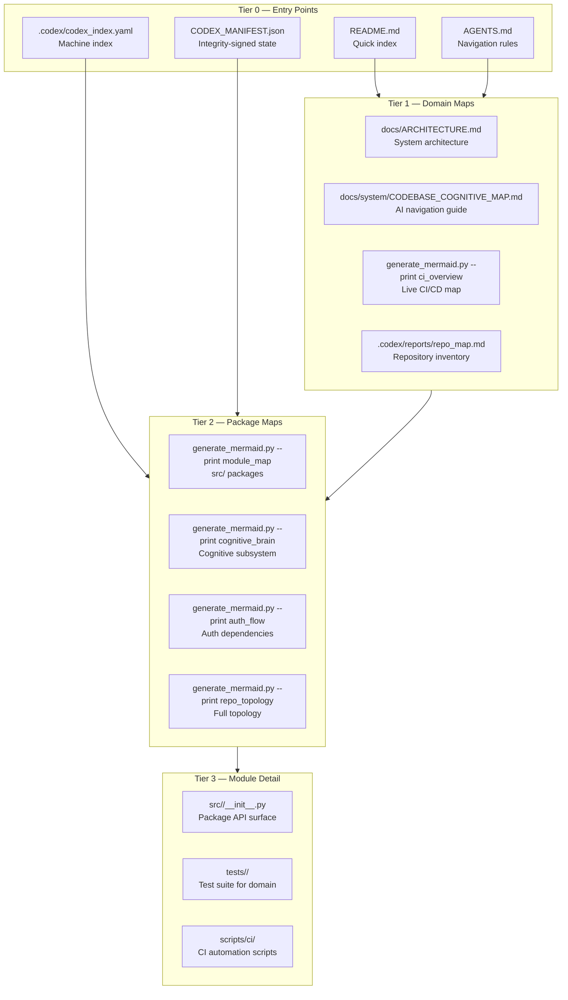
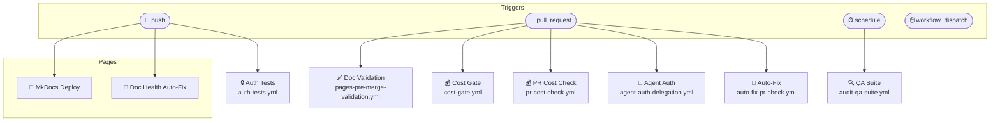
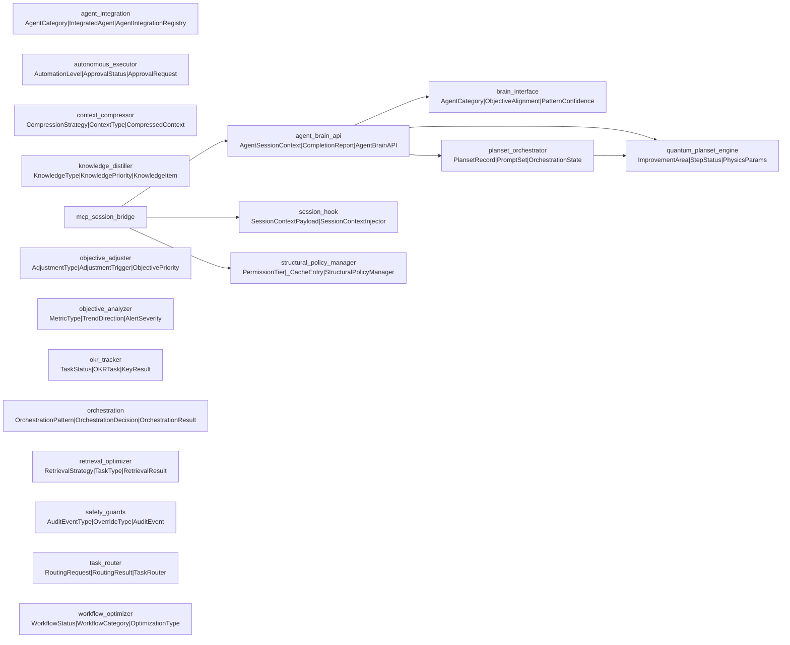

# 🗺 Agent Navigation Guide — Tiered Mermaid Maps
<!-- AUTO-GENERATED by scripts/ci/generate_mermaid.py --emit-nav — do not edit manually -->
<!-- Regenerate: python scripts/ci/generate_mermaid.py --emit-nav .codex/AGENT_NAVIGATION.md -->

## AI Navigation Contract

Agents MUST traverse this repository in layers:

| Tier | Layer | Purpose | Read first |
|------|-------|---------|-----------|
| 0 | Entry points | Canonical index + conventions | `README.md`, `AGENTS.md`, `.codex/codex_index.yaml` |
| 1 | Domain maps | Architecture + component topology | `docs/ARCHITECTURE.md`, `docs/system/CODEBASE_COGNITIVE_MAP.md` |
| 2 | Package maps | Live code structure derived from imports | `generate_mermaid.py --print module_map` |
| 3 | Module detail | Specific file inspection | Only when Tier 0–2 confirm relevance |

> **Rule:** Never jump from Tier 0 straight to Tier 3. Use Mermaid maps as scoped subgraph views.
> **Rule:** Prefer generated maps (this file, `generate_mermaid.py` output) over hand-drawn ones.
> **Rule:** Treat every static map as potentially stale — regenerate via `--emit-nav` on CI.

### Phase 10 Agent Set (Coverage/Resilience)

- `unified-coverage-agent`
- `fragile-test-guardian`
- `memory-sync-agent`

---

## Tier 0 — Entry Points



---

## Tier 1 — Repository Topology (Full)


---

## Tier 2 — Source Package Map

```mermaid
graph TD
  %% Auto-generated from src/ — do not edit
  ROOT["📦 src/"]
  agent["agent\n3 modules"]
  ROOT --> agent
  agent_adapters["adapters\n2 modules"]
  agent --> agent_adapters
  agents["agents\n2 modules"]
  ROOT --> agents
  cli["cli\n1 modules"]
  ROOT --> cli
  codex["codex\n19 modules"]
  ROOT --> codex
  codex_agents["agents\n2 modules"]
  codex --> codex_agents
  codex_analysis["analysis\n2 modules"]
  codex --> codex_analysis
  codex_analyze["analyze\n0 modules"]
  codex --> codex_analyze
  codex_api["api\n4 modules"]
  codex --> codex_api
  codex_archive["archive\n22 modules"]
  codex --> codex_archive
  codex_ast["ast\n13 modules"]
  codex --> codex_ast
  codex_ast_adapters["ast_adapters\n5 modules"]
  codex --> codex_ast_adapters
  codex_audit["audit\n1 modules"]
  codex --> codex_audit
  codex_auth["auth\n12 modules"]
  codex --> codex_auth
  codex_ci["ci\n1 modules"]
  codex --> codex_ci
  codex_cli["cli\n4 modules"]
  codex --> codex_cli
  codex_cognitive["cognitive\n19 modules"]
  codex --> codex_cognitive
  codex_config["config\n1 modules"]
  codex --> codex_config
  codex_db["db\n1 modules"]
  codex --> codex_db
  codex_diagram["diagram\n1 modules"]
  codex --> codex_diagram
  codex_dynamics["dynamics\n4 modules"]
  codex --> codex_dynamics
  codex_evidence["evidence\n1 modules"]
  codex --> codex_evidence
  codex_github["github\n1 modules"]
  codex --> codex_github
  codex_ingest["ingest\n2 modules"]
  codex --> codex_ingest
  codex_intent["intent\n2 modules"]
  codex --> codex_intent
  codex_interpretability["interpretability\n2 modules"]
  codex --> codex_interpretability
  codex_knowledge["knowledge\n6 modules"]
  codex --> codex_knowledge
  codex_logging["logging\n16 modules"]
  codex --> codex_logging
  codex_mapping["mapping\n2 modules"]
  codex --> codex_mapping
  codex_metrics["metrics\n2 modules"]
  codex --> codex_metrics
  codex_monitoring["monitoring\n1 modules"]
  codex --> codex_monitoring
  codex_monkeypatch["monkeypatch\n1 modules"]
  codex --> codex_monkeypatch
  codex_qa["qa\n1 modules"]
  codex --> codex_qa
  codex_quality["quality\n1 modules"]
  codex --> codex_quality
  codex_quantum_orchestrator["quantum_orchestrator\n5 modules"]
  codex --> codex_quantum_orchestrator
  codex_rag["rag\n9 modules"]
  codex --> codex_rag
  codex_refactoring["refactoring\n1 modules"]
  codex --> codex_refactoring
  codex_release["release\n2 modules"]
  codex --> codex_release
  codex_reporting["reporting\n1 modules"]
  codex --> codex_reporting
  codex_retrieval["retrieval\n7 modules"]
  codex --> codex_retrieval
  codex_search["search\n1 modules"]
  codex --> codex_search
  codex_security["security\n3 modules"]
  codex --> codex_security
  codex_session["session\n1 modules"]
  codex --> codex_session
  codex_transform["transform\n1 modules"]
  codex --> codex_transform
  codex_utils["utils\n9 modules"]
  codex --> codex_utils
  codex_verify["verify\n1 modules"]
  codex --> codex_verify
  codex_zendesk["zendesk\n2 modules"]
  codex --> codex_zendesk
  codex_audit["codex_audit\n5 modules"]
  ROOT --> codex_audit
  codex_bridge["codex_bridge\n1 modules"]
  ROOT --> codex_bridge
  codex_cli["codex_cli\n1 modules"]
  ROOT --> codex_cli
  codex_crm["codex_crm\n1 modules"]
  ROOT --> codex_crm
  codex_crm_cdm["cdm\n1 modules"]
  codex_crm --> codex_crm_cdm
  codex_crm_convert["convert\n1 modules"]
  codex_crm --> codex_crm_convert
  codex_crm_d365_admin["d365_admin\n1 modules"]
  codex_crm --> codex_crm_d365_admin
  codex_crm_diagram["diagram\n1 modules"]
  codex_crm --> codex_crm_diagram
  codex_crm_evidence["evidence\n1 modules"]
  codex_crm --> codex_crm_evidence
  codex_crm_pa_legacy["pa_legacy\n1 modules"]
  codex_crm --> codex_crm_pa_legacy
  codex_crm_zaf_legacy["zaf_legacy\n1 modules"]
  codex_crm --> codex_crm_zaf_legacy
  codex_crm_zd_admin["zd_admin\n1 modules"]
  codex_crm --> codex_crm_zd_admin
  codex_harness["codex_harness\n3 modules"]
  ROOT --> codex_harness
  codex_ml["codex_ml\n19 modules"]
  ROOT --> codex_ml
  codex_ml_analysis["analysis\n5 modules"]
  codex_ml --> codex_ml_analysis
  codex_ml_ast["ast\n0 modules"]
  codex_ml --> codex_ml_ast
  codex_ml_backends["backends\n1 modules"]
  codex_ml --> codex_ml_backends
  codex_ml_batching["batching\n1 modules"]
  codex_ml --> codex_ml_batching
  codex_ml_callbacks["callbacks\n3 modules"]
  codex_ml --> codex_ml_callbacks
  codex_ml_checkpointing["checkpointing\n7 modules"]
  codex_ml --> codex_ml_checkpointing
  codex_ml_cli["cli\n39 modules"]
  codex_ml --> codex_ml_cli
  codex_ml_config["config\n4 modules"]
  codex_ml --> codex_ml_config
  codex_ml_configs["configs\n0 modules"]
  codex_ml --> codex_ml_configs
  codex_ml_connectors["connectors\n4 modules"]
  codex_ml --> codex_ml_connectors
  codex_ml_data["data\n28 modules"]
  codex_ml --> codex_ml_data
  codex_ml_deployment["deployment\n2 modules"]
  codex_ml --> codex_ml_deployment
  codex_ml_detectors["detectors\n5 modules"]
  codex_ml --> codex_ml_detectors
  codex_ml_distributed["distributed\n1 modules"]
  codex_ml --> codex_ml_distributed
  codex_ml_docs["docs\n1 modules"]
  codex_ml --> codex_ml_docs
  codex_ml_eval["eval\n8 modules"]
  codex_ml --> codex_ml_eval
  codex_ml_evaluation["evaluation\n3 modules"]
  codex_ml --> codex_ml_evaluation
  codex_ml_events["events\n3 modules"]
  codex_ml --> codex_ml_events
  codex_ml_exec["exec\n1 modules"]
  codex_ml --> codex_ml_exec
  codex_ml_experiment["experiment\n0 modules"]
  codex_ml --> codex_ml_experiment
  codex_ml_features["features\n3 modules"]
  codex_ml --> codex_ml_features
  codex_ml_governance["governance\n1 modules"]
  codex_ml --> codex_ml_governance
  codex_ml_integrations["integrations\n1 modules"]
  codex_ml --> codex_ml_integrations
  codex_ml_interfaces["interfaces\n7 modules"]
  codex_ml --> codex_ml_interfaces
  codex_ml_io["io\n1 modules"]
  codex_ml --> codex_ml_io
  codex_ml_logging["logging\n12 modules"]
  codex_ml --> codex_ml_logging
  codex_ml_metrics["metrics\n18 modules"]
  codex_ml --> codex_ml_metrics
  codex_ml_modeling["modeling\n4 modules"]
  codex_ml --> codex_ml_modeling
  codex_ml_models["models\n10 modules"]
  codex_ml --> codex_ml_models
  codex_ml_monitoring["monitoring\n17 modules"]
  codex_ml --> codex_ml_monitoring
  codex_ml_peft["peft\n1 modules"]
  codex_ml --> codex_ml_peft
  codex_ml_perf["perf\n2 modules"]
  codex_ml --> codex_ml_perf
  codex_ml_plugins["plugins\n9 modules"]
  codex_ml --> codex_ml_plugins
  codex_ml_registry["registry\n8 modules"]
  codex_ml --> codex_ml_registry
  codex_ml_reproducibility["reproducibility\n1 modules"]
  codex_ml --> codex_ml_reproducibility
  codex_ml_reward_models["reward_models\n2 modules"]
  codex_ml --> codex_ml_reward_models
  codex_ml_rl["rl\n2 modules"]
  codex_ml --> codex_ml_rl
  codex_ml_safety["safety\n7 modules"]
  codex_ml --> codex_ml_safety
  codex_ml_security["security\n3 modules"]
  codex_ml --> codex_ml_security
  codex_ml_serving["serving\n9 modules"]
  codex_ml --> codex_ml_serving
  codex_ml_telemetry["telemetry\n2 modules"]
  codex_ml --> codex_ml_telemetry
  codex_ml_tokenization["tokenization\n15 modules"]
  codex_ml --> codex_ml_tokenization
  codex_ml_tracking["tracking\n11 modules"]
  codex_ml --> codex_ml_tracking
  codex_ml_training["training\n28 modules"]
  codex_ml --> codex_ml_training
  codex_ml_utils["utils\n59 modules"]
  codex_ml --> codex_ml_utils
  codex_ml_workflow["workflow\n1 modules"]
  codex_ml --> codex_ml_workflow
  codex_plans["codex_plans\n0 modules"]
  ROOT --> codex_plans
  codex_plans_batchsetpatchset_segments["batchsetpatchset_segments\n0 modules"]
  codex_plans --> codex_plans_batchsetpatchset_segments
  codex_utils["codex_utils\n1 modules"]
  ROOT --> codex_utils
  codex_utils_tracking["tracking\n1 modules"]
  codex_utils --> codex_utils_tracking
  cognitive_brain["cognitive_brain\n3 modules"]
  ROOT --> cognitive_brain
  cognitive_brain_active_learning["active_learning\n1 modules"]
  cognitive_brain --> cognitive_brain_active_learning
  cognitive_brain_agents["agents\n1 modules"]
  cognitive_brain --> cognitive_brain_agents
  cognitive_brain_analytics["analytics\n2 modules"]
  cognitive_brain --> cognitive_brain_analytics
  cognitive_brain_experiments["experiments\n7 modules"]
  cognitive_brain --> cognitive_brain_experiments
  cognitive_brain_integrations["integrations\n3 modules"]
  cognitive_brain --> cognitive_brain_integrations
  cognitive_brain_learning["learning\n3 modules"]
  cognitive_brain --> cognitive_brain_learning
  cognitive_brain_models["models\n2 modules"]
  cognitive_brain --> cognitive_brain_models
  cognitive_brain_monitoring["monitoring\n1 modules"]
  cognitive_brain --> cognitive_brain_monitoring
  cognitive_brain_quantum["quantum\n13 modules"]
  cognitive_brain --> cognitive_brain_quantum
  common["common\n8 modules"]
  ROOT --> common
  config["config\n1 modules"]
  ROOT --> config
  context_management["context_management\n13 modules"]
  ROOT --> context_management
  data["data\n4 modules"]
  ROOT --> data
  evaluation["evaluation\n2 modules"]
  ROOT --> evaluation
  experiments["experiments\n1 modules"]
  ROOT --> experiments
  hhg_logistics["hhg_logistics\n3 modules"]
  ROOT --> hhg_logistics
  hhg_logistics_data["data\n1 modules"]
  hhg_logistics --> hhg_logistics_data
  hhg_logistics_eval["eval\n1 modules"]
  hhg_logistics --> hhg_logistics_eval
  hhg_logistics_model["model\n2 modules"]
  hhg_logistics --> hhg_logistics_model
  hhg_logistics_monitor["monitor\n4 modules"]
  hhg_logistics --> hhg_logistics_monitor
  hhg_logistics_pipeline_nodes["pipeline_nodes\n3 modules"]
  hhg_logistics --> hhg_logistics_pipeline_nodes
  hhg_logistics_plugins["plugins\n1 modules"]
  hhg_logistics --> hhg_logistics_plugins
  hhg_logistics_registry["registry\n0 modules"]
  hhg_logistics --> hhg_logistics_registry
  hhg_logistics_serve["serve\n2 modules"]
  hhg_logistics --> hhg_logistics_serve
  hydra_extra["hydra_extra\n0 modules"]
  ROOT --> hydra_extra
  ingestion["ingestion\n8 modules"]
  ROOT --> ingestion
  integrations["integrations\n1 modules"]
  ROOT --> integrations
  mcp["mcp\n9 modules"]
  ROOT --> mcp
  mcp_adapters["adapters\n4 modules"]
  mcp --> mcp_adapters
  mcp_api["api\n1 modules"]
  mcp --> mcp_api
  mcp_backends["backends\n3 modules"]
  mcp --> mcp_backends
  mcp_embeddings["embeddings\n7 modules"]
  mcp --> mcp_embeddings
  mcp_metrics["metrics\n1 modules"]
  mcp --> mcp_metrics
  mcp_middleware["middleware\n1 modules"]
  mcp --> mcp_middleware
  mcp_observability["observability\n1 modules"]
  mcp --> mcp_observability
  mcp_packager["packager\n3 modules"]
  mcp --> mcp_packager
  mcp_server["server\n11 modules"]
  mcp --> mcp_server
  mcp_tools["tools\n1 modules"]
  mcp --> mcp_tools
  mcp_workers["workers\n2 modules"]
  mcp --> mcp_workers
  models["models\n2 modules"]
  ROOT --> models
  monitoring["monitoring\n1 modules"]
  ROOT --> monitoring
  quantum["quantum\n3 modules"]
  ROOT --> quantum
  rag["rag\n0 modules"]
  ROOT --> rag
  rag_pipelines["pipelines\n4 modules"]
  rag --> rag_pipelines
  safety["safety\n0 modules"]
  ROOT --> safety
  security["security\n10 modules"]
  ROOT --> security
  security_providers["providers\n4 modules"]
  security --> security_providers
  services["services\n0 modules"]
  ROOT --> services
  services_audio["audio\n0 modules"]
  services --> services_audio
  services_crawler["crawler\n3 modules"]
  services --> services_crawler
  services_github["github\n3 modules"]
  services --> services_github
  services_mcp["mcp\n1 modules"]
  services --> services_mcp
  services_workflow["workflow\n3 modules"]
  services --> services_workflow
  tokenization["tokenization\n6 modules"]
  ROOT --> tokenization
  tokenizer["tokenizer\n1 modules"]
  ROOT --> tokenizer
  tools["tools\n4 modules"]
  ROOT --> tools
  training["training\n16 modules"]
  ROOT --> training
  utils["utils\n9 modules"]
  ROOT --> utils
  verification["verification\n1 modules"]
  ROOT --> verification
  workers["workers\n1 modules"]
  ROOT --> workers
  zendesk["zendesk\n2 modules"]
  ROOT --> zendesk
```



---

## Tier 2 — CI/CD Workflow Map



---

## Tier 2 — Cognitive Brain Components



---

## How to Regenerate

```bash
# Regenerate this file
python scripts/ci/generate_mermaid.py --emit-nav .codex/AGENT_NAVIGATION.md

# Print any single tier to stdout
python scripts/ci/generate_mermaid.py --print repo_topology
python scripts/ci/generate_mermaid.py --print agent_nav_tiers

# Check all embedded MERMAID blocks in docs for drift
python scripts/ci/generate_mermaid.py --check

# Fix all drifted blocks in-place
python scripts/ci/generate_mermaid.py --fix
```

---

## Hybrid Topology Signals

| Signal | Source | Tier |
|--------|--------|------|
| Filesystem tree | `repo_topology` generator | 1 |
| Import graph | `module_map` / `cognitive_brain` generators | 2 |
| Docs navigation | `docs_nav` generator (mkdocs.yml) | 1 |
| Workflow configs | `ci_overview` generator | 1-2 |
| Agent contracts | `agent_nav_tiers` generator | 0 |

_Generated: 2026-03-25T07:50:16Z_
