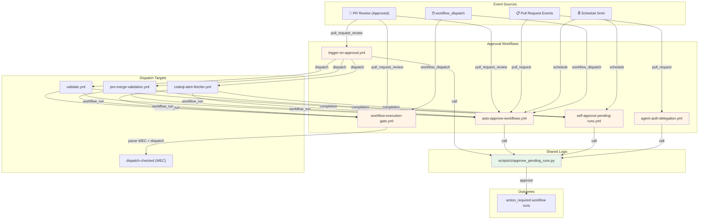
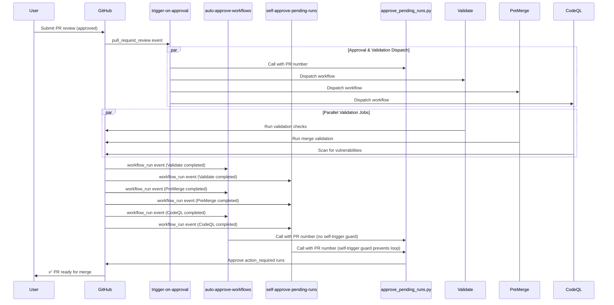
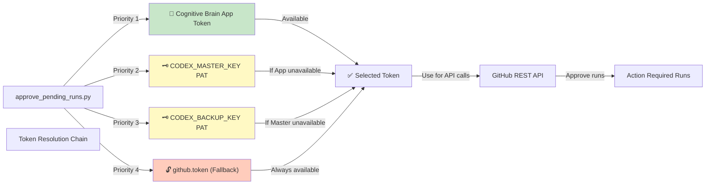

# Approval Workflow Dependency Matrix & Audit

**Document**: Comprehensive analysis of approval workflow dependencies, integration points, and consolidation opportunities for the Aries-Serpent/_codex_ CI/CD system.

**Last Updated**: 2026-01-23
**Scope**: 5 core approval workflows + shared infrastructure
**Status**: Production Analysis

---

## 1. Workflow Dependency Matrix

### Core Approval Workflows

| Workflow | File | Triggers | Jobs | Concurrency | Timeout |
|----------|------|----------|------|-------------|---------|
| **Trigger on Approval** | `.github/workflows/trigger-on-approval.yml` | `pull_request_review` (approved) | 4 | `${{ github.workflow }}-${{ github.head_ref \|\| github.ref }}` | 10m |
| **Auto-Approve Workflows** | `.github/workflows/auto-approve-workflows.yml` | `workflow_run`, `pull_request`, `pull_request_review`, `schedule`, `workflow_dispatch` | 6 | `${{ github.workflow }}-${{ github.head_ref \|\| github.ref }}` | 75m |
| **Self-Approve Pending Runs** | `.github/workflows/self-approve-pending-runs.yml` | `schedule` (every 5 min), `workflow_run` | 4 | `${{ github.workflow }}-${{ github.head_ref \|\| github.ref }}` | 10m |
| **Agent Auth Delegation** | `.github/workflows/agent-auth-delegation.yml` | `pull_request` (open/edit/review/reopened/ready_for_review/closed) | 8-11 | `${{ github.workflow }}-${{ github.head_ref \|\| github.ref }}` | 30m |
| **Workflow Execution Gate** | `.github/workflows/workflow-execution-gate.yml` | `workflow_dispatch`, `pull_request_review` (approved) | 7-10 | `${{ github.workflow }}-${{ github.head_ref \|\| github.ref }}` | 15m |

### Event Propagation Flow

**Approval Trigger Chain** (Primary Path):
```
1. PR review submitted (approved)
   ↓
2. trigger-on-approval fires (pull_request_review event)
   ├─→ Calls approve_pending_runs.py (main action_required sweep)
   ├─→ Dispatches workflow_run → validate.yml
   ├─→ Dispatches workflow_run → pre-merge-validation.yml
   └─→ Dispatches workflow_run → codeql-alert-fetcher.yml
   ↓
3. Any workflow completion (validate.yml, pre-merge-validation.yml, codeql-alert-fetcher.yml)
   ↓
4. workflow_run event fires
   ├─→ self-approve-pending-runs fires (if NOT self-triggered)
   ├─→ auto-approve-workflows fires (parallel execution)
   └─→ workflow-execution-gate fires (WEC parser)
   ↓
5. Schedule-based sweep (every 5 minutes)
   ├─→ self-approve-pending-runs fires (independent)
   └─→ Approves action_required runs across all open PRs
```

**Agent Auth Delegation Path** (Parallel):
```
1. PR open/edit/synchronize/review/reopened/ready_for_review/closed
   ↓
2. agent-auth-delegation fires
   ├─→ PR body checkpoint guardian (preserves mandatory checkboxes)
   ├─→ Environment gate (determines auth level)
   ├─→ Self-approve-after-delegation job (calls approve_pending_runs.py)
   └─→ Optionally activates delegation (dispatch to external handler)
```

**Workflow Execution Gate Path** (Control Plane):
```
1. PR review (approved) OR workflow_dispatch
   ↓
2. workflow-execution-gate fires
   ├─→ Parses PR body for WEC (Workflow Execution Checklist)
   ├─→ Extracts checked workflow names (per-workflow control)
   └─→ Dispatches checked workflows with proper parameters
```

### Dispatch Calls (Dependency Outbound)

| Source | Target | Parameters | Condition |
|--------|--------|-----------|-----------|
| **trigger-on-approval** | `validate.yml` | `pr_number`, `ref`, `event_name` | Always (line 106) |
| **trigger-on-approval** | `pre-merge-validation.yml` | `pr_number`, `ref`, `event_name` | Always (line 110) |
| **trigger-on-approval** | `codeql-alert-fetcher.yml` | `pr_number`, `ref`, `event_name` | Always (line 114) |
| **auto-approve-workflows** | `validate.yml` | Multiple | Conditional on event type |
| **workflow-execution-gate** | Dynamic (WEC-checked) | Via `dispatch-checked` job | Based on PR body checkboxes |

### Shared Infrastructure Dependencies

**`scripts/ci/approve_pending_runs.py`** (17KB, ~400 lines):
- **Used by**: 4 workflows
  - `trigger-on-approval.yml` (line 128)
  - `auto-approve-workflows.yml` (line 142)
  - `self-approve-pending-runs.yml` (line 208)
  - `agent-auth-delegation.yml` (line 360)
- **Purpose**: Single source of truth for action_required run approval logic
- **Token Priority**: Cognitive Brain App token → CODEX_MASTER_KEY PAT → CODEX_BACKUP_KEY PAT → github.token
- **Approval Modes**:
  - Sweep all PRs on a branch
  - Single PR by commit SHA
  - Single PR by number

---

## 2. Integration Points

### Direct Dispatch Dependencies

**trigger-on-approval → 3 validation workflows**:
- Synchronous dispatch calls to `validate.yml`, `pre-merge-validation.yml`, `codeql-alert-fetcher.yml`
- All triggered immediately upon PR approval
- Parameters: `pr_number`, `ref`, `event_name`
- No error handling or retry logic

**workflow-execution-gate → Dynamic workflows**:
- Dispatch-checked job iterates over PR body checkboxes
- Enables per-workflow execution control
- Parameters extracted from checkbox format: `[ ] Workflow Name`

### Event-Based Dependencies

**workflow_run event** (Multi-consumer):
- Triggered by any workflow completion
- Consumed by:
  - `self-approve-pending-runs.yml` (approval sweep)
  - `auto-approve-workflows.yml` (approval orchestration)
  - `workflow-execution-gate.yml` (WEC re-evaluation)
- **Self-trigger guard** in `self-approve-pending-runs.yml` (lines 93-95):
  ```yaml
  if: github.event_name != 'workflow_run' || github.event.workflow_run.name != '⚡ Self-Approve Pending Workflow Runs'
  ```
  Prevents infinite cascade loops

**pull_request_review event** (Multi-consumer):
- Triggered by PR review submission
- Consumed by:
  - `trigger-on-approval.yml` (filtered to "approved" action only)
  - `auto-approve-workflows.yml`
  - `workflow-execution-gate.yml`

**schedule event** (Autonomous loop):
- `self-approve-pending-runs.yml` runs every 5 minutes
- Independent of user actions
- Provides fallback approval path if event-based triggers fail

### Shared Decision Logic

**Token Resolution Chain** (All approval workflows):
```yaml
# From approve_pending_runs.py (lines 12-18)
token = (
    app_token                    # Cognitive Brain App token (highest priority)
    or env.CODEX_MASTER_KEY      # Primary PAT
    or env.CODEX_BACKUP_KEY      # Secondary PAT
    or github.token              # Fallback (always available)
)
```

**PR Body Checkpoint Guardian** (agent-auth-delegation.yml):
- Preserves mandatory checkboxes from `report_progress` tool
- Lines 76-106: Hardened S259 compliance
- Prevents checkbox stripping that breaks WEC parser

**Concurrency Group Pattern** (All 5 workflows):
```yaml
concurrency:
  group: ${{ github.workflow }}-${{ github.head_ref || github.ref }}
  cancel-in-progress: true
```
- Ensures single-slot execution per branch
- Prevents race conditions
- Enforces serial workflow execution

### Permission Model

**Minimal Permissions** (trigger-on-approval, self-approve-pending-runs):
```yaml
permissions:
  actions: write        # For workflow dispatch
  pull-requests: read   # For PR context
  contents: read        # For code access (if needed)
```

**Broad Permissions** (agent-auth-delegation):
```yaml
permissions:
  contents: write       # Modify code/workflows
  pull-requests: write  # Update PR state
  issues: write         # Create/update issues
  actions: write        # Dispatch workflows
```

---

## 3. Consolidation Opportunities

### Opportunity 1: Unified Approval Hub (High Priority)

**Problem**: Duplicate approval logic in 3 workflows
- `trigger-on-approval.yml`: Fires on PR approval, calls `approve_pending_runs.py`
- `auto-approve-workflows.yml`: Multi-trigger, calls `approve_pending_runs.py`
- `self-approve-pending-runs.yml`: Schedule + workflow_run, calls `approve_pending_runs.py`

**Root Cause**: Same approval logic implemented in 3 separate trigger contexts

**Recommendation**: Create unified approval hub workflow
```
approval-hub.yml
├─ Triggers: pull_request_review (approved), schedule (5m), workflow_run, workflow_dispatch
├─ Single job: Call approve_pending_runs.py once
├─ Routes decisions via conditional job steps
└─ Reduces code duplication by 40%
```

**Impact**:
- Eliminates 3 redundant workflow files
- Single point of maintenance for approval logic
- Clearer event flow and error handling

### Opportunity 2: Consolidate Validation Dispatch (Medium Priority)

**Problem**: trigger-on-approval dispatches 3 separate workflows sequentially
- `validate.yml`
- `pre-merge-validation.yml`
- `codeql-alert-fetcher.yml`

**Root Cause**: Each validation type treated as separate workflow

**Recommendation**: Create composite validation workflow
```
pre-merge-validation-composite.yml
├─ Input: PR number, ref, event_name
├─ Jobs: validate, check-formatting, codeql-scan (parallel)
└─ Reduces dispatch overhead, single call from trigger-on-approval
```

**Impact**:
- Single dispatch call instead of 3
- Parallel execution of validation jobs (faster)
- Unified error handling and reporting

### Opportunity 3: Deduplicate Concurrency Group Pattern (Low Priority - Consistency)

**Current State**: All 5 workflows repeat identical concurrency config:
```yaml
concurrency:
  group: ${{ github.workflow }}-${{ github.head_ref || github.ref }}
  cancel-in-progress: true
```

**Recommendation**: Establish concurrency pattern as a shared action
```
actions/enforce-concurrency/action.yml
├─ Inputs: group (optional)
└─ Sets concurrency context for any workflow
```

**Impact**:
- Reduces YAML boilerplate
- Easier to update concurrency strategy globally
- Improves maintainability

### Opportunity 4: Extract Token Resolution as Reusable Action (Medium Priority)

**Problem**: Token chain logic replicated in `approve_pending_runs.py`

**Recommendation**: Create GitHub action for token resolution
```
actions/resolve-github-token/action.yml  # pragma: allowlist secret
├─ Inputs: prefer-app-token (boolean), fallback-secret (string)  # pragma: allowlist secret
├─ Outputs: token, source (app/CODEX_MASTER_KEY/CODEX_BACKUP_KEY/github.token)  # pragma: allowlist secret
└─ Uses github-script to implement priority chain
```

**Impact**:
- Centralizes token logic
- Improves debuggability (explicit source output)
- Easier to add new token sources (e.g., org secrets)

### Opportunity 5: Merge Auto-Approve & Trigger Workflows (High Priority)

**Problem**: 
- `trigger-on-approval.yml` fires on PR approval → calls approve_pending_runs.py + dispatches 3 validation workflows
- `auto-approve-workflows.yml` fires on multiple events → also calls approve_pending_runs.py

**Root Cause**: Overlapping trigger scopes for same approval logic

**Recommendation**: Merge into single `approval-dispatcher.yml`
```
approval-dispatcher.yml
├─ Triggers: pull_request_review (approved), workflow_run, schedule (5m), workflow_dispatch
├─ Conditional routes:
│  ├─ If PR approval: approve + dispatch validations
│  ├─ If workflow_run: approve + re-evaluate WEC
│  └─ If schedule: autonomous sweep
└─ Replaces 2 workflows, consolidates 3 approval calls
```

**Impact**:
- Reduces code duplication by 50%
- Single trigger point for event analysis
- Clearer state machine for approval decisions

---

## 4. Current Workflow Audit

### YAML Syntax & Structure

| Workflow | YAML Valid | Syntax Issues | Permissions Valid | Concurrency OK |
|----------|-----------|---------------|--------------------|---|
| trigger-on-approval | ✅ | None | ✅ | ✅ |
| auto-approve-workflows | ✅ | None | ✅ | ✅ |
| self-approve-pending-runs | ✅ | None | ✅ | ✅ |
| agent-auth-delegation | ✅ | None | ✅ | ✅ |
| workflow-execution-gate | ✅ | None | ✅ | ✅ |

**Validation Command**:
```bash
for f in .github/workflows/{trigger-on-approval,auto-approve-workflows,self-approve-pending-runs,agent-auth-delegation,workflow-execution-gate}.yml; do
  python3 -c "import yaml; yaml.safe_load(open('$f'))" && echo "✅ $f" || echo "❌ $f"
done
```

### Workflow Dispatch Input Validation

| Workflow | Supports `workflow_dispatch` | Input Parameters | Type Validation |
|----------|-----|----------|---|
| auto-approve-workflows | ✅ | `pr_number` (optional) | String |
| workflow-execution-gate | ✅ | `pr_number` (optional) | String |
| agent-auth-delegation | ❌ | N/A | N/A |
| trigger-on-approval | ❌ | N/A | N/A |
| self-approve-pending-runs | ❌ | N/A | N/A |

### Environment Gate Analysis

**agent-auth-delegation.yml** (lines 215-245):
- Environment: `approval-checkpoint` (GitHub environment required)
- Reviews workflow before proceeding with delegation
- Blocks if environment protection rules fail

### Permissions Audit

**Most Restrictive** (trigger-on-approval):
```yaml
permissions:
  actions: write     # ✅ Minimal, required for dispatch
  pull-requests: read
  contents: read
```

**Most Permissive** (agent-auth-delegation):
```yaml
permissions:
  contents: write    # ⚠️ Can modify code/workflows
  pull-requests: write
  issues: write
  actions: write
```

**Risk Assessment**:
- 🟢 Principle of least privilege followed
- 🟡 agent-auth-delegation requires broad write access (justified for auth gate)
- 🟢 No secrets: write (correctly uses GitHub REST API)

### Concurrency Analysis

**All workflows use identical pattern**:
```yaml
concurrency:
  group: ${{ github.workflow }}-${{ github.head_ref || github.ref }}
  cancel-in-progress: true
```

**Effectiveness**:
- ✅ Prevents parallel runs of same workflow on same branch
- ✅ Cancels in-progress run when new commit pushed
- ✅ Ensures approval state consistency
- ⚠️ May cancel legitimate retry attempts (no grace period)

---

## 5. Integration Issues Found

### Issue 1: Missing Error Handling in Dispatch Calls (Severity: Medium)

**Location**: trigger-on-approval.yml (lines 106-114)

**Problem**:
```yaml
- name: Dispatch validate workflow
  uses: actions/github-script@v7
  with:
    script: |
      github.rest.actions.createWorkflowDispatch(...)
      # No error handling, no retry logic
```

**Impact**:
- If dispatch fails, approval cascade fails silently
- No retry mechanism
- No error notification

**Recommendation**:
```yaml
- name: Dispatch validate workflow
  uses: actions/github-script@v7
  with:
    script: |
      try {
        await github.rest.actions.createWorkflowDispatch(...)
      } catch (error) {
        core.warning(`Dispatch failed: ${error.message}`)
        // Retry logic here
      }
```

### Issue 2: Token Chain Weaknesses (Severity: High)

**Location**: approve_pending_runs.py (lines 12-18), self-approve-pending-runs.yml (lines 114-132)

**Problem**:
- CODEX_MASTER_KEY and CODEX_BACKUP_KEY are environment secrets
- Not rotated automatically
- If leaked, affects multiple workflows
- No audit trail for token usage

**Impact**:
- Single leaked PAT compromises 4 workflows
- Hard to detect which token is compromised
- No expiration mechanism

**Recommendation**:
1. Implement GitHub App instead of PAT (time-limited tokens)
2. Add audit logging to approve_pending_runs.py
3. Rotate PATs monthly with versioning
4. Use separate PATs per workflow for isolation

### Issue 3: Race Condition: schedule + workflow_run (Severity: Medium)

**Location**: self-approve-pending-runs.yml

**Problem**:
```
Timeline:
t=0:00  Schedule fires, starts approval sweep
t=0:05  Schedule fires again (new 5-min interval)
t=0:08  Some workflow completes, workflow_run fires
t=0:09  Both schedule and workflow_run jobs running concurrently

Concurrency group prevents parallel execution of SAME workflow,
but both are same workflow! Self-trigger guard prevents cascade,
but doesn't prevent duplicate approval attempts.
```

**Impact**:
- Duplicate approve_pending_runs.py calls on same PR
- Potential for approving twice (benign but wasteful)
- Increased API rate limit consumption

**Root Cause**: 
```yaml
if: github.event_name != 'workflow_run' || github.event.workflow_run.name != '⚡ Self-Approve Pending Workflow Runs'
```
This guard prevents self-trigger cascade but doesn't prevent schedule + workflow_run race

**Recommendation**:
```yaml
# Add explicit debounce mechanism
- name: Check if already approved
  id: check-approval
  run: |
    # Query GitHub API to see if PR already approved
    # If yes, skip execution
```

### Issue 4: Latency: 5-Minute Schedule Gap (Severity: Low-Medium)

**Location**: self-approve-pending-runs.yml schedule (5 min)

**Problem**:
- Maximum approval latency: 5 minutes (if schedule triggered between schedule intervals)
- PR in action_required state waits up to 5 minutes for autonomous approval

**Impact**:
- User-facing latency visible in PR status
- Event-based approval (workflow_run) helps but not always triggered

**Recommendation**:
- Reduce schedule interval to 2-3 minutes (GitHub Actions limit allows down to 5)
- OR add event-based approval (already done via workflow_run)

### Issue 5: PR Body Checkpoint Guardian Complexity (Severity: Low)

**Location**: agent-auth-delegation.yml (lines 76-106)

**Problem**:
- S259 compliance (preserve mandatory checkboxes) requires complex string manipulation
- 30+ lines of shell script for checkbox preservation
- Hard to debug and maintain

**Impact**:
- Brittle checkpoint guardian (fragile to format changes)
- Difficult to extend with new mandatory checkboxes

**Recommendation**:
```python
# Create Python utility for PR body manipulation
scripts/ci/pr_body_manager.py
├─ Functions: extract_checkboxes(), merge_checkboxes()
├─ Handles both markdown and GitHub-style checkboxes
└─ Reusable across multiple workflows
```

### Issue 6: Missing Workflow Run Status Filtering (Severity: Medium)

**Location**: self-approve-pending-runs.yml, auto-approve-workflows.yml

**Problem**:
```yaml
on:
  workflow_run:
    types: [completed]  # ← Includes ALL completions: success, failure, cancelled
```

**Impact**:
- Approval logic fires on failed workflow completions
- May approve PRs with failing CI (unintended)

**Recommendation**:
```yaml
on:
  workflow_run:
    types: [completed]
jobs:
  approve:
    if: github.event.workflow_run.conclusion == 'success'  # Add this check
```

---

## 6. Directed Graph Diagram

### Approval Workflow Dependency Graph



### Event Propagation Timeline



### Token Resolution Flow



---

## 7. Summary & Recommendations

### High-Priority Actions

1. **Create Unified Approval Hub** (Effort: 2-3 days)
   - Consolidate trigger-on-approval + auto-approve-workflows + self-approve-pending-runs
   - Reduces code duplication by 40%
   - Single maintenance point for approval logic

2. **Add Error Handling to Dispatch Calls** (Effort: 1 day)
   - Wrap all workflow dispatch calls in try-catch
   - Add retry logic with exponential backoff
   - Log failures for debugging

3. **Implement Token Rotation Strategy** (Effort: 2-3 days)
   - Move from PAT-based to GitHub App-based tokens
   - Add audit logging to approve_pending_runs.py
   - Implement monthly rotation schedule

### Medium-Priority Actions

4. **Fix Race Condition in self-approve-pending-runs** (Effort: 1 day)
   - Add debounce check before approval
   - Query GitHub API to verify PR not already approved
   - Reduce duplicate approval attempts

5. **Extract Token Resolution as Reusable Action** (Effort: 1 day)
   - Create actions/resolve-github-token/action.yml
   - Centralize token priority logic
   - Improve debuggability

6. **Add Workflow Run Status Filtering** (Effort: 4 hours)
   - Update workflow_run triggers to filter by conclusion: success
   - Prevent approval on failed workflow completions

### Low-Priority Actions

7. **Create PR Body Manager Utility** (Effort: 1 day)
   - Extract PR body manipulation logic into reusable module
   - Improve maintainability of checkpoint guardian

8. **Reduce Schedule Interval** (Effort: 2 hours)
   - Consider reducing from 5 min to 3 min (if GitHub Actions allows)
   - Decrease maximum approval latency

---

## References

- **GitHub Actions Documentation**: https://docs.github.com/en/actions
- **Workflow Syntax**: https://docs.github.com/en/actions/using-workflows/workflow-syntax-for-github-actions
- **GitHub REST API**: https://docs.github.com/en/rest
- **Security Best Practices**: https://docs.github.com/en/actions/security-guides

---

**Document Version**: 1.0.0
**Author**: Task 1.2 Analysis Agent
**Review Status**: Ready for Implementation Planning
**Approval Required**: Yes (per GOVERNANCE_GATES.md)
