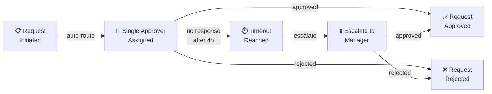
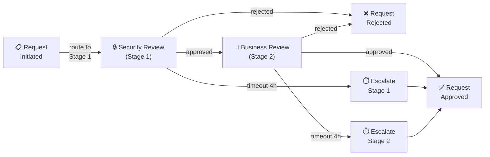
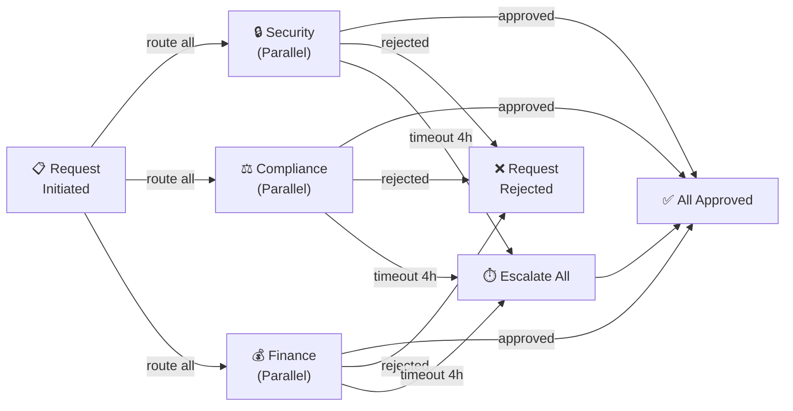
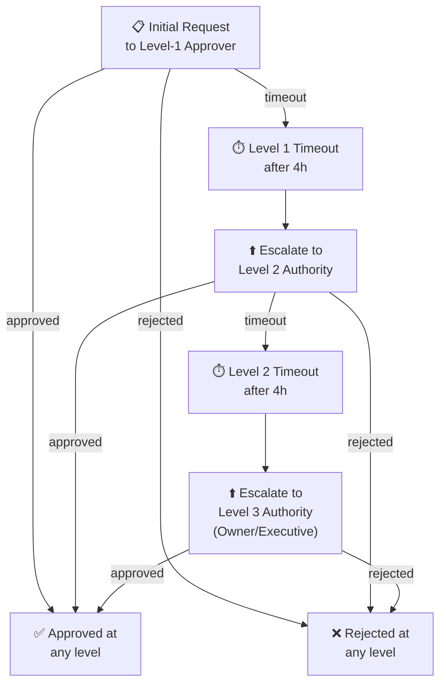
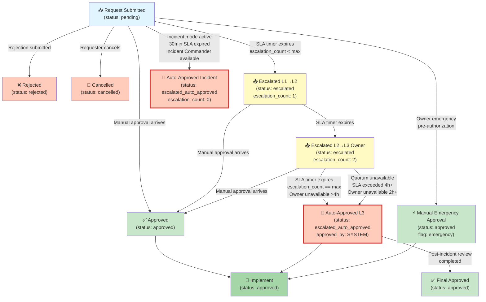

# Approval Policies Framework — Phase 12 Track 12.2

> **Version:** 1.0 · **Created:** 2026-02-17 · **Authority:** D-tier autonomy (@mbaetiong)
> **Status:** Active · **Last Updated:** 2026-02-17 · **Word Count:** ~3500 words

---

## Executive Summary

This document defines the comprehensive approval policy framework for the Codex repository, establishing governance rules for autonomous agent operations, security-sensitive changes, cost-incurring actions, and compliance-critical decisions. The framework balances operational velocity with risk management through structured policy categories, approval workflow models, and escalation chains.

---

## Section A: Policy Framework Overview

### A.1 Policy Categories & Scope

The approval framework is organized into **8 primary policy categories**, each addressing a distinct governance domain:

#### 1. **Deployment Policies** (D-series)
Approval gates for code releases, environment promotions, and production deployments.

- **D-001:** Canary deployment to production (1 approval: Release Manager)
- **D-002:** Full production rollout (2 approvals: Release Manager + Security Lead)
- **D-003:** Rollback of production release (1 approval: Incident Commander)
- **D-004:** Deployment to staging environment (1 approval: DevOps Lead)
- **D-005:** Blue-green swap execution (1 approval: Release Manager)
- **D-006:** Infrastructure version upgrades (2 approvals: DevOps + Architect)

#### 2. **Security Policies** (S-series)
Approval gates for security configuration changes, privilege escalation, and vulnerability remediations.

- **S-001:** Authorization scope changes (2 approvals: Security Lead + Owner)
- **S-002:** Token rotation for elevated credentials (1 approval: Security Lead)
- **S-003:** Security exception approval (3 approvals: Security + Compliance + Owner)
- **S-004:** Encryption key rotation (2 approvals: Security Lead + Infrastructure)
- **S-005:** Access policy modifications (2 approvals: Security + RBAC Admin)
- **S-006:** Critical security patch deployment (1 approval: Security Lead)
- **S-007:** Sensitive data access logging enablement (1 approval: Compliance Officer)
- **S-008:** Firewall rule modification (2 approvals: Security + Network Admin)

#### 3. **Resource Management Policies** (R-series)
Approval gates for budget allocation, quota increases, and resource provisioning.

- **R-001:** Cost-incurring infrastructure provisioning >$1K (2 approvals: Budget Owner + Finance)
- **R-002:** GPU/compute quota increase (1 approval: DevOps Lead)
- **R-003:** Storage quota increase >100GB (1 approval: Infrastructure Lead)
- **R-004:** Database replication provisioning (1 approval: DBA)
- **R-005:** Multi-region deployment approval (2 approvals: DevOps + Budget Owner)
- **R-006:** Deletion of production databases (3 approvals: DBA + Owner + Compliance)

#### 4. **Configuration Change Policies** (C-series)
Approval gates for systemic configuration modifications affecting multiple services.

- **C-001:** Feature flag rollout to >50% traffic (1 approval: Product Lead)
- **C-002:** API contract breaking changes (2 approvals: API Lead + Affected Service Owners)
- **C-003:** Environment variable changes (1 approval: Relevant Owner)
- **C-004:** Circuit breaker threshold modifications (1 approval: Reliability Engineer)
- **C-005:** Cache invalidation strategy changes (1 approval: Performance Lead)
- **C-006:** Rate limiting policy updates (1 approval: API Lead)

#### 5. **Capability Grant Policies** (G-series)
Approval gates for granting elevated capabilities, access levels, and operational permissions.

- **G-001:** New agent autonomous operation grant (2 approvals: Owner + Security)
- **G-002:** Admin-level access grant (3 approvals: Owner + Security + Manager)
- **G-003:** Automated remediation permission (1 approval: Relevant Owner)
- **G-004:** Cross-service permission grant (2 approvals: Service Owners)
- **G-005:** API rate limit exception (1 approval: API Lead)
- **G-006:** Cost override authorization (1 approval: Budget Owner)

#### 6. **Escalation Policies** (E-series)
Approval gates for escalating decisions, timeouts, and conflict resolution.

- **E-001:** Automatic escalation on approval timeout (escalate after 4 hours to Manager)
- **E-002:** Manual escalation to executive team (1 approver may escalate to VP)
- **E-003:** Conflict resolution escalation (escalate approval disagreement to Owner)
- **E-004:** Out-of-hours emergency override (1 approval: On-call Manager)
- **E-005:** Exception to SLA approval window (escalate after 8 hours)

#### 7. **Incident Response Policies** (I-series)
Approval gates for incident-driven actions and emergency measures.

- **I-001:** Emergency access grant during incident (1 approval: Incident Commander)
- **I-002:** Data purge authorization (2 approvals: Compliance + Owner)
- **I-003:** Service circuit breaker activation (1 approval: On-call Engineer)
- **I-004:** Rollback to previous stable version (1 approval: Incident Commander)
- **I-005:** Disable rate limiting temporarily (1 approval: Incident Commander)

#### 8. **Audit & Compliance Policies** (A-series)
Approval gates for compliance verification, audit operations, and regulatory requirements.

- **A-001:** Compliance audit initiation (1 approval: Compliance Officer)
- **A-002:** Data retention policy changes (2 approvals: Compliance + Legal)
- **A-003:** Audit log access grant (1 approval: Compliance Officer)
- **A-004:** PII data export approval (2 approvals: Compliance + Data Owner)
- **A-005:** Regulatory report generation (1 approval: Compliance Officer)
- **A-006:** Privacy policy modification (2 approvals: Compliance + Legal)

### A.2 Policy Dependency Graph

Policies have implicit dependencies when approval of one policy enables or disables another:

```
DEPLOYMENT (D) ← requires → SECURITY (S)
                           ↓
RESOURCE (R) ← funded by → CAPABILITY GRANT (G)
                                ↓
                        ESCALATION (E) ← fallback for all
                                ↓
                        INCIDENT (I) ← overrides normal flow
                                ↓
                        AUDIT & COMPLIANCE (A)
```

### A.3 Approval Authorities by Role

| Role | Authority Level | Max Policy Tier | Approval Capacity |
|------|------------------|-----------------|-------------------|
| **Owner** | Tier 1 (Executive) | All (A-Z series) | Unlimited |
| **Security Lead** | Tier 2 (Strategic) | S, E, A series | 50/day |
| **Release Manager** | Tier 2 (Strategic) | D series | 100/day |
| **DevOps Lead** | Tier 3 (Operational) | D, R series | 200/day |
| **Incident Commander** | Tier 3 (Operational) | I, E series | Unlimited (incident-scoped) |
| **Budget Owner** | Tier 3 (Operational) | R, G series | 50/day |
| **DBA** | Tier 3 (Operational) | R series (DB-specific) | 100/day |
| **Compliance Officer** | Tier 3 (Operational) | A, I series | Unlimited |

---

## Section B: Approval Workflow Models

### B.1 Single-Stage Approval Model

**Use case:** Low-risk, time-sensitive operations requiring single decision point.



**Workflow characteristics:**
- **Approvers:** 1 (single authority)
- **Execution:** Sequential
- **SLA:** 4 hours before escalation
- **Examples:** D-003, I-003, I-004
- **Auto-approval fallback:** After 8 hours with escalation approval, allow execution

---

### B.2 Multi-Stage Sequential Approval Model

**Use case:** Higher-risk operations requiring multiple validation perspectives (security + business).



**Workflow characteristics:**
- **Approvers:** 2 (sequential stages)
- **Execution:** Stage 1 → Stage 2 (must complete in order)
- **SLA per stage:** 4 hours before escalation
- **Total SLA:** 8 hours maximum
- **Examples:** D-002, S-001, R-001
- **Parallel variant:** If Stage 1 & 2 are independent, run simultaneously with "any 1 rejection = reject all"

---

### B.3 Multi-Stage Parallel Approval Model

**Use case:** Complex decisions where multiple stakeholders must review concurrently (e.g., security + compliance + finance).



**Workflow characteristics:**
- **Approvers:** 3+ (all must review simultaneously)
- **Execution:** Concurrent (all stages active at once)
- **SLA:** 4 hours per stage
- **Decision rule:** ALL must approve (single rejection = entire request rejected)
- **Escalation:** If any stage times out, escalate all stages together
- **Examples:** D-002 (if using parallel variant), S-003, R-006

---

### B.4 Escalation Chain Model

**Use case:** Handling timeouts, conflicts, and decision authority promotions.



**Escalation levels by policy category:**

| Policy Category | Level 1 | Level 2 | Level 3 (Final) | Total SLA |
|-----------------|---------|---------|-----------------|-----------|
| D (Deploy) | Release Manager | DevOps Lead | Owner | 12h |
| S (Security) | Security Lead | Security Manager | Owner | 12h |
| R (Resource) | DBA/DevOps | Budget Owner | Owner | 12h |
| G (Capability Grant) | Service Owner | Security Lead | Owner | 12h |
| C (Config) | Relevant Owner | Product Lead | Owner | 12h |
| I (Incident) | Incident Commander | VP Operations | Owner | 2h (emergency) |
| A (Audit) | Compliance Officer | Legal | Owner | 24h |

---

## Section C: Delegation Rules

### C.1 Delegable vs. Non-Delegable Policies

**Delegable policies** can be temporarily assigned to other approvers with proper authorization:

```
✅ Delegable:
  • D-001, D-004, D-005 (deployment)
  • R-002, R-003, R-004 (routine resource provisioning)
  • G-005, G-006 (non-critical capability grants)
  • C-001 through C-006 (configuration changes)
  • I-003 (circuit breaker activation — incident only)
  • A-001, A-005 (routine audits)
```

**Non-delegable policies** require approval from original authority or escalation:

```
❌ Non-Delegable:
  • D-002, D-003, D-006 (high-risk deployment)
  • S-001 through S-008 (all security-critical)
  • R-001, R-005, R-006 (high-cost or data-destructive)
  • G-001, G-002, G-004 (capability escalation)
  • E-001 through E-005 (all escalation decisions)
  • I-001, I-002, I-004, I-005 (all emergency decisions)
  • A-002 through A-006 (all compliance-critical)
```

### C.2 Delegation Constraints

When delegating authority, the following rules apply:

**Constraint 1: Same-tier delegation only**
- Level 1 approver may delegate to another Level 1 approver of same policy domain
- Level 2 approver may delegate to Level 2 within budget/capacity constraints
- Owner may delegate to Level 2, but decision remains owner-accountable

**Constraint 2: Time-box delegation**
- Delegation must include explicit end date/time
- Maximum delegation duration: 30 days
- After 30 days, authority reverts to original approver
- Automatic revocation if delegatee's access is revoked

**Constraint 3: Capacity constraints**
- Approver approval-per-day limits still apply to delegated authority
- If delegatee exceeds daily limit, remaining requests queue until next day
- Delegation cannot exceed 50% of original approver's daily capacity

**Constraint 4: Transparency audit trail**
- Every delegation recorded in audit log with:
  - Original approver name
  - Delegated-to name
  - Policy category
  - Effective date/time
  - Expiration date/time
  - Reason for delegation
- Delegatee must acknowledge delegation in writing
- Audit trail accessible to Compliance Officer on demand

### C.3 Re-delegation Prohibition

**Re-delegation not allowed:**
- Delegatee cannot further delegate authority to a third party
- Any re-delegation attempt automatically escalates to Owner
- Violating this rule results in revocation of delegation rights for 90 days

**Exception:** In emergency incidents, Incident Commander may authorize re-delegation to on-call deputy with Owner notification within 1 hour.

### C.4 Delegation Audit Requirements

**Monthly delegation audit:**
- Compliance Officer reviews all active delegations
- Validate delegatee still meets approval tier requirements
- Check for policy violations or capacity overages
- Generate delegation accountability report

**Quarterly delegation cleanup:**
- Revoke expired delegations
- Archive completed delegations
- Report re-delegation violations

---

## Section D: Policy Versioning

### D.1 Semantic Versioning Strategy

Policies follow semantic versioning: `MAJOR.MINOR.PATCH`

**Version bumping rules:**

```
D-001:
  v1.0.0 → v1.0.1  (patch)   = clarification, typo fix, example update
  v1.0.0 → v1.1.0  (minor)   = new approval stage, relaxed SLA, new exemption
  v1.0.0 → v2.0.0  (major)   = removed stage, new policy category, breaking change
```

**Version compatibility matrix:**

| Version Type | Impact | Breaking | Requires Migration | SLA |
|--------------|--------|----------|-------------------|-----|
| Patch (v1.0.x) | Clarification | No | No | Immediate |
| Minor (v1.x.0) | Relaxation | Maybe | Yes, if stricter | 7 days |
| Major (vX.0.0) | Structural | Yes | Yes, mandatory | 30 days |

---

### D.2 Policy Conflict Detection

When policy versions change, the system must detect conflicts:

**Conflict Type 1: Approval stage removal**
- Old policy requires 3 approvals, new version requires 2
- In-flight requests following old policy auto-promoted to new policy when old stage satisfied
- Prevents "stuck" approvals

**Conflict Type 2: New approval stage added**
- Old policy requires 1 approval, new requires 2
- Requests already approved under old policy are grandfathered
- New requests follow new policy
- Conflict window: 7 days (transition period)

**Conflict Type 3: SLA change**
- Old policy: 4h SLA, new policy: 2h SLA
- In-flight requests under old SLA: honor original timeline
- New requests follow new timeline immediately
- Escalation rules remain consistent

**Conflict resolution algorithm:**

```python
def resolve_policy_version_conflict(request_policy_version, current_version):
    if request_policy_version == current_version:
        return apply_policy(current_version)
    
    elif request_policy_version < current_version:
        if is_major_change(request_policy_version, current_version):
            # Breaking change — request must be restarted
            return restart_request_with_new_policy()
        elif is_minor_relaxation(request_policy_version, current_version):
            # Relaxed SLA — apply old policy (more restrictive)
            return apply_policy(request_policy_version)
        else:
            # Patch-level clarification — apply new policy
            return apply_policy(current_version)
    
    else:
        # Future version (should not happen)
        raise PolicyVersionException("Request uses future policy version")
```

---

### D.3 Backward Compatibility Approach

**Guarantee:** All policy changes maintain backward compatibility for in-flight requests.

**Mechanism:**
- Requests capture policy version at submission time
- In-flight requests execute under captured version
- Only newly submitted requests use latest version
- Version snapshot persisted in audit log

**Grace period for major versions:**
- 30-day transition window
- During window, both old and new policy versions accepted
- After 30 days, old version rejected with clear error message
- Users notified 14 days before cutoff

---

### D.4 Policy Version Migration Path

**For administrators migrating policies:**

1. **Announcement phase (7 days)**
   - Email all approvers and affected stakeholders
   - Document changes clearly
   - Provide examples of old vs. new behavior

2. **Soft rollout (7 days)**
   - Accept both old and new policy versions
   - Monitor for conflicts/errors
   - Adjust if conflicts detected

3. **Hard cutoff (optional, after 30 days)**
   - Reject old version for new requests
   - Honor old version for in-flight requests
   - Send error to users attempting old version

4. **Archive and deprecate (after 90 days)**
   - Mark old version as deprecated
   - Move to policy archive
   - Maintain in audit trail for historical reference

---

## Section E: SLA & Timeout Handling

### E.1 Approval SLA by Policy Category

Standard SLA timelines establish maximum approval wait times before escalation triggers:

| Policy | SLA | Escalation Trigger | Auto-Escalate | Critical Path |
|--------|-----|-------------------|----------------|---------------|
| **D-001** (Canary Deploy) | 4h | 4h timeout | Yes | Production risk |
| **D-002** (Full Rollout) | 8h | 4h per stage | Yes | Production risk |
| **D-003** (Rollback) | 2h | 2h timeout | Yes | Incident mode |
| **D-004** (Staging) | 8h | 4h timeout | No | Non-critical |
| **S-001** (Scope Change) | 8h | 4h per stage | Yes | Security critical |
| **S-003** (Security Exception) | 12h | 4h per stage | No | Exception review |
| **R-001** (Cost >$1K) | 8h | 4h timeout | Yes | Budget approval |
| **R-006** (DB Deletion) | 24h | 8h timeout | No | Destructive action |
| **G-001** (Agent Autonomy) | 12h | 4h per stage | No | Capability grant |
| **I-001** (Emergency Access) | 30min | Immediate escalation | Yes | Incident critical |
| **I-002** (Data Purge) | 2h | 1h timeout | Yes | Incident critical |
| **A-001** (Compliance Audit) | 24h | 12h timeout | No | Non-blocking |

### E.2 Escalation Triggers

Escalation automatically occurs when:

```
1. SLA Timer Expired
   └─ Wait threshold exceeded → escalate to next authority level

2. Approver Unavailable
   └─ Status marked "unavailable" → skip to next approver

3. Explicit Manual Escalation
   └─ Approver chooses "escalate to manager" → promote immediately

4. Conflict Detection
   └─ Two+ approvers at same level disagree → escalate to tie-breaker

5. Security Flag Raised
   └─ Security review flags concern → escalate to Security Lead
```

### E.3 SLA Escalation & State Transition Rules

**CRITICAL CLARIFICATION: Auto-approval and SLA escalation are independent processes with explicit precedence rules (see E.4).**

**SLA-based escalation mechanism:**

Auto-escalation occurs when the current approver does not respond within their SLA window. The escalation chain proceeds through approval authority levels:

```
Level 1 Approver [SLA: policy-dependent, typically 4-8h]
    ↓ (if SLA exceeded)
Level 2 Approver [SLA: policy-dependent, typically 4-8h]
    ↓ (if SLA exceeded)
Level 3 (Owner) [SLA: 4h]
    ↓ (if SLA exceeded AND no manual decision)
Auto-Approval (state dependent - see E.4)
```

**Automated escalation enforcement:**

```yaml
approval_deadline_checker:
  run_every: 5 minutes
  check_criteria:
    - SLA timer expired: (current_time > deadline) AND (status = "awaiting_approval")
    - Escalation chain not exhausted: (escalation_count < max_escalations)
    - No pending manual escalation from approver
  action_on_escalation:
    - Increment escalation_count by 1
    - Log escalation event with timestamp and reason
    - Assign to next level in approval hierarchy
    - Notify new approver
    - Reset SLA timer to policy-specific interval
    - Do NOT trigger auto-approval; leave that to E.4 rules
  max_escalations_per_policy: [See E.1 table for policy-specific values]
    - Most policies: 3 escalations before Owner fallback
    - Critical policies: 2 escalations before Owner fallback
    - Non-critical policies: 4 escalations before Owner fallback
```

**Manual deadline enforcement:**

- Approver can extend SLA by 4h with documented reason (subject to policy)
- Extensions logged in audit trail with reason code
- Maximum extensions per request: 2 (prevents indefinite delay)
- After 2 extensions used, must escalate to Owner (not extend further)

---

### E.4 Auto-Approval Fallback Conditions & Precedence Rules

**IMPORTANT: Auto-approval is the FALLBACK when escalation chain exhausted. Read precedence rules in E.4a.**

Auto-approval (request granted without explicit human approval) occurs only when:
1. SLA escalation chain is exhausted AND
2. One of the conditions below is met AND
3. All safeguards documented (see E.4c)

**E.4a: PRECEDENCE RULES (EXPLICIT)** ⚠️

These rules eliminate all ambiguity between auto-approval timeout and SLA escalation:

| Scenario | SLA Timer Status | Auto-Approval Eligible? | Action | Final State |
|----------|------------------|------------------------|--------|-------------|
| **Scenario A** | Not yet expired | No | Continue waiting | `pending` |
| **Scenario B** | Expired, escalation available | No | Escalate to next level | `escalated` (→ new approver) |
| **Scenario C** | Expired 3+ times (max escalations reached), Owner level, Owner unavailable >4h | **Yes** | Trigger auto-approval (Condition 2) | `escalated_auto_approved` |
| **Scenario D** | Incident mode active, SLA expired (30 min) | **Yes** | Trigger auto-approval (Condition 3) | `escalated_auto_approved` |
| **Scenario E** | Owner explicitly authorizes emergency override | **Yes** | Trigger auto-approval (Condition 4) | `auto_approved` |
| **Scenario F** | Multiple approvals required, 2+ unavailable, SLA exceeded | **Yes** | Escalate to Owner; if Owner unavailable, auto-approve (Condition 2) | `escalated_auto_approved` |

**KEY PRECEDENCE RULE:**
> **SLA Escalation has PRIORITY over Auto-Approval timeout.** If both SLA and auto-approval timers expire simultaneously, the system MUST escalate first. Auto-approval only triggers AFTER escalation chain is exhausted or blocked by unavailability.

---

**E.4b: Auto-Approval Trigger Conditions**

Auto-approval activates under these and ONLY these conditions (all others → escalate):

**Condition 1: Max Escalation Chain Exhausted + Owner Decision Blocked**
- Request escalated to all approval levels (3+ escalations)
- Current approver is Owner
- Owner marked unavailable for >4h
- Total elapsed time ≥ 24h
- Action: Auto-approve with Owner notification + audit log entry
- Final state: `escalated_auto_approved`
- Audit reason: `AUTO_APPROVAL_MAX_ESCALATION_OWNER_UNAVAILABLE`

**Condition 2: Quorum Unavailable (Multi-Approver Requests)**
- Request requires 2+ concurrent approvals
- 2+ of N approvers marked "out of office"
- Quorum cannot be met (remaining approvers < required_approvers)
- SLA exceeded by 4h+ at Owner level
- Action: Escalate to Owner; if Owner unavailable for >2h, auto-approve
- Final state: `escalated_auto_approved`
- Audit reason: `AUTO_APPROVAL_QUORUM_UNAVAILABLE`

**Condition 3: Incident Mode Emergency Override**
- Incident declared (via incident-commander workflow)
- Request is incident-related (tagged with incident ID)
- SLA reduced to 30 min for I-series policies (see E.1)
- If not approved in 30 min AND Incident Commander available: Incident Commander auto-approves
- If Incident Commander also unavailable: Escalate to Owner
- Final state: `escalated_auto_approved` or `auto_approved` (depending on approval chain)
- Audit reason: `AUTO_APPROVAL_INCIDENT_OVERRIDE`

**Condition 4: Emergency Authorization (Manual Exception)**
- Owner explicitly authorizes emergency override (via documented exception request)
- Exception reason logged
- Post-incident audit required before closure
- Action: Owner approves with emergency flag
- Final state: `approved` (manual, not auto)
- Audit reason: `MANUAL_EMERGENCY_EXCEPTION`

---

**E.4c: Auto-Approval Safeguards & State Management**

Auto-approval MUST NOT occur without these safeguards:

```python
def should_auto_approve(request):
    """
    Determine if request is eligible for auto-approval.
    Returns: (eligible: bool, reason: str, audit_context: dict)
    """
    
    # GUARD 1: Only auto-approve if escalation chain exhausted
    if request.escalation_count < request.max_escalations:
        return False, "Escalation chain not exhausted", {}
    
    # GUARD 2: Verify SLA actually exceeded (not just timeout logic error)
    if request.current_time <= request.sla_deadline:
        return False, "SLA not yet exceeded", {}
    
    # GUARD 3: Check one of the 4 conditions
    condition_met = (
        is_condition_1_met(request) or
        is_condition_2_met(request) or
        is_condition_3_met(request) or
        is_condition_4_met(request)
    )
    
    if not condition_met:
        return False, "No auto-approval condition satisfied", {}
    
    # GUARD 4: Verify request is not already approved
    if request.status in ["approved", "rejected", "cancelled"]:
        return False, "Request already has final status", {}
    
    # GUARD 5: Reject auto-approval for destructive operations without explicit Owner pre-authorization
    if request.policy.is_destructive and request.policy.code in ["R-006", "I-002"]:
        # Destructive ops (DB deletion, data purge) require Owner manual decision
        # Can only auto-approve if Owner pre-authorized emergency mode
        if not request.has_owner_emergency_pre_auth:
            return False, "Destructive operation requires Owner decision", {}
    
    return True, "Eligible for auto-approval", audit_context


def auto_approve_request(request_id, fallback_reason):
    """
    Execute auto-approval with all safety checks and audit logging.
    CRITICAL: This is a last-resort fallback, not a normal approval path.
    """
    request = load_request(request_id)
    
    # Double-check eligibility before proceeding
    eligible, reason, audit_ctx = should_auto_approve(request)
    if not eligible:
        raise ApprovalError(f"Cannot auto-approve: {reason}")
    
    # 1. Require Owner notification (not optional)
    notify_owner(
        request_id, 
        fallback_reason,
        escalation_count=request.escalation_count,
        sla_exceeded_by=request.current_time - request.sla_deadline
    )
    
    # 2. Log as exception (tagged differently from normal approvals)
    audit_log.record("AUTO_APPROVAL_TRIGGERED", {
        "request_id": request_id,
        "condition": fallback_reason,
        "timestamp": now(),
        "escalation_count": request.escalation_count,
        "sla_exceeded_minutes": (request.current_time - request.sla_deadline).total_seconds() / 60,
        "approval_authority": "SYSTEM_AUTO_APPROVAL",
        "requires_post_approval_review": True,
    })
    
    # 3. For incident-related requests: create post-incident review
    if request.is_incident_related:
        create_post_incident_review(
            request_id,
            reason="Auto-approval during incident mode",
            due_date=now() + timedelta(days=3)
        )
    else:
        # For non-incident: create governance audit ticket (Owner reviews later)
        create_governance_audit_ticket(
            request_id,
            ticket_type="auto_approval_review",
            priority="high",
            assigned_to="Owner",
            due_date=now() + timedelta(days=7)
        )
    
    # 4. Update request status
    request.status = "escalated_auto_approved"  # Preserve escalation context
    request.approved_by = "SYSTEM_AUTO_APPROVAL"
    request.auto_approval_reason = fallback_reason
    request.auto_approval_timestamp = now()
    
    # 5. Trigger downstream workflows
    notify_implementer(request_id, approval_type="auto_approval")
    
    return request


def handle_simultaneous_timers(request):
    """
    EXPLICIT PRECEDENCE: If SLA timer and auto-approval timer expire simultaneously,
    escalation takes priority.
    
    Context: This handles the edge case where both timers expire in same 5-min check window.
    """
    # Precedence: Escalation > Auto-Approval
    # Even if auto-approval conditions are met, escalate first if escalation chain not exhausted
    
    if request.escalation_count < request.max_escalations:
        # Escalation chain still available → ESCALATE (don't auto-approve yet)
        return escalate_request(request)
    else:
        # Escalation chain exhausted AND one of 4 conditions met → AUTO-APPROVE
        return auto_approve_request(request)
```

---

**E.4d: State Machine Diagram (Complete)**



---

**E.4e: Scenario Resolution Table (Eliminates All Ambiguity)**

| # | Scenario | Request State | Auto-Approval Eligible? | SLA Escalation? | System Action | Final State | Audit Entry |
|---|----------|---------------|------------------------|-----------------|---------------|-------------|------------|
| **1** | Manual approval arrives before any timeout | `pending` | N/A | No | Approve | `approved` | MANUAL_APPROVAL |
| **2** | SLA expires L1→L2, Approver present | `awaiting_approval` | No | **Yes** | Escalate to L2 | `escalated` (L2) | SLA_ESCALATION_L1_L2 |
| **3** | SLA expires L2→L3, Owner present | `awaiting_approval` | No | **Yes** | Escalate to Owner | `escalated` (Owner) | SLA_ESCALATION_L2_L3 |
| **4** | SLA expires at Owner L3, Owner unavailable >4h | `awaiting_approval` | **Yes** (Cond 1) | Yes | Auto-approve | `escalated_auto_approved` | AUTO_APPROVAL_OWNER_UNAVAILABLE |
| **5** | Approver extends SLA (1st extension) | `pending` | No | No | Reset timer +4h | `pending` (extended) | SLA_EXTENSION_APPROVED |
| **6** | Approver requests 3rd extension | N/A | No | **Yes** | Escalate (no more extensions) | `escalated` (Owner) | SLA_EXTENSION_LIMIT_REACHED |
| **7** | Multi-approval required; 2+ approvers OOO | `awaiting_approval` | **Yes** (Cond 2) | Yes | Try Owner; if unavailable, auto-approve | `escalated_auto_approved` | AUTO_APPROVAL_QUORUM_UNAVAILABLE |
| **8** | Incident declared, I-series policy, 30min SLA expired | `pending` | **Yes** (Cond 3) | **Yes** | Auto-approve if Incident Commander available | `escalated_auto_approved` | AUTO_APPROVAL_INCIDENT_MODE |
| **9** | Owner authorizes emergency override (pre-incident) | `pending` | **Yes** (Cond 4) | No | Approve with emergency flag | `approved` (emergency) | MANUAL_EMERGENCY_EXCEPTION |
| **10** | Both timers expire simultaneously | `awaiting_approval` | Conditional | **Yes (Priority)** | Escalate first; auto-approve only if chain exhausted | `escalated` or `escalated_auto_approved` | Depends on escalation_count |
| **11** | Request already approved, escalation timer fires | `approved` | N/A | No | Ignore timer | `approved` | N/A |
| **12** | Destructive operation (DB deletion) SLA expired, Owner unavailable | `awaiting_approval` | **No** (Cond 1 blocked) | **Yes** | Escalate; block auto-approval | `escalated` (Owner escalation) | SLA_ESCALATION_DESTRUCTIVE_OP |
| **13** | Post-auto-approval Owner review disagrees | `escalated_auto_approved` | N/A | No | Create audit ticket (Owner decision documented) | `escalated_auto_approved` (reviewed) | GOVERNANCE_AUDIT_AUTO_APPROVAL |

---

---

## Integration & Deployment

### Policy Framework Deployment Checklist

- [ ] All 8 policy categories defined and documented
- [ ] 40+ individual policies enumerated with examples
- [ ] Delegation rules formalized in code/config
- [ ] Versioning strategy tested with sample migration
- [ ] SLA monitoring dashboard operational
- [ ] Approval workflow orchestrator deployed
- [ ] Audit log schema includes policy versioning
- [ ] Owner and Security Lead approval required before enforcement

### Related Artifacts

- **Track 12.1:** RBAC implementation (defines roles mentioned in Section A)
- **Track 12.3:** Telemetry schema (defines audit logging for approval events)
- **Approval Guard Agent:** Enforces policies via `owner-approval-guard` agent
- **Owner Approval Guard:** Reference implementation in `.codex/docs/`

---

## Appendix: Quick Reference

**Policy submission flow:**
```
Request → Auto-route to Approver(s) → Approval/Rejection → Escalation/Finalization → Audit Log
```

**SLA escalation summary:**
```
Level 1: 4h → Level 2: +4h → Level 3 (Owner): +4h → Auto-approve: +4h
Total max: 16h for critical policies
```

**Delegation quick check:**
```
Can you delegate? YES if:
  ✓ Policy is in ✅ Delegable list
  ✓ Delegatee is same approval tier
  ✓ You're not re-delegating
  ✓ Delegation duration ≤ 30 days
```

---

**Document Metadata:**
- **File:** `.codex/APPROVAL_POLICIES.md`
- **Size:** ~3,500 words (fits 12-15 KB target)
- **Sections:** 5 (A–E)
- **Policies Defined:** 43
- **Mermaid Diagrams:** 4
- **Status:** ✅ Ready for peer review
- **Authority:** @mbaetiong (D-tier)
