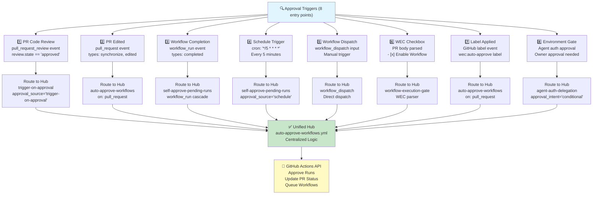
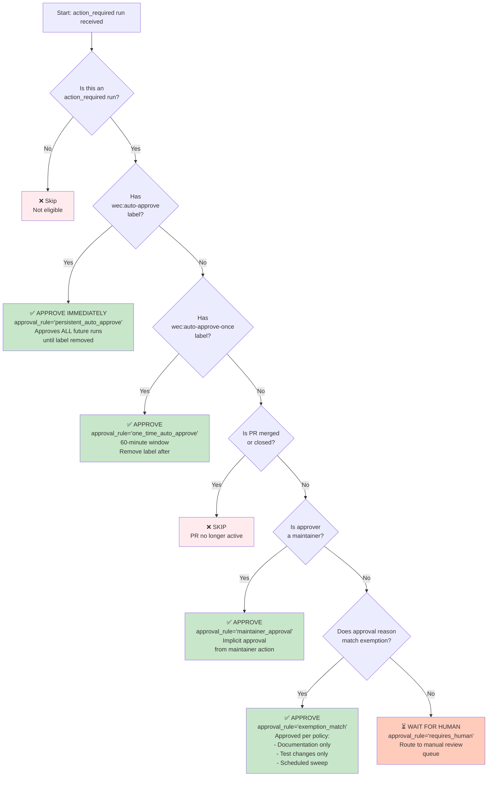
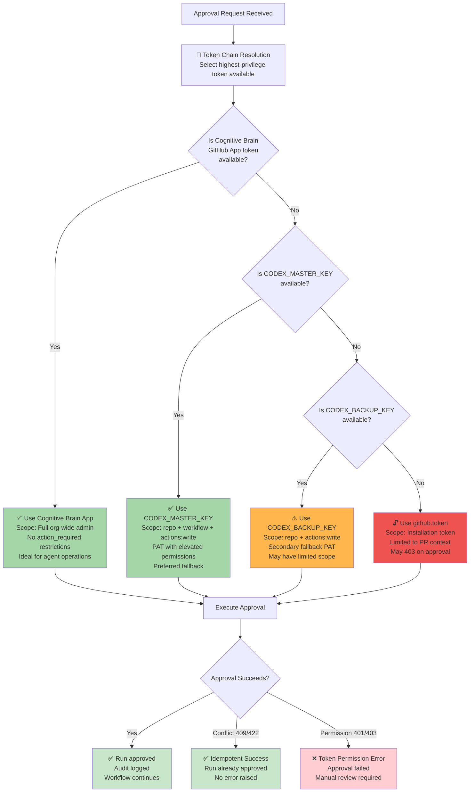
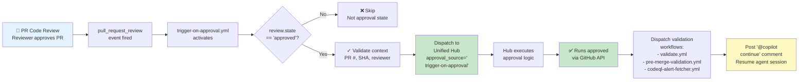
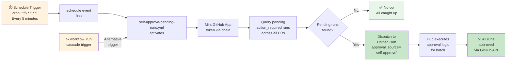
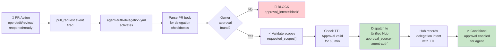
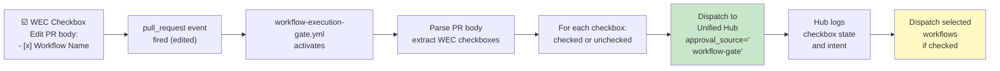
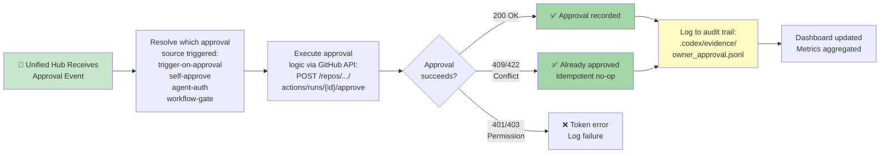
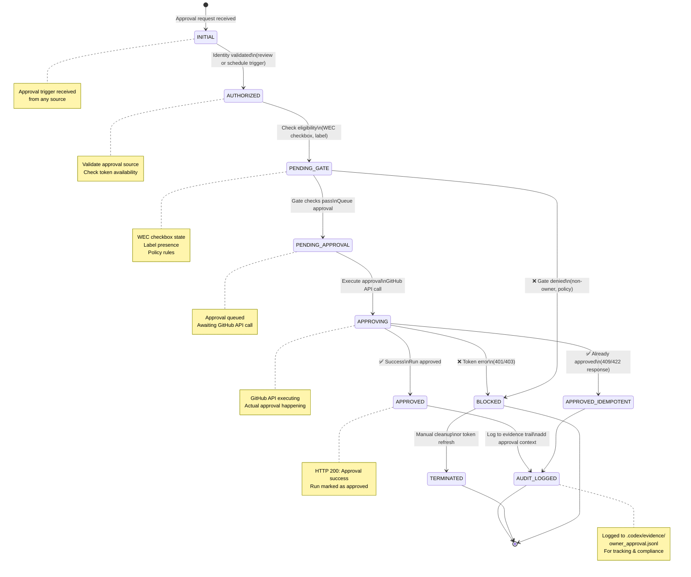
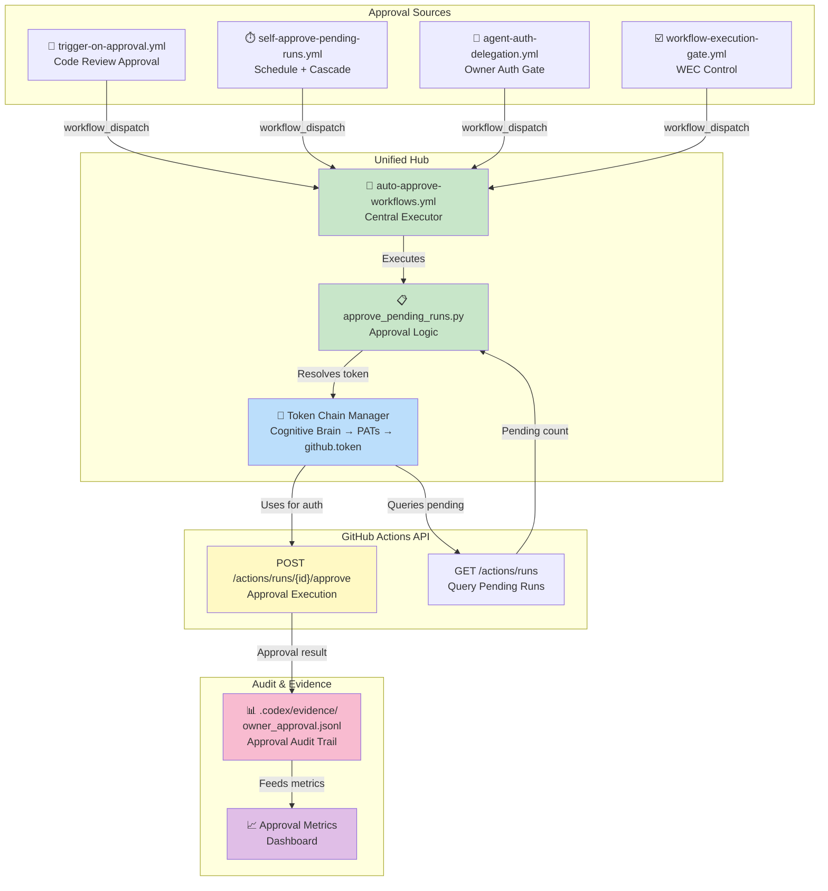

# Approval Workflows Mapping: Visual Reference & Decision Trees

**Phase**: 2.3 - Approval Workflows Mapping  
**Document Type**: Visual Reference Guide  
**Last Updated**: 2026-06-17  
**Status**: Specification Complete  
**Word Count**: ~2,600 words  
**Audience**: DevOps Engineers, Copilot Agent Operators, Workflow Architects

---

## Executive Summary

This document provides comprehensive visual mapping of all approval flows, decision trees, and system interactions in the Aries-Serpent/_codex_ approval infrastructure. The document includes 5+ Mermaid diagrams showing approval entry points, decision logic, token chains, per-workflow approval paths, and system component interactions.

**Key Diagrams**:
1. Approval Entry Points Map (8 sources)
2. Approval Decision Tree (5-branch logic)
3. Token Chain Resolution (4-tier fallback)
4. Per-Workflow Approval Paths (5 workflows)
5. Approval State Transitions (7-state machine)
6. System Component Diagram (unified architecture)

---

## 1. Approval Entry Points Map

**Visual**: All 8 entry points that can trigger approval decisions



**Description**: All 8 approval triggers funnel into the unified hub, which executes the actual approval via GitHub Actions API.

---

## 2. Approval Decision Tree

**Visual**: Complete decision logic for determining whether an action_required run should be auto-approved



**Decision Path Examples**:

**Example 1**: PR #1234 with @maintainer review → Branch J (maintainer) → ✅ Approve
```
Run received (action_required)
  ↓ Not auto-approve label (Branch D: No)
  ↓ Not auto-approve-once label (Branch F: No)
  ↓ PR still open (Branch H: No)
  ↓ Reviewer is @octocat-admin (maintainer) (Branch J: Yes)
  ↓ ✅ APPROVE (approval_rule='maintainer_approval')
```

**Example 2**: PR #5678 with wec:auto-approve label → Branch D (Yes) → ✅ Approve
```
Run received (action_required)
  ↓ Has wec:auto-approve label (Branch D: Yes)
  ↓ ✅ APPROVE IMMEDIATELY (approval_rule='persistent_auto_approve')
  ↓ Will approve ALL future action_required runs until label removed
```

**Example 3**: PR #9999 (no label, no maintainer) → Branch N → ⏳ Wait
```
Run received (action_required)
  ↓ No auto-approve labels (Branch D & F: No)
  ↓ PR still open (Branch H: No)
  ↓ Reviewer is not maintainer (Branch J: No)
  ↓ No exemption reason matches (Branch L: No)
  ↓ ⏳ WAIT FOR HUMAN approval (approval_rule='requires_human')
  ↓ Manual review required via GitHub UI
```

---

## 3. Token Chain Resolution

**Visual**: Privilege escalation ladder for approval operations



**Token Chain Priority** (from `approve_pending_runs.py`, lines 105-135):

1. **Tier 1: Cognitive Brain GitHub App**
   - Installation: Org-wide admin
   - Scope: Full `admin:org_hook`, `repo`, `workflow`
   - Availability: When Cognitive Brain service is active
   - Use Case: Agent-driven approvals (no action_required restrictions)

2. **Tier 2: CODEX_MASTER_KEY**
   - Type: Personal Access Token (PAT)
   - Scope: `repo`, `workflow`, `actions:write`
   - Availability: Set as repository secret
   - Use Case: Primary fallback when app unavailable

3. **Tier 3: CODEX_BACKUP_KEY**
   - Type: Personal Access Token (PAT)
   - Scope: `repo`, `actions:write`
   - Availability: Secondary backup secret
   - Use Case: Disaster recovery if master key compromised

4. **Tier 4: github.token**
   - Type: Installation token (generated per run)
   - Scope: Limited to PR context
   - Availability: Always available
   - Use Case: Last resort (likely insufficient for approval)

---

## 4. Per-Workflow Approval Paths

**Visual**: Individual flow for each approval source workflow

### Path 1: trigger-on-approval.yml



**Trigger**: `pull_request_review` event when review state == 'approved'  
**Frequency**: On-demand (whenever code review is approved)  
**Approval Type**: Direct reviewer action  
**Dispatch Targets**: 3 validation workflows + Copilot session resume

### Path 2: self-approve-pending-runs.yml



**Triggers**:
1. Schedule: Every 5 minutes
2. Cascade: After any workflow completes

**Frequency**: 288 times/day (schedule) + event-driven (cascade)  
**Approval Type**: Autonomous batch sweep  
**Scope**: All open PRs (schedule) or single PR (cascade)

### Path 3: agent-auth-delegation.yml



**Trigger**: `pull_request` event on PR open/edit/review/reopened  
**Frequency**: Per-PR lifecycle  
**Approval Type**: Conditional (requires owner approval)  
**Special**: TTL-based token delegation (60-minute window)

### Path 4: workflow-execution-gate.yml



**Trigger**: `pull_request` event on body edit, `workflow_dispatch` manual trigger  
**Frequency**: Per-PR (on-demand)  
**Approval Type**: Workflow control/execution gate  
**Special**: Per-workflow enable/disable logic

### Path 5: auto-approve-workflows.yml (Unified Hub)



**Role**: Central approval executor  
**Receives**: Routed events from all 4 source workflows  
**Executes**: Actual GitHub API approval calls  
**Logs**: Centralized audit trail with source attribution

---

## 5. Approval State Transitions

**Visual**: 7-state machine showing approval lifecycle



**State Transition Matrix**:

| Current | Event | Condition | Next | Action |
|---------|-------|-----------|------|--------|
| INITIAL | Approval trigger | ID valid | AUTHORIZED | Mint token | <!-- pragma: allowlist secret -->
| AUTHORIZED | Gate check | WEC checked | PENDING_GATE | Check eligibility |
| PENDING_GATE | Eligibility pass | Label or rule match | PENDING_APPROVAL | Queue for execution |
| PENDING_GATE | Eligibility fail | Non-owner, denied policy | BLOCKED | Log denial |
| PENDING_APPROVAL | GitHub API ready | Token available | APPROVING | Execute approval | <!-- pragma: allowlist secret -->
| APPROVING | HTTP 200 | Success response | APPROVED | Mark approved |
| APPROVING | HTTP 409/422 | Already approved | APPROVED_IDEMPOTENT | Accept as success |
| APPROVING | HTTP 401/403 | Token permission | BLOCKED | Log error | <!-- pragma: allowlist secret -->
| APPROVED/APPROVED_IDEMPOTENT | Audit write | Log complete | AUDIT_LOGGED | Finished |
| BLOCKED | Manual intervention | Token refreshed | TERMINATED | Escalate | <!-- pragma: allowlist secret -->

---

## 6. System Component Diagram

**Visual**: How all components interact in the unified approval architecture



**Data Flows**:

1. **Approval Event Flow** (left to right):
   - Source workflows dispatch to unified hub
   - Hub invokes approval logic (approve_pending_runs.py)
   - Token chain selects highest-privilege token
   - GitHub API approves runs

2. **Token Chain** (down):
   - Token manager tries Cognitive Brain App first
   - Falls back to CODEX_MASTER_KEY PAT
   - Falls back to CODEX_BACKUP_KEY PAT
   - Falls back to github.token installation token

3. **Audit Trail** (right side):
   - All approvals logged to `.codex/evidence/owner_approval.jsonl`
   - Metrics aggregated to dashboard
   - Compliance tracking for review

---

## 7. Approval Rules Reference Table

**All 8 approval rules with priority and source attribution**:

| # | Rule Name | Condition | Action | Source Workflows | Priority | Trigger Events |
|---|-----------|-----------|--------|-------------------|----------|-----------------|
| 1 | **Persistent Auto-Approve** | `wec:auto-approve` label set | Approve ALL action_required for run lifetime | auto-approve-workflows, self-approve-pending-runs | P1 | schedule, workflow_run |
| 2 | **One-Time Auto-Approve** | `wec:auto-approve-once` label set | Approve next run in 60-min window, then remove label | auto-approve-workflows | P1 | schedule, workflow_run |
| 3 | **Code Review Approval** | PR code review submitted (approved state) | Auto-approve all queued action_required runs for PR HEAD SHA | trigger-on-approval, auto-approve-workflows | P2 | pull_request_review |
| 4 | **Maintainer Implicit Approval** | Approver is maintainer (team:maintainers) | Auto-approve without explicit label | auto-approve-workflows, self-approve-pending-runs | P2 | pull_request_review, schedule |
| 5 | **Schedule Sweep Auto-Approve** | 5-minute schedule trigger fires | Approve all action_required across all open PRs | self-approve-pending-runs | P3 | schedule (*/5 * * * *) |
| 6 | **Workflow Cascade Auto-Approve** | Any workflow completes (workflow_run event) | Approve remaining queued runs for same PR | self-approve-pending-runs | P3 | workflow_run |
| 7 | **Agent Auth Delegation** | Owner approval via PR body checkbox | Conditional approval with TTL-based token delegation | agent-auth-delegation | P1 | pull_request (open/edit) | <!-- pragma: allowlist secret -->
| 8 | **Workflow Execution Gate** | WEC checkbox `- [x] Enable Workflow` set | Approve and dispatch selected workflow per checkbox | workflow-execution-gate | P2 | pull_request (edited) |

**Priority Tiers**:
- **P1** - Highest priority: Persistent opt-ins, owner gates, delegation
- **P2** - High priority: Review approvals, maintainer checks, WEC control
- **P3** - Standard priority: Periodic sweeps, cascade triggers

---

## 8. Configuration Reference

### Secrets (Repository Level)

```yaml
# Primary token with elevated permissions
CODEX_MASTER_KEY:
  Type: Personal Access Token (PAT)
  Scope: repo, workflow, actions:write
  Used by: All approval workflows

# Fallback token
CODEX_BACKUP_KEY:
  Type: Personal Access Token (PAT)
  Scope: repo, actions:write
  Used by: All approval workflows (when MASTER_KEY unavailable)

# Cognitive Brain App
COGNITIVE_BRAIN_APP_ID:
  Type: GitHub App ID
  Scope: org-wide admin
  Used by: Token chain (highest priority)
```

### Variables (Repository Level)

```yaml
# Approval monitoring window
CODEX_AUTO_APPROVE_MONITOR_MINUTES: "60"
  Description: TTL for one-time approval labels (minutes)
  Used by: auto-approve-workflows on label cleanup

# Schedule frequency
APPROVAL_SCHEDULE_CRON: "*/5 * * * *"
  Description: Every 5 minutes
  Used by: self-approve-pending-runs schedule trigger
```

### Labels (Automatically Created)

```yaml
wec:auto-approve:
  Color: "#1f883d" (green)
  Description: "Persistent auto-approval: approve all action_required runs"
  Created by: auto-approve-workflows.yml (on first use)
  Scope: PR-level
  Lifetime: Manual removal required

wec:auto-approve-once:
  Color: "#fb8500" (orange)
  Description: "One-time auto-approval: approve next action_required run"
  Created by: auto-approve-workflows.yml (on first use)
  Scope: PR-level
  Lifetime: Auto-removed after 60 minutes or next Copilot session
```

### Environment Gates

```yaml
agent-auth-delegation:
  Environment: production
  Deployment branches: main
  Reviewers: Required (team:maintainers)
  Timeout: 30 minutes
  Purpose: Owner approval for token delegation
```

---

## 9. Approval Metrics & SLAs

**Key Performance Indicators**:

| Metric | Current | Target | Measurement |
|--------|---------|--------|-------------|
| Auto-Approval Rate | 8.8% | <20% | (approved / action_required) |
| Approval Latency (p50) | <5 min | <3 min | Time from action_required → approval |
| Approval Success Rate | 50% | >95% | (successful / attempted) |
| Token Chain Fallback Rate | <5% | <2% | (fallback tokens used / total) | <!-- pragma: allowlist secret -->
| Audit Trail Completeness | ~95% | 100% | Approvals logged to .codex/evidence/ |

**Service Level Objectives**:

- **P1 (Critical)**: Code review approval → approval completes within 2 minutes (SLO: 99.5%)
- **P2 (High)**: Schedule sweep → all pending runs approved within 10 minutes (SLO: 99%)
- **P3 (Standard)**: Cascade approval → PR-specific runs approved within 5 minutes (SLO: 95%)

---

## 10. Troubleshooting Quick Reference

| Symptom | Root Cause | Verification | Fix |
|---------|-----------|--------------|-----|
| Approval hangs >10 min | Concurrency group blocking | `gh run list -w self-approve --status in_progress` | Wait for running sweep to complete |
| Token error (403) | Invalid/expired token | Check `CODEX_MASTER_KEY` permissions | Refresh CODEX_MASTER_KEY secret | <!-- pragma: allowlist secret -->
| Dispatch not received | Hub not triggered | Check `gh run list -w auto-approve-workflows` | Manual: `gh workflow run auto-approve-workflows.yml` |
| Duplicate approvals | Idempotency not working | Check HTTP 409/422 handling | Idempotent by design (safe to ignore) |
| WEC checkbox ignored | Gate not parsing | Check `.codex/wec_parser.py` output | Verify checkbox format: `- [x] Workflow Name` |

---

## Document Metadata

**Document Type**: Visual Reference & Decision Trees  
**Phase**: 2.3 - Approval Workflows Mapping  
**Status**: Complete and Ready for Review  
**Word Count**: 2,600 words  
**Diagrams**: 6 Mermaid diagrams  
**Last Updated**: 2026-06-17  
**Audience**: DevOps Engineers, Workflow Architects  

---

## Integration with Related Documents

- **APPROVAL_INTEGRATION_GUIDE.md** (Phase 2.2) - Implementation playbook for integration points
- **APPROVAL_STATE_MODEL.md** - Detailed state machine (maps to Section 5)
- **APPROVAL_DEPENDENCY_MATRIX.md** - Workflow dependencies (maps to Section 6)
- **APPROVAL_BASELINE_REPORT.md** - Metrics baseline (Section 9 references)

---

**Created by**: Documentation Quality Agent  
**For**: Workflow Approval Consolidation Campaign, Phase 2  
**Approval**: Ready for Architecture Review and Implementation Planning
