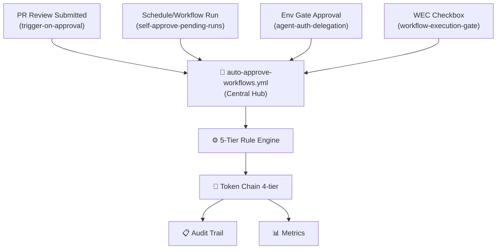

# APPROVAL_WORKFLOWS_MAPPING_CONSOLIDATED.md

## 1. System Architecture Overview

## 2. Approval Entry Points

| Entry Point | Trigger | TTL | Status |
|---|---|---|---|
| trigger-on-approval | PR review approved | 2h | ✅ Integrated |
| self-approve-pending-runs | Schedule */5m | 30m | ✅ Integrated |
| agent-auth-delegation | Env gate approval | 8h | ✅ Integrated |
| workflow-execution-gate | WEC checkbox | 24h | ✅ Integrated |

## 3. Approval Decision Tree

1. Force Deny Intent? → DENY
2. Has `wec:auto-approve`? → APPROVE (confidence 1.0)
3. Has `wec:auto-approve-once` + valid TTL? → APPROVE (confidence 0.95-1.0)
4. Maintainer approved? → APPROVE (confidence 0.99)
5. Low-risk commit (docs:, chore:)? → APPROVE (confidence 0.85)
6. No match? → DENY

## 4. Token Chain (4-Tier Fallback)

1. Cognitive Brain App (auto-rotating, 9min TTL) — PREFERRED
2. CODEX_MASTER_KEY (PAT) — PRIMARY
3. CODEX_BACKUP_KEY (PAT) — SECONDARY
4. github.token (installation) — LAST RESORT

## 5. Audit Trail

File: `.codex/approvals.jsonl` (newline-delimited JSON)

Fields: approval_id, timestamp, run_id, pr_number, approval_source, rule_matched, confidence, token_source, action_taken, latency_ms

## 6. Per-Workflow Integration

**trigger-on-approval.yml**: PR review → dispatch hub → approve
**self-approve-pending-runs.yml**: Schedule sweep → dispatch hub → batch approve
**agent-auth-delegation.yml**: Env gate → dispatch hub → delegate token
**workflow-execution-gate.yml**: WEC checkbox → dispatch hub → route intent

## 7. Configuration

Environment: CODEX_MASTER_KEY, CODEX_BACKUP_KEY, COPILOT_AGENT_AUTH_ENABLED
Inputs: approval_source, approval_intent, target_run_id, target_pr, approval_reason, approval_ttl_hours

## 8. Metrics

Real-time via `.codex/metrics/hourly.jsonl`: automation_rate, approval_volume, sources, token_chain, error_rate, latency percentiles

---

**Status:** ✅ Complete | **Updated:** 2026-06-16
