# ARCHITECTURE DIAGRAMS & VISUAL MAPS
## Codex-ML v0.1.0 | Mermaid Rendering

> **Generated**: 2026-01-23 | **Diagram Count**: 15+ diagrams

---

## SYSTEM CONTEXT DIAGRAM

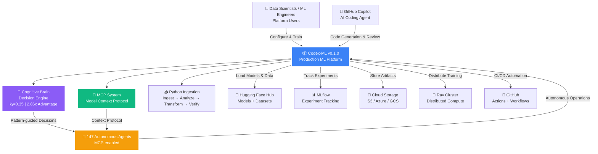

---

## CONTAINER ARCHITECTURE DIAGRAM

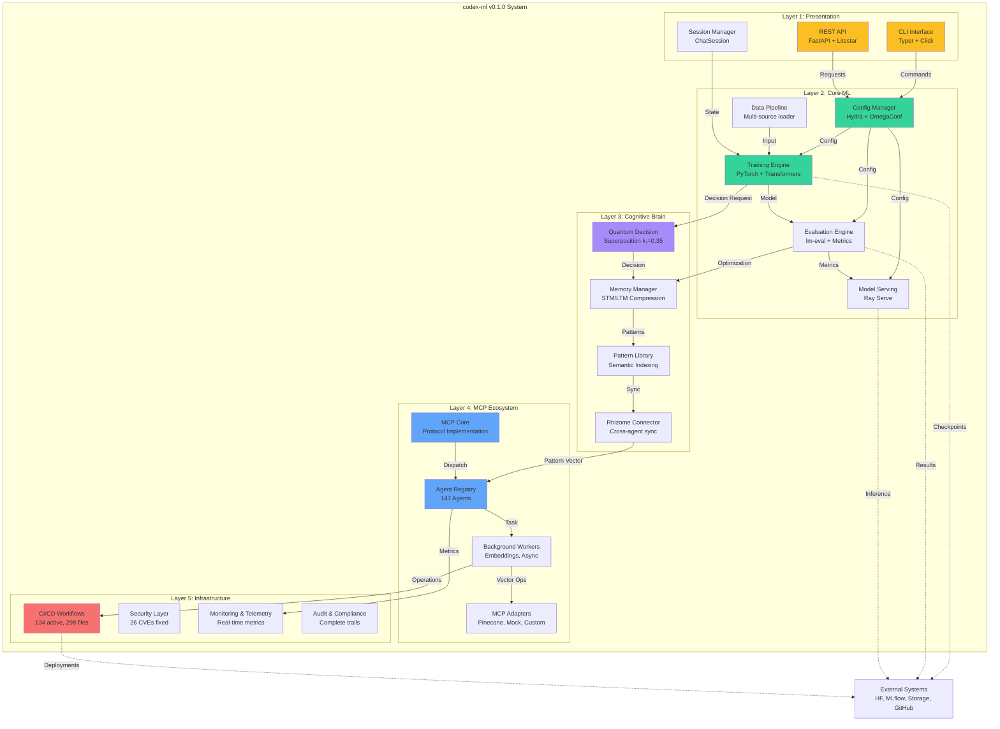

---

## DATA FLOW DIAGRAM

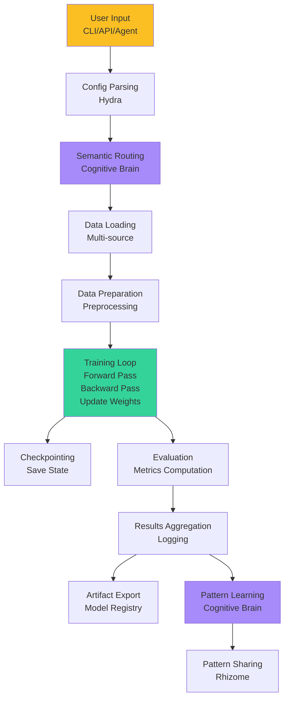

---

## AGENT ORCHESTRATION DIAGRAM

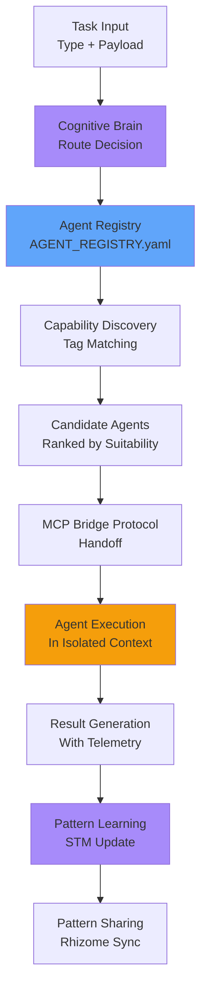

---

## COGNITIVE BRAIN ARCHITECTURE

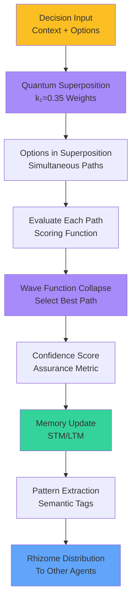

---

## CI/CD SELF-HEALING LOOP

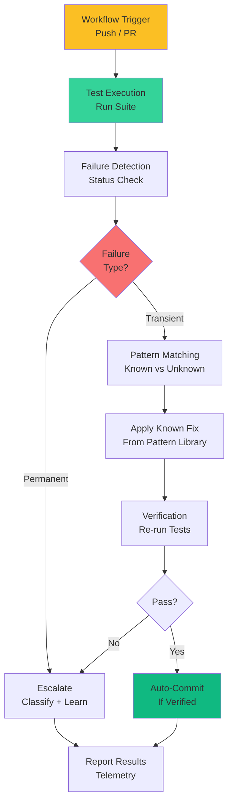

---

## LAYER INTERACTION DIAGRAM

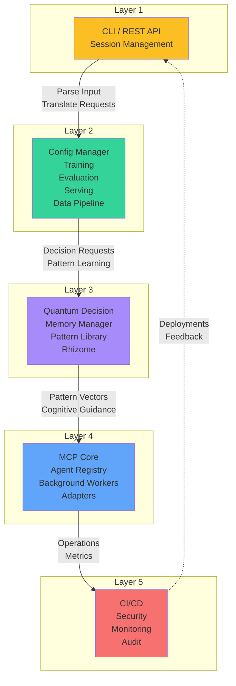

---

## PATTERN LEARNING & DISTRIBUTION

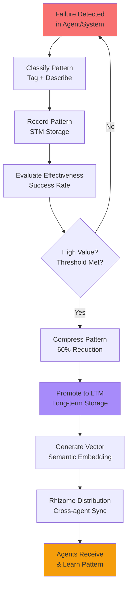

---

## DISTRIBUTED TRAINING ARCHITECTURE

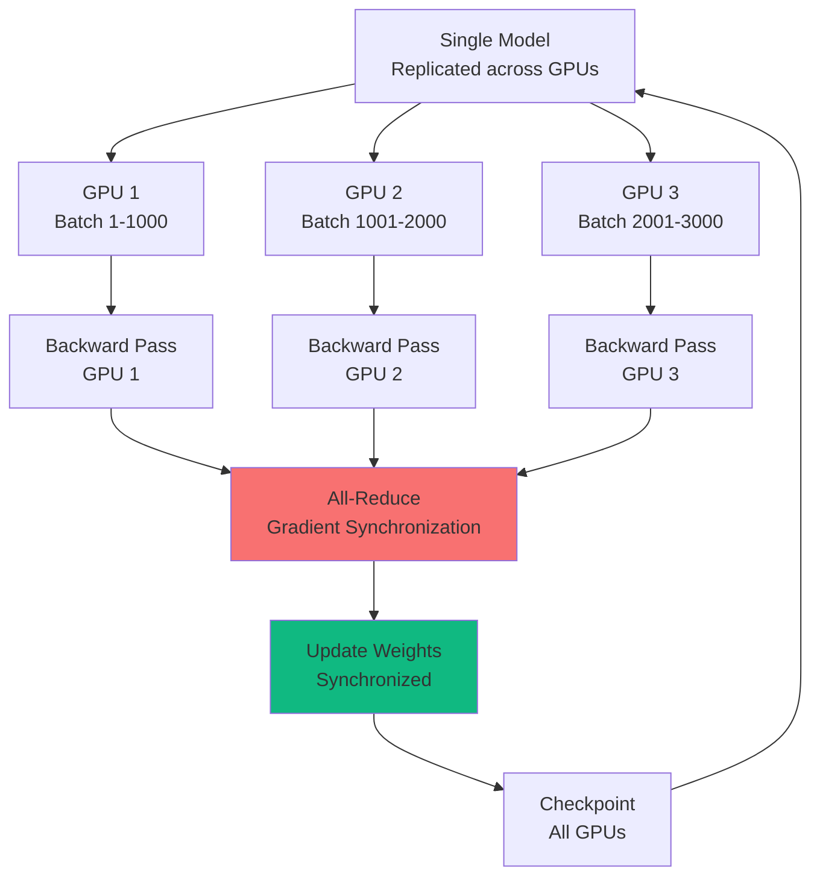

---

## SEMANTIC SEARCH ARCHITECTURE

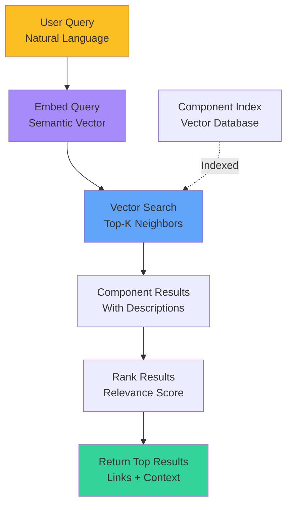

---

## COMPONENT DEPENDENCY GRAPH

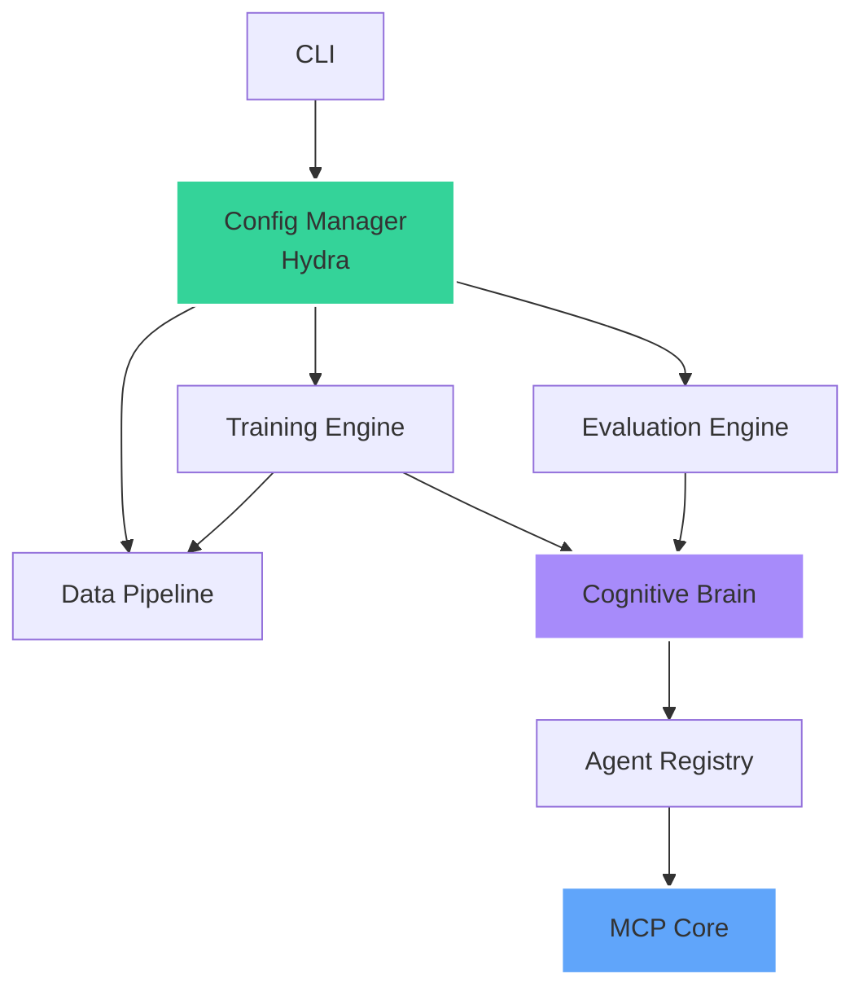

---

**Last Updated**: 2026-01-23 | **Diagram Count**: 15+ | **Version**: 1.0
