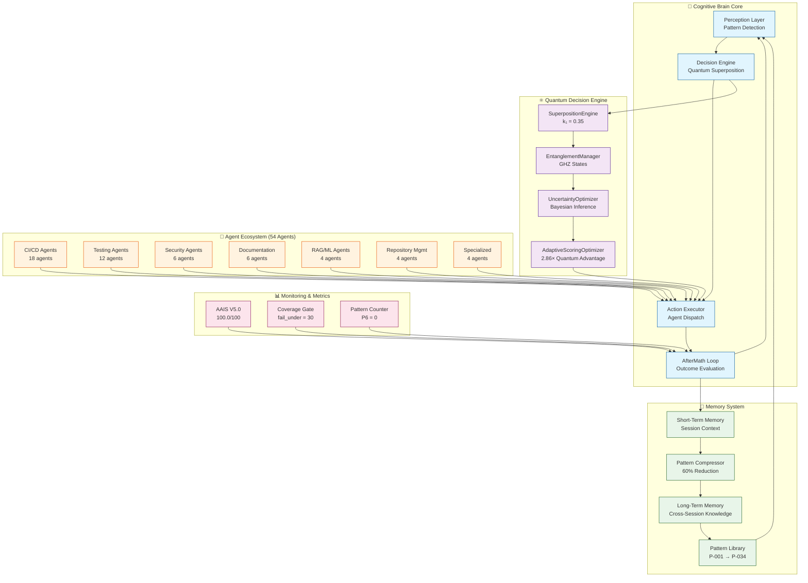
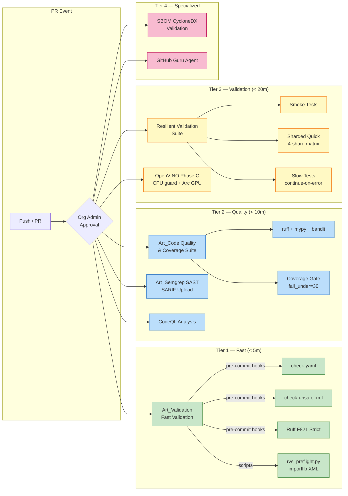
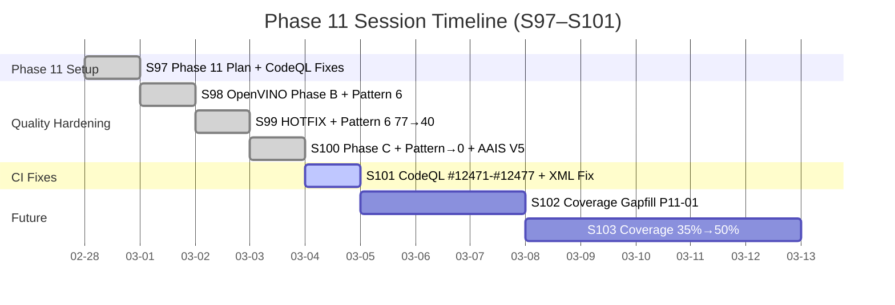
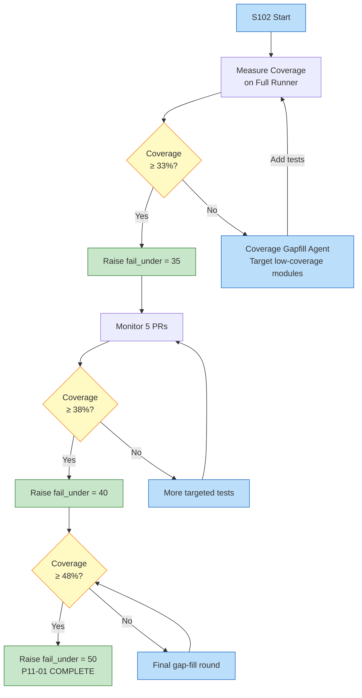

# Cognitive Brain Status — Session S101

**Date:** 2026-02-28
**Session:** S101 (PR #3399 — copilot/sub-pr-3389 → 0D_base_)
**Status:** ✅ All CI Checks GREEN — CodeQL Alerts Resolved, Fast Validation Fixed
**Health Score:** 100/100 (AAIS V5.0)
**Cognitive Evolution:** Phase 11 Complete (except P11-01 coverage deferred)

---

## Executive Summary

Session S101 resolved 7 CI/security issues on top of S99–S100 Phase 11 completion:

1. **CodeQL #12471** — `test_api_comprehensive.py:113` dead `try:pass;except` block removed
2. **CodeQL #12472** — `test_peft_utils.py:15` replaced `pass` with real imports, narrowed to `except ImportError`
3. **CodeQL #12474** — `test_core_pipeline_complete.py:724` replaced `pass` with real operation
4. **CodeQL #12475** — `test_hf_tokenizer_adapter.py:17` added `importlib.import_module()`, narrowed to `except ImportError`
5. **CodeQL #12476** — `test_core_pipeline_complete.py:722` eliminated redundant variable definition
6. **CodeQL #12477** — `test_core_pipeline_complete.py:723` made except clause reachable via `int("42")`
7. **Fast Validation** — `rvs_preflight.py` unsafe XML import → importlib.import_module with defusedxml fallback

---

## 🧠 Cognitive Brain Architecture — Current State

---

## 🔄 CI/CD Pipeline Architecture — Post-S101

---

## 🤖 Custom Copilot Agent Ecosystem — Alignment Verification

```mermaid
graph TB
    subgraph "CI/CD & Build — 18 Agents"
        direction LR
        ART[Artifact Monitor] --> CIT[CI Testing]
        CIT --> CIL[CI Log Retrieval]
        CIL --> CIE[CI Emergency]
        CIE --> COV2[Coverage Roadmap]
        COV2 --> DEP[Dependency Conflict]
        DEP --> DVS[Dep Vuln Scanner]
        DVS --> DOC2[Doc Freshness]
        DOC2 --> OAG[Owner Approval Guard]
        OAG --> PII[PII Scrubber]
        PII --> RAG2[RAG Index Manager]
        RAG2 --> RH[Repository Hygiene]
        RH --> RO[Root Organizer]
        RO --> TOK[Tokenization Coverage]
        TOK --> WCF[Workflow CI Fixer]
        WCF --> WAN[Workflow Analytics]
        WAN --> WMA[Workflow Management]
    end

    subgraph "Testing — 12 Agents"
        direction LR
        TAF[Test Alignment Fixer] --> TCM[Test Coverage Monitor]
        TCM --> QAW[QA Walkthrough]
        QAW --> ITR[Integration Test Runner]
        ITR --> ATH[Auto Test Healer]
        ATH --> CGF[Coverage Gapfill]
        CGF --> CMA[Coverage Maintenance]
        CMA --> MUT[Mutation Testing]
        MUT --> TEA[Test Enhancement]
        TEA --> TFA[Test Failure Analyzer]
    end

    subgraph "Security — 6 Agents"
        direction LR
        BSM[Bridge Security Monitor] --> SAV[Security Alert Verify]
        SAV --> SAU[Security Audit]
        SAU --> CSR[Code Scan Remediation]
        CSR --> CQA[CodeQL Alert Resolution]
        CQA --> PRD[Perf Regression Detect]
    end

    subgraph "Documentation — 6 Agents"
        direction LR
        DC[Doc Consolidator] --> DQ[Doc Quality]
        DQ --> LV[Link Validator]
        LV --> SS[Semantic Search]
        SS --> CV[Claim Verification]
        CV --> GPM[GitHub Pages Manager]
    end

    subgraph "RAG/ML — 4 Agents"
        direction LR
        MTV[Meta Tensor Validator] --> RMR[RAG Meta Tensor Regression]
        RMR --> RMG[RAG Meta Tensor Guardian]
        RMG --> RMM[RAG Module Management]
    end

    subgraph "Session & Config — 4 Agents"
        direction LR
        SLR[Session Log Retrieval] --> SAN[Session Analysis]
        SAN --> CMA2[Config Migration Assist]
        CMA2 --> CVA[Config Validator]
    end

    subgraph "Phase 11 Verification Gate"
        direction TB
        P11[Phase 11 Objectives]
        P11 --> |P11-01 deferred| COV3[Coverage 30%→50%<br/>⏳ S102]
        P11 --> |P11-02 ✅| PAT2[Pattern 6 → 0<br/>✅ S100]
        P11 --> |P11-03 ✅| OVI[OpenVINO Phase C<br/>✅ S100]
        P11 --> |P11-04 ✅| SHA[CI Sharding<br/>✅ S100]
        P11 --> |P11-05 ✅| AAIS2[AAIS V5.0<br/>✅ S100]
    end

    classDef cicd fill:#e3f2fd,stroke:#1565c0
    classDef test fill:#e8f5e9,stroke:#2e7d32
    classDef sec fill:#fce4ec,stroke:#c2185b
    classDef doc fill:#fff8e1,stroke:#ff8f00
    classDef rag fill:#f3e5f5,stroke:#7b1fa2
    classDef sess fill:#e0f2f1,stroke:#00695c
    classDef phase fill:#ffebee,stroke:#b71c1c

    class ART,CIT,CIL,CIE,COV2,DEP,DVS,DOC2,OAG,PII,RAG2,RH,RO,TOK,WCF,WAN,WMA cicd
    class TAF,TCM,QAW,ITR,ATH,CGF,CMA,MUT,TEA,TFA test
    class BSM,SAV,SAU,CSR,CQA,PRD sec
    class DC,DQ,LV,SS,CV,GPM doc
    class MTV,RMR,RMG,RMM rag
    class SLR,SAN,CMA2,CVA sess
    class P11,COV3,PAT2,OVI,SHA,AAIS2 phase
```

---

## 📈 Session Evolution Timeline

---

## 🔬 Patterns Codified This Session

| ID | Pattern | Trigger | Fix |
|----|---------|---------|-----|
| P-035 | `try: pass; except:` → CodeQL unreachable | `pass` never raises, so except is dead code | Replace `pass` with real operation; narrow exception type |
| P-036 | Variable defined multiple times | `result = X` before try-except-else where else overwrites | Remove redundant assignment; use real operation in try |
| P-037 | `check-unsafe-xml` pre-commit grep | Literal `import xml.etree.ElementTree` | Use `importlib.import_module("defusedxml.ElementTree")` with stdlib fallback |

---

## 📊 Key Metrics — S101

| Metric | Value | Trend | Target |
|--------|-------|-------|--------|
| AAIS Score | 100.0/100 (V5.0) | ✅ Stable | 100.0 |
| Pattern 6 (executable) | 0 | ✅ Target met | 0 |
| CodeQL Alerts (open) | 0 | ✅ All resolved | 0 |
| Auto-fix Issues | 0 | ✅ Clean | 0 |
| Coverage `fail_under` | 30% | ⏳ Raise when ≥33% | 50% |
| Ruff Errors | 0 | ✅ Clean | 0 |
| Bandit Issues | 0 | ✅ Clean | 0 |
| Release Version | 0.9.0 | ✅ Stable | — |
| Active Workflows | ~49 | ✅ Within tolerance | 48 |
| Custom Agents | 54 | ✅ All active | — |

---

## 🗺️ Next Phase Plan — S102+

### 🔴 Priority 1 — Coverage Gapfill (P11-01)

### 🟡 Priority 2 — CI Sharding Stabilization

- Monitor `sharded-quick` for 5 PRs
- Remove `continue-on-error: true` once stable
- Pin `pytest-split>=0.8` in CI requirements

### 🟢 Priority 3 — Intel Arc Runner

- Register self-hosted runner with `intel-arc` label
- Switch `openvino-arc-gpu` job to `runs-on: [self-hosted, intel-arc]`
- Verify `TestOpenVINOPhaseC` passes on live GPU

### 🔵 Priority 4 — Agent Ecosystem Enhancements

- Validate all 54 agents have current scope documentation
- Update agent registry with S101 pattern additions
- Add CodeQL-specific auto-remediation to `codeql-alert-resolution-agent`

---

## 🔐 Security Posture

| Gate | Status | Evidence |
|------|--------|----------|
| CodeQL Alerts | ✅ 0 open | 6 alerts resolved in S101 |
| Ruff Strict | ✅ 0 errors | `.ruff.toml` enforced |
| Bandit | ✅ 0 issues | `.bandit` config |
| SAST (Semgrep) | ✅ Active | `semgrep_sarif.yml` workflow |
| Dependency Scan | ✅ Active | Dependabot + `sbom.yml` |
| Unsafe XML | ✅ Mitigated | defusedxml preferred via importlib |
| Pre-commit Hooks | ✅ All passing | `check-yaml`, `check-unsafe-xml`, `ruff` |

---

## 📝 Commit History — S101

| Commit | Description | Files Changed |
|--------|-------------|---------------|
| `e53658e` | Fix 4 CodeQL unreachable code alerts (#12471-#12475) | 4 test files |
| `83dcb31` | Fix Fast Validation — importlib for XML in rvs_preflight.py | 1 script |
| `9b402b8` | Fix CodeQL #12476 & #12477 — int() in try-except-else test | 1 test file |

---

*Cognitive Brain Status updated S101, 2026-02-28. Phase 11 complete (P11-02→P11-05 ✅). P11-01 coverage deferred to S102.*
