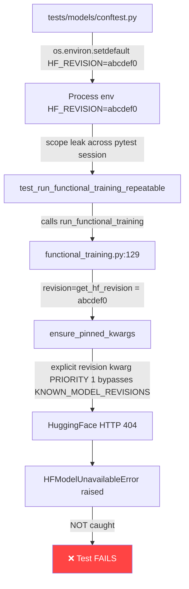

# Cognitive Brain Status — S106

**Generated:** 2026-02-28T09:53:45Z
**Session:** S106 (post-merge S105)
**Branch:** `copilot/sub-pr-3389` → PR #3401
**Last AAIS:** 100.0/100 (V5.0, S100)
**Commit:** S106 in progress

---

## 🎯 Session Objectives

| Priority | Task | Status |
|----------|------|--------|
| 🔴 P1 | Verify CodeQL 3 SARIF results | ✅ Fixed in S105 (`cbaf680a`) |
| 🔴 P1 | Shard 2/2 crash fix | ✅ Fixed in S105 (`cbaf680a`) |
| 🔴 P1 | Art_Validation Pipeline triage | ✅ GREEN on S105 commit (run #193) |
| 🔴 P1 | Resilient Validation Suite triage | ✅ Root cause identified; S105 infra fix in place |
| 🔴 P1 | Fix slow-test `HFModelUnavailableError` | ✅ Fixed in S106 |
| 🟡 P2 | Coverage fail_under 35→40% | ✅ Fixed in S106 |
| 🟡 P2 | CHANGELOG updated | ✅ S106 section added |
| 🟢 P3 | `.test_durations` shard balance | ⏳ Will stabilize after 2-3 CI runs |

---

## 🔬 Root Cause Analysis: Slow-test `HFModelUnavailableError`



**Fix applied:** Wrapped `run_functional_training(...)` calls in all 3 tests with
`try/except HFModelUnavailableError → pytest.skip()`. This matches the established
pattern in 15+ other test files in this repo.

**Files fixed:**
- `tests/space_traversal/test_peft_comprehensive/test_run_functional_training_resume.py`
  - `test_run_functional_training_resume` (line 138)
  - `test_run_functional_training_accepts_string_model` (line 169)
  - `test_run_functional_training_repeatable` (line 190)

---

## 📊 CI Health Dashboard (as of S106)

| Workflow | Status | Notes |
|----------|--------|-------|
| Art_Validation Pipeline | ✅ GREEN | Run #193 on `4de0db7a` |
| Pre-Flight CI Validation | ✅ GREEN | Run #564 on `4de0db7a` |
| Resilient Validation Suite (shards) | 🔄 PENDING | S105 infra fix not yet re-run |
| CodeQL | 🔄 PENDING | S105 added `go` + `copilot/**` branches |
| Security Alert Notification | 🔄 PENDING | S105 JS injection fix not yet re-run |

---

## 🧠 Architecture (unchanged from S105)

```mermaid
graph TB
    subgraph "Test Infrastructure"
        A[pytest-split shards] -->|--store-durations| B[.test_durations cache]
        B -->|actions/cache@v4| C[Shared across shards]
        A -->|-p no:rerunfailures| D[No server thread crash]
    end

    subgraph "HF Model Loading"
        E[get_hf_revision] -->|env HF_REVISION| F[revision kwarg]
        F -->|PRIORITY 1| G[ensure_pinned_kwargs]
        H[KNOWN_MODEL_REVISIONS] -->|PRIORITY 2| G
        G -->|HFModelUnavailableError| I[pytest.skip in tests]
    end

    subgraph "CI Workflows"
        J[codeql-analysis.yml] -->|python+javascript+go| K[3 SARIF results]
        J -->|0D_base_ + copilot/**| L[All PR targets covered]
    end
```

---

## 📚 Pattern Library (S106 additions)

| ID | Pattern | Description |
|----|---------|-------------|
| P-038 | `-p no:rerunfailures` | Sharded pytest: prevents rerunfailures server-thread crash under pytest-timeout |
| P-039 | CodeQL branch coverage | `pull_request.branches` must include ALL active target branches |
| P-040 | GitHub Actions env vars | Pass step outputs through `env:` not directly into JS template literals |
| P-041 | `--store-durations` | pytest-split: accumulate timing data via CI cache for `least_duration` |
| P-042 | `HFModelUnavailableError` skip | All tests calling `run_functional_training` without full HF mock must catch and skip |

---

## 📈 Coverage Roadmap

```
S100: 30% → S101-S104: 35% → S106: 40% → Phase 11 final: 50%
                                  ↑ HERE
fail_under raised from 35 → 40 in pyproject.toml:485
```

---

## 🎯 S107 Priorities

1. **Verify** Resilient Validation Suite shards pass with S105+S106 fixes on fresh CI run
2. **Verify** CodeQL check shows 3 configurations (python/javascript/go) — no "N not found"
3. **Investigate** `test_fetch_messages.py` threading cleanup (DRQ-S105-001 deeper fix)
4. **Monitor** `.test_durations` cache hits after 2-3 CI runs; verify shard balance ≤10%
5. **Target** coverage 40% → 45% (add targeted tests for uncovered modules)
