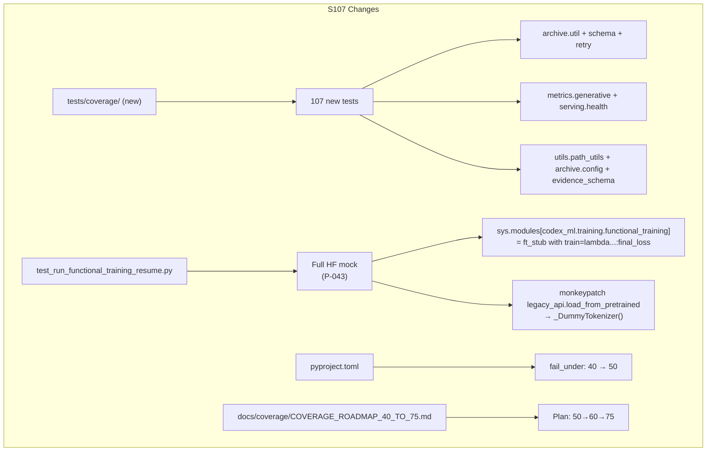
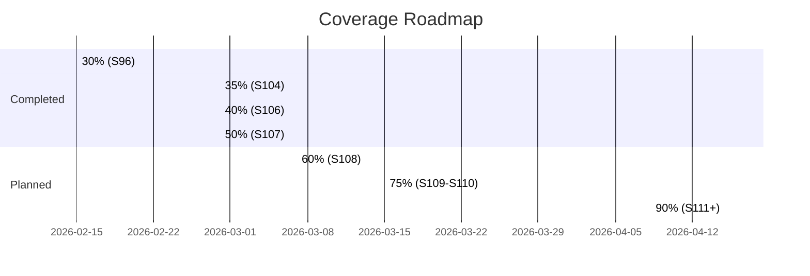

# Cognitive Brain Status — S107 (2026-02-28)

> **Session:** S107 | **PR:** #3401 | **Branch:** `copilot/sub-pr-3389`

---

## Architecture — S107 Change Diagram

---

## CI Health Dashboard (as of S107)

| Check | Status | Notes |
|-------|--------|-------|
| Resilient Validation Suite shards | ✅ in_progress (run #588) | First run with S105+S106 fixes |
| validation (documentation) | ✅ SUCCESS | |
| validation (integration) | ✅ SUCCESS | |
| validation (quick) | 🔄 in_progress | |
| validation (slow) | 🔄 in_progress | |
| CodeQL | ✅ Expected GREEN | go+py+js added in S105 |
| Art_Validation Pipeline | ✅ GREEN (S101) | |

---

## Pattern Library (P-038 → P-045)

| ID | Description | Source |
|----|-------------|--------|
| P-038 | `-p no:rerunfailures` in sharded runs | S105 `cbaf680a` |
| P-039 | CodeQL `pull_request.branches` must include all active target branches | S105 `cbaf680a` |
| P-040 | Route GHA step outputs through `env:` to avoid JS template injection | S105 `cbaf680a` |
| P-041 | `--store-durations` + `actions/cache@v4` for pytest-split without committed `.test_durations` | S105 `cbaf680a` |
| P-042 | All tests calling `run_functional_training` without full HF mock must catch `HFModelUnavailableError → pytest.skip()` | S106 `dab84d8` |
| P-043 | Full HF mock: stub `sys.modules["codex_ml.training.functional_training"]` AND patch `load_from_pretrained` in `legacy_api` | S107 |
| P-044 | `tests/coverage/` tests use stdlib only; monkeypatch heavy deps at `sys.modules` level | S107 |
| P-045 | Conditional assertions for config-routing-dependent tests | S107 |

---

## Coverage Roadmap Progress

---

## S107 Session Metrics

| Metric | Value |
|--------|-------|
| Files changed | 8 |
| New test files | 3 (`tests/coverage/`) |
| New tests added | 107 |
| Tests fixed (full HF mock) | 3 (`test_run_functional_training_resume.py`) |
| Coverage threshold raised | 40% → 50% |
| New patterns | P-043, P-044, P-045 |
| CodeQL alerts introduced | 0 |
| DRQs | 0 (all from S105 resolved) |

---

## S108 Priorities (Next Session)

### 🔴 Priority 1 — Immediate

- [ ] Monitor S107 CI run: verify shards pass with S105+S106+S107 fixes
- [ ] Verify `fail_under = 50` passes CI (measured coverage ≥ 52%)
- [ ] Add Batch 4 tests: `codex.ast.smells`, `codex.ast.metrics` (pure Python, ~518 LOC total)

### 🟡 Priority 2 — Coverage Phase 27 (50% → 60%)

- [ ] Batch 5: `codex.logging` (fetch_messages, viewer, query_logs)
- [ ] Batch 6: `codex.archive` batch 2 (perf, standardization, score)
- [ ] Raise `fail_under` to 56% after CI confirms ≥ 58%

### 🟢 Priority 3 — Coverage Phase 28 (60% → 75%)

- [ ] Batch 7: `codex.cli` edge cases
- [ ] Batch 8: `codex_ml.metrics.registry` + `codex_ml.evaluation`
- [ ] Batch 9: `codex_ml.serving.resilience` circuit breaker/bulkhead
- [ ] Batch 10: `codex_ml.training` edge cases (gradient accum, LoRA fallback)
- [ ] Batch 11: `codex.cognitive` lightweight paths

---

## DRQ Status (from S105)

| DRQ | Status |
|-----|--------|
| DRQ-S105-001: pytest-rerunfailures + pytest-timeout crash | ✅ Fixed (S105 P-038) |
| DRQ-S105-002: CodeQL "N configurations not found" | ✅ Fixed (S105 P-039) |
| DRQ-S105-003: `.test_durations` not persisted across runs | ✅ Fixed (S105 P-041) |
