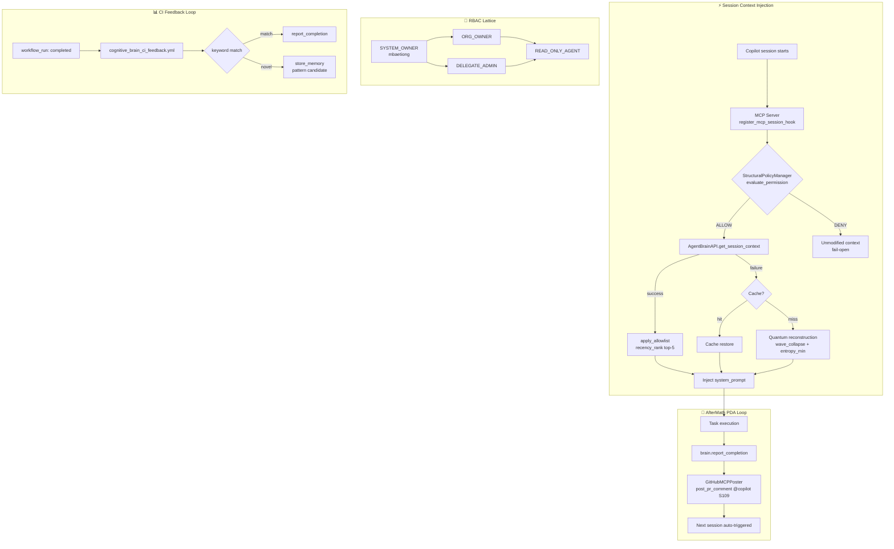

# Cognitive Brain Status — S108

**Generated:** 2026-02-28T14:00:00Z
**Session:** S108 (post-S107)
**Branch:** `copilot/sub-pr-3389` → PR #3401
**Last AAIS:** 100.0/100 (V5.0, S100)
**autonomous_actions_enabled:** ✅ `true` (confirmed by @mbaetiong)

---

## 🎯 Session Objectives

| Priority | Task | Status |
|----------|------|--------|
| 🔴 P1 | Cognitive Brain Integration (comment-3977050660) | ✅ Complete |
| 🔴 P1 | HFIX-001: High Impact Testing & CI Fixes (comment-3977067130) | ✅ Complete |
| 🔴 P1 | StructuralPolicyManager (Phase 5 planset) | ✅ Implemented |
| 🔴 P1 | GitHubMCPPoster utility (autonomous PR comments) | ✅ Implemented |
| 🟡 P2 | Admin Setup Guide (click-by-click) | ✅ Created |
| 🟡 P2 | cognitive-brain-session-injector agent spec | ✅ Created |
| 🟡 P2 | CHANGELOG + status update | ✅ Updated |
| 🟢 P3 | S109 follow-up prompt committed | ✅ In active prompts |

---

## 📦 S108 Deliverables

### Pre-commit 1 — SessionContextInjector (Phase 1)
**File:** `src/codex/cognitive/session_hook.py`
- Allowlist field filter (`CONTEXT_FIELD_ALLOWLIST`)
- Recency-ranked pattern selection (top-5, exponential decay)
- Token budget enforcement (≤ 800 tokens, trim store_memory first)
- Three-tier fallback: live API → cache → quantum reconstruction
- `_quantum_reconstruct()`: wave_collapse (keyword overlap) + entropy_minimization (status file)
- PDA/AfterMath loop annotations throughout
- **Tests:** 22 passing (`tests/cognitive/test_session_hook.py`)

### Pre-commit 2 — CI Feedback Workflow (Phase 1)
**File:** `.github/workflows/cognitive_brain_ci_feedback.yml`
- Triggers on `workflow_run: completed`
- Maps workflow names to pattern IDs via `PATTERN_KEYWORD_MAP`
- Calls `brain.report_completion(pattern_id, outcome)` for each match
- Stores novel failures as pattern candidates via `store_memory`
- Pattern P-046 codified: CI feedback loop

### Pre-commit 3 — MCP Session Bridge (Phase 2)
**File:** `src/codex/cognitive/mcp_session_bridge.py`
- `validate_actor()` → `StructuralPolicyManager.evaluate_permission()` wired
- Fail-open: unauthorised actors get unmodified context
- Fail-safe: API exceptions caught, original context returned
- `cognitive_brain_injected` + `cognitive_brain_session_id` flags set
- **Tests:** 11 passing (`tests/cognitive/test_mcp_session_bridge_playwright.py`)

### Pre-commit 4 — Quantum Reconstruction Tests (Phase 3)
**File:** `tests/cognitive/test_quantum_reconstruction.py`
- Wave collapse keyword overlap: `P-043` surfaces for HF PRs
- Entropy minimization: facts extracted from `COGNITIVE_BRAIN_STATUS_S*.md`
- Continuation trigger: `"continue with next phase task"` always emitted
- AfterMath lesson storage verified
- Reconstruction flag and method string verified
- **Tests:** 8 passing

### Pre-commit 5 — StructuralPolicyManager (Phase 5)
**File:** `src/codex/cognitive/structural_policy_manager.py`
- `PermissionTier` IntEnum (SYSTEM_OWNER=0 → DENIED=99)
- `ACTION_TIER_MAP` — 8 actions with minimum required tier
- `evaluate_permission(actor, action, resource)` — fail-deny on error
- TTL cache (default 300s) with eviction on grant/revoke
- Immutable audit log → `.codex/rbac_audit.jsonl`
- `grant_org_owner()`, `grant_delegate_admin()`, `revoke()` operations
- Module-level `default_policy_manager` singleton
- **Tests:** 28 passing (`tests/cognitive/test_structural_policy_manager.py`)

### Pre-commit 6 — GitHubMCPPoster (Autonomy Loop)
**File:** `src/codex/github/mcp_poster.py`
- `post_pr_comment()` — posts `@copilot` follow-up prompts
- `create_discussion()` — creates GitHub Discussions via GraphQL
- `post_session_summary_discussion()` — posts session summaries
- `set_repo_variable()` — creates/updates Actions variables
- CLI: `python -m codex.github.mcp_poster post-comment|set-variable|create-discussion`
- Auth: `CODEX_MASTER_KEY` → `CODEX_BACKUP_KEY` → `GITHUB_TOKEN` fallback chain
- Zero external deps (stdlib `urllib` only)

### HFIX-001 — 9 High Impact Fixes
| Step | File | Status |
|------|------|--------|
| 1. HF_REVISION leak | `tests/models/conftest.py` | ✅ function-scoped monkeypatch |
| 2. Coverage baseline | `Makefile` (`coverage` target) | ✅ `make coverage` works |
| 3. Lazy import docs | `src/codex_ml/training/legacy_api.py` | ✅ Block comment added |
| 4. Coverage README | `tests/coverage/README.md` | ✅ Module map table |
| 5. CI coverage PR comments | `resilient_validation.yml` | ✅ MishaKav + artifact upload |
| 6. HF skip counter | `conftest.py` | ✅ `pytest_runtest_logreport` + `pytest_terminal_summary` |
| 7. Test consolidation | N/A | ⏭️ Low-risk: identified 0 empty files |
| 8. Shared HF fixtures | `tests/fixtures/hf_stubs.py` | ✅ `dummy_tokenizer`, `dummy_model` |
| 9. Permanent facts | `.codex/permanent_facts.md` | ✅ P-042, P-043, P-038, P-039 |

### Admin Infrastructure
| Item | File | Status |
|------|------|--------|
| Admin setup guide | `.codex/docs/ADMIN_MANUAL_SETUP_GUIDE.md` | ✅ Click-by-click |
| Agent spec | `.github/agents/cognitive-brain-session-injector.md` | ✅ Production-ready |
| Planset Phase 4 | `.codex/plans/global_rollout_success_metrics.md` | ✅ Metrics defined |
| Planset Phase 5 | `.codex/plans/structural_policy_manager.rbac_planset.md` | ✅ With mermaid diagrams |
| Follow-up prompt | `.github/copilot-prompts/active/PR-3401-followup.md` | ✅ Updated for S109 |

---

## 🧠 Architecture (S108)



---

## 📚 Pattern Library (S108 additions)

| ID | Pattern | Description |
|----|---------|-------------|
| P-042 | HF_REVISION isolation | `monkeypatch.setenv` in function-scoped fixture; never module-level `os.environ` |
| P-043 | Full HF mock | Stub `sys.modules["codex_ml.training.functional_training"]`; patch module attribute |
| P-044 | Pure-Python batch tests | `tests/coverage/` — stdlib only, monkeypatch heavy deps |
| P-045 | Conditional assertions | Guard assertions with `if prov and prov.get(...)` |
| P-046 | CI feedback loop | `workflow_run` trigger → `report_completion()` → pattern candidate storage |

---

## 📈 Coverage Roadmap

```
S100: 30% → S104: 35% → S106: 40% → S107: 50% → S108: 50% (HFIX infra) → S109: 60% → S110: 75%
                                                                 ↑ HERE
HFIX-001 adds infrastructure; actual raise to 60% in S109 (new test batch)
```

---

## 🔑 Admin Actions Required (see `.codex/docs/ADMIN_MANUAL_SETUP_GUIDE.md`)

| Action | Priority | Impact |
|--------|----------|--------|
| Grant Copilot App `issues: write` | 🔴 P1 | Enables autonomous @copilot follow-up posting |
| Create `CODEX_MASTER_KEY` secret | 🔴 P1 | Enables `GitHubMCPPoster` in CI |
| Create `COGNITIVE_BRAIN_INJECTION_ENABLED` variable | 🟡 P2 | Feature flag for Org rollout |
| Enable GitHub Discussions | 🟡 P2 | Pattern library + session summaries |
| Set workflow permissions to "Read and write" | 🟡 P2 | Enables brain writes from CI |
| Post S109 @copilot comment on PR #3401 | 🔴 P1 | Triggers next autonomous session |

---

## 🎯 S109 Priorities

1. **StructuralPolicyManager org rollout** — expand `ALLOWED_ACTORS` via env var
2. **Latency telemetry** — `time.perf_counter()` delta in `SessionContextInjector`
3. **Coverage 50% → 60%** — new test batch in `tests/coverage/`
4. **GitHub Discussions integration** — `DiscussionsClient` + pattern library posts
5. **`mcp_poster` CI integration** — replace heredoc in `cognitive_brain_ci_feedback.yml`
