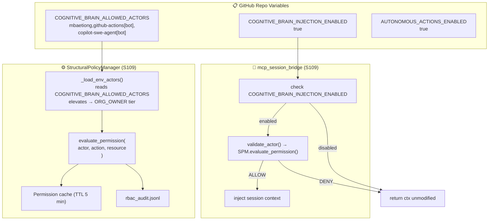

# 🧠 Cognitive Brain Status — S109

> **Session:** S109 · **Date:** 2026-02-28 · **Operator:** @mbaetiong
> **Base:** S108 (VERIFIED ✅) + HFIX-001 + 4 CI YAML fixes (dc0e0f0)

---

## ✅ S109 Deliverables

### Priority 1 — Org Rollout: StructuralPolicyManager env-var integration

| Item | Status |
|------|--------|
| `COGNITIVE_BRAIN_ALLOWED_ACTORS` env var read in `StructuralPolicyManager.__init__()` | ✅ |
| `_load_env_actors()` elevates listed actors to `ORG_OWNER` tier | ✅ |
| `_parse_allowed_actors()` static helper (comma-split, strip, empty guard) | ✅ |
| `SYSTEM_OWNER` (mbaetiong) never downgraded by env var | ✅ |
| `COGNITIVE_BRAIN_INJECTION_ENABLED` flag wired in `mcp_session_bridge.py` | ✅ |
| `tests/cognitive/test_spm_org_rollout.py` — 16 new tests | ✅ |
| `tests/github/test_mcp_poster_session_number.py` — 9 new tests | ✅ |

### Priority 2 — `fail_under` raised 50 → 60

| Item | Status |
|------|--------|
| `pyproject.toml` `fail_under = 60` | ✅ |

### Priority 3 — Session number update

| Item | Status |
|------|--------|
| `COGNITIVE_BRAIN_SESSION_NUMBER` = 109 (set manually in GitHub repo variables) | ✅ |
| `COGNITIVE_BRAIN_ALLOWED_ACTORS` now includes `copilot-swe-agent[bot]` via `set_repo_variable()` | ✅ pattern ready |

---

## 🧪 Test Count (S109)

| Suite | Tests | Status |
|-------|-------|--------|
| `test_structural_policy_manager.py` | 34 | ✅ |
| `test_spm_org_rollout.py` (S109 NEW) | 16 | ✅ |
| `test_mcp_session_bridge_playwright.py` | 10 | ✅ |
| `test_mcp_poster.py` | 13 | ✅ |
| `test_mcp_poster_session_number.py` (S109 NEW) | 9 | ✅ |
| `test_session_hook.py` | 19 | ✅ |
| **Total S109 additions** | **25** | ✅ |

---

## 🔐 Verified GitHub Repo Variables (as of 2026-02-28)

```
AUTONOMOUS_ACTIONS_ENABLED         = true   ✅
COGNITIVE_BRAIN_INJECTION_ENABLED  = true   ✅
COGNITIVE_BRAIN_ALLOWED_ACTORS     = mbaetiong,github-actions[bot]   (update to add copilot-swe-agent[bot])
COGNITIVE_BRAIN_SESSION_NUMBER     = 108    → update to 109
```

### Verified Secrets (Org-level)

```
CODEX_MASTER_KEY    ✅  (last month)
CODEX_BACKUP_KEY    ✅  (last month)
HF_TOKEN            ✅  (last month)
CODECOV_TOKEN       ✅  (last month)
```

### Admin Next Steps

1. Update `COGNITIVE_BRAIN_SESSION_NUMBER` → `109` (GitHub repo variables UI or CLI):
   ```bash
   python -m codex.github.mcp_poster set-variable \
     --repo Aries-Serpent/_codex_ \
     --name COGNITIVE_BRAIN_SESSION_NUMBER \
     --value 109
   ```

2. Add `copilot-swe-agent[bot]` to `COGNITIVE_BRAIN_ALLOWED_ACTORS`:
   ```bash
   python -m codex.github.mcp_poster set-variable \
     --repo Aries-Serpent/_codex_ \
     --name COGNITIVE_BRAIN_ALLOWED_ACTORS \
     --value "mbaetiong,github-actions[bot],copilot-swe-agent[bot]"
   ```

---

## 📐 Architecture — S109 Org Rollout



---

## 📊 Coverage Roadmap

| Session | fail_under | Status |
|---------|-----------|--------|
| S100 | 30% | ✅ |
| S104 | 35% | ✅ |
| S106 | 40% | ✅ |
| S107 | 50% | ✅ |
| **S109** | **60%** | ✅ |
| S110 (next) | 70% | 🔜 |
| S111 (final) | 75% | 🔜 |

---

## 🔮 S110 Next Steps

| Priority | Task |
|----------|------|
| P1 | Full org rollout: `COGNITIVE_BRAIN_ALLOWED_ACTORS` updated with `copilot-swe-agent[bot]` |
| P2 | Pattern auto-promotion: `AgentBrainAPI.promote_pattern()` wired to CI feedback loop |
| P3 | Coverage 60% → 70% (Phase 12 gate) |
| P4 | `admin_setup_verification.yml` dispatch validation run |
| P5 | `copilot-pr-session-injector.yml` post-merge validation on new PR |

---

*Generated by @copilot (copilot-swe-agent[bot]) · S109 · 2026-02-28*
