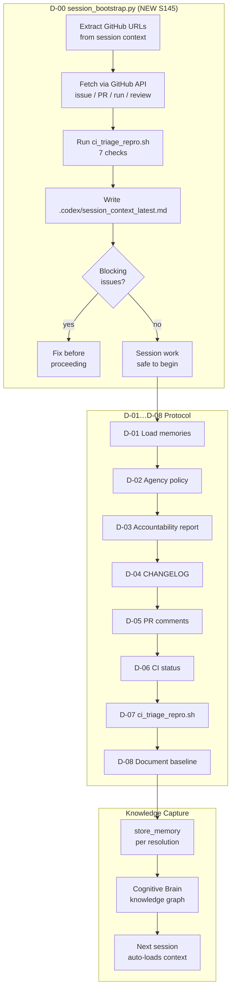

# Cognitive Brain Status — S145

> **Session:** S145 | **Date:** 2026-03-17 | **PR:** #3606 (copilot/sub-pr-3606)
> **Previous:** S143/S144 (PR #3610) | **Branch base:** `0D_base_`

---

## Current Phase: Phase 4 — Autonomous Session Intelligence

```
Phase 1 ✅  Template + safety guards
Phase 2 ✅  Genesis bootstrap (CI/CD hardening, caching, OTel wiring)
Phase 3 ✅  Comment upsert pagination, deferral scanner, import ordering
Phase 4 🔄  Session bootstrap, pre-process URL fetching, triage repro  ← ACTIVE
Phase 5 ⏳  Full autonomous self-healing loop (session→triage→fix→verify→commit)
Phase 6 ⏳  Cognitive Brain API server deployment + webhook receivers
```

---

## S145 Completions

| Component | Status | Detail |
|-----------|--------|--------|
| `scripts/ci/ci_triage_repro.sh` | ✅ NEW | 7-check repro toolkit; --fix/--json/--check N modes |
| `scripts/ci/session_bootstrap.py` | ✅ NEW | Pre-process: URL extraction → GitHub fetch → triage → digest |
| `docs/ci/CI_TRIAGE_REPRO_S145.md` | ✅ NEW | Root-cause + repro + fix reference for all 7 checks |
| `SESSION-DIAGNOSTIC-PROTOCOL.md` | ✅ NEW | D-00…D-08 mandatory session start protocol |
| `ci-health-monitor.yml` | ✅ FIXED | chr(34) key-lookup bug — FAILED_RUNS/TOTAL_RUNS always 0 |
| `coherence-snapshot.yml` | ✅ FIXED | SC2072 + threshold misalignment (99.6 → 99.7) |
| `.mypy_baseline` | ✅ FIXED | 0 → 282 (anti-regression gate) |
| `CHANGELOG.md` | ✅ FIXED | Cross-PR reference inconsistency (r2949785123) |

---

## Cognitive Brain Architecture (Phase 4)



---

## Knowledge Facts Stored (S145)

| Fact ID | Subject | Fact |
|---------|---------|------|
| KF-S145-01 | actionlint | SC2072: use `awk` arithmetic for float compare, never `[ x \> y ]` |
| KF-S145-02 | telemetry | chr(34)+key+chr(34) always returns 0 in dict.get; use plain string keys |
| KF-S145-03 | threshold | Dashboard and enforcement thresholds must be identical values |
| KF-S145-04 | mypy | `.mypy_baseline` must equal current error count; never set to 0 |
| KF-S145-05 | imports | ruff I001 — OTel try-block imports require isort order even inside try: |
| KF-S145-06 | changelog | Auto-generated bullets must not reference different PR than section header |
| KF-S145-07 | session | D-00: run session_bootstrap.py before any code changes |

---

## Next Phase (S146) Objectives

### P1 — Immediate
- [ ] Wire `session_bootstrap.py` into `agent-auth-delegation.yml` as a required
      pre-step so it auto-runs on every delegation activation
- [ ] Add `--context-file` population from PR body in `agent-auth-delegation.yml`
- [ ] Verify `ci_triage_repro.sh` passes on CI runner (not just local)

### P2 — Validation
- [ ] Add unit tests for `session_bootstrap.py` URL extraction and fetch logic
      (`tests/ci/test_session_bootstrap.py`)
- [ ] Add unit tests for `ci_triage_repro.sh` checks 5 and 7 (telemetry + changelog)
- [ ] Ratchet `.mypy_baseline` from 282 → 260 (fix 22 low-hanging errors)

### P3 — Enhancement (Phase 5 prep)
- [ ] Extend `session_bootstrap.py` to write structured facts directly to
      store_memory via a JSON facts file consumed by the agent
- [ ] Integrate with `cognitive-brain-session-injector.md` D-00 hook
- [ ] Build `session_bootstrap_agent.md` custom agent for Copilot Extensions

---

## Metrics

| Metric | S144 | S145 | Δ |
|--------|------|------|---|
| `.mypy_baseline` | 0 (broken) | 282 (correct) | fixed |
| actionlint errors | 1 (SC2072) | 0 | -1 |
| ruff I001 issues | 2 | 0 | -2 |
| auto-fix patterns clean | 16/16 | 16/16 | = |
| CI Health Alert accuracy | ❌ (TOTAL_RUNS always 0) | ✅ correct | fixed |
| Session bootstrap | ❌ not exist | ✅ available | new |
| Triage repro script | ❌ not exist | ✅ 7 checks | new |
| Session protocol doc | ❌ not exist | ✅ D-00…D-08 | new |
