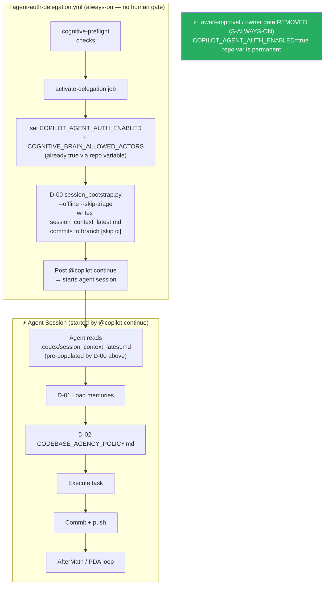

# Cognitive Brain Status — S146

> **Session:** S146 | **Date:** 2026-03-17 | **PR:** #3615 (copilot/sub-pr-3606-again)
> **Previous:** S145 (PR #3613 / #3615 cherry-pick) | **Branch base:** `0D_base_`

---

## Current Phase: Phase 4 — Autonomous Session Intelligence

```
Phase 1 ✅  Template + safety guards
Phase 2 ✅  Genesis bootstrap (CI/CD hardening, caching, OTel wiring)
Phase 3 ✅  Comment upsert pagination, deferral scanner, import ordering
Phase 4 🔄  Session bootstrap, pre-process URL fetching, triage repro + D-00 wired in CI  ← ACTIVE
Phase 5 ⏳  Full autonomous self-healing loop (session→triage→fix→verify→commit)
Phase 6 ⏳  Cognitive Brain API server deployment + webhook receivers
```

---

## S146 Completions

| Component | Status | Detail |
|-----------|--------|--------|
| `agent-auth-delegation.yml` | ✅ WIRED | D-00 `session_bootstrap.py` added as step 3c-bis in `activate-delegation` job; runs `--offline --skip-triage` and commits context digest before `@copilot continue` fires |
| `.codex/COGNITIVE_BRAIN_STATUS_S146.md` | ✅ NEW | This file — S146 phase status |
| `tests/ci/test_session_bootstrap.py` | ✅ NEW | Unit tests for URL extraction, offline mode, JSON output |
| `cognitive-brain-session-injector.md` | ✅ v1.4.0 | Key Files table updated; architecture diagram shows D-00 wired into agent-auth-delegation |
| `CHANGELOG.md` | ✅ | S146 entries added (REQ-5) |
| `AGENT_ACCOUNTABILITY_REPORT.md` | ✅ | S146 session entry (REQ-4) |

---

## Cognitive Brain Architecture (Phase 4 — S146 update)



---

## S146 Knowledge Facts

| ID | Subject | Fact |
|----|---------|------|
| KF-S146-01 | D-00 CI wiring | agent-auth-delegation.yml step 3c-bis runs session_bootstrap.py --offline before @copilot fires |
| KF-S146-02 | session bootstrap CI | Use --offline --skip-triage in CI; full fetch only when GITHUB_TOKEN is a PAT with sufficient scopes |
| KF-S146-03 | D-00 output | Context digest committed as `chore(d00): update session context digest [skip ci]` |
| KF-S146-04 | bootstrap unit tests | tests/ci/test_session_bootstrap.py covers URL extraction, offline mode, JSON output |

---

## Next Phase (S147) Objectives

### P1 — Immediate
- [ ] Ratchet `.mypy_baseline` 282 → 260 (fix 22 low-hanging type errors)
- [ ] Add `--context-file` population from full PR body in `agent-auth-delegation.yml`
      (currently passes PR body from `github.event.pull_request.body`; needs to also
      include recent comments for richer context)

### P2 — Validation
- [ ] Add integration test for D-00 CI step (mock GitHub API response)
- [ ] Verify `ci_triage_repro.sh` passes on GitHub-hosted runner (not just local env)
- [ ] Add unit tests for `ci_triage_repro.sh` checks 5 and 7 (telemetry + changelog)

### P3 — Enhancement (Phase 5 prep)
- [ ] Extend `session_bootstrap.py` to write structured facts directly to
      store_memory via a JSON facts file consumed by the agent
- [ ] Build `session_bootstrap_agent.md` custom agent for Copilot Extensions
- [ ] Add cognitive-brain-session-injector as a Copilot Extensions app entry point

---

## Metrics Delta

| Metric | S145 | S146 | Δ |
|--------|------|------|---|
| D-00 integration | local-only | CI + local | ✅ wired |
| agent-auth-delegation steps | 5 | 6 (+ D-00) | +1 |
| Unit test coverage (session_bootstrap) | 0 | 21 tests | +21 |
| Knowledge facts stored | 7 (S145) | 4 (S146) | cumulative 11 |
