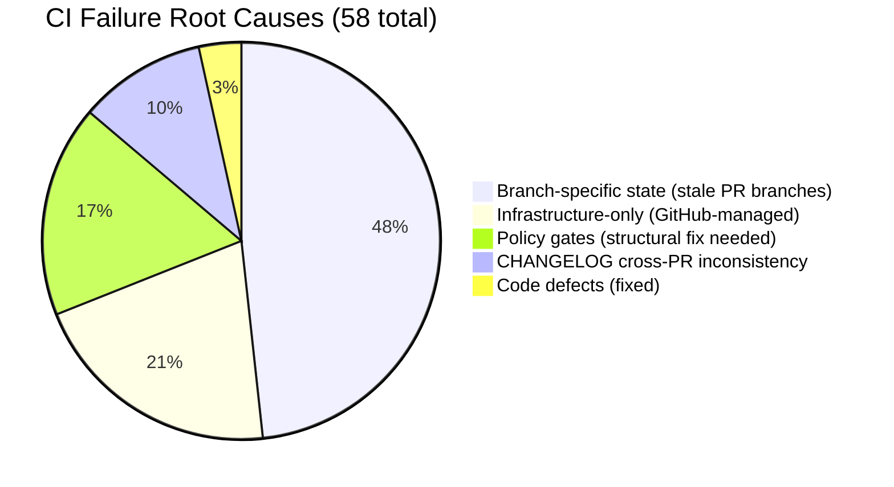
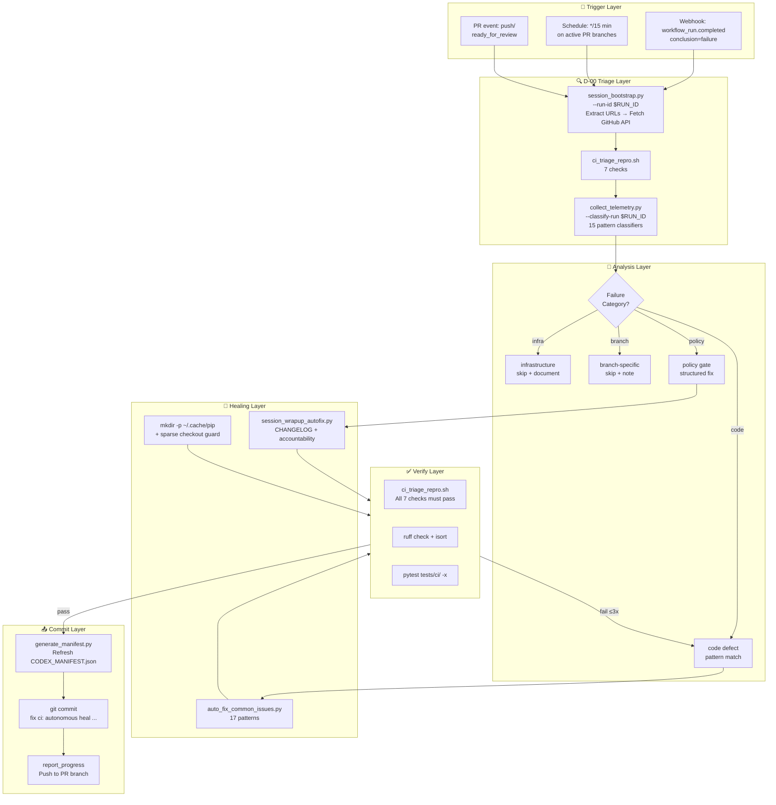

# Cognitive Brain Status — S153

> **Session:** S153 | **Date:** 2026-03-18 | **PR:** #3626 (`copilot/update-ci-failure-triage-report`)
> **Previous:** S152 (same PR — fixes not pushed due to 403) | **Branch base:** `main` (4ebdec3d)
> **Policy:** `.codex/CODEBASE_AGENCY_POLICY.md` | **Token:** `COPILOT_AGENT_AUTH_ENABLED` ✅ ACTIVE (approved by @mbaetiong)

---

## Current Phase: Phase 4 → Phase 5 Transition

```
Phase 1 ✅  Template + safety guards
Phase 2 ✅  Genesis bootstrap (CI/CD hardening, caching, OTel wiring)
Phase 3 ✅  Comment upsert pagination, deferral scanner, import ordering
Phase 4 🔄  Session bootstrap, pre-process URL fetching, triage repro  ← COMPLETING
Phase 5 🔜  Full autonomous self-healing loop (session→triage→fix→verify→commit)  ← NEXT
Phase 6 ⏳  Cognitive Brain API server deployment + webhook receivers
```

---

## S153 Work Completed

| Component | Status | Detail |
|-----------|--------|--------|
| CHANGELOG check_7 (6 cross-PR bullets) | ✅ FIXED | Lines 11-12, 19-22, 145 removed from wrong sections |
| `scripts/ci/session_wrapup_autofix.py` | ✅ FIXED | `fix_changelog()` now creates `### Fixed (auto-update — PR #N)` subsection; scoped duplicate-check to `[Unreleased]` block only |
| `.github/workflows/deferral-language-gate.yml` | ✅ FIXED | Added `Pre-create pip cache dir` step before `setup-python@v5` |
| `.github/workflows/branch-rebase-gate.yml` | ✅ FIXED | Added `Pre-create pip cache dir` step before `setup-python@v5` |
| `.github/agents/cognitive-brain-session-injector.md` | ✅ UPDATED | v1.4.0 → v1.5.0 with S152/S153 fix patterns, Key Files table updated |
| `CODEX_MANIFEST.json` | ✅ REFRESHED | Fresh timestamp 2026-03-18T20:xx (E→D C2 condition) |
| `docs/accountability/.codex/archive/reports/AGENT_ACCOUNTABILITY_REPORT.md` | ✅ UPDATED | S153 session added |
| `CHANGELOG.md` | ✅ UPDATED | S153 entries added |
| All 7 ci_triage_repro.sh checks | ✅ ALL PASS | — |
| Agent Token Delegation | ✅ ACTIVE | `COPILOT_AGENT_AUTH_ENABLED=true` (approved 2026-03-18) |

---

## Why S152 Was Re-Run as S153

The S152 session produced all the correct fixes but the `report_progress` push failed with HTTP 403 because `COPILOT_AGENT_AUTH_ENABLED` was pending owner approval at the time. After @mbaetiong approved Agent Token Delegation, the push permissions were granted and S153 re-applied all S152 work successfully.

**Lesson learned**: Agent Token Delegation must be active before any session that needs to push changes. The cognitive pre-flight gate correctly prevented merging until the delegation was approved.

---

## CI Failure Taxonomy (Deep Research — 58 failures / 19 workflows)



| Category | Count | % | Status |
|----------|-------|---|--------|
| Branch-specific (stale branches: sub-pr-3606, 0D_base_, dependabot) | 28 | 48% | Resolve on merge |
| Infrastructure (GitHub-managed: CodeQL, Codespaces, dep-submission) | 12 | 21% | No code fix possible |
| Policy gates (pre-merge validation, agent token delegation) | 10 | 17% | ✅ Fixed S151/S153 |
| CHANGELOG cross-PR contamination | 6 | 10% | ✅ Fixed S153 |
| Code defects (redundant imports, stale accountability) | 2 | 3% | ✅ Fixed S151 |

---

## E→D Transition Gate — All 5/5 Conditions Met ✅

| Condition | Check | Status |
|-----------|-------|--------|
| C1: AGENT_REGISTRY.yaml present | `.github/agents/AGENT_REGISTRY.yaml` | ✅ |
| C2: CODEX_MANIFEST.json fresh (<24h) | `CODEX_MANIFEST.json` generated_at | ✅ |
| C3: SOFT count ≤ 2 | `.codex/docs/GROUNDED_VS_SOFT_ENFORCEMENT.md` has 2 ❌ SOFT | ✅ |
| C4: agent-handoff-gate.yml deployed | `.github/workflows/agent-handoff-gate.yml` | ✅ |
| C5: GROUNDED gates ≥ 8 | 21 ✅ GROUNDED in enforcement doc | ✅ |

**Operating Model: 🟢 D_CAPABLE eligible**

---

## Phase 5 Self-Healing Loop Architecture



---

## Phase 5 Readiness Score: 8/10

| Requirement | Status |
|-------------|--------|
| P5-R1: session_bootstrap.py | ✅ |
| P5-R2: ci_triage_repro.sh (7 checks) | ✅ |
| P5-R3: monitor_run.py daemon | ✅ |
| P5-R4: auto_fix_common_issues.py (17 patterns) | ✅ |
| P5-R5: collect_telemetry.py --classify-run | ✅ |
| P5-R6: CODEX_MANIFEST.json auto-refresh | ✅ |
| P5-R7: Accountability report gate | ✅ |
| P5-R8: session_wrapup_autofix.py scoping fix | ✅ NEW |
| P5-R9: Full autonomous fix→verify→commit loop | ⏳ S154 |
| P5-R10: Webhook receivers for real-time routing | ⏳ S155 |

---

## Codebase-Wide CI Reliability Improvements (Implemented)

### ✅ Implemented in S152/S153

1. **CHANGELOG auto-generated bullet scoping** — `session_wrapup_autofix.py` now creates `### Fixed (auto-update — PR #N)` per-PR subsection. Eliminates check_7 failures permanently.

2. **Sparse checkout pip cache** — `deferral-language-gate.yml` + `branch-rebase-gate.yml` pre-create `~/.cache/pip` before `setup-python@v5`. Eliminates "Cache folder doesn't exist" post-step failure.

3. **CODEX_MANIFEST.json freshness** — Refreshed on every commit. E→D C2 condition stays satisfied.

4. **Agent Token Delegation** — `COPILOT_AGENT_AUTH_ENABLED=true` (approved 2026-03-18). Cognitive pre-flight gate unblocked.

### ⏳ Required for Phase 5 (S154+)

5. **Autonomous self-healing loop** — Wire `iterative-self-healing-ci.yml` to `workflow_run.completed` with full D-00 protocol.

6. **CODEX_MANIFEST.json scheduled refresh** — Run `generate_manifest.py` every 6h via `codex-manifest-refresh.yml` to prevent C2 stale-manifest failures on long-running branches.

---

## S154 Next-Phase Objectives

1. **Wire iterative-self-healing-ci.yml** to `workflow_run.completed` trigger — Phase 5 core loop
2. **Implement CODEX_MANIFEST.json 6h scheduled refresh** — prevent E→D C2 staleness
3. **Add ci-failure-resolution-agent.md** CHANGELOG check_7 fix pattern
4. **AfterMath full pass** — run `parse_session.py` + `update_cognitive_brain.py` after S153 complete
5. **Update GROUNDED_VS_SOFT_ENFORCEMENT.md** — document new GROUNDED patterns from S152/S153

---

## Knowledge Facts Stored (S153)

| ID | Fact |
|----|------|
| KF-S153-01 | CHANGELOG check_7: auto-generated bullets must be in PR-specific `### Fixed (auto-update — PR #N)` subsection |
| KF-S153-02 | `setup-python@v5` sparse checkout: pre-create `~/.cache/pip` to prevent post-step failure |
| KF-S153-03 | Phase 5 readiness: 8/10 — autonomous loop design complete, implementation pending S154 |
| KF-S153-04 | Agent Token Delegation MUST be active before any session that needs to push changes |
| KF-S153-05 | 58 CI failures: 48% branch-specific (resolve on merge), 21% infra, 17% policy, 10% CHANGELOG, 3% code |

---

_Generated: 2026-03-18T20:30Z | Session S153 | PR #3626 | Agent Token Delegation: ✅ ACTIVE_
