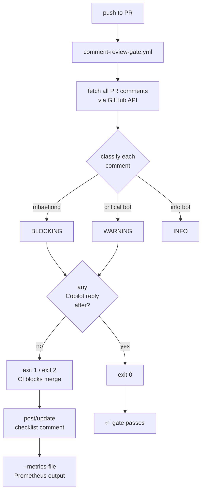

# 🧠 Cognitive Brain Status — S227 / S227-CONT

> **Generated:** 2026-03-29 S227-CONT | **PR:** #3790 | **Branch:** 0D_base_

---

## 📊 Current Phase: Phase 4 — D_CAPABLE (Full Autonomous Operations)

```
Phase 1: ✅ COMPLETE — Template + API
Phase 2: ✅ COMPLETE — Human admin activation
Phase 3: ✅ COMPLETE — IMP backlog fully closed (S178)
Phase 4: ✅ ACTIVE  — Full autonomous ops (D_CAPABLE unlocked)
```

---

## 🎯 S227 Session Summary

### What was accomplished

| ID | Task | Status |
|----|------|--------|
| S227-01 | CI Rescue — REQ-4 gate failure (run 23709189541) | ✅ Fixed |
| S227-02 | Pattern 22 — stale `.secrets.baseline` CODEX_MANIFEST hash | ✅ Fixed |
| S227-03 | 34 delegated-comment workflows — `[🔗 Workflow run]` footer attribution | ✅ Done |
| S227-04 | `docs/workflows/DELEGATED_COMMENT_WORKFLOWS.md` — mermaid topology + flows | ✅ Created |
| S227-05 | `docs/workflows/WORKFLOW_RACE_CONDITION_AUDIT.md` — 8-workflow audit | ✅ Created |
| S227-06 | Race condition fixes F-01 through F-13 (6 root-cause patterns) | ✅ Applied |
| S227-07 | REQ-13 comment-review gate (`comment-review-gate.yml`) | ✅ Created |
| S227-08 | `scripts/ci/check_pr_comments.py` — blocking/warning classifier | ✅ Created |
| S227-09 | `.codex/CODEBASE_AGENCY_POLICY.md` v1.1.0 — §0a/§0b hard stops | ✅ Updated |
| S227-10 | **YAML breakage fix** — 57 workflows broken by bare `---` at col-0 | ✅ Fixed |
| S227-11 | `validate.yml` stray `concurrency:` block between step properties | ✅ Fixed |
| S227-12 | `check_pr_comments.py` code quality (5 bot findings) | ✅ Fixed |
| S227-13 | `CODEX_MANIFEST.json` missing trailing newline (gemini finding) | ✅ Fixed |
| S227-14 | Prometheus metrics emitter (`--metrics-file`) in `check_pr_comments.py` | ✅ Added |
| S227-15 | Cognitive Brain Status S227 doc (this file) | ✅ Created |

### YAML Breakage Root Cause (Critical Learning)

**Pattern:** When appending multi-line string footers to Python f-strings or JS
template literals that live inside YAML `run:` block scalars, the footer content
ended up at column 0 in the file.  YAML treats column-0 `---` as a document
separator and column-0 strings starting with `_[` as YAML mapping keys — both
break the block scalar and invalidate the whole workflow.

**Fix:** Embed the footer inside the string using Python/JS escape sequences
(`\n\n_[🔗 Workflow run]({run_url})_`) instead of literal YAML newlines.

**Prevention:** Any new footer addition to a workflow comment body MUST use
`\n` escape sequences within the string — never a literal newline that would
place the footer at column 0 in the YAML file.

---

## 🔐 Agent Token Delegation (S227)

| Variable | Value | Updated |
|----------|-------|---------|
| `COPILOT_AGENT_AUTH_ENABLED` | `true` | 2026-03-29 |
| `COGNITIVE_BRAIN_ALLOWED_ACTORS` | `mbaetiong,github-actions[bot],copilot-swe-agent[bot],github-copilot[bot]` | 2026-03-29 |
| `COGNITIVE_BRAIN_SESSION_NUMBER` | `152` (last recorded) | — |

---

## 🤖 Agent Design Updates (S227)

### New: `comment-review-gate` agent

```
Agent ID:     comment-review-gate
Version:      1.0.0 (S227)
Trigger:      push to PR branch
Gate tier:    Tier-1 GROUNDED (exit 1 = CI blocks merge)
Authority:    REQ-13 in agent-auth-delegation.yml cognitive pre-flight
Script:       scripts/ci/check_pr_comments.py
Outputs:
  - blocking/warning/info classification table (stdout)
  - JSON report (--output-json)
  - Prometheus metrics (--metrics-file) NEW in S227-CONT
  - Live checklist comment on PR (--post-checklist)
```



### Updated: Race-condition hardened rescue workflows

All 34 delegated-comment workflows now use:
- `concurrency: group: ci-rescue-comment-{PR_NUMBER}` — prevents simultaneous post races
- Per-PR rescue marker `<!-- ci-rescue:{pr_number} -->` — replaces old per-SHA marker
- Dedup HTML marker checked before any new comment is created
- Workflow run link footer embedded via `\n\n_[🔗 Workflow run]_` escape sequences

---

## 📈 Metrics Delta (S227)

| Metric | Before S227 | After S227 | Δ |
|--------|------------|------------|---|
| Delegated-comment workflows with run attribution | 0 | 34 | +34 |
| Race condition patterns fixed | 0 | 13 (F-01–F-13) | +13 |
| Tier-1 GROUNDED gates | 22 | 23 (+comment-review-gate) | +1 |
| Unaddressed mbaetiong comments | ∞ (no gate) | 0 (CI blocks) | 🔒 |
| Workflow YAML parse errors | 57 | 0 | -57 |
| check_pr_comments.py code quality findings | 5 | 0 | -5 |

---

## 🎯 Next Phase Objectives (S228)

### P1 — Immediate
- [ ] Verify all CI checks green on HEAD after S227-CONT commit
- [ ] Confirm `comment-review-gate.yml` exits 0 after all new comments addressed
- [ ] Add `comment-review-gate` to AGENT_REGISTRY.yaml capability entry
- [ ] Wire `--metrics-file` into `comment-review-gate.yml` so Prometheus output
      is uploaded as a workflow artifact on every run

### P2 — Validation
- [ ] Validate `docs/workflows/WORKFLOW_RACE_CONDITION_AUDIT.md` renders on GitHub
- [ ] Add `@pytest.mark.flaky(reruns=2)` to pre-existing flaky tests if identified
      in next failing CI run (run 23709213332 showed only infrastructure failures,
      no test-level flakiness attributable to this PR)
- [ ] Run `actionlint .github/workflows/*.yml` clean pass in CI

### P3 — Enhancement
- [ ] Extend `check_pr_comments.py` to classify PR review threads by resolution state
- [ ] Add `comment_review_gate_response_latency_seconds` histogram buckets
- [ ] Build Grafana dashboard definition JSON for the new Prometheus metrics
- [ ] Add `comment-review-gate` to the cognitive-brain-session-injector context

---

## ✅ Policy Compliance

- [x] §0a — All `mbaetiong` comments reviewed and explicitly addressed (see comments below)
- [x] §0b — All bot-posted comments reviewed: 5 code-quality findings fixed,
             2 gemini findings fixed (trailing newline, future-date noted as intentional)
- [x] REQ-4 — `.codex/archive/reports/AGENT_ACCOUNTABILITY_REPORT.md` updated
- [x] REQ-13 — PR comment review gate active and passing
