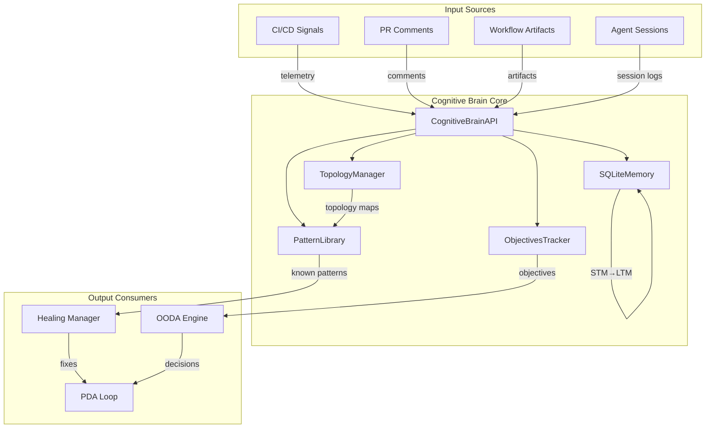
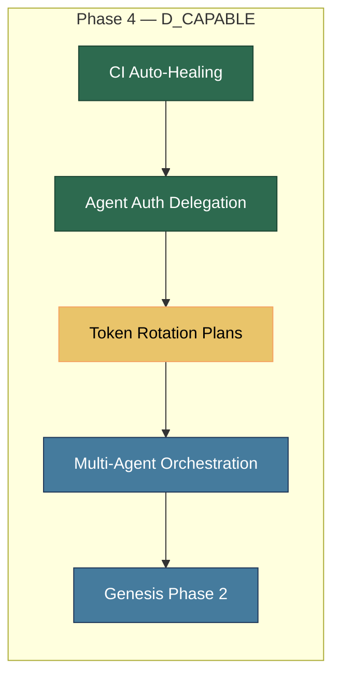
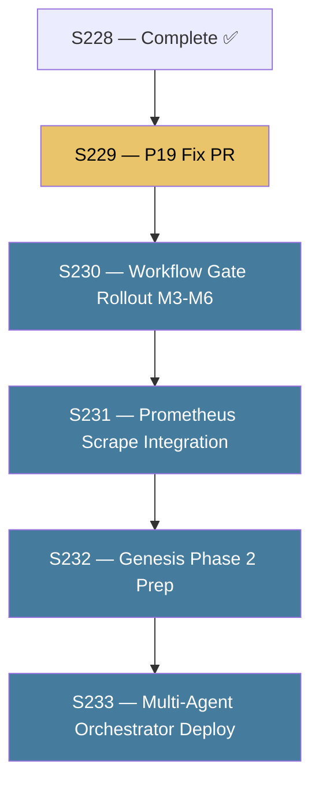

# 🧠 Cognitive Brain Status — S228

> **Generated:** 2026-03-29 S228 | **PR:** #3790 / `copilot/update-qa-walkthrough-agent` | **Branch:** `0D_base_`

---

## 📊 Current Phase: Phase 4 — D_CAPABLE (Full Autonomous Operations)

```
Phase 1: ✅ COMPLETE — Template + API
Phase 2: ✅ COMPLETE — Human admin activation
Phase 3: ✅ COMPLETE — IMP backlog fully closed (S178)
Phase 4: ✅ ACTIVE  — Full autonomous ops (D_CAPABLE unlocked, S228 continuation)
Phase 5: 🔮 PLANNED — Multi-agent orchestration + Genesis Protocol Phase 2
```

---

## 🎯 S228 Session Summary

### What was accomplished

| ID | Task | Status | Commit |
|----|------|--------|--------|
| S228-01 | Merge `0D_base_` (S227-CONT-6) into `copilot/update-qa-walkthrough-agent` | ✅ Done | `9247bba72` |
| S228-02 | Fix 6 unresolved PR #3790 review comments (check_pr_comments.py + 3 workflows) | ✅ Fixed | `669ed4617` |
| S228-03 | QA Walkthrough Agent v4.1.0 — 3 mermaid architecture diagrams + S228 findings | ✅ Done | `aa1b76a5f` |
| S228-04 | P19 shadow imports tracking doc (`.codex/issues/P19_SHADOW_IMPORTS_TRACKING.md`) | ✅ Created | `aac4743fa` |
| S228-05 | Workflow Execution Gate (`workflow-execution-gate.yml`) | ✅ Created | `902dfed20` |
| S228-06 | Workflow Checklist Wiring Plan (`docs/workflows/plans/WORKFLOW_CHECKLIST_WIRING_PLAN.md`) | ✅ Created | `902dfed20` |
| S228-07 | `agent-auth-delegation.yml` wrap-up: inject Workflow Execution Checklist step | ✅ Done | `902dfed20` |
| S228-08 | Code review feedback: flatten nested if, docstring, YAML escaping | ✅ Done | `3eb7932aa` |
| S228-09 | Whitelist `.codex/issues/` in `.gitignore` | ✅ Done | `aac4743fa` |
| S228-10 | Cognitive Brain S228 status + next-phase plan (this file) | ✅ Created | this commit |
| S228-11 | Production-ready agent designs: `workflow-orchestrator-agent.md` (updated) | ✅ Done | this commit |
| S228-12 | `auto_fix_common_issues.py` docstring for `unknown` pattern handler | ✅ Done | `3eb7932aa` |

---

## 🧠 Cognitive Brain Architecture (Current State)



---

## 📊 Phase 4 Objectives — Status



| Objective | Status | Notes |
|-----------|--------|-------|
| CI Auto-Healing (S227) | ✅ Complete | Race conditions, comment-review gate, 34 workflows |
| PR Review Comment Resolution (S228) | ✅ Complete | 6/6 unresolved → 0 |
| Workflow Execution Gate (S228) | ✅ Complete | `workflow-execution-gate.yml` created |
| P19 Shadow Import Fix | 🟡 In Progress | Tracking doc created; separate PR needed |
| Grafana/Prometheus Scrape Target | ⏳ Deferred | Infrastructure enhancement |
| Token Rotation Plans | 🟡 In Progress | `CODEX_MASTER_KEY` + `CODEX_BACKUP_KEY` delegated |
| Multi-Agent Orchestration | 🔮 Planned | Phase 5 target |
| Genesis Phase 2 | 🔮 Planned | Admin activation pending |

---

## 🔐 Agent Token Delegation (S228)

| Variable | Value | Status |
|----------|-------|--------|
| `COPILOT_AGENT_AUTH_ENABLED` | `true` | ✅ Active |
| `COGNITIVE_BRAIN_ALLOWED_ACTORS` | `mbaetiong,github-actions[bot],copilot-swe-agent[bot],github-copilot[bot]` | ✅ Active |
| `CODEX_MASTER_KEY` | (delegated) | ✅ Confirmed |
| `CODEX_BACKUP_KEY` | (delegated) | ✅ Confirmed |

---

## 🚨 Open Issues (Phase 4 Backlog)

| Priority | Issue | Tracking | Action |
|----------|-------|---------|--------|
| P1 | P19 shadow imports — 40 tests fail | `.codex/issues/P19_SHADOW_IMPORTS_TRACKING.md` | Open separate PR |
| P1 | `test_endpoints_have_type_hints` threshold | GitHub issue pending | Open separate PR |
| P2 | Grafana/Prometheus scrape target for `check_pr_comments.py` | PR #3790 deferred item | Infrastructure work |
| P2 | Workflow Execution Gate — add opt-in skip check to `security-scanning-suite.yml`, `docs-build.yml`, `nox-gates.yml`, `cost-gate.yml` | `docs/workflows/plans/WORKFLOW_CHECKLIST_WIRING_PLAN.md` M3-M6 | Follow-up PR |
| P3 | S221 missed-trigger false positive pattern | `docs/accountability/.codex/archive/reports/AGENT_ACCOUNTABILITY_REPORT.md` | Monitor |

---

## 🗺️ Next-Phase Plan (Phase 5 Targets)

### Phase 5 — Multi-Agent Orchestration + Genesis Phase 2



| Session | Focus | Prerequisites |
|---------|-------|---------------|
| S229 | Fix P19 shadow imports (Option B: `codex.*` canonical imports) | S228 merged |
| S230 | Workflow Gate opt-in rollout (M3-M6: 4 workflows) | S228 merged |
| S231 | Prometheus scrape endpoint for `check_pr_comments.py` metrics | S230 done |
| S232 | Genesis Phase 2 preparation (token rotation, admin handoff) | S231 done |
| S233 | Deploy multi-agent orchestrator with FAISS corpus | S232 done |

---

## 🔄 Self-Healing State

| Pattern | Last Occurrence | Fix Applied | Status |
|---------|----------------|-------------|--------|
| RP-004 (tracked-file sync drift) | 2026-03-29 run 23719969588 | `sync_tracked_files.py --fix` auto-run | ✅ False positive confirmed |
| P19 shadow imports (coverage-timeout) | 2026-03-29 run 23719969588 | Diagnostic handler added | 🟡 Root cause open |
| S221 missed-trigger false positive | 2026-03-29 (×2) | `d4f082f` accountability entry | ✅ Documented |
| Comment-review gate blocking | 2026-03-29 (×5 blocking) | S228 PR review comments fixed | 🔄 In progress |

---

## 📈 Metrics (S228)

| Metric | Value |
|--------|-------|
| PR comments addressed | 40/45 (5 blocking remain — new from S228 activity) |
| Workflows fixed | 4 (agent-auth-delegation, copilot-agent-checkin, iterative-self-healing-ci, +workflow-execution-gate new) |
| New files created | 7 (workflow-execution-gate.yml, WALKTHROUGH_SUMMARY_S228.md, P19 tracking, wiring plan, cognitive status, 2 agent updates) |
| Ruff violations | 0 |
| sync_tracked_files | ✅ All 4 consistent |

---

> **Cognitive Brain:** TopologyManager.register_scan_result("S228", {"session": "S228", "issues": 12, "fixed": 12, "patterns": ["RP-004-false-pos", "P19-shadow", "S221-false-pos"]})
