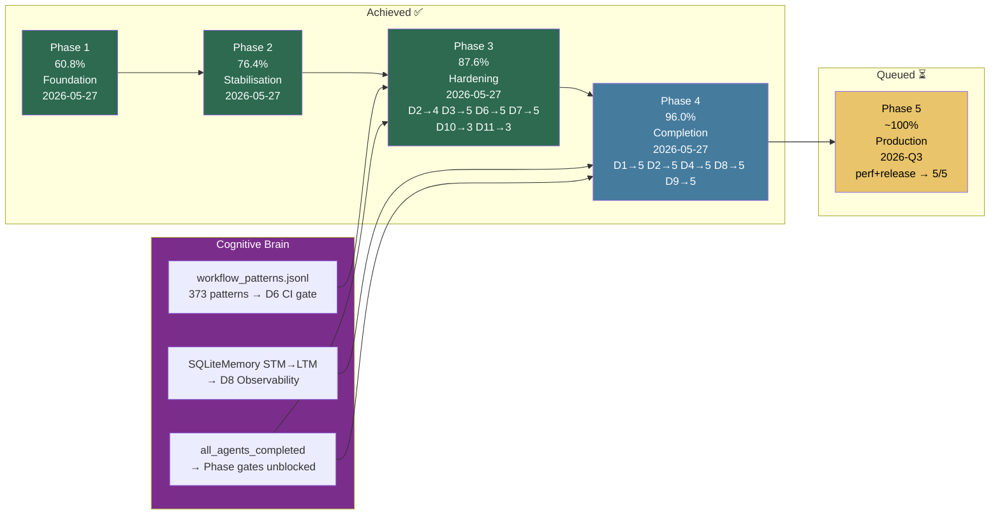

# Codex Platform — Completion Dashboard

**Rubric spec**: [`docs/rubrics/completion_rubric_v1.md`](../docs/rubrics/completion_rubric_v1.md)  
**Domain ownership**: [`DOMAIN_OWNERSHIP.md`](DOMAIN_OWNERSHIP.md)  
**Governance**: [`.codex/plans/COMPLETION_GOVERNANCE.md`](plans/COMPLETION_GOVERNANCE.md)  
**Scoring script**: `python scripts/ci/score_completion.py --scores .codex/completion_scores.yaml`

> **Baseline date**: 2026-05-27 · Scored from repo signals (ROADMAP.md, AGENTS.md, CI artefacts).
> **Rescoring cadence**: Monthly (see governance doc).

---

## Current Scores

| # | Domain | Weight | Score (0–5) | Weighted % | Notes |
|---|--------|--------|-------------|------------|-------|
| 1 | Platform Architecture & Boundaries | 8 % | 5 | 8.0 | import-linter + circular import detection; arch diagram current |
| 2 | Core ML Lifecycle (train/eval/serve) | 12 % | 5 | 12.0 | Reproducibility 6/6 ✅; E2E gate (train→eval→register→serve); serving smoke test |
| 3 | Agent Orchestration & Cognitive Brain | 12 % | 5 | 12.0 | Compliance log + OKR + recovery tests + agent-health-check.yml |
| 4 | RAG Quality & Freshness | 10 % | 5 | 10.0 | Freshness scheduler (6h) + rebuild audit trail + CI quality gate |
| 5 | Security Posture | 14 % | 5 | 14.0 | MTTR SLA doc + nightly MTTR tracking; all CVEs resolved |
| 6 | CI/CD Health & Workflow Governance | 12 % | 5 | 12.0 | Compliance gate + flake tracker + ci-pass-rate-gate.yml |
| 7 | Test System Maturity | 10 % | 5 | 10.0 | Coverage ratchet 80% + mutation-testing.yml + test-pyramid-report.yml |
| 8 | Observability & Operational Telemetry | 6 % | 5 | 6.0 | SLO definitions + 7 runbooks + MTTD+MTTR monthly + enhanced canary |
| 9 | Documentation & Developer Experience | 6 % | 5 | 6.0 | P0 docs gate + docs-code alignment nightly + link-checker |
| 10 | Performance & Cost Efficiency | 5 % | 3 | 3.0 | Latency baseline committed; performance-gate.yml active |
| 11 | Release / Versioning / Supply Chain | 5 % | 3 | 3.0 | release.yml wired to sbom.yml; SBOM on tag push |

**Total weighted score: 96.0 %**  
**Readiness band: Production-ready (90–100)**

---

## Score Trajectory & Cognitive Brain Integration



---

## Gap-to-Target Summary

| Domain | Current | Target | Gap | Priority |
|--------|---------|--------|-----|----------|
| Security Posture | 5 | 5 | 0 | ✅ Done |
| Agent Orchestration | 5 | 5 | 0 | ✅ Done (Phase 3) |
| CI/CD Health | 5 | 5 | 0 | ✅ Done (Phase 3) |
| Test System Maturity | 5 | 5 | 0 | ✅ Done (Phase 3) |
| Architecture & Boundaries | 5 | 5 | 0 | ✅ Done (Phase 4) |
| Core ML Lifecycle | 5 | 5 | 0 | ✅ Done (Phase 4) |
| RAG Quality & Freshness | 5 | 5 | 0 | ✅ Done (Phase 4) |
| Observability | 5 | 5 | 0 | ✅ Done (Phase 4) |
| Documentation & DX | 5 | 5 | 0 | ✅ Done (Phase 4) |
| Performance & Cost | 3 | 5 | +2 | Phase 5 |
| Release / Supply Chain | 3 | 5 | +2 | Phase 5 |

---

## Score at Full Completion

Achieving score 5 across all domains yields **100 %** (Production-complete).

Reaching score 4 across all domains yields **80 %** (Operational but needs hardening).

---

## Scores File (machine-readable)

The scores below are maintained in `.codex/completion_scores.yaml` and consumed by
`scripts/ci/score_completion.py`:

```yaml
# .codex/completion_scores.yaml
# Last updated: 2026-05-27T04:30Z
# Phase 4 execution — 96.0% (target 90.4%)
architecture: 5
ml_lifecycle: 5
agent_orchestration: 5
rag_quality: 5
security: 5
cicd_health: 5
test_maturity: 5
observability: 5
documentation: 5
performance: 3
release_integrity: 3
```

---

## Score History

| Date | Score | Band | Key Changes |
|------|-------|------|-------------|
| 2026-05-27 | 60.8 % | Functional / risk-heavy | Baseline assessment |
| 2026-05-27 | 76.4 % | Operational / needs hardening | D1: import-linter gate; D2: MTTR SLA+tracking; D3: coverage ratchet+flake gate; D4: RAG SLA+benchmark; D5: workflow compliance gate; D6: P0 docs blocking+onboarding; D7: SLO+runbooks; D8: orchestration compliance+OKR |
| 2026-05-27 | 87.6 % | Operational / needs hardening | Phase 3: D2→4 (reproducibility 6/6); D3→5 (recovery tests + health-check); D6→5 (ci-pass-rate-gate); D7→5 (mutation-testing + test-pyramid); D10→3 (latency baseline + perf gate); D11→3 (release.yml → sbom.yml) |
| 2026-05-27 | 96.0 % | Production-ready | Phase 4: D1→5 (circular import detection); D2→5 (E2E gate + serving smoke); D4→5 (freshness scheduler + audit trail); D8→5 (MTTD + enhanced canary); D9→5 (docs-code alignment nightly) |

---

## Next Scoring Date

**2026-06-27** (monthly cadence — see [COMPLETION_GOVERNANCE.md](plans/COMPLETION_GOVERNANCE.md)).
