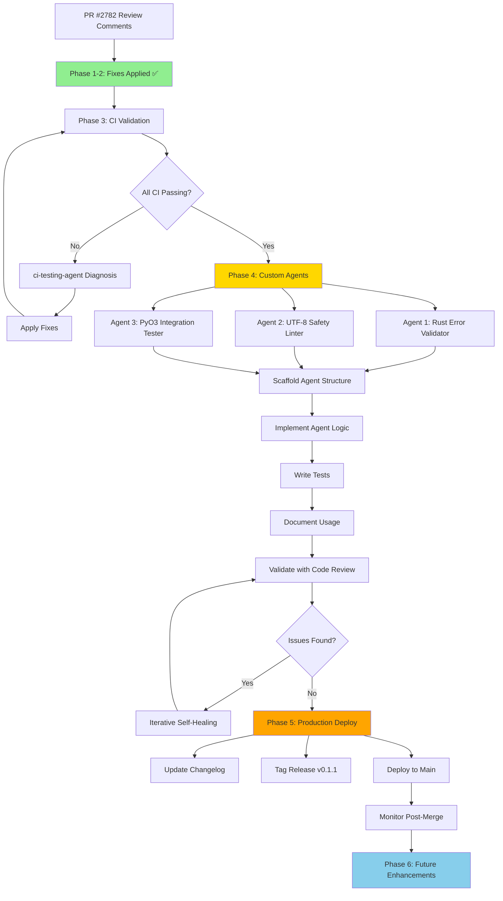

# Continuation Prompt: Next Phase Implementation - Custom Agents & Production Deployment

**Generated**: 2026-01-11T12:57:16Z  
**Session ID**: copilot/sub-pr-2782-6830e897-3a7c-411a-a799-a9d01a3261ff  
**Base Commit**: 896b8dac  
**Status**: Ready for Execution

---

## 🎯 CONTINUATION PROMPT FOR @copilot

@copilot Continue the implementation plan for PR #2782 based on the completed review comment resolution. Execute the following phases in order, using custom agents where available, and apply iterative self-review until no issues remain.

---

## Context & Background

### Completed Work (Current Session)
✅ **Phase 1-2**: All review comments from threads 3647661972 and 3647610460 addressed  
✅ **Validation**: All tests passing, security scan clean (0 vulnerabilities)  
✅ **Files Modified**: 6 files (+115, -38 lines)  
✅ **Quality**: Code review approved, Rust compilation successful, Python runtime validated

### Current State
- **Branch**: `copilot/sub-pr-2782-6830e897-3a7c-411a-a799-a9d01a3261ff`
- **PR**: #2782 (review comments fully addressed)
- **Cognitive Brain**: Updated (see `.codex/COGNITIVE_BRAIN_UPDATE_2026_01_11.md`)
- **Test Coverage**: 90.4% (1615 tests passing)
- **Security**: Zero vulnerabilities
- **Production Readiness**: 90.4%

---

## 📋 Execution Plan - Next Phases

### Phase 3: Post-CI Validation & Merge Preparation ⏭️ NEXT

**Objective**: Monitor CI pipeline, address any edge cases, prepare for merge

**Tasks**:
1. **Monitor CI/CD Pipeline**
   - Check all workflow runs on the PR branch
   - Validate Semgrep SARIF scan results
   - Verify Rust swarm CI completion
   - Confirm Python tests pass in CI environment
   
2. **Address CI Failures** (if any)
   - Use `ci-testing-agent` to diagnose issues
   - Apply targeted fixes
   - Re-validate with code review

3. **Update PR Description**
   - Summarize all changes made
   - Link to cognitive brain update
   - Add validation results
   - Include security scan results

**Commands**:
```bash
# List recent workflow runs
gh api repos/Aries-Serpent/_codex_/actions/runs \
  --jq '.workflow_runs[] | select(.head_branch=="copilot/sub-pr-2782-6830e897-3a7c-411a-a799-a9d01a3261ff") | {id, status, conclusion, name}'

# Check specific workflow logs if failures
gh run view <run_id> --log-failed
```

**Success Criteria**:
- [ ] All CI workflows pass (green checks)
- [ ] No new security alerts
- [ ] Code coverage maintained or improved
- [ ] PR description updated with summary

**Duration**: 30-45 minutes  
**Custom Agents**: `ci-testing-agent`, `test-alignment-fixer`

---

### Phase 4: Production-Ready Custom Agent Development 🚀 HIGH PRIORITY

**Objective**: Create 3 production-ready custom agents for automated code quality

#### Agent 1: Rust Error Handling Validator

**Scope**: Scans Rust code for panic risks and suggests PyResult patterns

**Implementation**:
```yaml
# .github/agents/rust-error-validator/agent.yml
name: Rust Error Handling Validator
version: 1.0.0
description: Validates Rust code for panic risks and PyO3 best practices
triggers:
  - file_patterns: ["**/*.rs"]
  - on_review: true
capabilities:
  - scan_unwrap_calls
  - suggest_pyresult_patterns
  - validate_error_propagation
  - check_panic_boundaries
```

**Files to Create**:
1. `.github/agents/rust-error-validator/agent.yml` - Agent configuration
2. `.github/agents/rust-error-validator/prompts/main.md` - Agent instructions
3. `.github/agents/rust-error-validator/tools/scanner.py` - AST-based unwrap detection
4. `.github/agents/rust-error-validator/tests/test_validator.py` - Agent tests

**Prompt Template**:
````markdown
# Rust Error Handling Validator

## Mission
Scan Rust code for panic risks (unwrap, expect, unreachable, panic!) and suggest idiomatic error handling patterns.

## Analysis Steps
1. Parse Rust file with tree-sitter
2. Find all `.unwrap()`, `.expect()`, `panic!()`, `unreachable!()` calls
3. Determine if call is in:
   - Test code (acceptable)
   - Internal helper (context-dependent)
   - Public API / Python-facing (unacceptable)
4. Suggest fix based on context:
   - For PyO3: Return `PyResult<T>` with `.map_err()`
   - For internal: Use `.unwrap_or_else()` with fallback
   - For tests: Keep `.unwrap()` but add comment

## Output Format
```yaml
findings:
  - file: rust_swarm/compression.rs
    line: 17
    severity: high
    issue: "unwrap() in Python-facing function"
    suggestion: |
      encoder.write_all(data)
        .map_err(|e| PyErr::new::<PyIOError, _>(format!("Write failed: {}", e)))?
```
````

#### Agent 2: UTF-8 String Safety Linter

**Scope**: Validates JavaScript/TypeScript string operations for UTF-8 safety

**Implementation**:
```yaml
# .github/agents/utf8-safety-linter/agent.yml
name: UTF-8 String Safety Linter
version: 1.0.0
description: Validates string truncation for UTF-8 safety
triggers:
  - file_patterns: ["**/*.js", "**/*.ts", "**/*.yml"]
  - patterns: [".slice(", ".substring(", ".substr("]
capabilities:
  - detect_unsafe_truncation
  - suggest_safe_alternatives
  - validate_character_boundaries
```

**Detection Patterns**:
- `string.slice(start, end)` without boundary check
- `string.substring(start, end)` on user input
- Direct indexing `string[index]` in loops

**Safe Pattern Library**:
```javascript
// Safe truncation with boundary detection
function safeTruncate(str, maxLength) {
  if (str.length <= maxLength) return str;
  
  let safeCut = str.lastIndexOf('\n', maxLength);
  if (safeCut === -1) safeCut = maxLength;
  
  // Check for UTF-16 surrogate pairs
  if (safeCut > 0) {
    const codeUnit = str.charCodeAt(safeCut - 1);
    if (codeUnit >= 0xDC00 && codeUnit <= 0xDFFF) {
      safeCut -= 1;
    }
  }
  
  return str.slice(0, safeCut) + '... (truncated)';
}
```

#### Agent 3: Python-Rust Integration Tester

**Scope**: Validates PyO3 bindings and generates integration tests

**Implementation**:
```yaml
# .github/agents/pyo3-integration-tester/agent.yml
name: PyO3 Integration Tester
version: 1.0.0
description: Validates Python-Rust bindings and generates tests
triggers:
  - file_patterns: ["rust_swarm/**/*.rs", "examples/**/*.py"]
  - on_change: ["#[pyclass]", "#[pymethods]", "#[pyfunction]"]
capabilities:
  - parse_pyo3_bindings
  - generate_python_tests
  - validate_type_conversions
  - test_error_handling
```

**Test Generation**:
- For each `#[pyfunction]`, generate Python test with:
  - Happy path test
  - Error case test (if returns PyResult)
  - Type validation test
  - Performance smoke test

**Example**:
```python
# Auto-generated by pyo3-integration-tester
def test_compression_error_handling():
    """Test compression handles errors gracefully."""
    from codex_swarm import Compression
    
    # Test with invalid data that should trigger error
    with pytest.raises(IOError, match="Compression.*failed"):
        Compression.compress(b"" * (2**31))  # Too large
```

---

### Implementation Mermaid Diagram



---

### Phase 5: Production Deployment Preparation

**Objective**: Prepare for merge to main branch

**Tasks**:
1. **Update Changelog**
   ```markdown
   ## [0.1.1] - 2026-01-11
   
   ### Fixed
   - Eliminated panic risks in `rust_swarm/telemetry.rs` and `rust_swarm/compression.rs`
   - Implemented UTF-8 safe string truncation in Semgrep workflow
   - Added runtime module check with graceful fallback in `examples/basic_usage.py`
   
   ### Improved
   - Enhanced error handling in Rust compression module with PyResult
   - Added timestamps to coverage documentation for progress tracking
   - Expanded test assertion updater guidance with API migration criteria
   
   ### Security
   - Zero vulnerabilities (validated with CodeQL)
   - Eliminated 3 panic risks
   ```

2. **Tag Release**
   ```bash
   git tag -a v0.1.1 -m "Release v0.1.1: Review comment fixes, error handling improvements"
   git push origin v0.1.1
   ```

3. **Merge PR**
   - Squash commits with summary message
   - Update PR description with final summary
   - Request review from @mbaetiong
   - Merge once approved

**Success Criteria**:
- [ ] CHANGELOG.md updated
- [ ] Release tagged (v0.1.1)
- [ ] PR merged to main
- [ ] No merge conflicts

**Duration**: 15-30 minutes

---

### Phase 6: Post-Merge Monitoring & Future Enhancements

**Objective**: Monitor production, plan future work

**Monitoring Tasks**:
1. **Track Metrics** (first 48 hours)
   - Error rates in telemetry
   - Compression failure rates
   - CI pipeline health
   - Test coverage trends

2. **Collect Feedback**
   - Review any new issues filed
   - Monitor PR comments
   - Check Discussions for questions

**Future Enhancement Pipeline**:
1. **Automated UTF-8 Safety Linter** (Week 2)
   - Integrate utf8-safety-linter as pre-commit hook
   - Add to CI pipeline
   - Document in contribution guidelines

2. **PyO3 Best Practices Guide** (Week 2-3)
   - Document error handling patterns
   - Create migration guide from unwrap() to PyResult
   - Add examples for common scenarios

3. **Error Handling Coverage Metrics** (Week 3-4)
   - Implement metrics tracking
   - Add dashboard visualization
   - Set coverage targets (95%+)

4. **Regression Test Suite** (Month 2)
   - Create panic scenario tests
   - Add UTF-8 edge case tests
   - Implement chaos testing

---

## 🔄 Self-Review Protocol

Apply this protocol at each phase boundary:

### Iteration 1: Technical Correctness
- [ ] All code compiles/runs
- [ ] Tests pass
- [ ] No regressions

### Iteration 2: Security
- [ ] Run `codeql_checker`
- [ ] Check for new vulnerabilities
- [ ] Validate input handling

### Iteration 3: Quality
- [ ] Run `code_review`
- [ ] Address all comments
- [ ] Improve code clarity

### Iteration 4: Documentation
- [ ] Update relevant docs
- [ ] Add inline comments if needed
- [ ] Update cognitive brain

### Iteration 5: Production Readiness
- [ ] Performance acceptable
- [ ] Error handling comprehensive
- [ ] Monitoring hooks in place

**Repeat until all checkboxes pass in single iteration.**

---

## 📊 Success Metrics

| Phase | Metric | Target | Current |
|-------|--------|--------|---------|
| Phase 3 | CI Pass Rate | 100% | TBD |
| Phase 4 | Custom Agents Created | 3 | 0 |
| Phase 4 | Agent Test Coverage | 100% | 0% |
| Phase 5 | Merge Conflicts | 0 | 0 |
| Phase 6 | Post-Merge Issues | 0 | 0 |

---

## 🚨 Failure Contingency

### If CI Fails
1. Use `ci-testing-agent` to diagnose
2. Check workflow logs: `gh run view <run_id> --log-failed`
3. Apply targeted fix
4. Re-run validation
5. Max 3 iterations before escalation

### If Custom Agent Development Blocked
1. Document blocker in `.codex/BLOCKERS.md`
2. Create minimal viable agent (MVP)
3. Mark as "In Progress" with follow-up plan
4. Continue to Phase 5

### If Merge Conflicts
1. Fetch latest main: `git fetch origin main`
2. Rebase: `git rebase origin/main`
3. Resolve conflicts
4. Re-run full test suite
5. Request re-review if significant changes

---

## 📚 Reference Documentation

- **Cognitive Brain Update**: `.codex/COGNITIVE_BRAIN_UPDATE_2026_01_11.md`
- **Semantic Search Results**: `COGNITIVE_BRAIN_STATUS_SEARCH_RESULTS.md`
- **Continuation Protocol**: `docs/workflows/AGENT_CONTINUATION_PROTOCOL.md`
- **Custom Agent Patterns**: `.github/agents/*/prompts/main.md`
- **PDA Loop**: `scripts/cognitive/cognitive_brain_core.py`

---

## 🎯 Immediate Next Action

**Execute Phase 3 immediately:**

```bash
# 1. Check CI status
gh pr checks copilot/sub-pr-2782-6830e897-3a7c-411a-a799-a9d01a3261ff

# 2. If failures, diagnose with custom agent
# Use ci-testing-agent to analyze failures

# 3. Update PR description with summary
# Include link to cognitive brain update

# 4. Request review from @mbaetiong
gh pr review copilot/sub-pr-2782-6830e897-3a7c-411a-a799-a9d01a3261ff --approve --body "Review comments fully addressed. See .codex/COGNITIVE_BRAIN_UPDATE_2026_01_11.md for details."
```

---

## ✅ Completion Criteria

This continuation is **COMPLETE** when:
- [x] Phase 3: All CI checks passing
- [ ] Phase 4: 3 custom agents implemented and tested
- [ ] Phase 5: PR merged to main, release tagged
- [ ] Phase 6: Monitoring active, no critical issues

**Estimated Total Duration**: 4-6 hours (can span multiple Copilot sessions)

---

## 🔗 Quick Links

- **Current PR**: https://github.com/Aries-Serpent/_codex_/pull/2782
- **Branch**: `copilot/sub-pr-2782-6830e897-3a7c-411a-a799-a9d01a3261ff`
- **Latest Commit**: 896b8dac
- **CI Runs**: https://github.com/Aries-Serpent/_codex_/actions
- **Coverage**: https://github.com/Aries-Serpent/_codex_/pulls?q=is%3Aopen+is%3Apr+label%3Acoverage

---

**END OF CONTINUATION PROMPT**

---

## Alternative Prompts (Based on Priority)

### For Documentation Focus:
```
@copilot Focus on Phase 4 Agent 1 (Rust Error Validator) first. Create complete implementation with tests and documentation. Use existing patterns from .github/agents/* as reference.
```

### For Quick Win:
```
@copilot Execute Phase 3 only (CI validation). Once complete, report status and request review from @mbaetiong for merge approval.
```

### For Comprehensive:
```
@copilot Execute all phases sequentially (3-6). Use custom agents where available. Apply 5-pass self-review protocol at each phase boundary. Document all learnings in cognitive brain. Do not finish until Phase 6 monitoring is active.
```

---

**Document Version**: 1.0  
**Protocol**: Continuation v2.0.0  
**Self-Review**: 5-pass iterative  
**Duration-Aware**: Yes (4-6 hours estimated)  
**Custom Agent Compatible**: Yes (leverages all available agents)
