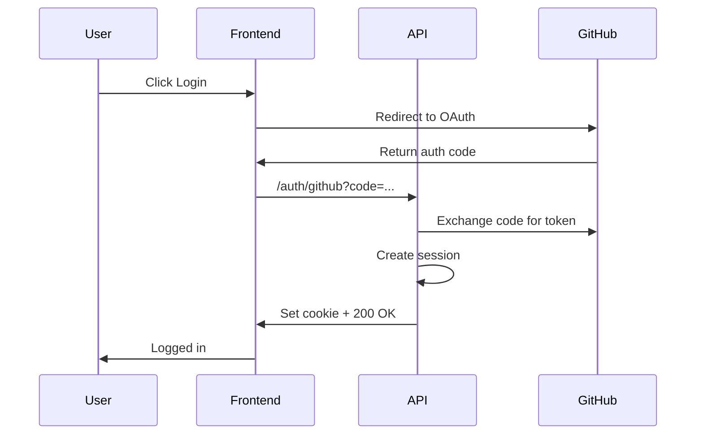
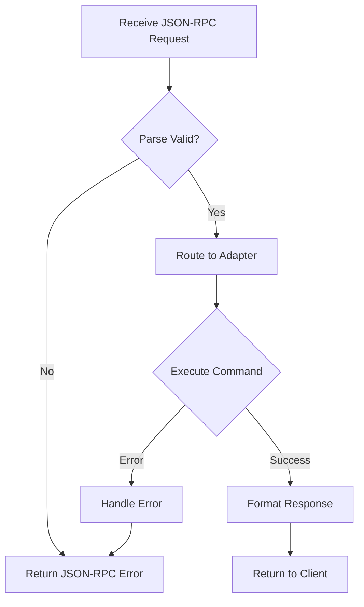
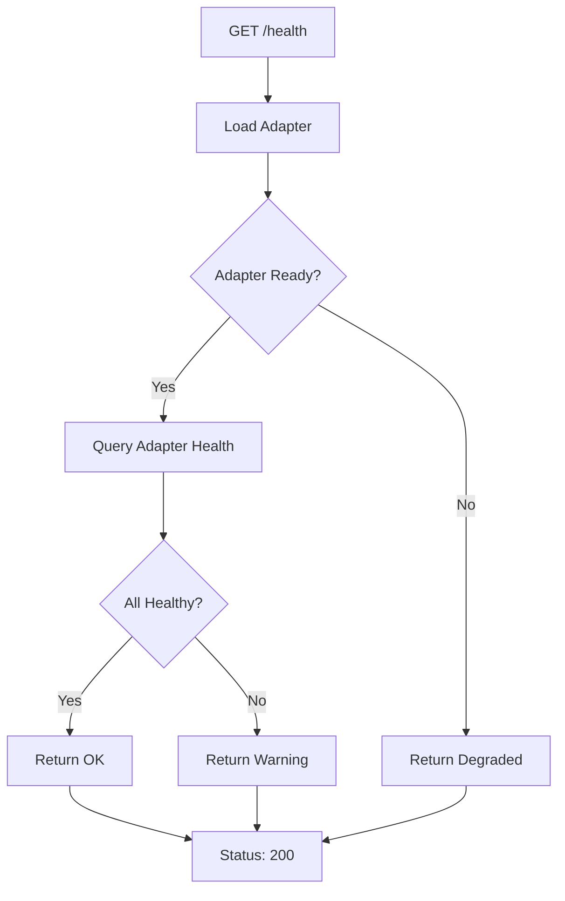
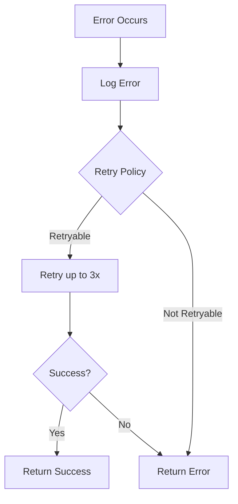

# Critical Paths Diagrams

## Authentication Flow Sequence

```mermaid
sequenceDiagram
    participant User
    participant Frontend
    participant API
    participant GitHub
    User->>Frontend: Click Login
    Frontend->>GitHub: Redirect to OAuth
    GitHub->>Frontend: Return auth code
    Frontend->>API: /auth/github?code=...
    API->>GitHub: Exchange code for token
    API->>API: Create session
    API->>Frontend: Set cookie + 200 OK
    Frontend->>User: Logged in
```

## MCP API Request Flow

```mermaid
graph TD
    A[Receive JSON-RPC Request] --> B{Parse Valid?}
    B -->|No| C[Return JSON-RPC Error]
    B -->|Yes| D[Route to Adapter]
    D --> E{Execute Command}
    E -->|Success| F[Format Response]
    E -->|Error| G[Handle Error]
    F --> H[Return to Client]
    G --> C
```

## Health Check Flow

```mermaid
graph TD
    A[GET /health] --> B[Load Adapter]
    B --> C{Adapter Ready?}
    C -->|Yes| D[Query Adapter Health]
    C -->|No| E[Return Degraded]
    D --> F{All Healthy?}
    F -->|Yes| G[Return OK]
    F -->|No| H[Return Warning]
    G --> I[Status: 200]
    E --> I
    H --> I
```

## Error Recovery Flow

```mermaid
graph TD
    A[Error Occurs] --> B[Log Error]
    B --> C{Retry Policy}
    C -->|Retryable| D[Retry up to 3x]
    C -->|Not Retryable| E[Return Error]
    D --> F{Success?}
    F -->|Yes| G[Return Success]
    F -->|No| E
```

