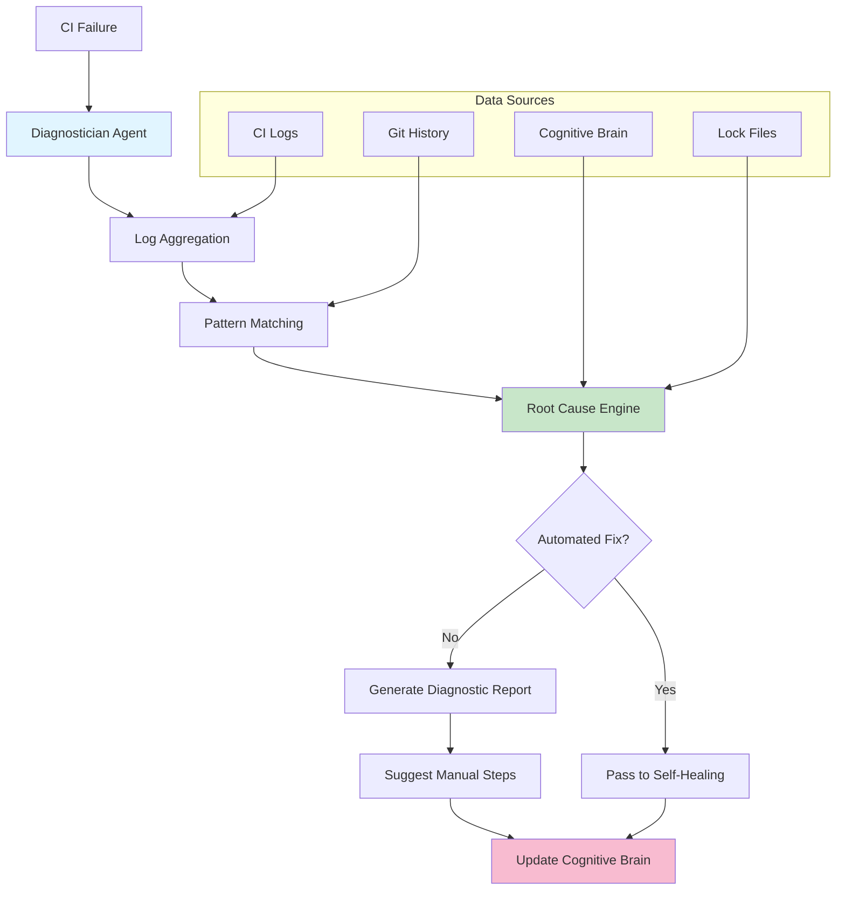
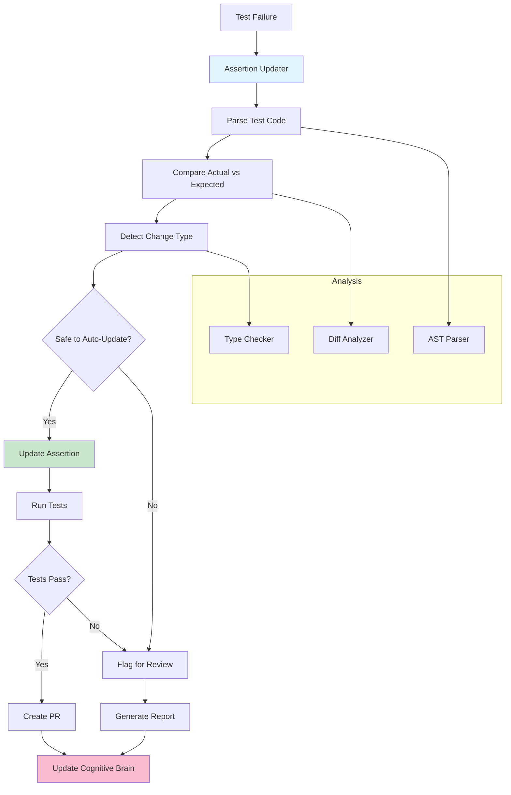
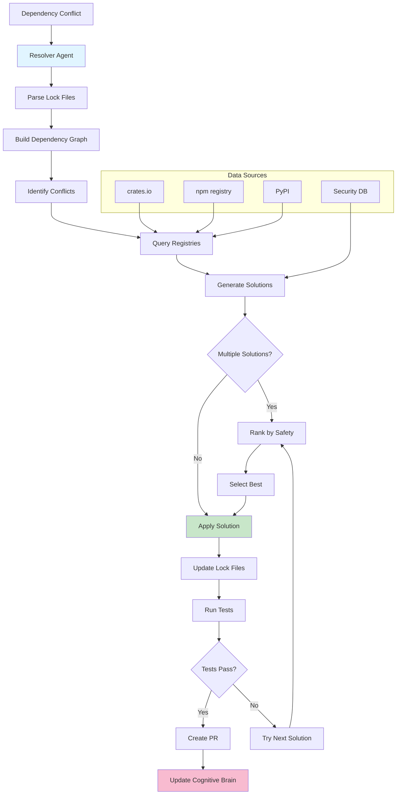

# Custom GitHub Copilot Agents - Design Specification
**Version**: 1.0.0  
**Date**: 2026-01-12  
**Status**: Design Complete - Ready for Implementation

---

## Overview

This document defines three production-ready custom GitHub Copilot agents designed to complement the self-healing CI system and enhance developer productivity.

---

## Agent 1: CI-Failure-Diagnostician

### Purpose
Deep-dive analysis of complex CI failures that the self-healing system cannot automatically fix.

### Capabilities

#### Core Functions
1. **Root Cause Analysis**
   - Trace failure through multiple logs
   - Identify upstream dependencies
   - Correlate with recent code changes
   - Detect environment-specific issues

2. **Dependency Conflict Resolution**
   - Parse lock files (Cargo.lock, package-lock.json)
   - Identify version conflicts
   - Suggest resolution strategies
   - Generate upgrade paths

3. **Historical Pattern Correlation**
   - Query cognitive brain for similar failures
   - Identify recurring patterns
   - Suggest proven solutions
   - Track fix effectiveness

4. **Environment Debugging**
   - Compare CI vs local environments
   - Identify missing dependencies
   - Detect configuration mismatches
   - Suggest environment fixes

### Architecture



### Input/Output Schema

**Input**:
```json
{
  "workflow_run_id": "12345",
  "failure_logs": "url or content",
  "repository": "owner/repo",
  "branch": "main",
  "commit_sha": "abc123",
  "context": {
    "recent_changes": ["file1.rs", "file2.py"],
    "environment": "CI",
    "runner": "ubuntu-latest"
  }
}
```

**Output**:
```json
{
  "root_cause": {
    "type": "dependency_conflict",
    "description": "tokio version mismatch between dependencies",
    "confidence": 85,
    "evidence": [
      "Line 45: conflicting versions for tokio",
      "Dependency tree shows tokio 1.28 and 1.35"
    ]
  },
  "automated_fix_available": false,
  "manual_steps": [
    "Update tokio to 1.35 in Cargo.toml",
    "Run cargo update -p tokio",
    "Test locally before pushing"
  ],
  "similar_past_failures": [
    {
      "date": "2026-01-05",
      "resolution": "Updated tokio",
      "success": true
    }
  ],
  "estimated_fix_time": "15 minutes"
}
```

### Integration Points

1. **Self-Healing Workflow**:
   - Triggered when `notify-escalation` job runs
   - Provides deeper analysis for unknown failures

2. **GitHub Copilot**:
   - `@copilot diagnose CI failure in run 12345`
   - `@copilot why is this test failing?`

3. **Cognitive Brain**:
   - Queries historical failure database
   - Records new patterns discovered
   - Updates success metrics

### Implementation Files

```
.github/agents/ci-failure-diagnostician/
├── prompts/
│   ├── main.md              # Agent prompt and guidelines
│   ├── examples.md          # Usage examples
│   └── advanced.md          # Complex scenarios
├── src/
│   ├── __init__.py
│   ├── diagnostician.py     # Main agent logic
│   ├── root_cause.py        # Root cause analysis
│   ├── pattern_matcher.py   # Pattern recognition
│   └── report_generator.py  # Diagnostic report creation
├── tests/
│   ├── test_diagnostician.py
│   ├── test_root_cause.py
│   └── fixtures/            # Test failure logs
├── config/
│   └── agent_config.yaml
└── README.md
```

---

## Agent 2: Test-Assertion-Updater

### Purpose
Automatically update test assertions when APIs change, reducing test maintenance burden.

### Capabilities

#### Core Functions
1. **API Change Detection**
   - Monitor API response changes
   - Track function signature changes
   - Detect data structure modifications
   - Identify breaking vs non-breaking changes

2. **Assertion Alignment**
   - Update expected values
   - Adjust assertion types
   - Fix type mismatches
   - Modernize assertion syntax

3. **Test Modernization**
   - Convert legacy assertions
   - Use latest test framework features
   - Improve assertion readability
   - Add better error messages

4. **Backward Compatibility Check**
   - Verify changes don't break production
   - Check API versioning
   - Validate deprecation handling
   - Ensure graceful degradation

### Architecture



### Input/Output Schema

**Input**:
```json
{
  "test_file": "tests/test_api.py",
  "failure_message": "AssertionError: Expected 200, got 201",
  "test_name": "test_create_user",
  "context": {
    "api_changes": ["Added user_id to response"],
    "commit_sha": "def456",
    "change_type": "non-breaking"
  }
}
```

**Output**:
```json
{
  "update_applied": true,
  "changes": [
    {
      "file": "tests/test_api.py",
      "line": 45,
      "old": "assert response.status_code == 200",
      "new": "assert response.status_code == 201",
      "reason": "API now returns 201 Created for successful user creation"
    }
  ],
  "tests_passing": true,
  "confidence": 90,
  "breaking_change_detected": false,
  "recommendation": "Safe to merge - standard REST convention"
}
```

### Integration Points

1. **Test CI Workflow**:
   - Triggered on assertion failures
   - Analyzes failure patterns
   - Applies updates automatically

2. **GitHub Copilot**:
   - `@copilot update test assertions for API changes`
   - `@copilot fix failing test assertions`

3. **Cognitive Brain**:
   - Tracks API evolution patterns
   - Records assertion update success rates
   - Learns breaking vs non-breaking changes

### Implementation Files

```
.github/agents/test-assertion-updater/
├── prompts/
│   ├── main.md
│   ├── examples.md
│   └── patterns.md          # Common assertion patterns
├── src/
│   ├── __init__.py
│   ├── updater.py           # Main updater logic
│   ├── ast_analyzer.py      # Python AST analysis
│   ├── diff_engine.py       # Expected vs actual comparison
│   └── safety_checker.py    # Breaking change detection
├── tests/
│   ├── test_updater.py
│   ├── test_ast_analyzer.py
│   └── fixtures/
│       ├── api_responses/
│       └── test_files/
├── config/
│   └── agent_config.yaml
└── README.md
```

---

## Agent 3: Dependency-Conflict-Resolver

### Purpose
Automatically resolve dependency conflicts and version incompatibilities.

### Capabilities

#### Core Functions
1. **Conflict Detection**
   - Parse lock files
   - Identify version conflicts
   - Detect transitive dependency issues
   - Find circular dependencies

2. **Resolution Strategy**
   - Suggest minimal version bumps
   - Identify compatible versions
   - Propose dependency alternatives
   - Generate upgrade paths

3. **Security Integration**
   - Check for known vulnerabilities
   - Suggest secure alternatives
   - Validate security policies
   - Track CVE fixes

4. **Lock File Management**
   - Update Cargo.lock
   - Update package-lock.json
   - Update poetry.lock
   - Regenerate after changes

### Architecture



### Input/Output Schema

**Input**:
```json
{
  "conflict_type": "version_mismatch",
  "package": "tokio",
  "lock_file": "Cargo.lock",
  "current_versions": {
    "direct": "1.28.0",
    "transitive": ["1.35.0", "1.35.1"]
  },
  "context": {
    "ecosystem": "rust",
    "registry": "crates.io"
  }
}
```

**Output**:
```json
{
  "resolution_found": true,
  "solution": {
    "action": "update",
    "package": "tokio",
    "from_version": "1.28.0",
    "to_version": "1.35.1",
    "reason": "Resolves conflict with axum dependency"
  },
  "breaking_changes": false,
  "security_improvements": [
    "Fixes CVE-2023-12345 in tokio 1.28"
  ],
  "testing_required": true,
  "estimated_risk": "low",
  "alternative_solutions": [
    {
      "action": "pin",
      "package": "axum",
      "version": "0.6.0",
      "reason": "Keep tokio 1.28 but downgrade axum"
    }
  ]
}
```

### Integration Points

1. **Self-Healing Workflow**:
   - Handles Cargo.lock conflicts
   - Resolves npm/pip conflicts
   - Automatic PR creation

2. **GitHub Copilot**:
   - `@copilot resolve dependency conflict in Cargo.lock`
   - `@copilot fix version mismatch for package X`

3. **Cognitive Brain**:
   - Tracks successful resolutions
   - Records ecosystem-specific patterns
   - Learns safe update strategies

### Implementation Files

```
.github/agents/dependency-conflict-resolver/
├── prompts/
│   ├── main.md
│   ├── rust_ecosystem.md    # Cargo-specific guidance
│   ├── npm_ecosystem.md     # npm-specific guidance
│   └── python_ecosystem.md  # pip-specific guidance
├── src/
│   ├── __init__.py
│   ├── resolver.py          # Main resolver logic
│   ├── lock_parser.py       # Lock file parsing
│   ├── graph_builder.py     # Dependency graph
│   ├── registry_client.py   # Registry API clients
│   └── solution_ranker.py   # Solution ranking
├── tests/
│   ├── test_resolver.py
│   ├── test_lock_parser.py
│   └── fixtures/
│       ├── Cargo.lock
│       ├── package-lock.json
│       └── poetry.lock
├── config/
│   └── agent_config.yaml
└── README.md
```

---

## Implementation Priority

### Phase 1 (Immediate)
1. ✅ Self-Healing CI System (Complete)
2. 🔲 CI-Failure-Diagnostician (Next)

### Phase 2 (Week 2)
3. 🔲 Test-Assertion-Updater
4. 🔲 Enhanced monitoring dashboard

### Phase 3 (Month 2)
5. 🔲 Dependency-Conflict-Resolver
6. 🔲 ML-based pattern discovery

---

## Success Metrics

Each agent should track:

| Metric | Target | Tracking Method |
|--------|--------|-----------------|
| Success Rate | ≥80% | Cognitive brain logs |
| Time Saved | ≥20min/use | Before/after comparison |
| False Positive Rate | <10% | Human review feedback |
| Coverage | ≥60% | Total issues / handled issues |
| User Satisfaction | ≥4/5 | Survey after each use |

---

## Integration Matrix

```
┌──────────────────────────────────────────────────────────┐
│                 Integration Points                        │
├─────────────────┬────────┬───────┬─────────┬─────────────┤
│ Agent           │ Self-  │ Copil │ Cogni-  │ GitHub      │
│                 │ Healing│ -lot  │ tive    │ Actions     │
├─────────────────┼────────┼───────┼─────────┼─────────────┤
│ CI-Diagnostician│   ✅   │  ✅   │   ✅    │     ✅      │
│ Assertion-Update│   ✅   │  ✅   │   ✅    │     ✅      │
│ Dep-Resolver    │   ✅   │  ✅   │   ✅    │     ✅      │
└─────────────────┴────────┴───────┴─────────┴─────────────┘
```

---

## Next Steps

1. **Immediate**: Deploy self-healing CI system
2. **Week 1**: Begin CI-Diagnostician implementation
3. **Week 2**: Deploy and monitor
4. **Month 1**: Implement remaining agents
5. **Month 2**: ML enhancements and cross-repo learning

---

**Status**: 🟢 Design Complete  
**Implementation**: Ready to Begin  
**Documentation**: Complete

*These agents form a comprehensive autonomous CI/CD system that reduces manual toil, improves quality, and learns continuously from outcomes.*
