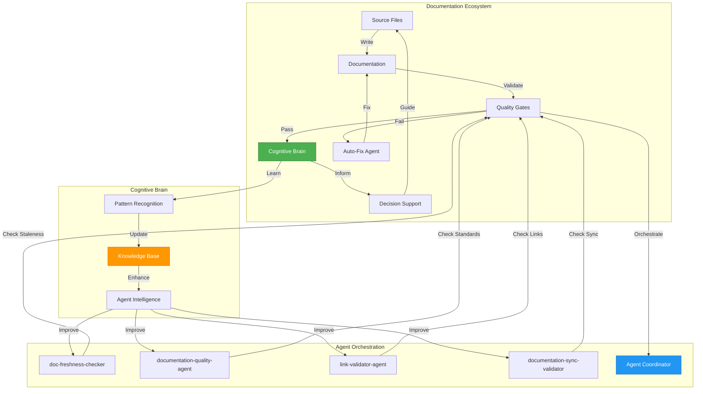
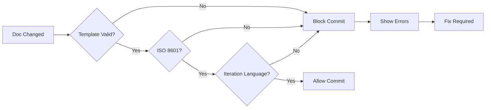
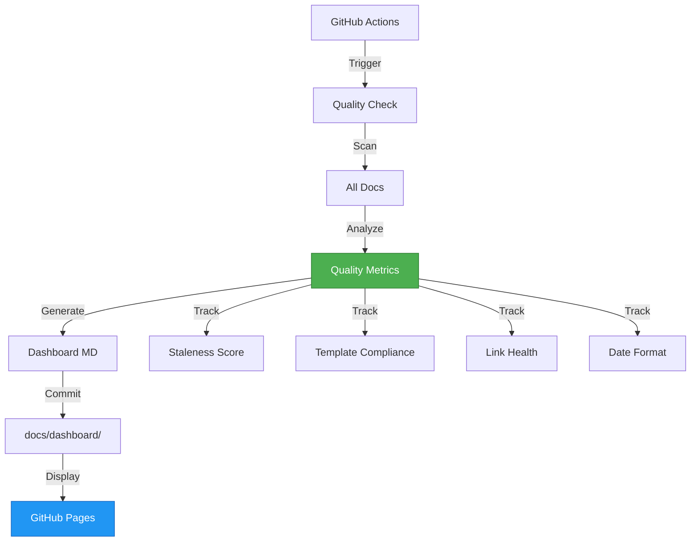
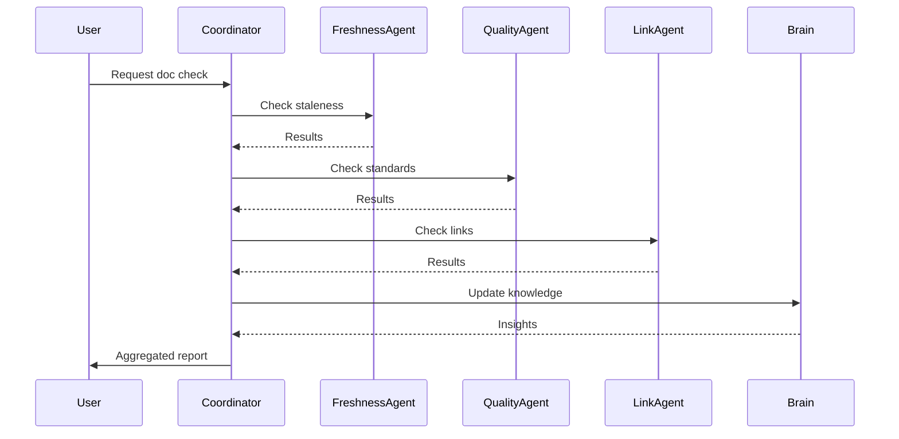
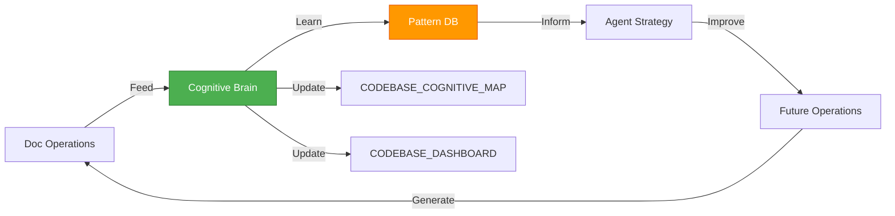

# Documentation System Evolution - Continuation Plan

**Generated**: 2026-01-23T09:40:00Z  
**Based On**: PR #2960 - Documentation Freshness Check  
**Status**: Ready for Execution  
**Priority**: High (Foundation for documentation quality)

---

## 🎯 Mission Overview

**Objective**: Evolve documentation system from reactive maintenance to proactive quality assurance with automated validation, multi-agent orchestration, and real-time cognitive brain integration.

**Energy Level**: ⚡⚡⚡⚡⚡ (5/5 - Strategic Infrastructure)

**Status**: 🟢 Ready to Execute

---

## 📊 Current State Analysis

### Completed (PR #2960)
- ✅ System docs template compliance (2/2 files)
- ✅ ISO 8601 date standardization
- ✅ Iteration-based workflow language
- ✅ 6-section template structure established
- ✅ doc-freshness-checker agent validated

### In Progress
- 🟡 Template application to other doc directories (0%)
- 🟡 Automated validation tooling (0%)
- 🟡 Multi-agent orchestration (0%)

### Not Started
- ⚪ Documentation quality dashboard
- ⚪ Real-time cognitive brain updates
- ⚪ Auto-generation pipeline
- ⚪ Cross-reference validation
- ⚪ Agent standardization

---

## 🗺️ Architecture Overview



---

## 🚀 Phase 1: Template Standardization (Priority 1)

**Timeline**: 1-2 phases  
**Effort**: 3-5 PRs  
**Dependencies**: None (can start immediately)

### Iteration 1.1: Admin Documentation
**Target**: `docs/admin/*.md` (8 files)
**Agent**: doc-freshness-checker
**Template**: Same 6-section structure

**Tasks**:
1. Audit all admin docs for staleness
2. Apply template sections
3. Convert to iteration-based language
4. Standardize date formats

**Success Criteria**:
- [ ] All admin docs have 6 template sections
- [ ] All dates in ISO 8601 format
- [ ] No time-based language
- [ ] Last Updated within 30 iterations

### Iteration 1.2: MCP Documentation
**Target**: `docs/mcp/*.md` (8+ files)
**Agent**: doc-freshness-checker
**Template**: Same 6-section structure

**Tasks**:
1. Audit MCP docs for staleness
2. Apply template sections
3. Update technical accuracy
4. Validate code examples

**Success Criteria**:
- [ ] All MCP docs have 6 template sections
- [ ] Code examples tested and working
- [ ] Architecture diagrams updated
- [ ] Cross-references validated

### Iteration 1.3: Agent Documentation
**Target**: `.github/agents/*.md` (70+ files)
**Agent**: documentation-quality-agent
**Template**: Agent-specific extension of base template

**Tasks**:
1. Define agent doc template (extends base)
2. Batch process all agent docs
3. Add usage examples
4. Standardize metadata

**Success Criteria**:
- [ ] Agent template defined
- [ ] All agents follow template
- [ ] Usage examples present
- [ ] Metadata standardized

---

## 🚀 Phase 2: Automation & Validation (Priority 2)

**Timeline**: 2-3 phases  
**Effort**: 4-6 PRs  
**Dependencies**: Phase 1 progress

### Iteration 2.1: Template Validation Tool
**Create**: `scripts/validation/validate_doc_template.py`
**Integration**: Pre-commit hook + CI



**Features**:
- Validates 6 template sections present
- Checks ISO 8601 date format
- Validates iteration-based language
- Provides fix suggestions

**Success Criteria**:
- [ ] Tool detects missing sections
- [ ] Tool validates date formats
- [ ] Tool checks language patterns
- [ ] Pre-commit integration working
- [ ] CI integration working

### Iteration 2.2: Documentation Quality Dashboard
**Create**: `docs/dashboard/quality.md` + GitHub Action
**Update**: Real-time via Actions



**Metrics Tracked**:
- Documentation staleness (% docs > 90 iterations old)
- Template compliance (% docs with all sections)
- Link health (% working links)
- Date format compliance (% ISO 8601)
- Iteration language adoption (% converted)

**Success Criteria**:
- [ ] Dashboard auto-updates per-iteration
- [ ] All metrics tracked accurately
- [ ] Trend analysis available
- [ ] Alert system for issues

### Iteration 2.3: Link Validation System
**Enhance**: `link-validator-agent`
**Integration**: Pre-commit + CI

**Features**:
- Validates internal markdown links
- Checks external URLs (with caching)
- Validates anchor references
- Suggests fixes for broken links

**Success Criteria**:
- [ ] All internal links validated
- [ ] External link cache working
- [ ] Anchor validation accurate
- [ ] Fix suggestions helpful

---

## 🚀 Phase 3: Multi-Agent Orchestration (Priority 3)

**Timeline**: 3-4 phases  
**Effort**: 5-8 PRs  
**Dependencies**: Phase 1 + Phase 2 foundational work

### Iteration 3.1: Agent Coordinator System
**Create**: `scripts/agents/coordinator.py`
**Purpose**: Orchestrate multiple doc agents



**Capabilities**:
- Parallel agent execution
- Result aggregation
- Priority-based fixes
- Cognitive brain integration

**Success Criteria**:
- [ ] Can orchestrate 3+ agents
- [ ] Parallel execution working
- [ ] Results properly aggregated
- [ ] Brain updates automatic

### Iteration 3.2: Agent Pipeline System
**Create**: Workflow-based agent chains
**Example**: Freshness → Quality → Links → Fix → Validate

**Pipeline Definition**:
```yaml
documentation_pipeline:
  stages:
    - name: audit
      agents: [doc-freshness-checker]
      on_fail: report
    
    - name: quality
      agents: [documentation-quality-agent]
      on_fail: attempt_fix
    
    - name: validation
      agents: [link-validator-agent]
      on_fail: attempt_fix
    
    - name: fix
      agents: [documentation-sync-validator]
      on_fail: escalate
    
    - name: verify
      agents: [doc-freshness-checker]
      on_fail: rollback
```

**Success Criteria**:
- [ ] Pipeline executes stages sequentially
- [ ] On_fail handlers work correctly
- [ ] Rollback mechanism functional
- [ ] Results tracked in cognitive brain

### Iteration 3.3: Cognitive Brain Integration
**Enhance**: Real-time learning from doc operations
**Update**: `docs/system/CODEBASE_COGNITIVE_MAP.md`

**Learning Loops**:
1. **Pattern Detection**: Identify common doc issues
2. **Solution Learning**: Track what fixes work
3. **Prediction**: Anticipate future issues
4. **Optimization**: Improve agent efficiency

**Integration Points**:
- Agent coordinator feeds results to brain
- Brain updates agent strategies
- Brain suggests proactive fixes
- Brain tracks doc evolution

**Success Criteria**:
- [ ] Brain learns from each doc update
- [ ] Patterns identified automatically
- [ ] Predictions improve over time
- [ ] Agent efficiency increases

---

## 🚀 Phase 4: Advanced Capabilities (Priority 4)

**Timeline**: 4-6 phases  
**Effort**: 8-12 PRs  
**Dependencies**: Phase 3 completion

### Iteration 4.1: Auto-Generation Pipeline
**Create**: Code → Documentation automation
**Trigger**: Code merge events

**Features**:
- Generate API docs from code
- Update architecture diagrams
- Sync examples with tests
- Maintain change logs

### Iteration 4.2: Semantic Documentation Search
**Create**: AI-powered doc search
**Integration**: Cognitive brain embeddings

**Features**:
- Natural language queries
- Context-aware results
- Cross-reference suggestions
- Gap identification

### Iteration 4.3: Documentation Health Scoring
**Create**: Comprehensive quality metric
**Display**: Dashboard + badges

**Score Components**:
- Freshness (30%)
- Completeness (25%)
- Accuracy (20%)
- Readability (15%)
- Maintainability (10%)

---

## 📈 Success Metrics

### Phase 1 Targets
| Metric | Current | Target | Timeline |
|--------|---------|--------|----------|
| Template compliance | 2/100 docs | 80/100 docs | 2 phases |
| ISO 8601 adoption | 2/100 docs | 80/100 docs | 2 phases |
| Stale docs (>90d) | Unknown | <10% | 2 phases |

### Phase 2 Targets
| Metric | Current | Target | Timeline |
|--------|---------|--------|----------|
| Automated validation | 0% | 100% | 3 phases |
| Quality dashboard | N/A | Live | 3 phases |
| Link health | Unknown | >95% | 3 phases |

### Phase 3 Targets
| Metric | Current | Target | Timeline |
|--------|---------|--------|----------|
| Agent orchestration | 0 pipelines | 3 pipelines | 4 phases |
| Brain integration | Manual | Automated | 4 phases |
| Agent efficiency | Baseline | +30% | 4 phases |

### Phase 4 Targets
| Metric | Current | Target | Timeline |
|--------|---------|--------|----------|
| Auto-generation | 0% | 40% | 6 phases |
| Doc health score | N/A | >80/100 | 6 phases |
| Search accuracy | N/A | >90% | 6 phases |

---

## 🔄 Iterative Improvement Process

### per-phase Cycle
1. **Monday**: Review metrics, prioritize issues
2. **Tuesday-Thursday**: Execute planned work
3. **Friday**: Review week, update cognitive brain
4. **Weekend**: Automated monitoring

### Monthly Cycle
1. **Week 1**: Plan month's priorities
2. **Week 2-3**: Execute planned work
3. **Week 4**: Review, document learnings
4. **End of month**: Update continuation plan

### Quarterly Cycle
1. **Month 1**: Foundation work
2. **Month 2**: Integration work
3. **Month 3**: Optimization work
4. **End of quarter**: Strategic review

---

## 🧠 Cognitive Brain Evolution

### Learning Objectives
1. **Pattern Recognition**: Identify doc quality patterns
2. **Predictive Maintenance**: Anticipate doc issues
3. **Agent Optimization**: Improve agent efficiency
4. **Knowledge Synthesis**: Connect documentation insights

### Integration Strategy


### Memory Consolidation
- **Short-term**: Each doc update captured
- **Medium-term**: per-phase pattern analysis
- **Long-term**: Monthly knowledge synthesis
- **Strategic**: Quarterly evolution review

---

## 🎯 Risk Mitigation

### Technical Risks
| Risk | Impact | Likelihood | Mitigation |
|------|--------|------------|------------|
| Agent conflicts | Medium | Low | Coordinator arbitration |
| Performance issues | Medium | Medium | Caching + optimization |
| Brain complexity | High | Medium | Incremental approach |
| Tool maintenance | Low | High | Automated tests |

### Process Risks
| Risk | Impact | Likelihood | Mitigation |
|------|--------|------------|------------|
| Scope creep | High | Medium | Strict phase boundaries |
| Resource constraints | Medium | Medium | Priority-based execution |
| Change fatigue | Low | High | Gradual rollout |
| Knowledge loss | High | Low | Comprehensive docs |

---

## 🔗 Dependencies & Prerequisites

### Technical Prerequisites
- [x] Git repository access
- [x] GitHub Actions enabled
- [x] Python 3.9+ environment
- [x] CODEX_MASTER_KEY access granted
- [x] Agent framework operational

### Knowledge Prerequisites
- [x] Documentation template defined
- [x] ISO 8601 standard adopted
- [x] Iteration-based language defined
- [x] Agent orchestration patterns known

### Resource Prerequisites
- [x] CI/CD capacity available
- [x] Storage for cognitive brain data
- [x] Compute for agent execution
- [x] Human oversight for escalations

---

## 📝 Success Criteria Checklist

### Phase 1 Complete When:
- [ ] 80% of docs have template sections
- [ ] 80% of dates are ISO 8601
- [ ] <10% of docs are stale (>90 iterations)
- [ ] Agent docs standardized

### Phase 2 Complete When:
- [ ] Template validation automated
- [ ] Quality dashboard live
- [ ] Link validation automated
- [ ] All metrics tracked

### Phase 3 Complete When:
- [ ] Agent coordinator operational
- [ ] 3+ agent pipelines working
- [ ] Cognitive brain auto-updating
- [ ] Agent efficiency improved 30%

### Phase 4 Complete When:
- [ ] Auto-generation working
- [ ] Semantic search operational
- [ ] Doc health scoring active
- [ ] All advanced features live

---

## 🚀 Quick Start Instructions

### For Next Session
1. Review this continuation plan
2. Start with Phase 1, Iteration 1.1 (Admin docs)
3. Use doc-freshness-checker agent
4. Apply same process as PR #2960
5. Track progress in cognitive brain

### For Agent Execution
```bash
# Phase 1.1 Example
python scripts/agents/doc-freshness-checker.py \
  --target docs/admin/ \
  --template docs/templates/ITERATION_PLAN_TEMPLATE.md \
  --output .codex/freshness-admin.json \
  --auto-fix

# Validate
python scripts/validation/validate_doc_template.py \
  --path docs/admin/ \
  --strict
```

---

## 📊 Progress Tracking

Track in: `.codex/documentation_evolution_progress.json`

```json
{
  "last_updated": "2026-01-23T09:40:00Z",
  "overall_progress": 5,
  "phases": {
    "phase_1": {"progress": 2, "status": "ready"},
    "phase_2": {"progress": 0, "status": "pending"},
    "phase_3": {"progress": 0, "status": "pending"},
    "phase_4": {"progress": 0, "status": "future"}
  },
  "next_milestone": "Phase 1.1 - Admin docs template application"
}
```

---

**Status**: Ready for Execution  
**Priority**: High  
**Next Session**: Start Phase 1.1
