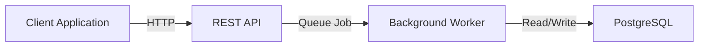
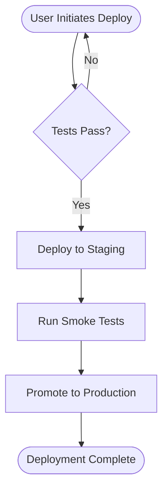

# _codex_ Documentation Style Guide

**Version:** 2.0  
**Last Updated:** 2026-07-08  
**Maintained By:** Documentation Quality Team  
**Status:** Active (Phase 12 WS3)

---

## Overview

This style guide defines the voice, tone, structure, and formatting standards for all _codex_ documentation. It ensures consistency across 1,900+ markdown files while maintaining readability and accessibility.

**Quality Target:** 90+/100 (from 80.8/100)

---

## 1. Tone & Voice  # pragma: allowlist secret

### Principles

- **Clear & Accessible** — Write for developers of all experience levels
- **Active Voice** — Use "You will execute" not "It will be executed"
- **Direct & Concise** — Eliminate unnecessary words
- **Technical but Friendly** — Balance accuracy with approachability
- **Action-Oriented** — Focus on "how to do" not "why it exists"

### Examples

❌ **Passive, unclear:**
> The configuration file is used to define how the system processes data. It should be properly formatted.

✅ **Active, clear:**
> Edit the configuration file to define how your system processes data. Use YAML formatting.

---

## 2. Document Structure

### Required Metadata Header

Every documentation file must start with:

```markdown
# Document Title

**Last Updated:** YYYY-MM-DD  
**Audience:** [Developers | DevOps | Admins | All]  
**Related:** [Link to related docs]

---

[Content starts here]
```

### Standard Sections

Use these headings in this order for long documents:

```
# Title

**Last Updated & Metadata**

---

## Overview
(1-2 paragraphs introducing the topic)

## Quick Start
(Code examples or immediate action steps)

## Concepts
(Background theory if needed)

## Detailed Guide
(Step-by-step instructions)

## Troubleshooting
(Common issues and solutions)

## Related Resources
(Links to other documentation)
```

### Heading Hierarchy

- **Level 1** (`# `) — Page title only. One per document.
- **Level 2** (`## `) — Major sections (Overview, Guide, Troubleshooting)
- **Level 3** (`### `) — Subsections within major sections
- **Level 4** (`#### `) — Minor details (rarely needed)

⚠️ **Never skip levels** — Go from `##` → `###`, not `##` → `####`

---

## 3. Markdown Formatting Standards

### Lists

**Unordered lists:** Use `-` (hyphen), not `*` or `+`

```markdown
- First item
- Second item
  - Nested item
  - Another nested
- Third item
```

**Ordered lists:** Number sequentially, use 1-based indexing

```markdown
1. First step
2. Second step
   1. Sub-step
   2. Another sub-step
3. Third step
```

**Inline code:** Use backticks for commands, file names, variables

```markdown
Run `npm install` to fetch dependencies.
Edit the `config.yaml` file in `src/`.
Set `DEBUG=true` environment variable.
```

### Code Blocks

**Standard block:** Three backticks with language identifier

````markdown
```python
def calculate_hash(data):
    return hashlib.sha256(data).hexdigest()
```

```bash
pip install -r requirements.txt
python script.py --verbose
```

```yaml
config:
  debug: false
  timeout: 30
```
````

**Important code:** Use callout box with code

```markdown
!!! warning "Critical Configuration"
    ```yaml
    database:
      primary: postgres://prod-db:5432
      backup: postgres://backup-db:5432
    ```
    **Never commit these credentials to version control.**
```

### Tables

Use pipe tables with header alignment. Minimum 3 columns.

```markdown
| Feature | Status | Notes |
|---------|--------|-------|
| API v2 | ✅ Stable | Production-ready |
| WebSocket | 🟡 Beta | Limited testing |
| Webhooks | ❌ Planned | Q3 2026 |
```

### Emphasis

- **Bold** (`**text**`) — For important terms, UI elements, warnings
- *Italic* (`*text*`) — For emphasis, file names, user input
- `Code` (backticks) — For commands, variables, code terms

❌ **Avoid:** `***Bold italic***`, `__underscores__`

---

## 4. Common Patterns

### Callout Boxes

Use admonitions for special content:

```markdown
!!! note
    This is helpful context the reader should know.

!!! warning
    This could cause problems if ignored.

!!! danger
    This will break your system if done wrong.

!!! tip
    This is a helpful best practice or shortcut.

!!! success
    This confirms the procedure worked correctly.
```

### Prerequisites Sections

```markdown
## Prerequisites

Before starting, you need:
- Python 3.10 or later
- pip and virtualenv installed
- A GitHub account with push access
- 2GB free disk space
```

### Step-by-Step Procedures

```markdown
## Installation

1. **Clone the repository**
   ```bash
   git clone https://github.com/Aries-Serpent/_codex_.git
   cd _codex_
   ```

2. **Install dependencies**
   ```bash
   pip install -r requirements.txt
   ```

3. **Verify installation**
   ```bash
   python -c "import codex; print(codex.__version__)"
   ```
```

### Troubleshooting Tables

```markdown
## Troubleshooting

| Problem | Cause | Solution |
|---------|-------|----------|
| `ImportError: No module 'codex'` | codex not installed | Run `pip install -e .` |
| Slow build times | Missing GPU drivers | Install CUDA 12.0 |
| Port 5000 already in use | Another process owns port | Use `lsof -i :5000` to find PID |
```

---

## 5. Cross-References

### Internal Links

Link to documents using **relative paths from `docs/`**:

```markdown
- [Configuration Guide](../configuration/INDEX.md)
- [API Reference](../../API_REFERENCE.md)
- [Quick Start](#quick-start) — Link to heading within same doc
```

### External Links

Use full URLs for external resources:

```markdown
[GitHub Repository](https://github.com/Aries-Serpent/_codex_)
[Python Documentation](https://docs.python.org/3.10/)
```

### Breaking Links Check

Add a comment before releasing:

```markdown
<!-- LINK AUDIT: All links in this section verified 2026-07-08 -->
```

---

## 6. Visual Elements

### Mermaid Diagrams

Use for architecture, workflows, relationships:

```markdown
## Architecture Overview


```

### Screenshots

Reference external images (store in `docs/assets/`):

```markdown


*Figure 1: The configuration panel with key settings highlighted.*
```

### Flowcharts for Processes

```markdown

```

---

## 7. Writing Guidelines

### Sentence Structure

**Keep sentences under 20 words when possible.**

❌ **Too long:**
> When you have configured the system with the appropriate parameters and installed all the necessary dependencies, you should run the initialization script which will set up your environment.

✅ **Better:**
> 1. Configure the system with appropriate parameters
> 2. Install necessary dependencies
> 3. Run the initialization script

### Paragraphs

- **Keep paragraphs to 3-5 sentences max**
- **Use blank lines between paragraphs**
- **Start with topic sentence** (what this paragraph covers)

### Headers as Navigation

Headers should tell the reader what's in that section:

❌ `### Setup`  
✅ `### Installing Dependencies on macOS`

❌ `### Configuration`  
✅ `### Configuring Database Connection Strings`

---

## 8. Code Examples

### Complete, Runnable Examples

Always provide working code:

```python
# Complete example users can copy-paste
from codex import Client

client = Client(api_key="sk-...")
result = client.generate(
    prompt="Describe machine learning",
    max_tokens=100
)
print(result.text)
```

### Annotated Examples

Add comments for complex code:

```python
# Initialize the model with optimized settings
model = ModelFactory.create(
    name="bert-base",
    device="cuda",  # Use GPU if available
    cache_dir="/tmp/models"  # Cache to avoid re-downloads
)

# Process in batches for memory efficiency
for batch in data_loader:
    outputs = model.forward(batch)
    results.extend(outputs)
```

### Multi-Language Examples

Show equivalent code in multiple languages:

=== "Python"
    ```python
    client = Client(api_key="sk-...")
    result = client.query("What is ML?")
    ```

=== "JavaScript"
    ```javascript
    const client = new Client({ apiKey: "sk-..." });
    const result = await client.query("What is ML?");
    ```

=== "cURL"
    ```bash
    curl -X POST https://api.example.com/query \
      -H "Authorization: ******" \
      -d '{"prompt": "What is ML?"}'
    ```

---

## 9. Accessibility Standards

### Alt Text for Images

Always include descriptive alt text:

```markdown

```

### Color & Symbols

Don't rely on color alone to convey meaning:

❌ **Bad:** "Status is shown in red (failure) or green (success)"  
✅ **Good:** "Status is shown as ❌ (failure) or ✅ (success)"

### Font Sizes

- Use heading hierarchy (`#`, `##`, `###`) not HTML size tags
- MkDocs automatically handles responsive sizing

### Keyboard Navigation

Ensure all interactive elements work without mouse:

```markdown
<!-- Document this if it matters for the reader -->
- Press **Tab** to navigate to next link
- Press **Enter** to activate
- Press **Escape** to close modal
```

---

## 10. Version Control & Updates

### Update Headers

Always update when editing:

```markdown
# Document Title

**Last Updated:** 2026-07-08  <!-- Update this -->
**Audience:** [Developers | DevOps | Admins]
```

### Change Log Format

For significant documents, include a "Recent Changes" section:

```markdown
## Recent Changes

| Date | Change | Impact |
|------|--------|--------|
| 2026-07-08 | Added PostgreSQL 16 support | Updated installation steps |
| 2026-06-15 | Removed Python 3.8 support | Bumped min version to 3.10 |
```

---

## 11. Documentation Templates

### Feature Documentation Template

```markdown
# [Feature Name]

**Last Updated:** YYYY-MM-DD  
**Status:** [Beta | Stable | Deprecated]  
**Minimum Version:** X.Y.Z

## What It Does

One-sentence summary of the feature.

## Quick Example

```code
[Minimal working example]
```

## Use Cases

- When to use this feature
- What problems it solves
- Real-world examples

## Configuration

| Setting | Default | Purpose |
|---------|---------|---------|
| setting1 | value | What it does |

## Advanced Usage

[For power users]

## Troubleshooting

| Error | Solution |
|-------|----------|
| Error message | How to fix |

## Related Docs

- [Link 1](...)
- [Link 2](...)
```

### API Endpoint Template

```markdown
## GET /api/resource/{id}

**Authentication:** Required (******  
**Rate Limit:** 100 requests/minute  
**Response Format:** JSON

### Request Parameters

| Parameter | Type | Required | Description |
|-----------|------|----------|-------------|
| id | string | Yes | Resource identifier |

### Response

```json
{
  "id": "res-123",
  "name": "Example",
  "status": "active"
}
```

### Error Responses

| Status | Code | Description |
|--------|------|-------------|
| 404 | NOT_FOUND | Resource doesn't exist |
| 401 | UNAUTHORIZED | Invalid token |

### Examples

```bash
curl -H "Authorization: ******" \
  https://api.example.com/api/resource/res-123
```
```

---

## 12. Quality Checklist

Before publishing documentation, verify:

- [ ] **Metadata** — Last Updated, Audience, Related docs present
- [ ] **Structure** — Single H1 title, proper heading hierarchy
- [ ] **Links** — All internal links use relative paths
- [ ] **Code** — Examples are complete and runnable
- [ ] **Clarity** — Average sentence < 20 words
- [ ] **Accessibility** — Alt text on images, no color-only info
- [ ] **Formatting** — Consistent list styles, code blocks, tables
- [ ] **Tone** — Active voice, direct, action-oriented
- [ ] **Visuals** — Diagrams where they help understanding
- [ ] **Maintenance** — Comment marks any outdated sections

---

## 13. Common Mistakes to Avoid

| Mistake | Instead |
|---------|---------|
| Multiple H1 titles | Single H1 per document |
| Inconsistent list markers | Use `-` consistently |
| Absolute paths in links | Use relative paths from docs/ |
| Sentences > 25 words | Break into shorter sentences |
| Wall of text | Use lists, headers, blank lines |
| Code without language tag | Always specify: ```python, ```bash |
| Ignoring heading hierarchy | Go H2→H3, never skip levels |
| Unclear headers | "Configuring X" not just "Configuration" |
| No working examples | Always include copy-pasteable code |
| Passive voice dominance | Use "You will" not "It will" |

---

## 14. Tools & Automation

### Markdown Linting

Use `markdownlint` for automated checking:

```bash
npm install -g markdownlint-cli

# Check all docs
markdownlint 'docs/**/*.md'

# Fix automatically
markdownlint --fix 'docs/**/*.md'
```

**Configuration (.markdownlint.json):**
```json
{
  "MD001": true,
  "MD003": { "style": "consistent" },
  "MD004": { "style": "consistent" },
  "MD013": { "line_length": 120 },
  "MD024": false,
  "MD033": false
}
```

### Link Validation

Use `markdown-link-check`:

```bash
npm install -g markdown-link-check
markdown-link-check 'docs/**/*.md'
```

### Build Validation

Test locally before publishing:

```bash
pip install mkdocs mkdocs-material mkdocs-mermaid2-plugin
mkdocs build --strict
```

---

## 15. Review Process

### Self-Review Checklist

Before submitting:

1. ✅ Read aloud for clarity
2. ✅ Verify all links work
3. ✅ Confirm examples run
4. ✅ Check metadata is current
5. ✅ Ensure proper heading hierarchy
6. ✅ Validate with linting tools

### Peer Review

Assign review to:
- Another team member (readability)
- Technical expert (accuracy)
- End user if possible (usefulness)

### Acceptance Criteria

Documentation is approved when:
- ✅ Zero linting errors
- ✅ All links functional
- ✅ Examples tested
- ✅ Tone consistent
- ✅ Heading hierarchy correct
- ✅ Reviewers approve

---

## 16. Migration from Old Style

### High-Priority Updates

Start with these document categories:

1. **API Reference** — Most commonly used, high impact
2. **Getting Started Guides** — First impression for new users
3. **Troubleshooting Docs** — Critical for user success
4. **Architecture Docs** — Onboarding value
5. **Configuration Guides** — Frequently referenced

### Update Process

1. Read the old document
2. Restructure using new templates
3. Improve clarity and reduce length
4. Add visual elements where helpful
5. Update Last Updated date
6. Run linting and link checks
7. Submit for review

---

## 17. Governance

### Who Can Edit

- ✅ **Authorized Contributors** — Full edit access
- ✅ **Team Members** — Own section, peer review
- ✅ **Automated Agents** — Per permission grants

### Deprecation Policy

When removing documentation:

1. Add deprecation notice at top:
   ```markdown
   !!! danger "Deprecated"
       This feature is no longer supported as of 2026-07-08.
       See [Current Alternative](../new-doc.md) instead.
   ```

2. Keep document published for 6 months minimum
3. Link from deprecated doc to replacement
4. Remove from navigation after 6 months

### Versioning

For versioned docs, use branch strategy:

```
docs/
├── latest/           # Current main branch
├── v2.0/            # Previous major version
├── v1.5/            # Earlier version
```

---

## 18. Success Metrics

Documentation quality is measured by:

| Metric | Target | Tracking |
|--------|--------|----------|
| Markdown linting score | 100% | CI/CD gates |
| Link validity | 95%+ | Automated checks |
| Average readability grade | 12 (college level) | Tools like Flesch-Kincaid |
| Update currency | <6 months old | Last Updated field |
| User satisfaction | 4.0+/5.0 | Feedback surveys |
| Code example success rate | 98%+ | Testing examples |

**Overall Quality Score Target:** 90+/100

---

## 19. FAQ

**Q: Should I include table of contents?**  
A: Yes, for documents > 2,000 words. MkDocs auto-generates sidebar TOC.

**Q: How long should a page be?**  
A: Target 500-2,000 words. Break longer content into multiple pages.

**Q: Can I use HTML?**  
A: Minimize HTML. Use markdown equivalents when possible. HTML is for complex layouts only.

**Q: What's the best image format?**  
A: PNG for diagrams/screenshots, SVG for icons. Optimize images to <500KB.

**Q: Should I document deprecated features?**  
A: Yes, with clear deprecation notice and migration path.

---

## 20. Contact & Feedback

### Suggest Improvements

Found an issue with this guide?

- Open an issue: [GitHub Issues](https://github.com/Aries-Serpent/_codex_/issues)
- Suggest changes: [Discussion](https://github.com/Aries-Serpent/_codex_/discussions)
- Direct edits: Create a PR with changes

### Style Guide Maintenance

**Owner:** Documentation Quality Team  
**Review Frequency:** Quarterly  
**Last Reviewed:** 2026-07-08  
**Next Review:** 2026-10-08

---

**Happy documenting! 📚**
