# Codex Platform — Domain Ownership & Exit Criteria

**Version**: 1.1.0  
**Created**: 2026-05-27  
**Dashboard**: [`COMPLETION_DASHBOARD.md`](COMPLETION_DASHBOARD.md)  
**Rubric spec**: [`../docs/rubrics/completion_rubric_v1.md`](../docs/rubrics/completion_rubric_v1.md)

---

## Domain Owners

> Owners are Copilot custom agents defined in `.github/agents/`.  Each agent listed
> below is the authoritative responder and decision-maker for its domain.

| # | Domain | Owner | Backup | Primary Gate |
|---|--------|-------|--------|--------------|
| 1 | Platform Architecture & Boundaries | `codebase-health-guardian` | `recon-scout-agent` | `.importlinter` / `scripts/ci/` |
| 2 | Core ML Lifecycle (train/eval/serve) | `ml-validation-suite-agent` | @mbaetiong | `nox -s ml_tests` / `serving smoke` |
| 3 | Agent Orchestration & Cognitive Brain | `agent-orchestrator` | `cognitive-brain-session-injector` | `cognitive-action-decision.yml` |
| 4 | RAG Quality & Freshness | `rag-freshness-loop-agent` | `rag-index-manager` | `rag-freshness-scheduler.yml` / `test-rag.yml` |
| 5 | Security Posture | `unified-security-scanner` | `security-audit-agent` | `codeql.yml` / `security-scanning-suite.yml` |
| 6 | CI/CD Health & Workflow Governance | `workflow-health-monitor` | `workflow-compliance-guardian` | `workflow-execution-gate.yml` |
| 7 | Test System Maturity | `unified-coverage-agent` | `fragile-test-guardian` | `nox -s tests` / `code-quality-coverage-suite.yml` |
| 8 | Observability & Operational Telemetry | `performance-monitor-agent` | `msv-dashboard-monitor` | `ci-health-monitor.yml` |
| 9 | Documentation & Developer Experience | `unified-doc-agent` | `doc-freshness-checker` | `doc-freshness-check.yml` / `docs-health.yml` |
| 10 | Performance & Cost Efficiency | `performance-regression-detector` | `cache-management-agent` | `benchmarks.yml` / `pr-cost-check.yml` |
| 11 | Release / Versioning / Supply Chain | `pypi-publishing-operations-agent` | `packaging-validation-agent` | `sbom.yml` / `pypi-publish.yml` |

---

## Agent ↔ Domain ↔ Workflow Map

```mermaid
flowchart TD
    subgraph D1["D1 · Platform Architecture"]
        codebase-health-guardian["codebase-health-guardian\n(primary)"]
        recon-scout-agent["recon-scout-agent\n(backup)"]
        GW1[".importlinter / scripts/ci/"]
    end

    subgraph D2["D2 · Core ML Lifecycle"]
        ml-validation-suite-agent["ml-validation-suite-agent\n(primary)"]
        mbaetiong2["@mbaetiong\n(backup)"]
        GW2["nox -s ml_tests / serving smoke"]
    end

    subgraph D3["D3 · Agent Orchestration"]
        agent-orchestrator["agent-orchestrator\n(primary)"]
        cognitive-brain-session-injector["cognitive-brain-session-injector\n(backup)"]
        GW3["cognitive-action-decision.yml"]
    end

    subgraph D4["D4 · RAG Quality & Freshness"]
        rag-freshness-loop-agent["rag-freshness-loop-agent\n(primary)"]
        rag-index-manager["rag-index-manager\n(backup)"]
        GW4["rag-freshness-scheduler.yml / test-rag.yml"]
    end

    subgraph D5["D5 · Security Posture"]
        unified-security-scanner["unified-security-scanner\n(primary)"]
        security-audit-agent["security-audit-agent\n(backup)"]
        GW5["codeql.yml / security-scanning-suite.yml"]
    end

    subgraph D6["D6 · CI/CD Health"]
        workflow-health-monitor["workflow-health-monitor\n(primary)"]
        workflow-compliance-guardian["workflow-compliance-guardian\n(backup)"]
        GW6["workflow-execution-gate.yml"]
    end

    subgraph D7["D7 · Test System Maturity"]
        unified-coverage-agent["unified-coverage-agent\n(primary)"]
        fragile-test-guardian["fragile-test-guardian\n(backup)"]
        GW7["nox -s tests / code-quality-coverage-suite.yml"]
    end

    subgraph D8["D8 · Observability"]
        performance-monitor-agent["performance-monitor-agent\n(primary)"]
        msv-dashboard-monitor["msv-dashboard-monitor\n(backup)"]
        GW8["ci-health-monitor.yml"]
    end

    subgraph D9["D9 · Docs & Dev Experience"]
        unified-doc-agent["unified-doc-agent\n(primary)"]
        doc-freshness-checker["doc-freshness-checker\n(backup)"]
        GW9["doc-freshness-check.yml / docs-health.yml"]
    end

    subgraph D10["D10 · Performance & Cost"]
        performance-regression-detector["performance-regression-detector\n(primary)"]
        cache-management-agent["cache-management-agent\n(backup)"]
        GW10["benchmarks.yml / pr-cost-check.yml"]
    end

    subgraph D11["D11 · Release / Supply Chain"]
        pypi-publishing-operations-agent["pypi-publishing-operations-agent\n(primary)"]
        packaging-validation-agent["packaging-validation-agent\n(backup)"]
        GW11["sbom.yml / pypi-publish.yml"]
    end

    codebase-health-guardian --> GW1
    ml-validation-suite-agent --> GW2
    agent-orchestrator --> GW3
    rag-freshness-loop-agent --> GW4
    unified-security-scanner --> GW5
    workflow-health-monitor --> GW6
    unified-coverage-agent --> GW7
    performance-monitor-agent --> GW8
    unified-doc-agent --> GW9
    performance-regression-detector --> GW10
    pypi-publishing-operations-agent --> GW11
```

---

## Hard Exit Criteria (Score = 5)

These are the minimum requirements for a domain to be considered **Complete**.  
All evidence items must be continuously passing in CI — not just satisfied once.

---

### 1 · Platform Architecture & Boundaries

- [ ] Architecture diagram committed at `docs/ARCHITECTURE.md` and up-to-date
- [ ] `DOMAIN_OWNERSHIP.md` (this file) has every `@TBD` filled with a named owner
- [ ] `import-linter` or equivalent runs in CI and blocks PRs on violations
- [ ] No cross-domain circular imports detected (checked in CI)
- [ ] `docs/rubrics/completion_rubric_v1.md` references accurate domain map

---

### 2 · Core ML Lifecycle (Train / Eval / Serve)

- [ ] `dvc repro` (or equivalent) produces byte-identical artefacts across two independent runs
- [ ] Model registry (`mlflow`) shows versioned entries for every released model
- [ ] Serving smoke test (`tests/` or CI job) executes end-to-end and passes
- [ ] Rollback procedure documented and tested in `docs/PRODUCTION_DEPLOYMENT_GUIDE.md`
- [ ] E2E gate in CI (train → eval → register → serve) passing on `main`

---

### 3 · Agent Orchestration & Cognitive Brain Reliability

- [ ] Orchestration success-rate metric reported ≥ 95 % over a rolling 7-day window
- [ ] Every policy violation generates an entry in the compliance log within 5 minutes
- [ ] Automated recovery (retry / fallback path) demonstrated in integration tests
- [ ] OKR tracking reports are generated automatically each sprint
- [ ] Cognitive Brain OODA loop validated by a dedicated nightly CI job

---

### 4 · RAG Quality & Freshness

- [ ] Freshness job (`rag-freshness-scheduler.yml`) succeeded in the last 24 h
- [ ] Retrieval quality metric (e.g., top-k recall @ threshold) is above defined threshold in CI
- [ ] Drift alert configured and fires a test notification in a canary run
- [ ] Index rebuild is automated and auditable (rebuild log committed)
- [ ] RAG benchmarks tracked in `benchmarks/` and regression blocked in CI

---

### 5 · Security Posture

- [ ] Zero open **critical** or **high** security alerts (CodeQL + SAST + Dependabot)
- [ ] Secret scanning passes with zero detected secrets on `main`
- [ ] MTTR for critical alerts tracked and ≤ 5 business days
- [ ] Dependency allowlist (`security_allowlist.json`) reviewed and current
- [ ] `defusedxml`, `filelock`, hardened defaults active and tested

---

### 6 · CI/CD Health & Workflow Governance

- [ ] 7-day CI pass rate ≥ 95 % (tracked in `ci-health-monitor.yml`)
- [ ] Flaky test rate < 1 % (tracked in `fragile-test-guardian` agent or equivalent)
- [ ] Median CI wall-clock time ≤ 5 min (cost-gate job)
- [ ] All 126 workflows have an owner recorded in this file or a `.meta` file
- [ ] Workflow compliance report (`workflow-execution-gate.yml`) green on every PR

---

### 7 · Test System Maturity

- [ ] Coverage ≥ 90 % on all critical-path modules (not just overall); ratchet enforced in CI
- [ ] All integration tests pass deterministically (zero flakes in last 20 runs)
- [ ] Test pyramid health report committed quarterly to `reports/`
- [ ] Mutation score reported and > 60 % on critical-path modules
- [ ] `pytest --timeout` set on every test to prevent CI hangs

---

### 8 · Observability & Operational Telemetry

- [ ] SLO dashboard exists for ML serving, RAG pipeline, and agent orchestration
- [ ] Alerts configured for all SLO breaches; verified by a canary test
- [ ] Incident runbooks committed to `docs/runbooks/` for each critical surface
- [ ] MTTD and MTTR reported monthly in `reports/`
- [ ] Phase 8a monitoring thresholds (`.codex/config/monitoring.yaml`) reviewed and current

---

### 9 · Documentation & Developer Experience

- [ ] Doc-freshness gate passes in CI (no page older than 90 days without review)
- [ ] Link-checker passes with zero broken links on `main`
- [ ] `docs/CONTRIBUTOR_ONBOARDING.md` validated by a recent contributor (last 90 days)
- [ ] Onboarding time to first successful `nox -s tests` ≤ 60 min (tracked in `docs/onboarding/`)
- [ ] Docs-to-code alignment check runs nightly

---

### 10 · Performance & Cost Efficiency

- [ ] Benchmark regression gate (`benchmarks.yml`) passes on every PR to `main`
- [ ] P50 / P99 latency for serving and RAG retrieval gated in CI
- [ ] CI cost report generated weekly; budget defined and monitored
- [ ] Cache hit ratio ≥ 90 % (reported in `cache-health-monitor.yml`)
- [ ] Benchmark results committed to `benchmarks/` and tracked over time

---

### 11 · Release / Versioning / Supply-Chain Integrity

- [ ] Release artifacts are cryptographically signed (Sigstore or GPG)
- [ ] SBOM (CycloneDX or SPDX) generated and attached to every release
- [ ] Provenance attestation (`sbom.yml`) committed to release
- [ ] `pypi-publish.yml` gated on rubric score ≥ 80 % (no release from failing state)
- [ ] Release checklist (`docs/RELEASE_CHECKLIST.md`) reviewed and passed before each tag

---

## Updating This File

1. Fill in owner fields when re-assigning (agents or `@mbaetiong` for human escalation).
2. Check off exit criteria as they are met.
3. Run `python scripts/ci/score_completion.py --scores .codex/completion_scores.yaml`
   to recompute the weighted score.
4. Update `.codex/COMPLETION_DASHBOARD.md` with the new score and date.

---

## Change Log

| Date | Change |
|------|--------|
| 2026-05-27 | Initial version — all owners TBD; exit criteria drafted |
| 2026-05-27 | Assigned Copilot custom agents as domain owners/backups; @mbaetiong as backup for Domain 2 (no ideal secondary agent) |
