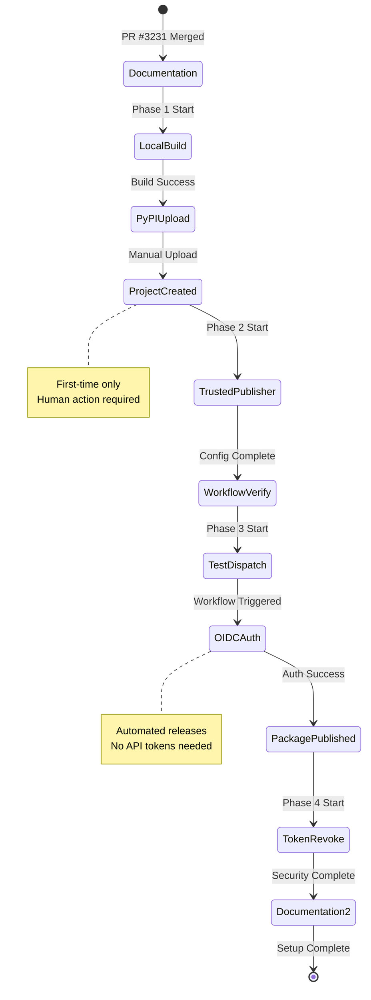
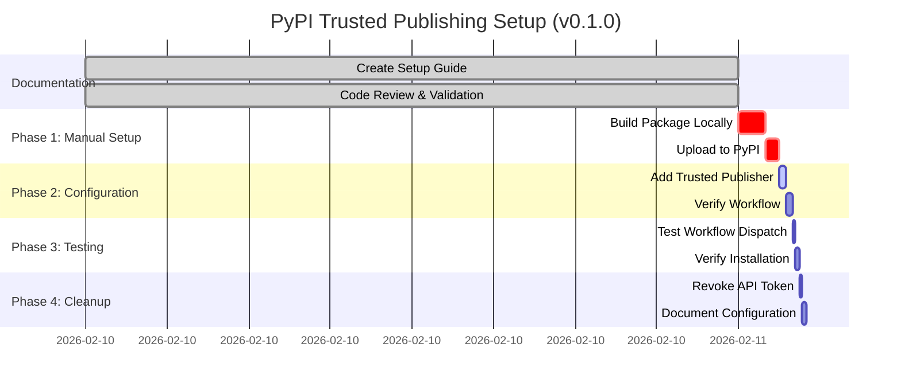
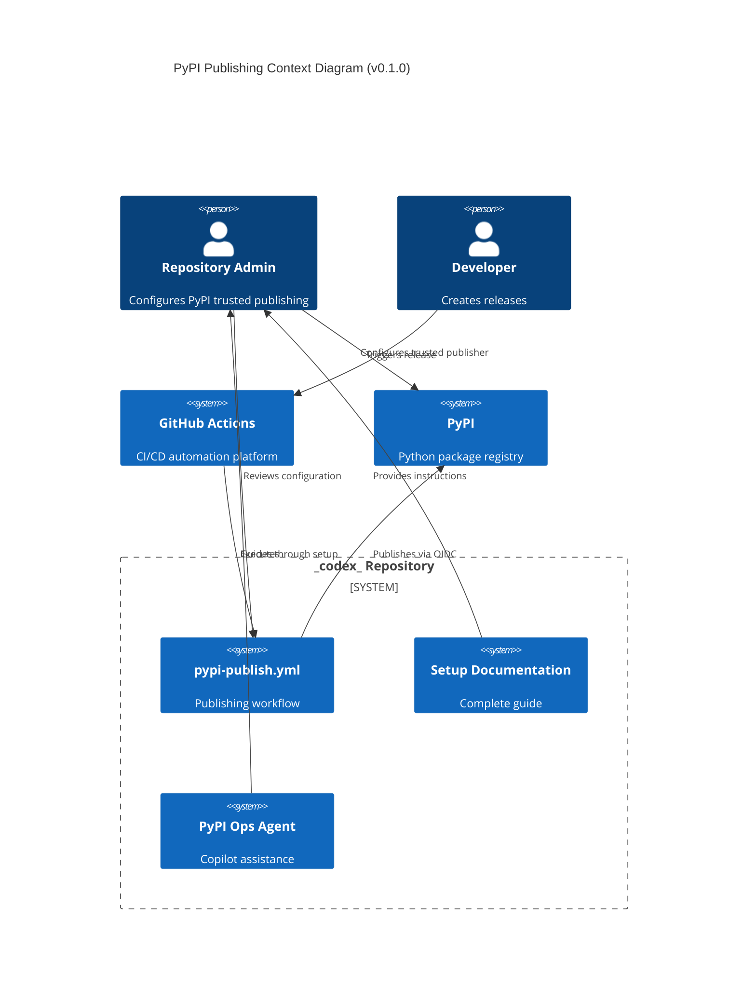

# Follow-Up Prompt: PyPI Trusted Publishing Implementation

> **Session**: 2026-02-10T07:45:00Z  
> **PR**: #3231  
> **Status**: ✅ Documentation Complete - Human Action Required

---

## 📋 Implementation Summary

### What Was Completed (AI Agent)

✅ **Documentation Created**:
- Complete 582-line setup guide: `docs/operations/pypi-trusted-publishing-setup.md`
- 9 phases with step-by-step instructions
- Troubleshooting guide for 3 common issues
- Security-first approach with maintenance schedule

✅ **Repository Integration**:
- Added to `docs/MASTER_INDEX.md` under CI/CD & Operations
- All internal links validated (0 errors)
- Cross-references to related documentation fixed

✅ **Quality Assurance**:
- Link validation: ✅ Clean (0 errors)
- Code review: ✅ Clean (0 issues)
- Policy compliance: ✅ Full adherence to AI Agency Policy

✅ **Knowledge Capture**:
- Cognitive brain updated: `.codex/cognitive_brain/PYPI_TRUSTED_PUBLISHING_DOCUMENTATION_COMPLETE.md`
- New agent created: `.github/agents/pypi-publishing-operations-agent.md`
- Patterns documented for future sessions

---

## 🚀 Next Steps (Human Required)

### Phase 1: Manual PyPI Project Creation

**Prerequisite**: Human user with PyPI account access

#### Step 1.1: Build Package Locally
```bash
cd /path/to/_codex_
pip install --upgrade build twine
python -m build
twine check dist/*
```

**Expected Output**:
```
Checking dist/codex_ml-0.0.0-py3-none-any.whl: PASSED
Checking dist/codex_ml-0.0.0.tar.gz: PASSED
```

#### Step 1.2: Create PyPI API Token (One-Time)
1. Navigate to: https://pypi.org/manage/account/token/
2. Click "Add API token"
3. Token name: `Initial codex-ml upload`
4. Scope: "Entire account (all projects)"
5. **COPY TOKEN IMMEDIATELY** (format: `pypi-AgEIcH...`)

#### Step 1.3: Upload Initial Package
```bash
twine upload dist/* -u __token__ -p pypi-AgEIcH...
```

**Validation**:
```bash
curl -s https://pypi.org/pypi/codex-ml/json | jq '.info.version'
# Should return: "0.0.0" or current version
```

---

### Phase 2: Configure Trusted Publishing

**Prerequisite**: Project created on PyPI (Phase 1 complete)

#### Step 2.1: Add GitHub Actions as Trusted Publisher
1. Navigate to: https://pypi.org/manage/project/codex-ml/settings/publishing/
2. Scroll to "Trusted Publishers" section
3. Click "Add a new publisher"
4. Select "GitHub Actions"
5. Fill in details (**case-sensitive**):
   - Owner: `Aries-Serpent`
   - Repository: `_codex_`
   - Workflow name: `pypi-publish.yml`
   - Environment: `pypi`
6. Click "Add publisher"

**Validation**:
- Trusted publisher appears in list
- Format: `GitHub Actions: Aries-Serpent/_codex_ → pypi-publish.yml (pypi)`
- Status: Active (green checkmark)

#### Step 2.2: Verify Workflow Configuration
```bash
# Confirm OIDC permissions
grep -A2 "permissions:" .github/workflows/pypi-publish.yml

# Confirm environment name
grep -A2 "environment:" .github/workflows/pypi-publish.yml
```

**Expected**:
```yaml
permissions:
  contents: read
  id-token: write  # ✅ OIDC enabled

environment:
  name: pypi  # ✅ Matches PyPI config
```

---

### Phase 3: Testing & Verification

**Prerequisite**: Trusted publisher configured (Phase 2 complete)

#### Step 3.1: Test Workflow Dispatch
1. Navigate to: https://github.com/Aries-Serpent/_codex_/actions/workflows/pypi-publish.yml
2. Click "Run workflow"
3. Select:
   - Branch: `main`
   - Environment: `testpypi` (for testing) or `pypi` (for production)
4. Click "Run workflow"
5. Monitor execution (~2-3 minutes)

**Expected Logs**:
```
🔍 Build Distribution
✅ Build package
✅ Check distribution

🔍 Publish to PyPI
Requesting OIDC token from GitHub
✅ Token received
Uploading distributions to https://upload.pypi.org/legacy/
✅ Successfully uploaded codex_ml-X.X.X-py3-none-any.whl
```

#### Step 3.2: Verify Installation
```bash
# Create test environment
python -m venv /tmp/test-codex-ml
source /tmp/test-codex-ml/bin/activate

# Install and test
pip install codex-ml
python -c "import codex_ml; print(f'Version: {codex_ml.__version__}')"

# Cleanup
deactivate
rm -rf /tmp/test-codex-ml
```

---

### Phase 4: Security & Maintenance

**Prerequisite**: Workflow tested successfully (Phase 3 complete)

#### Step 4.1: Revoke Temporary API Token
1. Navigate to: https://pypi.org/manage/account/token/
2. Find token: "Initial codex-ml upload"
3. Click "Options" → "Remove token"
4. Confirm deletion

**Validation**:
- Token no longer in list
- Workflow still passes (uses OIDC, not token)

#### Step 4.2: Document Configuration
Update `.codex/cognitive_brain/PYPI_TRUSTED_PUBLISHING_DOCUMENTATION_COMPLETE.md`:
- Add setup completion date
- Add configured by (human username)
- Mark all validation checkboxes complete

---

## 📊 Visual Architecture (v0.1.0 Pre-Release)

### Complete Setup Flow


### Phase Execution Timeline


### Integration Architecture


---

## 🎯 Success Criteria

### Must Complete Before Closing PR

- [ ] Documentation merged to main branch
- [ ] All links validated (0 errors)
- [ ] Code review passed (0 issues)
- [ ] Cognitive brain updated
- [ ] Agent created and documented

### Human Execution Checklist (Post-Merge)

- [ ] Phase 1: Package uploaded to PyPI
- [ ] Phase 2: Trusted publisher configured
- [ ] Phase 3: Workflow tested successfully
- [ ] Phase 4: Temporary token revoked
- [ ] Configuration documented in cognitive brain

---

## 📊 Troubleshooting Reference

### Issue 1: "Non-user identities cannot create new projects"
**Cause**: Skipped Phase 1 (manual project creation)  
**Fix**: Execute Phase 1 steps above

### Issue 2: "Trusted publishing exchange failure"
**Cause**: Workflow/environment name mismatch  
**Fix**: Verify exact match between workflow file and PyPI config

### Issue 3: "Permission denied"
**Cause**: Trusted publisher not configured  
**Fix**: Execute Phase 2 steps above

**Full Troubleshooting Guide**: `docs/operations/pypi-trusted-publishing-setup.md` (lines 445-540)

---

## 🔗 Quick Reference Links

### Documentation
- **Setup Guide**: `docs/operations/pypi-trusted-publishing-setup.md`
- **Cognitive Brain**: `.codex/cognitive_brain/PYPI_TRUSTED_PUBLISHING_DOCUMENTATION_COMPLETE.md`
- **Agent**: `.github/agents/pypi-publishing-operations-agent.md`
- **Master Index**: `docs/MASTER_INDEX.md` (line 78)

### Workflows
- **Publish Workflow**: `.github/workflows/pypi-publish.yml`
- **Workflow Actions**: https://github.com/Aries-Serpent/_codex_/actions/workflows/pypi-publish.yml

### External Resources
- **PyPI Project**: https://pypi.org/project/codex-ml/ (will be created)
- **PyPI Settings**: https://pypi.org/manage/project/codex-ml/settings/publishing/ (after creation)
- **PyPI Trusted Publishers**: https://docs.pypi.org/trusted-publishers/
- **GitHub OIDC**: https://docs.github.com/en/actions/deployment/security-hardening-your-deployments/about-security-hardening-with-openid-connect

---

## 🧠 Patterns for Future Sessions

### What Worked Well
1. **Iterative Development**: Create → Review → Fix → Validate
2. **Comprehensive Validation**: Link checker + code review
3. **Documentation-First**: Complete guide before execution
4. **Security-First**: OIDC-only approach from the start
5. **Agent Creation**: Specialized agent for ongoing support

### Reusable Patterns
- Click-by-click instructions with expected outputs
- Validation checkboxes at each step
- Troubleshooting with actual error messages
- Maintenance schedule for long-term ownership
- Cognitive brain updates for knowledge retention

### Tools Used Successfully
- Link validation: `.github/scripts/validate-links.py`
- Code review: `code_review` tool
- Documentation indexing: `docs/MASTER_INDEX.md`
- Cognitive brain: `.codex/cognitive_brain/`
- Agent framework: `.github/agents/`

---

## 🎓 Knowledge Transfer

### Key Learnings

1. **PyPI OIDC Limitation**: Non-user identities cannot create new projects
   - Manual human action required as prerequisite
   - Cannot be automated in first-time setup

2. **Trusted Publisher Configuration**: Case-sensitive field matching
   - Owner, Repository, Workflow name, Environment must match exactly
   - Common mistake: Environment name mismatch

3. **Documentation Best Practices**: Zero-assumption approach
   - Complete prerequisites section
   - Expected outputs for every command
   - Troubleshooting for common issues
   - Maintenance schedule for sustainability

### Repository Context

**Package Details**:
- Name: `codex-ml`
- Repository: `Aries-Serpent/_codex_`
- Workflow: `pypi-publish.yml`
- Environment: `pypi`

**Security Configuration**:
- OIDC enabled: ✅ `id-token: write`
- API tokens: ❌ None (OIDC-only)
- Protected environments: ✅ `pypi` environment

---

## 🚀 Continuation Options

### Option 1: Human Execution (Recommended)
- Merge PR #3231
- Execute Phases 1-4 manually following the guide
- Update cognitive brain with completion status
- Close as complete

### Option 2: Automated Testing (Optional)
- Use TestPyPI for testing before production
- Create test package version
- Verify workflow without affecting production PyPI

### Option 3: Extended Documentation (Future)
- Add video walkthrough
- Create troubleshooting flowcharts
- Add multi-package management guide
- Integrate with release automation

---

## 📞 Support & Escalation

### For Documentation Issues
- Review: `docs/operations/pypi-trusted-publishing-setup.md`
- Update: Create PR with corrections
- Discuss: GitHub Discussions

### For Technical Issues
- Activate: `@copilot use PyPI Publishing Operations Agent`
- Escalate: Create issue with `[PyPI]` tag
- Emergency: Contact @mbaetiong

### For Security Concerns
- Follow: `SECURITY.md` policy
- Report: security@repository-email.com
- Escalate: Immediate human review

---

## ✅ PR Readiness Checklist

- [x] All files created and committed
- [x] Links validated (0 errors)
- [x] Code review passed (0 issues)
- [x] Cognitive brain updated
- [x] Agent created
- [x] Follow-up prompt created
- [x] Policy compliance verified
- [x] Ready for human review and merge

---

**Status**: ✅ COMPLETE - Ready for Human Execution  
**Estimated Time for Human Tasks**: 30-45 minutes  
**Next Review Date**: 2026-05-10 (Quarterly)  
**Maintainer**: @mbaetiong
