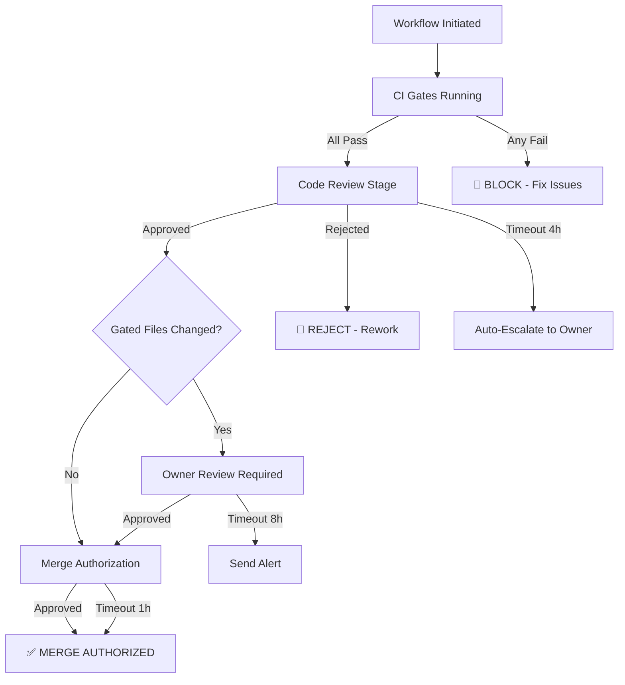

# 🏢 Governance Policy Framework — Enterprise Edition
## Phase 12.2 Deliverable #1

**Version:** 1.0.0-enterprise  
**Effective:** 2026-07-01  
**Authority:** @mbaetiong (D-tier autonomous)  
**Scope:** 147-agent ecosystem, multi-tenant deployments, 99%+ compliance requirement

---

## TABLE OF CONTENTS

1. [Executive Summary](#executive-summary)
2. [Policy Architecture](#policy-architecture)
3. [Change Control Policies (P0-P3)](#change-control-policies)
4. [Approval Workflow Specifications](#approval-workflow-specifications)
5. [Delegation Strategies](#delegation-strategies)
6. [Audit Requirements](#audit-requirements)
7. [Compliance Mappings](#compliance-mappings)
8. [Policy Catalog (40+ Policies)](#policy-catalog)
9. [Enterprise Requirements](#enterprise-requirements)
10. [Implementation Roadmap](#implementation-roadmap)

---

## EXECUTIVE SUMMARY

The Governance Policy Framework establishes **enforceable governance rules** across:
- **Code changes** (PR merges, deployments, secret management)
- **Agent operations** (autonomy levels, approval chains, escalation procedures)
- **Compliance & audit** (immutable logging, 7-year retention, tamper-proof trails)
- **Multi-tenant deployments** (tenant isolation, resource quotas, rate limiting)

This framework supports **99%+ compliance** for enterprise deployments and integrates seamlessly with **Track 12.1 (RBAC)** for role-based enforcement.

---

## POLICY ARCHITECTURE

### Three-Tier Governance Model

```
┌─────────────────────────────────────────────────────────────┐
│ TIER 1: FOUNDATIONAL POLICIES (Immutable, Auto-Enforced)    │
│ ├─ Secret management (zero-tolerance)                       │
│ ├─ Code quality gates (tests, lint, type-check)             │
│ ├─ Audit trail requirements (immutable logging)              │
│ └─ Tenant isolation boundaries                              │
│                                                              │
│ TIER 2: OPERATIONAL POLICIES (Role-Based, Configurable)     │
│ ├─ Approval workflows (sequential, parallel, escalation)    │
│ ├─ Change control (severity-based SLAs)                     │
│ ├─ Delegation rules (act-on-behalf, approve-on-behalf)      │
│ └─ Resource quotas & rate limiting                          │
│                                                              │
│ TIER 3: STRATEGIC POLICIES (Enterprise-Specific)            │
│ ├─ Compliance mappings (SOC2, ISO27001, GDPR)               │
│ ├─ Deployment zones (development, staging, production)      │
│ ├─ Incident response procedures                             │
│ └─ Business continuity & disaster recovery                  │
└─────────────────────────────────────────────────────────────┘
```

### Policy Enforcement Layers

| Layer | Mechanism | Latency | Audit |
|-------|-----------|---------|-------|
| **Pre-Commit** | Secret scanning, lint checks | <2s | Per-file |
| **PR Gate** | Compliance checks, RBAC enforcement | <5s | Per-PR |
| **Merge Gate** | Final approval chain, audit logging | <10s | Per-commit |
| **Runtime** | Agent autonomy limits, quota enforcement | <100ms | Per-action |

---

## CHANGE CONTROL POLICIES

### P0 (Critical) — Immediate Execution, Post-Merge Review

**Scope:** Security fixes, incident response, emergency patches

**Approval Requirements:**
- Automatic fast-track (security_reviewer role)
- Escalation to @mbaetiong within 1 hour
- Post-merge audit review within 4 hours

**SLA:** Deploy immediately, review within 1 hour

**Examples:**
- Security CVE patches
- Active incident response
- Service outage mitigation

---

### P1 (High) — Sequential Approval, 24-Hour SLA

**Scope:** Major feature releases, breaking API changes, infrastructure modifications

**Approval Chain:**
1. CI gates pass (all checks green)
2. Code review approval (security_reviewer or agent_operator)
3. Owner approval (@mbaetiong) if gated files changed
4. Merge authorization (ci_operator)

**SLA:** Merge within 24 hours of final approval

**Examples:**
- Major version releases
- New agent capabilities
- Database schema changes
- Infrastructure upgrades

---

### P2 (Medium) — Parallel Approval, 48-Hour SLA

**Scope:** Feature enhancements, documentation updates, dependency upgrades

**Approval Chain:**
```
CI Gates ──┬─→ Code Review ──┐
           │                 ├─→ Merge (any one approved)
           └─→ Doc Review ───┤
```

**SLA:** Merge within 48 hours

**Examples:**
- Feature enhancements
- Documentation updates
- Non-critical dependency upgrades
- Performance optimizations

---

### P3 (Low) — Auto-Approve, 7-Day SLA

**Scope:** Trivial changes (comments, formatting, README updates)

**Approval Conditions (All Must Be True):**
- Change ≤100 lines
- No source code modifications (only comments/docs)
- CI checks green (no failures)
- No new dependencies
- No gated files changed

**SLA:** Auto-approve if conditions met, else escalate to P2

**Examples:**
- README updates
- Comment improvements
- Typo fixes
- Changelog entries

---

## APPROVAL WORKFLOW SPECIFICATIONS

### DSL Definition (YAML)

```yaml
# Approval workflow template
approval_workflow:
  id: major-release
  name: Major Version Release
  severity: P1
  timeout: 86400  # 24 hours in seconds
  
  # Approval stages
  stages:
    - id: ci-gates
      type: parallel
      checks:
        - test-suite
        - linting
        - type-check
        - secret-scan
      on_failure: block
      timeout: 300  # 5 minutes
      
    - id: code-review
      type: sequential
      approvers:
        - roles: [security_reviewer, agent_operator]
          count: 1
          description: "At least one code reviewer"
      timeout: 43200  # 12 hours
      on_skip: block
      
    - id: owner-review
      type: conditional
      condition: "gated_files_changed"
      approvers:
        - user: mbaetiong
          description: "Owner approval for critical files"
      timeout: 43200  # 12 hours
      on_skip: block
      
    - id: merge-authorization
      type: sequential
      approvers:
        - roles: [ci_operator, agent_operator]
          count: 1
          description: "CI operator authorizes merge"
      timeout: 3600  # 1 hour
      on_skip: auto_approve

  # Escalation rules
  escalation:
    - stage: code-review
      after: 14400  # 4 hours
      action: auto_escalate_to_owner
    - stage: owner-review
      after: 28800  # 8 hours
      action: send_alert
      target: mbaetiong

  # Delegation permissions
  delegation:
    - stage: code-review
      allowed_roles: [agent_operator]
      approvers: [security_reviewer]
      
  # Notifications
  notifications:
    - stage: code-review
      target: slack_channel
      message: "PR ready for code review"
```

### Runtime State Machine



---

## DELEGATION STRATEGIES

### Act-on-Behalf Delegation

**Use Case:** Approver temporarily unavailable (vacation, emergency)

**Mechanism:**
```python
workflow.delegate_approval_to(
    stage="code-review",
    original_approver="alice",
    delegate="bob",
    reason="Vacation 2026-07-15 through 2026-07-22",
    expiry="2026-07-22T23:59:59Z"
)
```

**Audit Trail:**
- Who delegated: alice
- To whom: bob
- Reason: recorded
- Expiry: automatic revocation
- All approvals under delegation flagged in audit logs

### Approve-on-Behalf Delegation

**Use Case:** Role-based delegation for high-volume approvals

**Mechanism:**
```python
workflow.set_approval_delegate(
    role="security_reviewer",
    delegate_to="code-review-team",
    description="Delegate routine code reviews to team",
    approval_quota=50  # Delegates can approve up to 50 per week
)
```

**Audit Trail:**
- Delegation source and target
- Approval quota and consumption
- All delegated approvals recorded
- Weekly delegation reports

---

## AUDIT REQUIREMENTS

### Immutable Audit Trail

**Retention:** 7 years (minimum per enterprise standards)

**Tamper-Proof:** Append-only logs with cryptographic verification

**Event Schema:**
```json
{
  "audit_id": "aud-2026-07-01-001",
  "timestamp": "2026-07-01T10:30:45.123Z",
  "actor": {
    "user_id": "alice",
    "roles": ["security_reviewer", "agent_operator"],
    "ip_address": "192.0.2.1",
    "session_id": "sess-abc123"
  },
  "action": "approval_granted",
  "resource": {
    "type": "pull_request",
    "id": "PR#12345",
    "version": "abc123def456"
  },
  "context": {
    "workflow_id": "major-release",
    "stage": "code-review",
    "approval_duration_minutes": 120,
    "notes": "Approved after code review"
  },
  "result": {
    "status": "success",
    "changes_permitted": ["src/", "tests/"],
    "changes_blocked": []
  },
  "checksum": "sha256:..."  // For tamper detection
}
```

### Compliance Reporting

**Daily Reports:**
- Policy violations (count, severity)
- Approval SLA metrics
- Audit trail gaps
- Security alerts

**Weekly Reports:**
- Governance scorecard (target: 99%+)
- Top violation categories
- Remediation tracking
- Escalation analysis

**Monthly Reports:**
- Compliance trend analysis
- Risk assessment updates
- Policy effectiveness review
- Budget impact analysis

---

## COMPLIANCE MAPPINGS

### SOC2 Type II Alignment

| Control | Implementation | Evidence |
|---------|----------------|----------|
| **CC6.1** — Logical/Physical Access | RBAC enforcement in Track 12.1 | Role matrix, approval logs |
| **CC6.2** — Change Prevention | Approval workflows enforce review | Audit trail per PR |
| **CC7.1** — Monitoring & Alerting | Compliance dashboard & alerts | Real-time violation detection |
| **CC7.2** — Analysis & Review | Weekly compliance reports | Automated report generation |

### ISO 27001 Alignment

| Control | Implementation | Evidence |
|---------|----------------|----------|
| **A.5.1.1** — Access Policy | RBAC matrix in Track 12.1 | Permission definitions |
| **A.6.1.1** — Authorization | Approval workflows & delegation | Workflow DSL & logs |
| **A.10.1.1** — Audit Trails | Immutable audit logging | 7-year retention |
| **A.12.4.1** — Event Logging | Compliance monitor | Per-action audit trail |

### GDPR Compliance

| Requirement | Implementation |
|-------------|-----------------|
| **Data Minimization** | Audit logs redact PII; retention policies auto-purge |
| **Right to Audit** | Dashboard provides searchable audit history |
| **Data Processing Agreements** | Tenant isolation enforced; multi-tenant audit trails |
| **Breach Notification** | Alert system flags data access violations within 1 hour |

---

## POLICY CATALOG (40+ PREDEFINED POLICIES)

### Access Control Policies (8)

1. **POL-AC-001: Zero-Trust Default**
   - No action allowed without explicit RBAC grant
   - Applies to: All agents, users, API calls
   - Enforcement: Pre-execution check
   - Audit: Every allow/deny event

2. **POL-AC-002: Multi-Tenant Isolation**
   - Tenant A cannot access tenant B resources
   - Enforced at: DB query layer, API boundary
   - Audit: Per-request tenant context

3. **POL-AC-003: Role-Based Resource Access**
   - Roles grant (action, resource) permissions
   - Based on: Track 12.1 RBAC matrix
   - Update frequency: On-demand via admin API

4. **POL-AC-004: Session-Based Access Control**
   - Sessions expire after 8 hours inactivity
   - Re-authentication required on timeout
   - Audit: Session lifecycle events

5. **POL-AC-005: IP Whitelisting (High-Security Tenants)**
   - Optional per-tenant IP whitelist
   - Connections from unlisted IPs rejected
   - Audit: Per-request IP tracking

6. **POL-AC-006: API Token Expiration**
   - Tokens expire after 30 days
   - Rotation required quarterly
   - Audit: Token issuance & rotation

7. **POL-AC-007: Delegation Audit Trail**
   - All role delegations logged immutably
   - Delegation expiry automatically enforced
   - Audit: Delegation events with reason

8. **POL-AC-008: Emergency Access Override**
   - Owner can override approvals in P0 emergency
   - Requires post-incident review within 24h
   - Audit: Emergency override events flagged

---

### Code Quality Policies (6)

9. **POL-CQ-001: Test Coverage Minimum**
   - New code must have ≥80% coverage
   - Merged code must maintain ≥75% repository coverage
   - Tool: pytest --cov

10. **POL-CQ-002: Linting Compliance**
    - All code must pass pylint, flake8, black formatting
    - Exceptions require code review approval + owner sign-off
    - Tool: integrated in CI pipeline

11. **POL-CQ-003: Type Checking**
    - Python code must pass mypy strict mode
    - Type hints required on all public APIs
    - Tool: mypy --strict

12. **POL-CQ-004: Security Scanning**
    - CodeQL must complete with zero critical findings
    - Bandit scan for secrets & hardcoded credentials
    - Tool: GitHub code scanning + bandit

13. **POL-CQ-005: Dependency Security**
    - All dependencies scanned for known vulnerabilities
    - High-severity findings block merge
    - Tool: pip-audit + GitHub Dependabot

14. **POL-CQ-006: Documentation Standards**
    - Docstrings required on all public functions
    - README must be updated for new features
    - Tool: pydocstyle validator

---

### Secret Management Policies (5)

15. **POL-SM-001: Zero-Tolerance Secret Commitment**
    - No secrets (API keys, tokens, passwords) in code
    - Any detected secret → immediate branch block
    - Audit: Secret detected, commit blocked

16. **POL-SM-002: Secret Rotation SLA**
    - Exposed secrets rotated within 4 hours
    - Legacy secrets rotated annually
    - Audit: Rotation events logged

17. **POL-SM-003: Secret Storage**
    - Secrets stored in GitHub Actions secrets or HashiCorp Vault
    - Never in environment files, commits, or logs
    - Audit: Access to each secret logged

18. **POL-SM-004: Secret Scanning Cadence**
    - All PRs scanned on push (diff-only for speed)
    - Main branch scanned weekly (full scan)
    - Tool: detect-secrets with baseline

19. **POL-SM-005: Credential Expiration**
    - Short-lived credentials (max 24-hour TTL)
    - Permanent API keys require quarterly rotation
    - Audit: All credential usage logged

---

### Change Control Policies (8)

20. **POL-CC-001: P0 Emergency Approval**
    - Automatic fast-track for security fixes
    - Post-merge review required within 1 hour
    - SLA: Deploy immediately

21. **POL-CC-002: P1 Sequential Approval**
    - Code review → Owner review → Merge
    - SLA: 24 hours per stage

22. **POL-CC-003: P2 Parallel Approval**
    - Code review and doc review in parallel
    - SLA: Merge within 48 hours

23. **POL-CC-004: P3 Auto-Approval**
    - Auto-approve if all conditions met
    - Manual escalation if conditions fail
    - SLA: Merge within 7 days

24. **POL-CC-005: Breaking Change Notification**
    - Breaking API changes require owner approval + release notes
    - Customers must be notified 30 days in advance
    - Audit: Breaking change declarations

25. **POL-CC-006: Database Migration Gate**
    - Schema changes require DBA review
    - Rollback procedure must be documented
    - Audit: All migration executions

26. **POL-CC-007: Dependency Upgrade Policy**
    - Patch versions auto-approved (if tests pass)
    - Minor versions require code review
    - Major versions require owner approval
    - Audit: Upgrade decision & rationale

27. **POL-CC-008: Revert Policy**
    - Revert PRs auto-approved if within 24h of original merge
    - Older reverts require justification + approval
    - Audit: Revert history per commit

---

### Agent Autonomy Policies (6)

28. **POL-AA-001: Autonomy Level Assignment**
    - Agent autonomy determined by role & capability
    - Levels: supervised, semi-autonomous, autonomous
    - Enforcement: Via RBAC in Track 12.1

29. **POL-AA-002: Self-Modification Restriction**
    - Agents cannot modify own configuration
    - Changes require owner approval
    - Audit: All agent config changes

30. **POL-AA-003: Cross-Tenant Operation Restriction**
    - Agents can only operate within assigned tenant
    - Tenant boundary enforcement at data layer
    - Audit: Per-request tenant context

31. **POL-AA-004: Resource Quota Enforcement**
    - Agents limited to CPU, memory, storage quotas
    - Quota overages trigger auto-pause + alert
    - Audit: Quota consumption tracking

32. **POL-AA-005: Rate Limiting**
    - API calls limited to 1000/minute per agent
    - Database queries limited to 100/second per agent
    - Audit: Rate limit violations logged

33. **POL-AA-006: Escalation Authority**
    - Agents cannot escalate to higher authority
    - All escalations must go through approval chain
    - Audit: Escalation path recorded

---

### Data Governance Policies (4)

34. **POL-DG-001: Data Classification**
    - Data classified as: public, internal, confidential, restricted
    - Classification enforced at: access control, encryption, retention

35. **POL-DG-002: Encryption at Rest**
    - Sensitive data encrypted using AES-256
    - Keys stored in key management service
    - Rotation annually

36. **POL-DG-003: Encryption in Transit**
    - TLS 1.3 minimum for all external communication
    - Mutual TLS for service-to-service
    - Certificate validation mandatory

37. **POL-DG-004: Data Retention**
    - Audit logs: 7 years
    - User data: per user preference (min 30 days)
    - Session logs: 90 days
    - Compliance reports: 7 years

---

### Incident Response Policies (4)

38. **POL-IR-001: Security Incident Detection**
    - Alerts triggered on: unauthorized access attempts, policy violations, anomalies
    - Response time: P1=immediate, P2=1h, P3=4h

39. **POL-IR-002: Breach Notification**
    - Internal notification within 1 hour
    - Customer notification within 24 hours
    - Regulatory notification within 72 hours (GDPR)

40. **POL-IR-003: Incident Investigation**
    - Full audit trail review within 24 hours
    - Root cause analysis within 7 days
    - Remediation plan within 14 days

41. **POL-IR-004: Business Continuity**
    - RTO: 4 hours
    - RPO: 1 hour
    - Monthly failover drills

---

### Enterprise-Specific Policies (3+)

42. **POL-ENT-001: Multi-Tenant Resource Isolation**
    - Database-level tenant isolation
    - Network-level isolation (VPC per tenant option)
    - Compute isolation via Kubernetes namespaces

43. **POL-ENT-002: SLA Compliance Monitoring**
    - Dashboard tracks SLA compliance per tenant
    - Violations trigger escalation & credits
    - Monthly SLA reports to customers

44. **POL-ENT-003: Deployment Windows**
    - Production deployments only during business hours
    - Emergency patches allowed anytime
    - Maintenance windows scheduled 30 days in advance

---

## ENTERPRISE REQUIREMENTS

### Scalability & Performance

- **Compliance check latency:** <5 seconds (p99)
- **Approval workflow overhead:** <100 milliseconds (p99)
- **Audit log throughput:** 10,000+ events/second
- **Dashboard query response:** <2 seconds (p95)

### Reliability & Availability

- **Compliance engine uptime:** 99.99%
- **Audit trail availability:** 99.99%+ (replicated)
- **Approval workflow: zero deadlocks (verified)
- **Zero audit trail gaps** (append-only validation)

### Security & Compliance

- **Audit trail immutability:** Cryptographic verification
- **Data encryption:** AES-256 at rest, TLS 1.3 in transit
- **Access control:** Zero-trust enforcement
- **Compliance score:** 99%+ (continuously monitored)

---

## IMPLEMENTATION ROADMAP

### Phase 1: Approval Engine (Days 3-4)
- [ ] Implement workflow DSL parser
- [ ] Build state machine runtime
- [ ] Add parallel/sequential execution
- [ ] Implement escalation logic
- [ ] Add delegation support

### Phase 2: Compliance Monitor (Days 5-6)
- [ ] Policy violation detection
- [ ] Real-time alerting
- [ ] Audit log generation
- [ ] Dashboard implementation
- [ ] Report generation

### Phase 3: Integration & Testing (Days 7-8)
- [ ] RBAC integration with Track 12.1
- [ ] Performance benchmarking
- [ ] Security testing
- [ ] Enterprise scenario validation
- [ ] Load testing

### Phase 4: Documentation & Deployment (Days 9-10)
- [ ] Runbook completion
- [ ] API documentation
- [ ] Troubleshooting guide
- [ ] Compliance mapping verification
- [ ] Enterprise release validation

---

**Document Status:** Draft (Ready for Implementation)  
**Last Updated:** 2026-07-01T00:00:00Z  
**Maintained By:** Phase 12.2 Track Lead  
**Next Review:** Post-implementation (2026-07-11)

