# Mermaid Diagram Templates for _codex_ Documentation

**Version:** 1.0  
**Created:** 2026-07-08  
**Purpose:** Reusable templates for common documentation diagrams

---

## 1. Architecture Diagram Template

Use for system components and data flow:

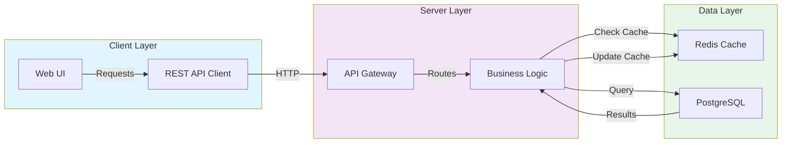

**When to use:** System architecture, component relationships, data flow

**Customization:**
- Replace `Client`, `Server`, `Data` with your layers
- Add/remove components as needed
- Adjust colors (lighter = `fill:#` code, darker = `stroke:#` code)

---

## 2. Process Workflow Template

Use for step-by-step procedures:

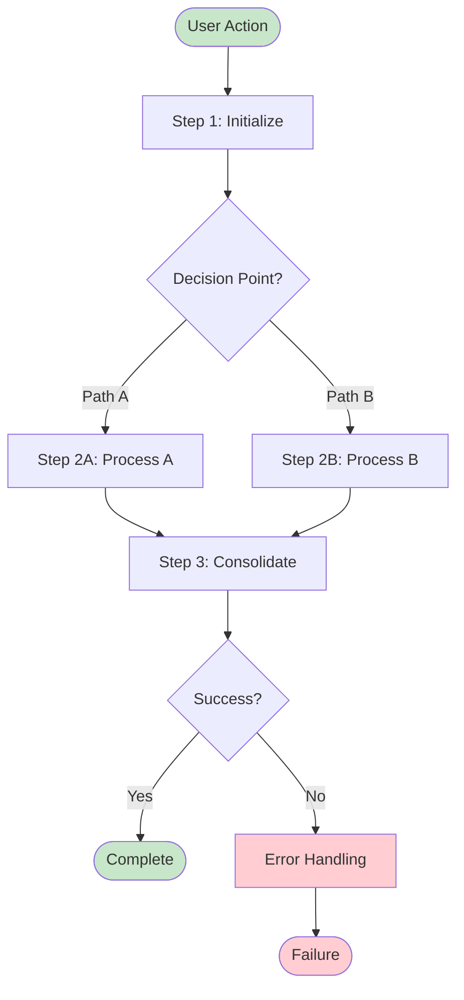

**When to use:** Deployment pipelines, approval workflows, decision trees

**Customization:**
- Add steps: `StepN["Description"]`
- Add decisions: `Decision{Question?}`
- Chain with `-->`
- Use `style` for highlighting important nodes

---

## 3. Entity Relationship Diagram Template

Use for database schemas:

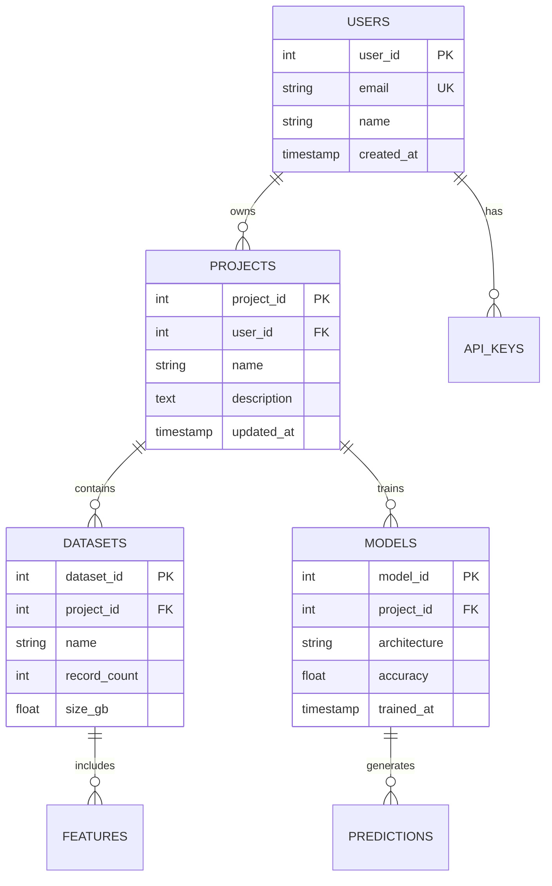

**When to use:** Database schemas, data models, relationship documentation

**Customization:**
- `ENTITY_NAME` — Table name (UPPERCASE)
- `PK` — Primary key
- `FK` — Foreign key
- `UK` — Unique key
- `||--o{` — One-to-many relationship
- `||--||` — One-to-one relationship

---

## 4. Sequence Diagram Template

Use for interactions over time:

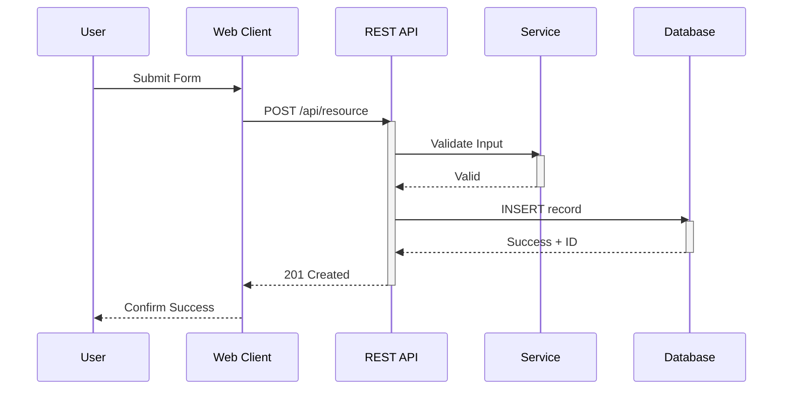

**When to use:** API interactions, authentication flows, request/response sequences

**Customization:**
- `participant Name as Label`
- `->>` — Arrow (request)
- `-->>` — Dotted arrow (response)
- `activate` / `deactivate` — Show processing time
- `alt` — Alternative paths

---

## 5. Timeline Diagram Template

Use for project phases and milestones:

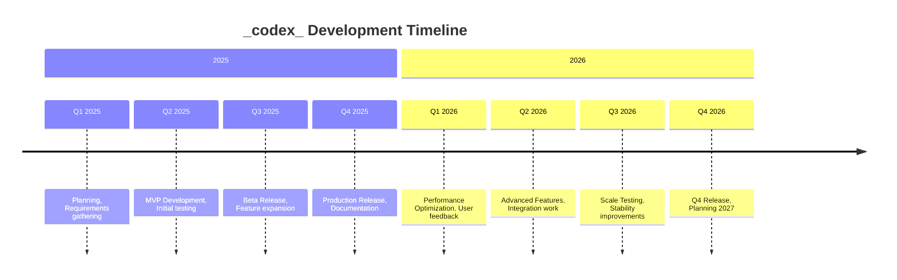

**When to use:** Project roadmaps, release timelines, historical evolution

**Customization:**
- Add/remove milestones
- Group into sections with `section Name`
- Keep descriptions concise

---

## 6. State Diagram Template

Use for state machines and workflows:

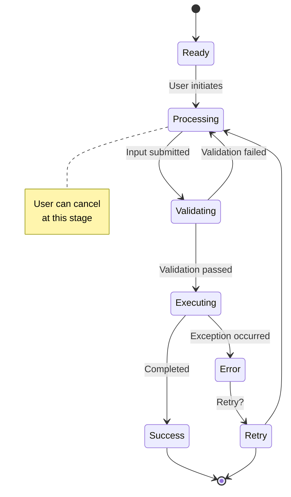

**When to use:** State machines, status workflows, user journey stages

**Customization:**
- States are simple nodes
- `[*]` — Start/end states
- Add notes with `note right/left of State`
- Conditions on arrows

---

## 7. Class Diagram Template

Use for object-oriented design:

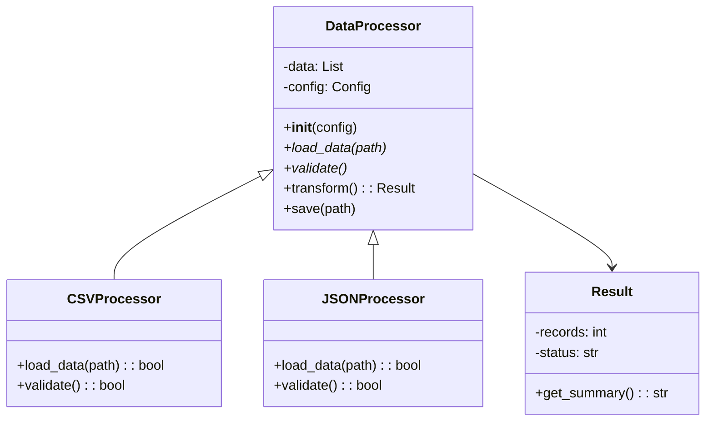

**When to use:** Object-oriented designs, inheritance hierarchies, class relationships

**Customization:**
- `-` for private properties
- `+` for public properties
- `*` for abstract methods
- `<|--` for inheritance
- `-->` for dependency

---

## 8. Pie Chart Template

Use for composition or distribution:

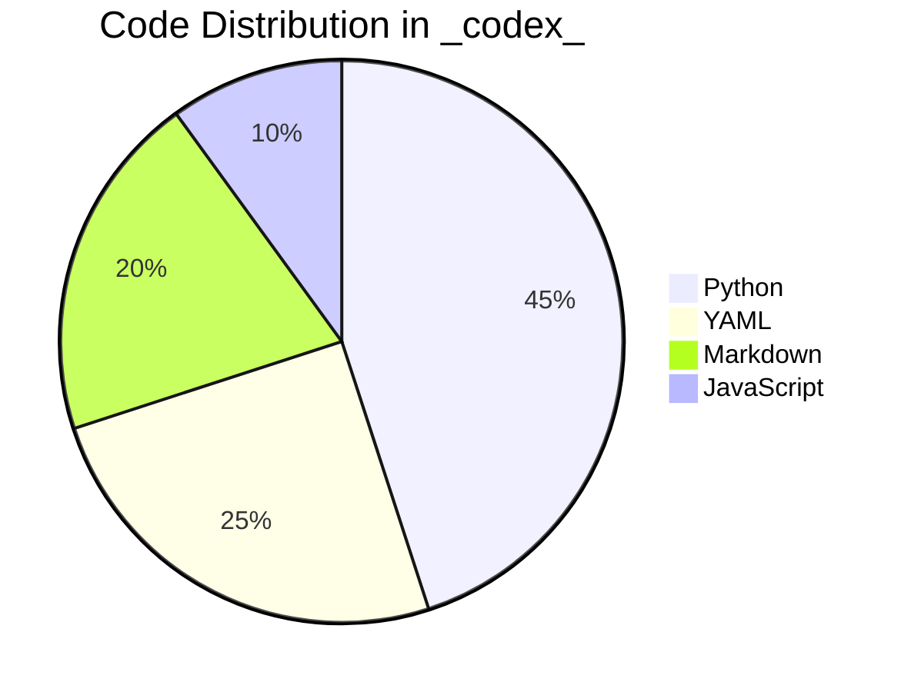

**When to use:** Resource allocation, code composition, time distribution

**Customization:**
- Add/remove categories
- Adjust percentages (must sum to 100)

---

## 9. Gantt Chart Template

Use for project scheduling:

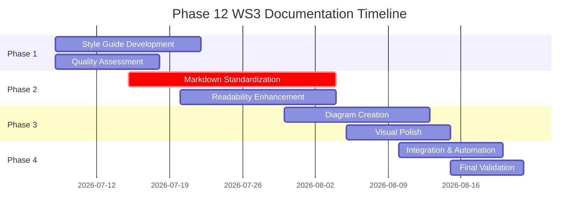

**When to use:** Project timelines, task scheduling, dependency visualization

**Customization:**
- `crit` — Critical path (red)
- `done` — Completed (green)
- Dates in `YYYY-MM-DD` format
- Adjust duration numbers

---

## 10. Git Branching Diagram Template

Use for version control workflows:

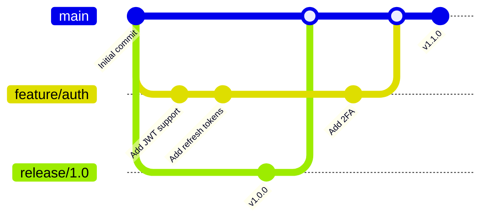

**When to use:** Git workflows, branching strategies, release processes

**Customization:**
- `branch name` — Create new branch
- `checkout name` — Switch to branch
- `merge name` — Merge branch
- `commit id: "message"` — Log commit

---

## Best Practices for Diagrams

### Do ✅

- Keep diagrams focused on one concept
- Use consistent colors across related diagrams
- Add titles and labels
- Test rendering in your documentation build
- Include explanatory text before/after diagram
- Use simple, clear language in labels

### Don't ❌

- Overcomplicate with too many nodes
- Mix multiple unrelated concepts
- Use inconsistent styling
- Forget to test the diagram syntax
- Leave diagrams without context
- Assume readers will understand without explanation

### Integration Example

```markdown
## Our Architecture

The _codex_ system has three main layers:

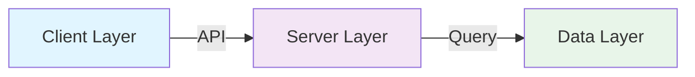

**Client Layer** handles user interface and requests.

**Server Layer** processes business logic.

**Data Layer** manages persistence and caching.
```

---

## Common Issues & Solutions

| Issue | Cause | Solution |
|-------|-------|----------|
| Diagram not rendering | Syntax error | Validate with `mermaid live editor` |
| Text wrapping awkwardly | Long labels | Shorten or use multi-line with `\|` |
| Colors not showing | Invalid color code | Use `fill:#hexcode` or named colors |
| Arrows pointing wrong | Wrong syntax | Use `-->` not `->` or `>` |
| Diagram too large | Too many nodes | Split into multiple diagrams |

---

## Resources

- [Mermaid Official Docs](https://mermaid.js.org)
- [Mermaid Live Editor](https://mermaid.live)
- [_codex_ Style Guide](./../.codex/DOCUMENTATION_STYLE_GUIDE.md)

---

*Keep these templates in mind when adding diagrams to documentation. Good diagrams make complex ideas easy to understand!*
