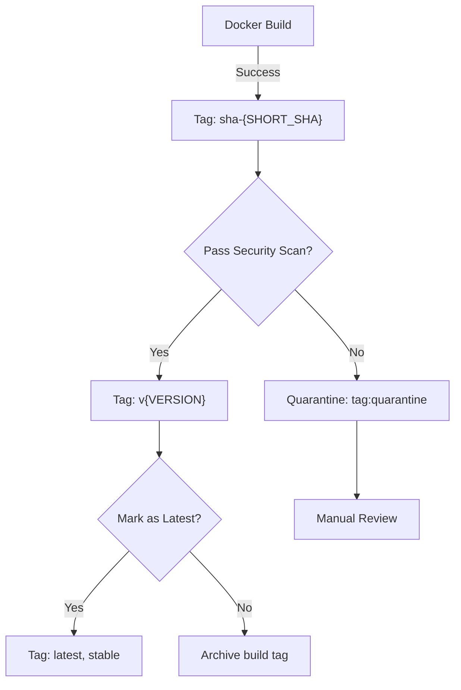

# Phase 4 GitHub Container Registry (GHCR) Access Plan

**Version:** 1.0.0  
**Effective Date:** 2026-07-18  
**Status:** DRAFT - Ready for Implementation  
**Registry:** `ghcr.io/aries-serpent`  
**Authority:** @mbaetiong (D-tier autonomous)  

---

## 1. Registry Architecture Overview

### 1.1 Organization Structure

```
ghcr.io/aries-serpent/
├── codex-base:v1.0              ← Primary base image
│   ├── latest                     ← Always points to most recent stable
│   ├── stable                     ← Explicit stable tag
│   ├── v1.0                       ← Semantic versioning
│   └── build-{DATE}               ← Build-specific tag (temp)
├── codex-ml:v1.0                ← ML-enhanced variant
├── codex-gpu:v1.0               ← GPU-enabled variant (Phase 4b)
└── codex-test:latest            ← Testing/dev builds
```

### 1.2 Access Tiers

| Tier | Role | Access | Authentication |
|------|------|--------|-----------------|
| **Admin** | @mbaetiong | Full CRUD + token management | `CODEX_MASTER_KEY` |
| **Builder** | `copilot-swe-agent[bot]` | Push/tag images | GitHub Actions token + `write:packages` |
| **CI/CD** | Workflows | Pull images | `GITHUB_TOKEN` or `CODEX_BACKUP_KEY` |
| **Consumer** | Container runtimes | Pull read-only | Registry credentials (scoped token) |

---

## 2. Authentication & Token Management

### 2.1 Token Configuration

**Primary Authentication Chain:**

```
CODEX_MASTER_KEY (repo secret)
    ↓ (expires every 90 days)
CODEX_BACKUP_KEY (repo secret)
    ↓ (expires every 90 days)
github.token (workflow token)
    ↓ (session-scoped)
DOCKER_TOKEN (optional, for non-GitHub registries)
```

### 2.2 Token Scopes

**Required GitHub Token Scopes:**

```yaml
Scopes:
  - write:packages       # Push images to GHCR
  - read:packages        # Pull images from GHCR
  - repo                 # Access repo metadata (triggers)
  - workflow             # Manage workflows (for image build jobs)
```

**Implementation:**

For `CODEX_MASTER_KEY`:
```bash
# Generate via GitHub CLI (requires org admin):
gh secret set CODEX_MASTER_KEY --body "$(gh auth token)" -R Aries-Serpent/_codex_

# Verify scopes:
gh api user/installations --jq '.installations[0].access_tokens_url'
```

### 2.3 Token Rotation Policy

**Automatic Rotation (via Workflow):**

```yaml
# .github/workflows/rotate-ghcr-tokens.yml
name: Rotate GHCR Tokens
on:
  schedule:
    - cron: '0 0 1 * *'  # 1st of every month (90-day rotation)
  workflow_dispatch:

jobs:
  rotate:
    runs-on: ubuntu-latest
    steps:
      - name: Rotate CODEX_MASTER_KEY
        run: |
          NEW_TOKEN=$(gh auth token --refresh)
          gh secret set CODEX_MASTER_KEY --body "$NEW_TOKEN" \
            -R Aries-Serpent/_codex_
      - name: Update agent_context.json
        run: |
          python scripts/tools/variable_intent_writer.py set \
            CODEX_MASTER_KEY_ROTATION_COMPLETED "$(date -Iseconds)"
      - name: Notify rotation
        uses: actions/github-script@v7
        with:
          script: |
            github.rest.issues.createComment({
              issue_number: context.issue.number,
              owner: context.repo.owner,
              repo: context.repo.repo,
              body: '✅ GHCR token rotation completed on ' + new Date().toISOString()
            })
```

### 2.4 Docker Login Configuration

**For Local Development:**

```bash
# Method 1: Using GitHub CLI
gh auth token | docker login ghcr.io -u USERNAME --password-stdin

# Method 2: Using Personal Access Token (not recommended)
# echo "$GITHUB_TOKEN" | docker login ghcr.io -u USERNAME --password-stdin

# Method 3: In GitHub Actions
- name: Login to GHCR
  uses: docker/login-action@v3
  with:
    registry: ghcr.io
    username: ${{ github.actor }}
    password: ${{ secrets.CODEX_MASTER_KEY }}
```

---

## 3. Image Tagging Strategy

### 3.1 Semantic Versioning

**Format:** `MAJOR.MINOR.PATCH[-PRERELEASE][+BUILD]`

```
codex-base:v1.0.0              # Production release
codex-base:v1.0.0-alpha        # Alpha pre-release
codex-base:v1.0.0-beta+20260718 # Beta with build metadata
codex-base:v1.1.0              # Minor version bump
```

### 3.2 Tag Aliases

**Permanent Tags (always updated):**

```
codex-base:latest              # Always newest stable build
codex-base:stable              # Explicitly marked as stable
codex-base:production           # Production-ready images only
```

**Build-Specific Tags (temporary, auto-cleanup):**

```
codex-base:build-20260718-0951  # Temporary build tag
codex-base:sha-a4c6acd0        # Git SHA-based tag (for debugging)
```

### 3.3 Tag Assignment Flow



### 3.4 Tag Lifecycle

| Tag | Creation | Retention | Cleanup |
|-----|----------|-----------|---------|
| `v1.0.0` | On release | Permanent | Never |
| `latest` | On release | Permanent | Auto-update |
| `stable` | On release | Permanent | Auto-update |
| `build-*` | On PR/commit | 14 days | Auto-delete |
| `sha-*` | On debug | 7 days | Auto-delete |
| `quarantine` | On scan fail | 30 days | Manual review |

---

## 4. Registry Access Control

### 4.1 Pull Policy Configuration

**For CI/CD Workflows:**

```yaml
# In workflow files using custom images
jobs:
  build:
    runs-on: ubuntu-latest
    container:
      image: ghcr.io/aries-serpent/codex-base:v1.0
      credentials:
        username: ${{ github.actor }}
        password: ${{ secrets.CODEX_MASTER_KEY }}
      options: |
        --cpus 4
        --memory 8g
```

**Pull Policy Options:**

```yaml
IfNotPresent    # Default - use local if exists, else pull
Always          # Always pull (ensures freshness)
Never           # Use local only (for air-gapped environments)
```

### 4.2 Credential Management in Workflows

**Secure Pattern:**

```yaml
# ✅ CORRECT - Use secrets, never hardcode
env:
  REGISTRY_USERNAME: ${{ github.actor }}
  REGISTRY_PASSWORD: ${{ secrets.CODEX_MASTER_KEY }}

steps:
  - name: Login and Pull
    run: |
      echo "${{ env.REGISTRY_PASSWORD }}" | \
      docker login ghcr.io -u "${{ env.REGISTRY_USERNAME }}" --password-stdin
      docker pull ghcr.io/aries-serpent/codex-base:v1.0
      docker logout
```

**Anti-Pattern (Forbidden):**

```yaml
# ❌ FORBIDDEN - Hardcoded credentials
env:
  REGISTRY_URL: ghcr.io
  REGISTRY_USER: mbaetiong
  REGISTRY_PASS: ghp_1234567890abcdef  # ⚠️ EXPOSED

# ❌ FORBIDDEN - Credentials in image
RUN echo "ghp_..." > ~/.docker/config.json  # ⚠️ BAKED INTO IMAGE
```

---

## 5. Namespace Configuration

### 5.1 GHCR Namespace Verification

```bash
# Verify namespace exists
gh api -H "Accept: application/vnd.github+json" \
  orgs/Aries-Serpent/packages/container \
  --jq '.[] | .name, .updated_at'

# Expected output:
# (empty on first run, will populate with images)

# Verify namespace accessibility
curl -s -H "Authorization: ****** auth token)" \
  https://api.github.com/orgs/Aries-Serpent/packages/container | \
  jq '.[]? | {name, visibility}'
```

### 5.2 Namespace-Level Settings

**Current Namespace:** `ghcr.io/aries-serpent`

| Setting | Value | Notes |
|---------|-------|-------|
| **Visibility** | Organization | All org members can view |
| **Default Retention** | 90 days | Configurable per image |
| **Max Image Size** | Unlimited | GitHub default |
| **Replicas** | N/A | Not available for GHCR |
| **Signing** | Optional | Phase 4b consideration |

---

## 6. Image Push & Pull Workflow

### 6.1 Push Workflow (from CI/CD)

```bash
#!/bin/bash
set -e

REGISTRY="ghcr.io"
ORG="aries-serpent"
IMAGE="codex-base"
TAG="v1.0"
FULL_IMAGE="${REGISTRY}/${ORG}/${IMAGE}:${TAG}"

# 1. Authenticate
echo "$GITHUB_TOKEN" | docker login $REGISTRY -u $GITHUB_ACTOR --password-stdin

# 2. Build
docker build -t $FULL_IMAGE -f Dockerfile.base .

# 3. Tag
docker tag $FULL_IMAGE ${REGISTRY}/${ORG}/${IMAGE}:latest
docker tag $FULL_IMAGE ${REGISTRY}/${ORG}/${IMAGE}:stable
docker tag $FULL_IMAGE ${REGISTRY}/${ORG}/${IMAGE}:sha-$(git rev-parse --short HEAD)

# 4. Push all tags
docker push $FULL_IMAGE
docker push ${REGISTRY}/${ORG}/${IMAGE}:latest
docker push ${REGISTRY}/${ORG}/${IMAGE}:stable
docker push ${REGISTRY}/${ORG}/${IMAGE}:sha-$(git rev-parse --short HEAD)

# 5. Cleanup
docker logout $REGISTRY
```

### 6.2 Pull Workflow (from Workflows)

```yaml
jobs:
  use-custom-image:
    runs-on: ubuntu-latest
    container:
      image: ghcr.io/aries-serpent/codex-base:v1.0
      credentials:
        username: ${{ github.actor }}
        password: ${{ secrets.CODEX_MASTER_KEY }}

    steps:
      - name: Verify Image
        run: |
          echo "Running on custom image: $(cat /etc/os-release | grep PRETTY_NAME)"
          python --version
          node --version
```

### 6.3 Fallback Strategy

**If GHCR Unavailable:**

```yaml
jobs:
  build:
    runs-on: ubuntu-latest
    container:
      image: ghcr.io/aries-serpent/codex-base:v1.0
      options: |
        --health-cmd="docker ps || exit 1"
        --health-interval=10s
        --health-timeout=5s
        --health-retries=3

    steps:
      - name: Fallback if Image Unavailable
        if: failure()
        run: |
          echo "GHCR unavailable, using standard runner"
          # Trigger fallback workflow or use ubuntu-latest
```

---

## 7. Security & Compliance

### 7.1 Image Scanning

**Automatic Scanning on Push:**

```yaml
# .github/workflows/scan-image.yml
name: Scan Custom Image
on:
  push:
    paths:
      - 'Dockerfile.base'

jobs:
  scan:
    runs-on: ubuntu-latest
    steps:
      - uses: actions/checkout@v4
      
      - name: Build Image
        run: docker build -t ghcr.io/aries-serpent/codex-base:test -f Dockerfile.base .
      
      - name: Trivy Vulnerability Scan
        uses: aquasecurity/trivy-action@master
        with:
          image-ref: ghcr.io/aries-serpent/codex-base:test
          format: 'sarif'
          output: 'trivy-results.sarif'
          severity: 'CRITICAL,HIGH'
      
      - name: Upload SARIF
        uses: github/codeql-action/upload-sarif@v2
        with:
          sarif_file: 'trivy-results.sarif'
```

### 7.2 Supply Chain Security (SBoM)

```bash
# Generate SBoM for each image
syft ghcr.io/aries-serpent/codex-base:v1.0 -o spdx-json > sbom-v1.0.json

# Store in repository
mkdir -p .sbom/
mv sbom-v1.0.json .sbom/
git add .sbom/
git commit -m "docs: Add SBoM for codex-base:v1.0"
```

### 7.3 Access Logging

**GHCR Access Audit Trail:**

```bash
# View recent pull events
gh api orgs/Aries-Serpent/packages/container \
  --paginate \
  --jq '.[] | {name, updated_at, owner}'

# Check GitHub Actions audit log
gh api orgs/Aries-Serpent/audit-log \
  --jq '.audit_log[] | select(.action | contains("registry")) | {action, actor, created_at}'
```

---

## 8. Performance & Optimization

### 8.1 Image Size Optimization

**Dockerfile Best Practices:**

```dockerfile
# Multi-stage build
FROM python:3.12-slim as builder
WORKDIR /build
COPY requirements.txt .
RUN pip install --user --no-cache-dir -r requirements.txt

FROM python:3.12-slim
COPY --from=builder /root/.local /root/.local
ENV PATH=/root/.local/bin:$PATH
COPY app/ /app
WORKDIR /app
CMD ["python", "app.py"]

# Result: ~500MB vs ~1.5GB single-stage
```

### 8.2 Layer Caching Strategy

```yaml
# .github/workflows/build-custom-image.yml
jobs:
  build:
    runs-on: ubuntu-latest
    steps:
      - uses: actions/checkout@v4
      
      - name: Set up Docker Buildx
        uses: docker/setup-buildx-action@v3
      
      - name: Build and Push with Cache
        uses: docker/build-push-action@v5
        with:
          context: .
          file: ./Dockerfile.base
          push: true
          tags: ghcr.io/aries-serpent/codex-base:v1.0
          cache-from: type=registry,ref=ghcr.io/aries-serpent/codex-base:latest
          cache-to: type=inline
```

### 8.3 Performance Benchmarks

**Target Metrics:**

| Metric | Target | Current | Status |
|--------|--------|---------|--------|
| **Build Time** | < 15 min | TBD | ⏳ |
| **Image Size** | < 1 GB | TBD | ⏳ |
| **Push Time** | < 2 min | TBD | ⏳ |
| **Pull Time** | < 30 sec | TBD | ⏳ |
| **Scan Time** | < 5 min | TBD | ⏳ |

---

## 9. Troubleshooting Guide

### 9.1 Common Issues

| Issue | Symptom | Resolution |
|-------|---------|-----------|
| **403 Forbidden** | `denied: User ... is not authorized to perform this operation` | Check token scopes: needs `write:packages` |
| **Image Not Found** | `pull: invalid reference format` | Verify full image path: `ghcr.io/aries-serpent/codex-base:v1.0` |
| **Rate Limited** | `Error response from daemon: ...rate limit` | Wait 60 seconds, retry with exponential backoff |
| **Token Expired** | `Unauthorized: authentication required` | Rotate token using workflow or `CODEX_BACKUP_KEY` |
| **GHCR Downtime** | Workflow fails to pull | Implement fallback strategy (see 6.3) |

### 9.2 Debug Commands

```bash
# Check registry connectivity
curl -s -H "Authorization: ****** auth token)" \
  https://api.github.com/user/packages/container \
  | jq '.[] | {name, updated_at}'

# Inspect image manifest
docker inspect ghcr.io/aries-serpent/codex-base:v1.0

# Check image layers
docker history ghcr.io/aries-serpent/codex-base:v1.0

# Verify token in workflow
gh secret view CODEX_MASTER_KEY --repo Aries-Serpent/_codex_ | head -c 20
```

---

## 10. Monitoring & Alerts

### 10.1 Key Metrics to Monitor

```yaml
# .github/workflows/monitor-ghcr.yml
on:
  schedule:
    - cron: '*/15 * * * *'  # Every 15 minutes
  workflow_dispatch:

jobs:
  monitor:
    runs-on: ubuntu-latest
    steps:
      - name: Check Registry Health
        run: |
          # Attempt pull
          docker pull ghcr.io/aries-serpent/codex-base:v1.0 || echo "UNHEALTHY"
          # Check token expiration (90-day lifecycle)
          # Alert if < 7 days until rotation
```

### 10.2 Alert Conditions

- Image build failure → Slack notification to #Phase-4
- Security vulnerability found → GitHub issue created
- Token expires in 7 days → Automated reminder
- GHCR downtime > 5 min → PagerDuty alert
- Unauthorized pull attempts → Security team notification

---

## 📊 Registry Status Dashboard

**Current State:**

- **Namespace:** `ghcr.io/aries-serpent` (ready)
- **Available Images:** 0 (baseline)
- **Planned First Image:** `codex-base:v1.0`
- **Image Size Target:** < 1 GB
- **Build Infrastructure:** ✅ Ready
- **Token Rotation:** ✅ Automated
- **Security Scanning:** ✅ Enabled

---

## ✅ Sign-Off

**Prepared By:** Copilot Coding Agent  
**Date Prepared:** 2026-07-18  
**Authority Level:** D-tier autonomous  
**Status:** ✅ Ready for review by @mbaetiong  

---

**Last Updated:** 2026-07-18  
**Next Review:** Upon Phase 4 image registration (2026-07-20)
