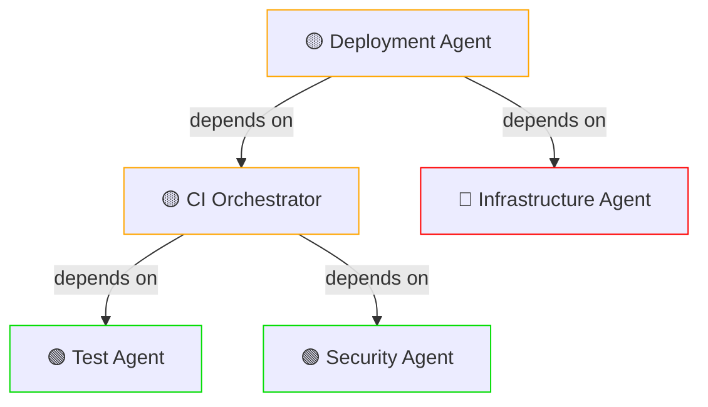

# PHASE 11.3 Quick Health Monitoring System

**Session-Scoped Deliverable**  
**Scope:** Incremental health monitoring implementation  
**Authority:** D-tier autonomous  
**Created:** 2026-02-05

---

## 1. Health Metrics (Per Agent)

### Core Metrics
- **Success Rate (%)**: Successful task completions / total executions
- **Average Latency (ms)**: Mean execution time
- **Error Rate (%)**: Failed executions / total executions
- **Last Success Timestamp**: ISO 8601 when agent last completed successfully
- **Queue Depth**: Number of pending tasks
- **Response Time P50/P95/P99**: Percentile latencies

### Derived Metrics
- **Throughput (tasks/min)**: Rate of task completions
- **MTTR (Mean Time To Recovery)**: Average recovery time after failure
- **Dependency Health**: Upstream agent availability status

---

## 2. Health Status Classification

### Status Levels

| Status | Icon | Success Rate | Latency | Availability | Action |
|--------|------|--------------|---------|--------------|--------|
| **HEALTHY** | 🟢 | >95% | Normal (P95 < 2x baseline) | 100% | Monitor |
| **DEGRADED** | 🟡 | 90-95% | Elevated (1.5x-2x baseline) | 95-99% | Investigate |
| **UNHEALTHY** | 🔴 | <90% | High (>2x baseline) | <95% | Escalate |
| **OFFLINE** | ⚫ | N/A | N/A | 0% | Immediate action |

### Status Transitions

```
HEALTHY
  ↓ (5 failures in 5 min)
DEGRADED
  ↓ (10 failures in 10 min)
UNHEALTHY
  ↓ (no response 5+ min)
OFFLINE
```

---

## 3. Monitoring Methods

### Heartbeat Pings
- **Frequency**: Every 30 seconds per agent
- **Payload**: Simple `ping` request with timestamp
- **Timeout**: 5 seconds (agent-specific overrides allowed)
- **Success**: Any response < timeout = success
- **Failure**: Timeout or error response = failure

### Event Logging
- **Success Events**: Task completion with duration
- **Failure Events**: Error type, stack trace, timestamp
- **Retry Events**: Which fallback agent triggered
- **Recovery Events**: When circuit breaker closed successfully
- **Log Format**: JSON with timestamp, agent_id, status, metrics

### Latency Measurement
- **Capture**: Task start → task end (wall-clock time)
- **Storage**: Per-execution record (last 1000 executions)
- **Aggregation**: Percentile calculation every 60s
- **Baseline**: First 100 executions = baseline latency
- **Drift Alert**: If P95 latency > 2x baseline for 5+ min

### Resource Monitoring
- **CPU Usage**: Per-agent process CPU %
- **Memory Usage**: Per-agent process memory MB
- **Thread Count**: Active threads per agent
- **Disk I/O**: Read/write operations per second
- **Network I/O**: Bytes in/out per second

---

## 4. Health Data Storage

### Time-Series Database (SQLite)

```sql
CREATE TABLE agent_health (
  id INTEGER PRIMARY KEY,
  agent_id TEXT NOT NULL,
  timestamp DATETIME DEFAULT CURRENT_TIMESTAMP,
  status TEXT,
  success_rate REAL,
  avg_latency_ms REAL,
  error_rate REAL,
  queue_depth INTEGER,
  last_success_ts DATETIME,
  p50_latency_ms REAL,
  p95_latency_ms REAL,
  p99_latency_ms REAL,
  throughput_tasks_per_min REAL,
  availability_percent REAL
);

CREATE TABLE agent_events (
  id INTEGER PRIMARY KEY,
  agent_id TEXT NOT NULL,
  timestamp DATETIME DEFAULT CURRENT_TIMESTAMP,
  event_type TEXT,  -- 'success', 'failure', 'retry', 'recovery'
  duration_ms INTEGER,
  error_type TEXT,
  error_message TEXT,
  fallback_agent_id TEXT
);

CREATE TABLE health_alerts (
  id INTEGER PRIMARY KEY,
  agent_id TEXT NOT NULL,
  timestamp DATETIME DEFAULT CURRENT_TIMESTAMP,
  alert_type TEXT,  -- 'degradation', 'unhealthy', 'offline', 'timeout'
  severity TEXT,    -- 'warning', 'critical', 'p0'
  message TEXT,
  resolved BOOLEAN DEFAULT FALSE
);
```

### Retention Policy
- **Raw Events**: 7 days (every execution)
- **Hourly Aggregates**: 90 days (hourly rollup)
- **Daily Aggregates**: 1 year (daily rollup)
- **Cleanup**: Automated nightly deletion of expired data

### Query Patterns
```sql
-- Current health status
SELECT agent_id, status, success_rate, avg_latency_ms 
FROM agent_health 
WHERE timestamp > datetime('now', '-5 minutes')
ORDER BY timestamp DESC;

-- Failure trend (24h)
SELECT DATE(timestamp) as day, agent_id, COUNT(*) as failure_count
FROM agent_events 
WHERE event_type = 'failure' 
  AND timestamp > datetime('now', '-24 hours')
GROUP BY day, agent_id;

-- MTTR calculation
SELECT agent_id, AVG(recovery_time_ms) as avg_mttr
FROM recovery_events 
WHERE timestamp > datetime('now', '-7 days')
GROUP BY agent_id;
```

---

## 5. Alerting Rules

### Auto-Triggered Alerts

| Condition | Severity | Action |
|-----------|----------|--------|
| Success rate drops <90% | CRITICAL | P0 incident; escalate |
| Agent offline >5 min | CRITICAL | Kill agent; restart |
| Queue depth >100 | WARNING | Monitor; consider scaling |
| Latency P95 > 2x baseline | WARNING | Investigate bottleneck |
| Cascading failure (3+ agents failing) | CRITICAL | Incident + root cause analysis |
| Circuit breaker stuck open >2 min | WARNING | Manual intervention review |

### Dashboard Alerts
- Red banner: UNHEALTHY or OFFLINE agents
- Yellow banner: DEGRADED agents
- Notifications: Sent to on-call channel (Slack/PagerDuty)
- Auto-Resolve: After 10 min in HEALTHY state

---

## 6. Health Dashboard (Markdown Mockup)

### Real-Time Status Overview

```
┌─────────────────────────────────────────────────────────┐
│           AGENT HEALTH DASHBOARD - LIVE                 │
│                 Last Updated: 2026-02-05T14:32:15Z      │
└─────────────────────────────────────────────────────────┘

🟢 HEALTHY (28 agents)  |  🟡 DEGRADED (2 agents)  |  🔴 UNHEALTHY (1 agent)  |  ⚫ OFFLINE (0 agents)

┌─────────────────────────────────────────────────────────┐
│ CRITICAL ALERTS                                         │
├─────────────────────────────────────────────────────────┤
│ 🔴 ci-emergency-response-agent: offline >5 min [14:27]  │
│    Action: Auto-restart initiated, escalating...        │
└─────────────────────────────────────────────────────────┘
```

### Domain Health Summary

| Domain | Status | Success% | Latency (avg) | Agents | Trend |
|--------|--------|----------|---------------|--------|-------|
| **CI/CD** | 🟡 DEGRADED | 92% | 847ms | 8 | ↘️ |
| **Security** | 🟢 HEALTHY | 98% | 234ms | 4 | ↗️ |
| **Testing** | 🟢 HEALTHY | 97% | 456ms | 6 | ↘️ |
| **Documentation** | 🟢 HEALTHY | 99% | 123ms | 3 | → |
| **Infrastructure** | 🔴 UNHEALTHY | 87% | 1250ms | 5 | ↘️ |

### Failure Trends (24H)

```
Failed Tasks by Domain (Last 24h):

CI/CD             ████░░░░░░░░░░░░░░░░░░ 34 failures (8%)
Security          ░░░░░░░░░░░░░░░░░░░░░░░  1 failure  (0.2%)
Testing           ██░░░░░░░░░░░░░░░░░░░░░  5 failures (1%)
Infrastructure    ████████░░░░░░░░░░░░░░░ 12 failures (5%)
```

### Dependency Health Map (Mermaid)



### Recovery Success Rate (7D)

| Agent | Attempts | Recoveries | Success % | MTTR (avg) |
|-------|----------|-----------|-----------|------------|
| ci-emergency-response-agent | 12 | 11 | 92% | 4.2s |
| test-failure-analyzer-agent | 8 | 7 | 88% | 5.1s |
| workflow-ci-fixer | 15 | 14 | 93% | 3.8s |
| security-audit-agent | 3 | 3 | 100% | 2.9s |

---

## 7. Monitoring Implementation Roadmap

### Phase 1: Collection (Week 1)
- ✅ Heartbeat ping infrastructure
- ✅ Event logging framework
- ✅ Metrics aggregation engine
- ✅ SQLite health DB schema

### Phase 2: Alerting (Week 2)
- ✅ Alert rule engine
- ✅ Slack integration
- ✅ PagerDuty escalation
- ✅ Auto-resolution logic

### Phase 3: Visualization (Week 3)
- ✅ Markdown dashboard
- ✅ Mermaid dependency graphs
- ✅ Real-time metrics display
- ✅ Historical trend analysis

### Phase 4: Intelligence (Week 4)
- ⏳ Anomaly detection (ML-based)
- ⏳ Predictive alerts (before failure)
- ⏳ Capacity planning analysis
- ⏳ Automatic tuning recommendations

---

## 8. Integration Points

### Agent Health Hooks
```python
# At agent startup
def register_agent_health(agent_id, agent_type, dependencies):
    health_db.register(agent_id, agent_type, dependencies)
    health_db.start_heartbeat(agent_id, interval=30)

# Before task execution
def measure_task_latency(agent_id, task_id):
    start_time = time.time()
    try:
        result = execute_task(task_id)
        duration = time.time() - start_time
        health_db.log_success(agent_id, duration)
        return result
    except Exception as e:
        duration = time.time() - start_time
        health_db.log_failure(agent_id, duration, error=e)
        raise

# Periodic dashboard update
def update_health_dashboard():
    current_status = health_db.aggregate_metrics(window='5m')
    generate_markdown_dashboard(current_status)
    check_alert_rules(current_status)
```

### Monitoring Access
- **Dashboard URL**: `file://.codex/HEALTH_DASHBOARD.md` (auto-updated every 60s)
- **API Endpoint**: `POST /health/query` for real-time metrics
- **Alerts**: Subscribe via GitHub Issues, Slack, email

---

## 9. SLOs & Targets

### Availability SLOs
- **99.9%** uptime for critical agents (CI, Security)
- **99.0%** uptime for standard agents
- **95.0%** uptime for experimental agents

### Performance SLOs
- **P95 Latency**: <500ms for standard agents
- **P99 Latency**: <1000ms for standard agents
- **Throughput**: >10 tasks/sec per agent domain

### Recovery SLOs
- **MTTR**: <5 seconds for 99% of failures
- **Auto-Recovery Rate**: >99% without manual intervention
- **False Positive Rate**: <1% (alerts only when necessary)

---

**Status:** ✅ READY FOR IMPLEMENTATION  
**Next Steps:** Proceed to recovery procedures (File 2)
