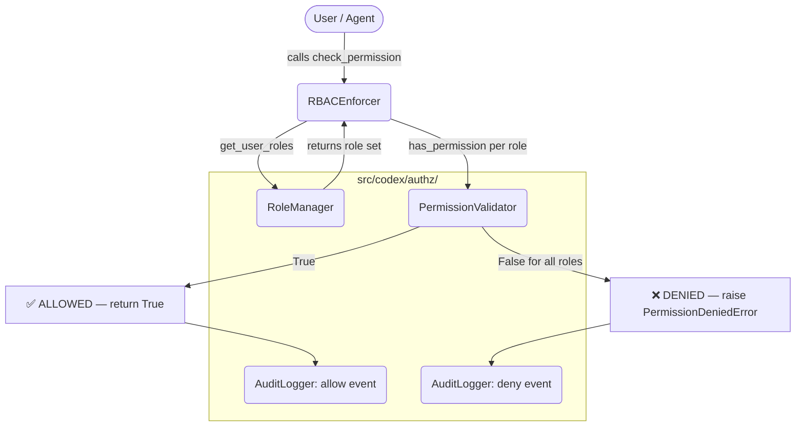

# Phase 12.1 — RBAC Model Design Document

**Track:** 12.1 — Role-Based Access Control  
**Status:** ✅ Implemented  
**Location:** `src/codex/governance/rbac.py`  
**Depends on:** `src/codex/authz/` (Phase 11)

---

## 1. Overview

The Codex RBAC system enforces the principle of least privilege across
every operation performed by human operators, CI pipelines, and autonomous
agents. It defines **seven built-in roles**, a **permission matrix** mapping
each role to the set of (action, resource) pairs it may perform, and a
central `RBACEnforcer` class that delegates to `src/codex/authz/` primitives
to ensure there is a single authoritative enforcement layer.

Zero-trust is the default: if a user holds no role, or their roles do not
cover a requested (action, resource) pair, `PermissionDeniedError` is raised
immediately and the operation is aborted.

---

## 2. Role Hierarchy

```
system_admin
    └── agent_operator
            ├── ci_operator
            └── security_reviewer
    └── doc_maintainer
    └── agent_reader
    └── guest
```

Roles are **additive** — a user may hold multiple roles simultaneously and
the union of their permissions is applied. There is no negative-permission
(deny) mechanism; when any role grants access, access is granted.

| Role | Description |
|------|-------------|
| `system_admin` | Unrestricted access; manages roles and all resources |
| `agent_operator` | Deploy, configure, and execute agents and workflows |
| `ci_operator` | Trigger and approve CI workflows; create reports |
| `security_reviewer` | Approve security-sensitive changes; read secrets |
| `doc_maintainer` | Full CRUD on documentation resources |
| `agent_reader` | Read-only across agents, workflows, code, and reports |
| `guest` | Read-only access to docs and reports only |

---

## 3. Permission Matrix

The matrix below shows which **actions** each role may perform on each
**resource type**. `✓` = permitted, `—` = denied.

Legend — Actions: **C** = create, **R** = read, **U** = update, **D** = delete,
**E** = execute, **A** = approve, **S** = assign (roles only)

| Resource | system_admin | agent_operator | ci_operator | security_reviewer | doc_maintainer | agent_reader | guest |
|----------|:---:|:---:|:---:|:---:|:---:|:---:|:---:|
| **agents** | C R U D E A | C R U E | R E | R | R | R | — |
| **workflows** | C R U D E A | C R U E | R E A | R A | R | R | — |
| **secrets** | C R U D A | R | — | R A | — | — | — |
| **docs** | C R U D A | R | R | R | C R U D | R | R |
| **code** | C R U D A | R U | R | R A | R | R | — |
| **reports** | C R U D | C R | C R | R | R | R | R |
| **roles** | C R U D S | R | R | R | R | R | — |
| **audit_logs** | R | R | R | R | — | — | — |

---

## 4. Resource Types

| Resource | Description | Sensitivity |
|----------|-------------|-------------|
| `agents` | Agent configuration, deployments, metadata | High |
| `workflows` | GitHub Actions / CI workflow definitions | High |
| `secrets` | Credentials, API keys, tokens | Critical |
| `docs` | Documentation files, markdown, wikis | Low |
| `code` | Source code, patches, diffs | Medium |
| `reports` | Audit reports, coverage, security scan results | Medium |
| `roles` | Role assignments and definitions | High |
| `audit_logs` | Immutable audit trail | Critical |

---

## 5. Actions

| Action | Meaning |
|--------|---------|
| `create` | Instantiate a new resource |
| `read` | View or list a resource |
| `update` | Modify an existing resource |
| `delete` | Permanently remove a resource |
| `execute` | Trigger execution (run agent, fire workflow) |
| `approve` | Grant authorisation for a pending change |
| `assign` | Assign/revoke roles (roles resource only) |

---

## 6. Integration with `src/codex/authz/`

```
┌─────────────────────────────────────────┐
│       src/codex/governance/rbac.py       │
│                                         │
│  RBACEnforcer                           │
│    ├── self._role_manager               │ ──► RoleManager (authz)
│    ├── self._permission_validator       │ ──► PermissionValidator (authz)
│    └── self._audit_logger              │ ──► AuditLogger (authz)
└─────────────────────────────────────────┘
```

`RBACEnforcer.__init__()` calls `_bootstrap_roles()` which:

1. Iterates over every `CodexRole`.
2. Converts the permission matrix entry to `"<resource>:<action>"` strings.
3. Creates the role in `RoleManager` with the permission set.
4. Grants each permission string to the role via `PermissionValidator`.

All subsequent `check_permission()` calls go through `PermissionValidator.has_permission()`, keeping the authz layer as the authoritative enforcement surface.

---

## 7. RBAC Flow (Mermaid)



---

## 8. Security Model

### 8.1 Threat Mitigations

| Threat | Mitigation |
|--------|-----------|
| Privilege escalation | Role assignment requires `roles:assign` permission (only `system_admin`) |
| Permission confusion | Single permission matrix in one constant (`_ROLE_PERMISSION_MATRIX`) |
| Bypass via default | No default role; unauthenticated callers have zero permissions |
| Audit evasion | All allow and deny events are written to `AuditLogger` before returning |
| Decorator skip | `@require_permission` raises `TypeError` if `user_id` kwarg is absent |

### 8.2 Secure Defaults

- **Deny-by-default**: Callers receive `PermissionDeniedError` unless an
  explicit grant exists.
- **Immutable matrix**: `_ROLE_PERMISSION_MATRIX` is a module-level constant.
  Runtime changes require explicit `PermissionValidator.grant_permission()` calls.
- **No secret storage**: The RBAC module stores role names and permission
  strings only; credential material is never processed here.

---

## 9. Example Workflows

### 9.1 Code Review Approval

```python
from codex.governance import RBACEnforcer, CodexRole, Action, ResourceType

enforcer = RBACEnforcer()
enforcer.assign_role("alice", CodexRole.SECURITY_REVIEWER)

# Alice reviews and approves a code change
enforcer.check_permission("alice", Action.APPROVE, ResourceType.CODE)
# → True (security_reviewer can approve code)

enforcer.check_permission("alice", Action.DELETE, ResourceType.CODE)
# → PermissionDeniedError (security_reviewer cannot delete code)
```

### 9.2 Secret Rotation Approval

```python
enforcer.assign_role("bob", CodexRole.CI_OPERATOR)

# CI operator cannot read or approve secrets
enforcer.check_permission("bob", Action.READ, ResourceType.SECRETS,
                           raise_on_deny=False)
# → False

enforcer.assign_role("carol", CodexRole.SECURITY_REVIEWER)
enforcer.check_permission("carol", Action.APPROVE, ResourceType.SECRETS)
# → True
```

### 9.3 Agent Deployment Gate

```python
from codex.governance import require_permission

@require_permission(Action.EXECUTE, ResourceType.AGENTS)
def deploy_agent(agent_id: str, *, user_id: str) -> None:
    """Deploy an agent — only agent_operator and system_admin may call this."""
    ...

# agent_operator can deploy
enforcer.assign_role("dave", CodexRole.AGENT_OPERATOR)
deploy_agent("my-agent", user_id="dave")   # succeeds

# guest cannot deploy
enforcer.assign_role("eve", CodexRole.GUEST)
deploy_agent("my-agent", user_id="eve")    # PermissionDeniedError
```

---

## 10. Success Criteria Verification

| Criterion | How Verified |
|-----------|-------------|
| ✅ Full RBAC enforcement | `check_permission()` raises `PermissionDeniedError` on every deny |
| ✅ Zero unauthorized actions | `@require_permission` decorator blocks callers before function body executes |
| ✅ All actions auditable | Every allow/deny/assign/revoke writes to `AuditLogger._data` |
| ✅ Import verification | `python -c "from src.codex.governance.rbac import RBACEnforcer; print('RBAC import OK')"` |

---

## 11. Future Extensions

- **Persistent storage backend**: Replace the in-memory `RoleManager` with
  a SQLite or Redis-backed implementation for multi-process environments.
- **Attribute-Based Access Control (ABAC)**: Extend the matrix to support
  resource-attribute constraints (e.g. "own agents only").
- **Role inheritance**: Implement parent-child role chains so that granting
  `agent_operator` implicitly includes `agent_reader` permissions.
- **JWT integration**: Validate user identity against a JWT claim before
  calling `check_permission()`.
