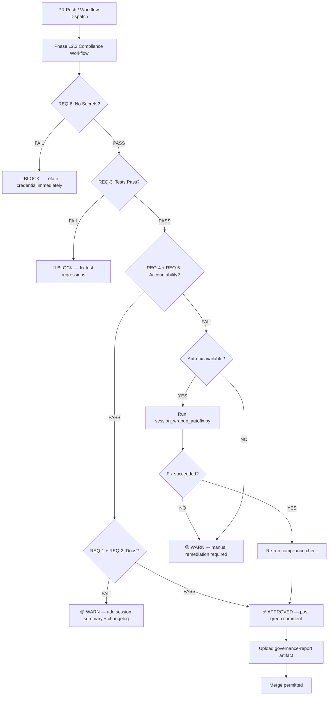

# Phase 12.2 — Governance & Compliance Policy

**Authority:** D-tier autonomous (mbaetiong-approved)
**Version:** 1.0.0
**Effective Date:** 2026-01-01
**Scope:** Aries-Serpent/_codex_ — 147-agent ecosystem

---

## 1. Purpose and Scope

This document defines the authoritative governance and compliance policy for the
`_codex_` repository's 147-agent AI ecosystem. It establishes enforceable rules
for session accountability, code quality, secret management, CI/CD gate operation,
and pull-request lifecycle management.

All agents operating in this repository are bound by this policy. Violations
trigger the remediation procedures described in Section 9.

---

## 2. Governance Framework Overview

The governance model is built on three pillars:

| Pillar | Scope | Enforcement |
|--------|-------|-------------|
| **Session Accountability** | REQ-1 to REQ-6 | `session_wrapup_autofix.py`, compliance dashboard |
| **Operational Safety** | Network, secrets, agentic autonomy | `AGENTS.md`, `CODEBASE_AGENCY_POLICY.md` |
| **CI/CD Quality Gate** | Tests, lint, type-check, SBOM | Workflow matrix in `.github/workflows/` |

---

## 3. REQ-1 through REQ-6: Definitions and Enforcement

Each session that commits code to the repository must satisfy all six requirements
before the branch is considered compliant. These requirements are checked
automatically by `scripts/ci/phase_12_2_compliance_dashboard.py`.

### REQ-1 — Session Summary Exists

**Definition:** A session summary file must exist in `.codex/sessions/` for the
current session. The file must be a valid Markdown (`.md`) document containing at
minimum a date stamp, the agent identity, and a brief description of changes made.

**Enforcement:** The compliance dashboard scans `.codex/sessions/` for files
modified or created within the look-back window (default: last 30 days). A session
with zero matching files fails REQ-1.

**Remediation:** Create a summary file at `.codex/sessions/<session-id>.md` before
the branch is merged.

---

### REQ-2 — CHANGELOG Updated

**Definition:** The root `CHANGELOG.md` must be updated in the last commit that
modifies source files. The `## [Unreleased]` section must contain at least one
entry describing the changes in the current session.

**Enforcement:** The compliance dashboard calls `git log -1 --name-only` and
verifies that `CHANGELOG.md` appears in the changed files. If the last commit
touched only infrastructure files (e.g., `*.yml` workflow files) the check is
relaxed to look back two commits.

**Remediation:** Append a bullet under `## [Unreleased]` in `CHANGELOG.md`
describing the changes, then amend the commit or add a follow-up commit.

---

### REQ-3 — Tests Pass

**Definition:** No new test failures may be introduced by commits on the branch.
The baseline is the last green build on the `main` branch. A regression is defined
as a test that was passing on `main` and is now failing on the current branch.

**Enforcement:** The compliance dashboard checks the most recent CI run status via
`gh run list` and parses the result. Locally it attempts `pytest --tb=no -q` with a
60-second timeout as a best-effort check.

**Remediation:** Fix failing tests before requesting review. If a test is
legitimately flaky, mark it `@pytest.mark.flaky` and open an issue linking the
evidence.

---

### REQ-4 — Agent Accountability Report Updated

**Definition:** The file `docs/accountability/AGENT_ACCOUNTABILITY_REPORT.md` must
be updated in the last commit. At minimum one new entry must describe what the agent
did, why, and the outcome.

**Enforcement:** The compliance dashboard calls `git log -1 --name-only` and checks
for `AGENT_ACCOUNTABILITY_REPORT.md` in the diff. If absent,
`session_wrapup_autofix.py` may be invoked to auto-fix.

**Remediation:** Run `python scripts/ci/session_wrapup_autofix.py --fix-accountability`
or manually append an entry following the template in `.codex/AGENT_ACCOUNTABILITY_REPORT_INDEX_TEMPLATE.md`.

---

### REQ-5 — CHANGELOG in Last Commit

**Definition:** `CHANGELOG.md` must appear in the files changed by the **most recent**
commit (not just any recent commit). This is a stricter subset of REQ-2.

**Enforcement:** `git show --name-only HEAD` is parsed for the presence of
`CHANGELOG.md`. This runs on every push in the compliance workflow.

**Remediation:** Run `python scripts/ci/session_wrapup_autofix.py --fix-changelog`
or add a manual CHANGELOG entry and amend/re-commit.

---

### REQ-6 — No Secrets Committed

**Definition:** No credentials, API keys, tokens, or other secrets may be present in
any file committed to the repository. This includes test fixtures and documentation.

**Enforcement:** `detect-secrets scan` runs against the diff of the PR using the
baseline at `.secrets.baseline`. Any NEW finding (not in the baseline) causes an
immediate BLOCK. The compliance dashboard shells out to `detect-secrets` if
available, otherwise runs a regex heuristic scan.

**Remediation:** Remove the secret, rotate the credential, and update `.secrets.baseline`
following the procedure in `SECURITY.md`. Never push a `# pragma: allowlist secret`
comment without a linked security review issue.

---

## 4. Agent Operation Policies

### 4.1 Auto-Approve Conditions

An agent action is automatically approved (no human review required) when ALL of the
following hold:

1. All CI checks are green (no failures, warnings permitted).
2. The change touches **no** owner-gated files (see §4.2).
3. REQ-1 through REQ-6 are all satisfied.
4. The PR diff is ≤ 500 lines changed.
5. No new external dependencies are introduced.

### 4.2 Owner-Gated Files (Require @mbaetiong Review)

| Path Pattern | Reason |
|---|---|
| `.github/workflows/**` | Workflow changes can alter CI trust boundary |
| `src/codex_ml/security/**` | Security-critical code |
| `requirements/lock.txt` | Supply chain risk |
| `scripts/ci/session_wrapup_autofix.py` | Compliance gate itself |
| `.codex/CODEBASE_AGENCY_POLICY.md` | Governance policy |
| `pyproject.toml` (dependency section) | Supply chain risk |

### 4.3 Prohibited Agent Statements

The compliance pillar scans the PR body for prohibited deferral phrases. Any match
causes an immediate BLOCK:

- "This is not related to my PR"
- "These are pre-existing issues"
- "My PR only adds files to X"
- "Out of scope for this session"

---

## 5. Branch and PR Governance Rules

### 5.1 Branch Naming

All agent-created branches must follow the pattern:

```
copilot/<short-description>[-<issue-number>]
```

Human branches follow standard conventions (`feat/`, `fix/`, `chore/` etc.).

### 5.2 PR Lifecycle

| Stage | Requirement | Automated? |
|-------|-------------|-----------|
| Draft opened | All CI must be green within 10 min | No — agent responsibility |
| Ready for Review | REQ-1..REQ-6 all pass | Yes — compliance workflow |
| Approved | Owner review if gated files changed | Semi — CODEOWNERS |
| Merge | Squash-merge only from `main` | Yes — branch protection |
| Post-merge | Session summary archived | No — agent responsibility |

### 5.3 Branch Protection Rules

The `main` branch enforces:

- Require pull request reviews before merging (1 approval minimum).
- Require status checks: `cognitive-preflight`, `phase-12-2-compliance-check`.
- Require branches to be up to date before merging.
- No force-push. No deletion.

---

## 6. Secret Management Governance

1. **Zero-tolerance policy**: No exceptions for "temporary" or "test" secrets.
2. **Rotation SLA**: Exposed secrets must be rotated within 4 hours of discovery.
3. **Baseline management**: `.secrets.baseline` is updated only via PR with security review label.
4. **Environment variables**: All runtime secrets are stored as GitHub Actions secrets or repository variables, never in code.
5. **Scanning cadence**: `detect-secrets` runs on every PR push and weekly on `main`.

---

## 7. CI/CD Governance Gates

The following gates must pass before any branch can be merged to `main`:

| Gate | Workflow | Block? |
|------|----------|--------|
| Phase 12.2 Compliance | `phase-12-2-compliance-check.yml` | Yes |
| Cognitive Preflight | `cognitive-preflight.yml` | Yes |
| Unit Tests | `ci.yml` | Yes |
| Secret Scan | `secret-scan.yml` | Yes |
| CodeQL | `codeql.yml` | Yes (critical severity) |
| Mypy | `ci.yml` | Warning only |

**SLA:** All automated gates must complete within **5 minutes** (p95). Violations
trigger an alert to the workflow health monitor.

---

## 8. Compliance SLA

| Check Type | Target Completion | Alert Threshold |
|---|---|---|
| REQ-1..REQ-6 automated scan | < 2 minutes | > 5 minutes |
| Full compliance report generation | < 3 minutes | > 5 minutes |
| Secret scan (diff only) | < 1 minute | > 3 minutes |
| PR comment posting | < 30 seconds | > 2 minutes |

---

## 9. Violation Handling Procedures

### 9.1 Severity Levels

| Level | Definition | Response Time |
|-------|-----------|---------------|
| **P1 — Critical** | REQ-6 (secret exposed) or security vulnerability | Immediate; branch locked |
| **P2 — High** | REQ-3 (test regression) | Within 1 hour |
| **P3 — Medium** | REQ-4 or REQ-5 (accountability) | Within 4 hours (auto-fix available) |
| **P4 — Low** | REQ-1 or REQ-2 (documentation) | Within 24 hours |

### 9.2 Auto-Remediation

For P3 and P4 violations, `session_wrapup_autofix.py` provides automated remediation:

```bash
python scripts/ci/session_wrapup_autofix.py \
    --pr-number <PR> \
    --fix-accountability \
    --fix-changelog
```

For P1 and P2, human intervention is required.

### 9.3 Escalation Path

```
Agent detects violation
  → Auto-fix attempted (if P3/P4)
  → If auto-fix succeeds: re-run compliance check, post green comment
  → If auto-fix fails or P1/P2: open GitHub issue with label ci-health-alert
  → Assign to @mbaetiong for human resolution
```

---

## 10. Governance Enforcement Flow



---

## 11. Governance Report Artifact

Every compliance workflow run uploads `governance-report.json` as a CI artifact
retained for 30 days. The JSON schema is:

```json
{
  "governance_status": "APPROVED | WARN | BLOCK",
  "compliance_score": 1.0,
  "timestamp": "ISO-8601",
  "requirements": {
    "REQ-1": {"passed": true, "details": "..."},
    "REQ-2": {"passed": true, "details": "..."},
    "REQ-3": {"passed": true, "details": "..."},
    "REQ-4": {"passed": true, "details": "..."},
    "REQ-5": {"passed": true, "details": "..."},
    "REQ-6": {"passed": true, "details": "..."}
  },
  "violations": [],
  "warnings": [],
  "remediation": []
}
```

---

## 12. Related Documents

| Document | Purpose |
|---|---|
| `AGENTS.md` | Agent operational constraints (network, offline mode) |
| `.codex/CODEBASE_AGENCY_POLICY.md` | AI agency policy |
| `SECURITY.md` | Secret management procedures |
| `scripts/ci/session_wrapup_autofix.py` | Auto-remediation for REQ-4/5 |
| `scripts/ci/phase_12_2_compliance_dashboard.py` | Compliance dashboard |
| `docs/accountability/AGENT_ACCOUNTABILITY_REPORT.md` | Accountability log |

---

*This document is maintained by the Unified Governance Gate agent. Changes require
owner review (@mbaetiong) per §4.2.*
