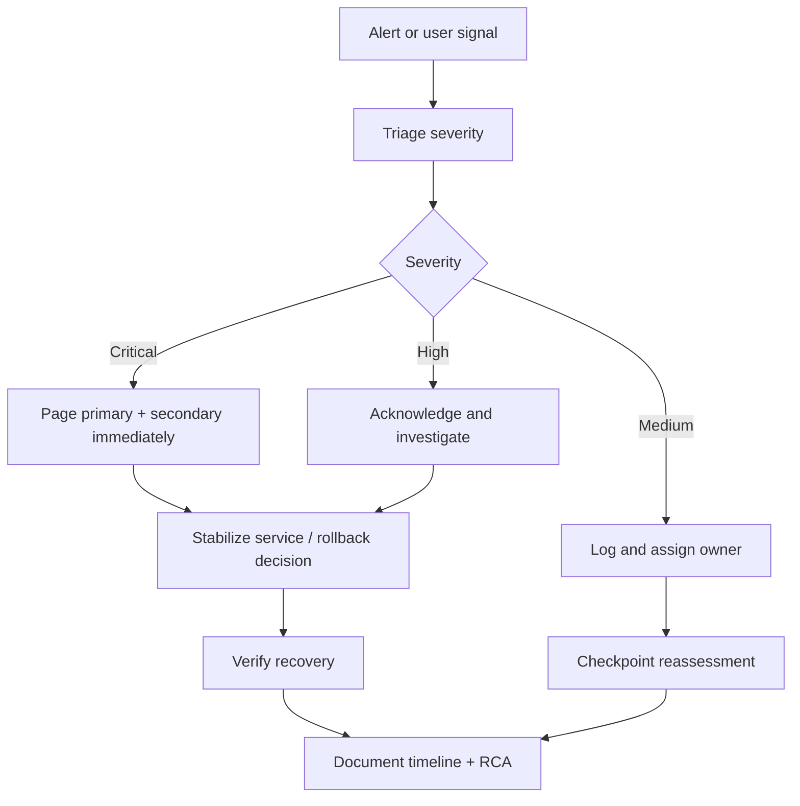

# Phase 12 Incident Response Framework

**Session:** 6 — Phases 2-5 orchestration  
**Phase:** 3 — Incident Response Activation  
**Planned Window:** 2026-07-20T02:00:00Z → 2026-07-20T10:00:00Z  
**Scope:** Activation framework and runbook requirements only

---

## 1. Objective

Ensure the production traffic ramp and 24-hour validation windows are protected by active monitoring, staffed escalation paths, tested alerting, and clear remediation / rollback procedures.

## 2. Monitoring Dashboard Configuration Requirements

### Required Dashboards
- **System Overview** — request rate, error rate, uptime, active incidents
- **Performance** — latency p50/p95/p99, throughput, percentile variance
- **Infrastructure Health** — CPU, memory, network I/O, instance health, restarts
- **Data Plane** — DB pool usage, replication lag, query latency, cache hit rate
- **Security & Compliance** — auth failures, policy violations, suspicious traffic, secrets/PII incidents
- **Incidents & Alerts** — active alerts, acknowledged alerts, escalation timer, MTTA/MTTR

### Configuration Standards
- Refresh interval: **1 minute** for live dashboards
- Annotation stream required for release markers and traffic changes
- Source health panel required for Prometheus/log pipeline availability
- Alert status panel required for acknowledged vs unacknowledged alerts
- Dashboard ownership and backup owner documented
- Read access for incident responders; edit access limited to owners

## 3. On-Call Rotation Setup Checklist

- [ ] Primary incident commander assigned
- [ ] Secondary on-call assigned and reachable
- [ ] DB / infra specialist listed as escalation contact
- [ ] Security contact listed for auth / abuse / compliance events
- [ ] PagerDuty / Slack / email routing tested
- [ ] Handoff note published before 2026-07-20T02:00:00Z
- [ ] Escalation tree pinned in incident channel
- [ ] Rollback approver identified
- [ ] Coverage confirmed through 2026-07-21T06:00:00Z

## 4. SLA Configuration

| Severity | First acknowledgement target | Initial triage target | Mitigation target | Typical examples |
|---|---:|---:|---:|---|
| **CRITICAL** | <2 min | <5 min | Immediate / rollback-ready | service down, data corruption, auth outage |
| **HIGH** | <5 min | <10 min | <30 min | sustained elevated errors, severe latency, capacity loss |
| **MEDIUM** | <30 min | <60 min | same shift | transient error spike, minor subsystem degradation |
| **LOW** | best effort | next checkpoint | backlog | noisy signal, informational anomaly |

## 5. Incident Response Procedures and Runbooks

### Response Flow


### Standard Procedure
1. Detect and classify the signal.
2. Start incident clock and assign incident commander.
3. Capture diagnostics: metrics, logs, deployment markers, topology health.
4. Contain blast radius (pause ramp, scale, isolate dependency, or rollback).
5. Verify customer impact reduction.
6. Communicate status every 15 minutes for Critical/High incidents.
7. Close only after recovery is verified and follow-up actions are recorded.

### Required Runbooks
- Service unavailable / health check failures
- High error rate / failed requests spike
- High latency / resource exhaustion
- DB replication lag / connection saturation
- Cache degradation / invalidation cascade
- Telemetry outage / monitoring blindness
- Security event / suspicious auth spike
- Rollback execution and recovery verification

## 6. Alert Rule Templates

| Rule ID | Alert | Condition | Severity | Required action |
|---|---|---|---|---|
| IR-001 | ServiceDown | healthy instances <95% or endpoint probe fails | Critical | Pause ramp + assess rollback |
| IR-002 | HighErrorRate | error rate ≥1.0% for 5 min | Critical | Page IC + rollback decision |
| IR-003 | ErrorRateWarning | error rate >0.05% and <1.0% | High | Hold promotion, investigate |
| IR-004 | LatencySpike | p99 ≥2000ms for 5 min or p95 variance >10% | Critical/High | Investigate capacity / rollback |
| IR-005 | ResourcePressure | CPU or memory >80% for 10 min | High | Scale / tune / hold |
| IR-006 | DBStress | replication lag >250ms or pool >80% | Critical/High | Protect writes / rollback |
| IR-007 | CacheRegression | cache hit rate <95% for 10 min | High | Investigate cache path |
| IR-008 | TelemetryBlind | missing critical metrics >10 min | Critical | Freeze changes, restore visibility |
| IR-009 | SecuritySignal | auth failures spike, abuse, or policy violation | Critical/High | Security-led investigation |

### Alert Template
```yaml
alert: [RULE_NAME]
expr: [PROMQL OR SOURCE QUERY]
for: [DURATION]
labels:
  severity: [critical|high|medium]
  service: production-v0.2.0
  phase: phase-12
annotations:
  summary: "[short description]"
  runbook: ".codex/PHASE_12_INCIDENT_RESPONSE_FRAMEWORK.md#[section-anchor]"
  action: "[pause ramp / investigate / rollback]"
```

## 7. Validation Test Procedures

- [ ] Synthetic alert fires and routes to primary on-call
- [ ] Secondary escalation triggers when unacknowledged
- [ ] Dashboard refresh and annotation stream verified
- [ ] Log search can isolate failing request within 2 minutes
- [ ] Rollback drill command path validated (dry run)
- [ ] Incident template / war-room notes accessible
- [ ] SLA timer visible in incident dashboard
- [ ] Alert silence / maintenance mode tested and reversible

## 8. Subsystem Health Check Matrix

| Subsystem | Primary signal | Healthy state | Escalate when | Owner |
|---|---|---|---|---|
| Load balancer / ingress | route success, 2xx rate | target weights match plan | weight drift, probe failures | workflow-health-monitor |
| Application fleet | instance health, restarts | 100% healthy, no crash loops | <95% healthy or restart spike | artifact-monitor-agent |
| API latency | p95/p99 latency | within baseline + thresholds | p95 variance >5%, p99 >2s | performance-monitor-agent |
| Database | lag, pool, query latency | lag <100ms, pool <20% | lag >250ms or pool >80% | ci-emergency-response-agent |
| Cache | hit rate, eviction noise | ≥97% hit rate | <95% sustained | cache-management-agent |
| Telemetry | scrape success, ingestion | 100% critical metrics present | gap >10 min | workflow-health-monitor |
| Security | auth failures, policy events | no critical events | suspicious spike / policy violation | unified-security-scanner |
| Release artifacts | version markers | expected build/live version match | mixed-version fleet unexpectedly | claim-verification-agent |

## 9. Incident Log Template

```markdown
## Incident #[ID]
- Opened: [YYYY-MM-DDTHH:MM:SSZ]
- Severity: [Critical / High / Medium / Low]
- Phase: [Traffic Ramp / Post-Deployment Validation]
- Incident commander: [NAME]
- Trigger: [alert rule / manual report]
- Customer impact: [describe]

### Timeline
- T+00: [alert acknowledged]
- T+02: [initial diagnostics]
- T+05: [mitigation decision]
- T+XX: [resolved]

### Evidence
- Dashboard links: [fill]
- Logs / traces: [fill]
- Metrics snapshot: [fill]

### Resolution
- Action taken: [scale / config / rollback / no-op]
- Recovery verified at: [timestamp]
- Follow-up items: [fill]
```

## 10. Exit Criteria

- [ ] Dashboards live and annotated
- [ ] Alert rules armed and tested
- [ ] On-call rotation verified
- [ ] SLA timers documented and visible
- [ ] Rollback runbook linked in alerts
- [ ] Incident template ready for live use
