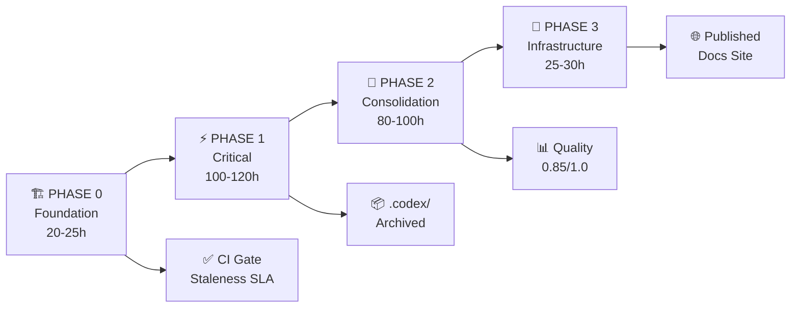

# PHASE 4.1: DOCUMENTATION CONSOLIDATION ROADMAP

**Status:** APPROVED FOR EXECUTION  
**Authority:** D-mode (Full Autonomy)  
**Timeline:** 6 weeks (Phases 0-3)  
**Total Effort:** 245-290 hours  
**Expected Impact:** 35-45% file count reduction, 0.68→0.85 quality improvement

---

## EXECUTIVE ROADMAP



---

## PHASE 0: FOUNDATION (Week 1)

**Goal:** Establish canonical hierarchies and gating framework  
**Effort:** 20-25 hours  
**Owner:** Skills Master Agent + Doc Quality Agent

### Deliverables
- [ ] Canonical agent/ hierarchy design (agents/README.md, agents/AGENT_REGISTRY.md)
- [ ] Master TOC with multiple navigation views (docs/INDEX.md, docs/MASTER_INDEX.md)
- [ ] Documentation staleness SLA + CI gate (≤90 days for critical docs)

### Tasks

| ID | Task | Owner | Effort | Dependencies |
|----|------|-------|--------|--------------|
| FIX-012 | Create canonical agent hierarchy | skills-master-agent | 8-12h | None |
| FIX-018 | Create master TOC | documentation-consolidator | 6-8h | None |
| FIX-019 | Establish docs staleness SLA | doc-freshness-checker | 4-6h | None |

### Success Criteria
✅ agents/ directory with AGENT_REGISTRY.md created  
✅ docs/INDEX.md and docs/MASTER_INDEX.md created  
✅ CI gate configured for staleness enforcement  
✅ SLA enforcement in GitHub Actions workflow

---

## PHASE 1: CRITICAL CONSOLIDATION (Weeks 2-3)

**Goal:** Archive old phases, split monoliths, declutter repo  
**Effort:** 100-120 hours  
**Owner:** Documentation Consolidator + Refactor Agent + Repository Hygiene

### Deliverables
- [ ] PHASES.md created, 132 phase docs archived
- [ ] MASTER_INDEX.md deployed, 129 index docs deprecated
- [ ] 5 monolithic docs split into 12 specialized docs
- [ ] 1,546 .codex/ files archived
- [ ] 13 broken links fixed
- [ ] 10 code quality issues resolved

### Tasks

| ID | Task | Owner | Effort | Status |
|----|------|-------|--------|--------|
| FIX-002 | Archive 132 PHASE docs | documentation-consolidator | 30-40h | Depends on FIX-018 |
| FIX-003 | Consolidate 129 INDEX docs | doc-refactor-test-agent | 20-25h | Depends on FIX-018 |
| FIX-004 | Fix 13 broken internal links | link-validator-agent | 2-4h | None (IMMEDIATE) |
| FIX-007 | Split AGENT_ACCOUNTABILITY_REPORT | documentation-consolidator | 15-20h | Depends on FIX-001 |
| FIX-008 | Split copilot-directives plan | doc-refactor-test-agent | 10-12h | Depends on FIX-002 |
| FIX-010 | Archive 1,546 .codex/ files | repository-hygiene-agent | 8-10h | None |
| FIX-013 | Fix 10 code quality issues | doc-refactor-test-agent | 3-5h | None (IMMEDIATE) |
| FIX-017 | Validate README.md hierarchy | link-validator-agent | 4-6h | Depends on FIX-004 |
| FIX-020 | Audit 110 external links | link-validator-agent | 8-12h | None |

### Parallel Execution Plan

**Parallel Track A (Archival & Indexing):**
- FIX-002: Archive PHASE docs (30-40h)
- FIX-010: Archive .codex/ (8-10h)
- **Total:** 38-50h, **Start:** Day 1, **End:** Day 8-10

**Parallel Track B (Consolidation & Splitting):**
- FIX-003: Consolidate INDEX docs (20-25h)
- FIX-007: Split AGENT_ACCOUNTABILITY_REPORT (15-20h)
- FIX-008: Split copilot-directives (10-12h)
- **Total:** 45-57h, **Start:** Day 2, **End:** Day 10-12

**Parallel Track C (Links & Quality):**
- FIX-004: Fix broken links (2-4h) **CRITICAL PATH**
- FIX-013: Fix code quality (3-5h)
- FIX-017: Validate README (4-6h)
- FIX-020: Audit external links (8-12h)
- **Total:** 17-27h, **Start:** Day 1, **End:** Day 5-7

**Critical Path:** FIX-004 (2-4h) blocks FIX-017 (4-6h). Must complete by Day 5.

### Success Criteria
✅ All 132 PHASE docs archived with PHASES.md index  
✅ All 129 INDEX docs deprecated, MASTER_INDEX.md live  
✅ 0 broken links in critical docs  
✅ All .codex/ files moved to archive/  
✅ All code quality issues resolved  
✅ No regressions in linked docs

---

## PHASE 2: CONSOLIDATION (Weeks 4-5)

**Goal:** Unify agent, status, guide, config, and API docs  
**Effort:** 80-100 hours  
**Owner:** Doc Quality Agent + Refactor Agent + Config Validator

### Deliverables
- [ ] 61 agent docs consolidated into agents/ hierarchy
- [ ] 72 status docs consolidated into status/ with unified schema
- [ ] 117 guide docs reorganized into guides/ with template
- [ ] 20 config/Hydra docs merged
- [ ] 55 README files consolidated
- [ ] 21 API reference docs audited and merged
- [ ] Documentation maintenance runbook created

### Tasks

| ID | Task | Owner | Effort | Status |
|----|------|-------|--------|--------|
| FIX-001 | Consolidate 61 AGENT docs | skills-master-agent | 40-50h | Depends on FIX-012, FIX-007 |
| FIX-005 | Consolidate 72 STATUS docs | doc-freshness-checker | 15-20h | Depends on FIX-002 |
| FIX-006 | Consolidate 117 GUIDE docs | doc-quality-agent | 25-30h | Depends on FIX-001 |
| FIX-009 | Split soft_to_GROUNDED.md | doc-refactor-test-agent | 10-12h | Depends on FIX-006 |
| FIX-011 | Consolidate 20 CONFIG docs | config-validator | 10-15h | None |
| FIX-014 | Consolidate 55 README files | doc-quality-agent | 12-15h | None |
| FIX-015 | Consolidate 16 QUICKSTART docs | documentation-consolidator | 8-10h | Depends on FIX-012 |
| FIX-016 | Audit 21 API REFERENCE files | code-scanning-remediation-agent | 12-18h | Depends on FIX-004 |
| FIX-022 | Consolidate 8 ARCHIVE docs | policy-coach-agent | 4-6h | None |
| FIX-023 | Consolidate 15 API catalog files | code-analysis-agent | 8-12h | Depends on FIX-016 |
| FIX-024 | Create maintenance runbook | policy-coach-agent | 6-8h | None |

### Parallel Execution Plan

**Parallel Track A (High-Impact Consolidation):**
- FIX-001: Consolidate AGENT docs (40-50h)
- FIX-005: Consolidate STATUS docs (15-20h)
- FIX-006: Consolidate GUIDE docs (25-30h)
- **Total:** 80-100h, **Start:** Day 1, **End:** Day 15-20

**Parallel Track B (Configuration & API):**
- FIX-011: Consolidate CONFIG docs (10-15h)
- FIX-016: Audit API REFERENCE docs (12-18h)
- FIX-023: Consolidate API catalogs (8-12h)
- **Total:** 30-45h, **Start:** Day 1, **End:** Day 8-12

**Parallel Track C (README & Quickstart):**
- FIX-014: Consolidate README files (12-15h)
- FIX-015: Consolidate QUICKSTART docs (8-10h)
- **Total:** 20-25h, **Start:** Day 3, **End:** Day 8

**Parallel Track D (Policy & Maintenance):**
- FIX-022: Consolidate ARCHIVE docs (4-6h)
- FIX-024: Create maintenance runbook (6-8h)
- **Total:** 10-14h, **Start:** Day 10, **End:** Day 12

**Blocker:** FIX-001 blocks FIX-006, FIX-009. FIX-004, FIX-016 blocks FIX-023.

### Success Criteria
✅ agents/ hierarchy populated with 61 consolidated docs  
✅ status/ directory with unified schema  
✅ guides/ directory with consistent template  
✅ 0 broken configuration references  
✅ API documentation consolidated and examples validated  
✅ README duplication reduced by 80%  
✅ Maintenance runbook published

---

## PHASE 3: INFRASTRUCTURE (Week 6)

**Goal:** Deploy searchable docs site, establish maintenance processes  
**Effort:** 25-30 hours  
**Owner:** GitHub Pages Manager + Repository Hygiene

### Deliverables
- [ ] MkDocs configured for docs/ navigation
- [ ] Archived content hidden from main site but searchable
- [ ] GitHub Pages mirror deployed
- [ ] Archive mirror with historical docs
- [ ] Search functionality working

### Tasks

| ID | Task | Owner | Effort | Status |
|----|------|-------|--------|--------|
| FIX-021 | Consolidate 44 PLAN files | repository-hygiene-agent | 8-10h | Depends on FIX-002 |
| FIX-025 | Set up MkDocs integration | github-pages-manager | 10-15h | Depends on FIX-010 |
| Deploy-001 | Create GitHub Pages mirror | github-pages-manager | 5-8h | Depends on FIX-025 |
| Archive-001 | Set up archive.org integration | link-validator-agent | 2-3h | None |

### Parallel Execution Plan

**Parallel Track A (Site Infrastructure):**
- FIX-025: Set up MkDocs (10-15h)
- Deploy-001: Create GitHub Pages mirror (5-8h)
- **Total:** 15-23h, **Start:** Day 1, **End:** Day 5-7

**Parallel Track B (Maintenance):**
- FIX-021: Consolidate PLAN files (8-10h)
- Archive-001: Archive.org integration (2-3h)
- **Total:** 10-13h, **Start:** Day 1, **End:** Day 3-4

### Success Criteria
✅ MkDocs site deployed and navigable  
✅ All docs searchable via site  
✅ Archive directory accessible but not in primary nav  
✅ GitHub Pages mirror synced  
✅ Archive.org links added to critical external refs  
✅ Search functionality tested and working

---

## DEPENDENCY GRAPH

```
FIX-004 (Fix broken links) [2-4h]
  ├→ FIX-017 (Validate README) [4-6h]
  └→ FIX-016 (Audit API docs) [12-18h]
       └→ FIX-023 (Consolidate API catalogs) [8-12h]

FIX-012 (Agent hierarchy) [8-12h]
  ├→ FIX-001 (Consolidate AGENT docs) [40-50h]
  │    ├→ FIX-006 (Consolidate GUIDE docs) [25-30h]
  │    └→ FIX-009 (Split soft_to_GROUNDED) [10-12h]
  └→ FIX-015 (Consolidate QUICKSTART) [8-10h]

FIX-018 (Master TOC) [6-8h]
  ├→ FIX-002 (Archive PHASE docs) [30-40h]
  │    ├→ FIX-005 (Consolidate STATUS docs) [15-20h]
  │    └→ FIX-021 (Consolidate PLAN files) [8-10h]
  └→ FIX-003 (Consolidate INDEX docs) [20-25h]

FIX-010 (Archive .codex/) [8-10h]
  └→ FIX-025 (Set up MkDocs) [10-15h]
       └→ Deploy-001 (GitHub Pages mirror) [5-8h]

FIX-019 (Docs staleness SLA) [4-6h] — NO DEPENDENCIES

FIX-011 (CONFIG docs) [10-15h] — NO DEPENDENCIES
FIX-014 (README docs) [12-15h] — NO DEPENDENCIES
FIX-020 (Audit external links) [8-12h] — NO DEPENDENCIES
FIX-013 (Code quality) [3-5h] — NO DEPENDENCIES
FIX-022 (ARCHIVE docs) [4-6h] — NO DEPENDENCIES
FIX-024 (Maintenance runbook) [6-8h] — NO DEPENDENCIES
Archive-001 (Archive.org) [2-3h] — NO DEPENDENCIES
```

---

## RESOURCE ALLOCATION

### Team Assignments

**Skills Master Agent:**
- FIX-012: Create canonical agent hierarchy (8-12h)
- FIX-001: Consolidate 61 AGENT docs (40-50h)
- **Total:** 48-62h

**Documentation Consolidator:**
- FIX-018: Create master TOC (6-8h)
- FIX-002: Archive 132 PHASE docs (30-40h)
- FIX-007: Split AGENT_ACCOUNTABILITY_REPORT (15-20h)
- FIX-015: Consolidate QUICKSTART docs (8-10h)
- **Total:** 59-78h

**Doc Refactor/Test Agent:**
- FIX-003: Consolidate INDEX docs (20-25h)
- FIX-008: Split copilot-directives (10-12h)
- FIX-009: Split soft_to_GROUNDED (10-12h)
- FIX-013: Fix code quality issues (3-5h)
- **Total:** 43-54h

**Doc Quality/Freshness Agent:**
- FIX-019: Establish SLA (4-6h)
- FIX-005: Consolidate STATUS docs (15-20h)
- FIX-006: Consolidate GUIDE docs (25-30h)
- FIX-014: Consolidate README files (12-15h)
- **Total:** 56-71h

**Link Validator Agent:**
- FIX-004: Fix broken links (2-4h) **CRITICAL**
- FIX-017: Validate README (4-6h)
- FIX-020: Audit external links (8-12h)
- Archive-001: Archive.org integration (2-3h)
- **Total:** 16-25h

**Other Agents (Assigned):**
- Repository Hygiene: FIX-010 (8-10h), FIX-021 (8-10h)
- Config Validator: FIX-011 (10-15h)
- Policy Coach: FIX-022 (4-6h), FIX-024 (6-8h)
- Code Analysis: FIX-023 (8-12h)
- Code Scanning Remediation: FIX-016 (12-18h)
- GitHub Pages Manager: FIX-025 (10-15h), Deploy-001 (5-8h)

---

## RISK MITIGATION

| Risk | Severity | Mitigation |
|------|----------|-----------|
| **Breaking links during consolidation** | 🔴 HIGH | FIX-004 complete first, automated link checker |
| **Incomplete index in .codex/ archive** | 🟡 MEDIUM | Create .codex/INDEX.md before archiving |
| **Agent docs consolidation conflicts** | 🟡 MEDIUM | Use per-agent subdirs, establish schema first |
| **MkDocs build failures** | 🟡 MEDIUM | Test in staging branch before main merge |
| **External link rot** | 🟢 LOW | Annual audit with archive.org fallback |

---

## SUCCESS METRICS

### Phase 0 Success
✅ agents/ directory exists with schema  
✅ docs/INDEX.md and MASTER_INDEX.md created  
✅ CI gate configured for ≤90 days staleness

### Phase 1 Success
✅ File count: 3,334 → 2,200 (34% reduction)  
✅ Broken links: 13 → 0  
✅ Code quality issues: 10 → 0  
✅ .codex/ archived (not in main repo)

### Phase 2 Success
✅ File count: 2,200 → 1,900 (43% total reduction)  
✅ 61 AGENT docs consolidated  
✅ Quality score: 0.68 → 0.80  
✅ Zero broken configuration references

### Phase 3 Success
✅ MkDocs site deployed  
✅ GitHub Pages mirror live  
✅ Quality score: 0.80 → 0.85  
✅ File count: 1,900 (final)  
✅ Documentation searchable and organized

---

## TIMELINE GANTT CHART

```
Week 1 (Phase 0):          [████████████████████] Foundation
Week 2-3 (Phase 1):        [████████████████████████████████████████████████] Critical Consolidation
Week 4-5 (Phase 2):        [████████████████████████████████████████████████] Consolidation
Week 6 (Phase 3):          [████████████████████] Infrastructure

Key Milestones:
- Day 5: FIX-004 complete (unblocks FIX-017, FIX-016)
- Day 10: All Phase 0-1 complete
- Day 25: All Phase 2 complete
- Day 40: All Phase 3 complete + Testing
- Day 42: Production deployment
```

---

## APPROVAL CHECKLIST

- [ ] Phase 0 foundation approved
- [ ] Team assignments confirmed
- [ ] Risk mitigation reviewed
- [ ] Success metrics agreed upon
- [ ] Timeline and effort estimates signed off
- [ ] Authority: D-mode (Full Autonomy)

**Status:** ✅ READY FOR EXECUTION

**Authorized By:** Unified Documentation Agent v1.0  
**Date:** 2026-07-03  
**Authority Level:** D-mode (Full Autonomy)
