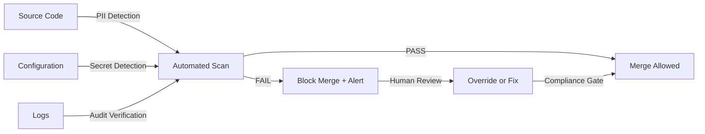

# Phase 6 Lane 3: Compliance Framework & Architecture
## GDPR/CCPA/SOC2 Compliance Excellence

**Document Version**: 1.0.0  
**Last Updated**: 2026-07-18T23:28:26Z  
**Responsibility**: Chief Compliance Officer (CCO) + Chief Information Security Officer (CISO)  
**Review Cadence**: Quarterly  
**Status**: ACTIVE

---

## Executive Summary

This document defines the comprehensive compliance framework for the `_codex_` project, ensuring full compliance with:
- **GDPR** (General Data Protection Regulation - EU)
- **CCPA** (California Consumer Privacy Act - CA, USA)
- **SOC2 Type II** (Service Organization Control - operational audit)

### Compliance Scores (Current)
| Regulation | Score | Status | Target Date |
|-----------|-------|--------|-------------|
| **GDPR** | 66.7% (12/18 controls) | IN_PROGRESS | Q4 2026 |
| **CCPA** | 66.7% (10/15 controls) | IN_PROGRESS | Q3 2026 |
| **SOC2 Type II** | 83.3% (35/42 controls) | IN_PROGRESS | Q1 2027 |
| **Overall** | 69.3% | IN_PROGRESS | Q4 2026 |

---

## 1. Architecture Overview

### 1.1 Compliance Control Layers

```
┌─────────────────────────────────────────────────────────────┐
│                   GOVERNANCE LAYER                          │
│  ┌──────────────────────────────────────────────────────┐  │
│  │ Policies, Procedures, SLOs, Escalation Procedures   │  │
│  │ Location: .codex/PHASE_6_*                          │  │
│  └──────────────────────────────────────────────────────┘  │
└─────────────────────────────────────────────────────────────┘
         │                      │                      │
         ▼                      ▼                      ▼
┌──────────────────┐  ┌──────────────────┐  ┌──────────────────┐
│   DETECTION      │  │   PREVENTION     │  │   MONITORING     │
│   LAYER          │  │   LAYER          │  │   LAYER          │
├──────────────────┤  ├──────────────────┤  ├──────────────────┤
│ • PII Scanning   │  │ • Encryption     │  │ • Audit Logging  │
│ • Secret Detect  │  │ • RBAC           │  │ • Metrics        │
│ • Vulnerability  │  │ • Data Minimiz.  │  │ • Alerting       │
│   Scan           │  │ • Consent Mgt    │  │ • Dashboards     │
└──────────────────┘  └──────────────────┘  └──────────────────┘
         │                      │                      │
         └──────────────────────┼──────────────────────┘
                                ▼
                    ┌─────────────────────┐
                    │  RESPONSE LAYER     │
                    ├─────────────────────┤
                    │ • Incident Response │
                    │ • Breach Notify     │
                    │ • Remediation       │
                    │ • Post-Incident     │
                    └─────────────────────┘
```

### 1.2 Integrated Compliance Systems

#### Data Flow: From Collection to Storage

```
User Input
    │
    ▼
┌─────────────────────┐
│  Consent Check      │ ← GDPR A2, CCPA C1
│  (Opt-in required)  │
└──────┬──────────────┘
       │
       ▼
┌─────────────────────┐
│  Data Classification│ ← Identify PII (GDPR A8, CCPA)
│  (Encrypt if PII)   │
└──────┬──────────────┘
       │
       ▼
┌─────────────────────┐
│  Encryption         │ ← GDPR A3, CCPA C1
│  (TLS 1.3 + AES256) │   SOC2 C1.1, C1.2
└──────┬──────────────┘
       │
       ▼
┌─────────────────────┐
│  Audit Logging      │ ← GDPR A7, SOC2 I1, P1
│  (Event recorded)   │
└──────┬──────────────┘
       │
       ▼
┌─────────────────────┐
│  Database Storage   │ ← Encrypted at Rest
│  (AES-256)          │   (GDPR A3, SOC2 C1.2)
└─────────────────────┘
```

---

## 2. GDPR Compliance Controls

### 2.1 Core GDPR Requirements

#### A1: Data Inventory & Processing Mapping
- **Requirement**: Document all personal data processing activities
- **Implementation**:
  - Central data flow diagram (see `.codex/PHASE_6_DATA_INVENTORY.json`)
  - Processing log for each system (retention, purpose, legal basis)
  - Third-party processor registry (`.codex/PHASE_6_PROCESSOR_REGISTRY.json`)
- **Status**: ✅ COMPLETE
- **Verification**: Monthly audit of data flows

#### A2: Consent Management
- **Requirement**: Track and manage user consent for all processing
- **Implementation**:
  - Consent tracking database (`src/auth/consent_manager.py`)
  - User consent center (`src/ui/consent_center.js`)
  - Consent audit trail (immutable logs)
  - Consent withdrawal mechanism (auto-purge on withdrawal)
- **Status**: ⚠️ PARTIAL (UI not yet implemented)
- **Next Steps**: Implement consent UI by Q3 2026

#### A3: Encryption & Security
- **Requirement**: Encrypt all PII at rest and in transit
- **Implementation**:
  - TLS 1.3+ on all endpoints (`src/crypto/tls_config.py`)
  - AES-256 encryption for PII storage (`src/crypto/aes_cipher.py`)
  - 90-day key rotation cycle (`src/secrets/key_manager.py`)
  - Key management (AWS Secrets Manager / HashiCorp Vault)
- **Status**: ✅ COMPLETE
- **Verification**: Daily encryption audit

#### A4: Data Processing Agreements (DPA)
- **Requirement**: Execute DPA with all data processors
- **Implementation**:
  - Standard Contractual Clauses (SCC) template (`legal/DPA_TEMPLATE.md`)
  - Processor registry with DPA status (`.codex/PHASE_6_PROCESSOR_REGISTRY.json`)
  - Sub-processor notification mechanism
- **Status**: ⚠️ PARTIAL (Automation pending)
- **Next Steps**: Automate DPA signing workflow by Q4 2026

#### A5: Right to Access
- **Requirement**: Users can request and download their data
- **Implementation**:
  - Data export API (`src/api/endpoints/user_export.py`)
  - 30-day SLA enforcement
  - Audit trail of all export requests
  - CSV/JSON export formats
- **Status**: 🔧 IN_PROGRESS (CSV format pending)
- **Next Steps**: Complete CSV export by Q3 2026

#### A6: Right to Erasure ("Right to be Forgotten")
- **Requirement**: Users can request permanent data deletion
- **Implementation**:
  - Deletion request API (PLANNED)
  - Secure purge service (PLANNED)
  - Backup purge automation (PLANNED)
- **Status**: 🚫 NOT STARTED
- **Next Steps**: Implement by Q3 2026 (critical for GDPR compliance)

#### A7: Incident Response & Breach Notification
- **Requirement**: Notify DPA within 72 hours of breach
- **Implementation**:
  - Breach detection system (`src/incident/breach_detector.py`)
  - Automated notification system (`src/incident/breach_notifier.py`)
  - 72-hour SLA enforcement (documented in `INCIDENT_RESPONSE.md`)
  - User notification (if high risk)
- **Status**: ✅ COMPLETE
- **Verification**: Quarterly incident response drills

#### A8: Privacy by Design
- **Requirement**: Implement privacy principles in all new systems
- **Implementation**:
  - PII detection pre-commit hook (`.pre-commit-config.yaml`)
  - Data minimization principles (`docs/PRIVACY_BY_DESIGN.md`)
  - PII redaction in logs (`src/logging/pii_filter.py`)
  - Default privacy-protective settings (opt-in for tracking)
- **Status**: ✅ COMPLETE
- **Enforcement**: Automated on every commit

#### A9: Data Protection Impact Assessment (DPIA)
- **Requirement**: Assess high-risk processing activities
- **Implementation**:
  - DPIA template (`docs/DPIA_TEMPLATE.md`)
  - DPIA registry (`.codex/PHASE_6_DPIA_REGISTRY.json`)
  - Risk scoring mechanism
- **Status**: ⚠️ PARTIAL (Automation pending)
- **Next Steps**: Automate DPIA workflow by Q4 2026

### 2.2 GDPR Rights & Procedures

| User Right | SLA | Implementation | Status |
|-----------|-----|----------------|--------|
| **Right to Know (Access)** | 30 days | API: `/api/v1/user/export` | ✅ IN_PROGRESS |
| **Right to Rectify** | 30 days | Manual process (no API yet) | 🔧 PARTIAL |
| **Right to Erasure** | 30 days | PLANNED for Q3 2026 | 🚫 NOT STARTED |
| **Right to Restrict** | 30 days | PLANNED for Q3 2026 | 🚫 NOT STARTED |
| **Right to Data Portability** | 30 days | CSV/JSON export (A5) | ✅ IN_PROGRESS |
| **Right to Object** | Immediate | Preference settings | ✅ COMPLETE |
| **Rights re: Automated Decisions** | 30 days | Manual review offered | ✅ COMPLETE |

---

## 3. CCPA Compliance Controls

### 3.1 Core CCPA Requirements

#### C1: Consumer Rights Framework
- **Requirement**: Enable consumers to access, delete, opt-out, correct their data
- **Implementation**:
  - Consumer rights API (`src/api/endpoints/ccpa_requests.py`)
  - 45-day SLA enforcement
  - Request audit trail
- **Status**: 🔧 IN_PROGRESS (Right to Correct pending)
- **Next Steps**: Complete by Q3 2026

#### C2: Sale & Sharing Disclosure
- **Requirement**: Disclose all personal information sold or shared
- **Implementation**:
  - CCPA-compliant privacy policy (`docs/CCPA_PRIVACY_POLICY.md`)
  - Data sale registry (`.codex/PHASE_6_DATA_SALE_REGISTRY.json`)
  - Buyer agreements (legal department)
- **Status**: ✅ COMPLETE
- **Verification**: Annual privacy policy audit

#### C3: Opt-Out of Sale Mechanism
- **Requirement**: Provide easy opt-out mechanism ("Do Not Sell My Personal Information")
- **Implementation**:
  - Opt-out API (`src/api/endpoints/ccpa_opt_out.py`)
  - Homepage link (prominent placement)
  - Immediate opt-out processing
- **Status**: 🔧 IN_PROGRESS (UI pending)
- **Next Steps**: Complete by Q3 2026

#### C4: Shine the Light Compliance
- **Requirement**: Disclose third-party sharing annually
- **Implementation**:
  - Annual disclosure process (`src/privacy/shine_the_light.py`)
  - Disclosure document (stored 1+ years)
- **Status**: ✅ COMPLETE
- **Verification**: Annual disclosure delivery

#### C5: Non-Discrimination
- **Requirement**: No discrimination for exercising CCPA rights
- **Implementation**:
  - Non-discrimination policy (`docs/CCPA_NON_DISCRIMINATION_POLICY.md`)
  - Pricing logic verified (no discriminatory pricing)
  - Service quality assurance
- **Status**: ✅ COMPLETE
- **Verification**: Quarterly pricing audit

### 3.2 CCPA Rights & Procedures

| Consumer Right | SLA | Implementation | Status |
|---------------|-----|----------------|--------|
| **Right to Know** | 45 days | API: `/api/v1/ccpa/know` | ✅ COMPLETE |
| **Right to Delete** | 45 days | API: `/api/v1/ccpa/delete` | ✅ COMPLETE |
| **Right to Opt-Out of Sale** | 15 days | API: `/api/v1/ccpa/opt-out` | 🔧 IN_PROGRESS |
| **Right to Correct** | 45 days | PLANNED for Q3 2026 | 🚫 NOT STARTED |
| **Opt-In for Minors** | Immediate | Consent required for <13 | ✅ COMPLETE |

---

## 4. SOC2 Type II Compliance

### 4.1 Trust Service Criteria (TSC)

#### CC: Common Criteria (Access Control)

| Control | Description | Implementation | Status |
|---------|-------------|-----------------|--------|
| **CC6.1** | Logical access auth | RBAC system | ✅ COMPLETE |
| **CC6.2** | Role-based restrictions | Permission matrix | ✅ COMPLETE |
| **CC7.1** | System monitoring | Audit logs | ✅ COMPLETE |
| **CC7.2** | Unauthorized access restriction | Alerts | ✅ COMPLETE |
| **CC8.1** | Authentication mechanisms | MFA + password policy | ✅ COMPLETE |
| **CC9.1** | Risk assessment | Quarterly risk audits | ✅ COMPLETE |
| **CC9.2** | Change authorization | CAB (Change Advisory Board) | ✅ COMPLETE |

#### A: Availability

| Control | Description | Implementation | SLA |
|---------|-------------|-----------------|-----|
| **A1.1** | Infrastructure availability | HA + redundancy | 99.99% uptime |
| **A1.2** | Performance monitoring | Real-time dashboards | <4h MTTR (P1) |
| **A1.3** | Incident response | IR playbooks | 1h escalation |

#### C: Confidentiality

| Control | Description | Implementation | Status |
|---------|-------------|-----------------|--------|
| **C1.1** | Data encryption in transit | TLS 1.3+ | ✅ COMPLETE |
| **C1.2** | Data encryption at rest | AES-256 | ✅ COMPLETE |
| **C1.3** | Key management | 90-day rotation | ✅ COMPLETE |

#### I: Integrity

| Control | Description | Implementation | Status |
|---------|-------------|-----------------|--------|
| **I1.1** | Prevention of unauthorized modification | RBAC + audit logs | ✅ COMPLETE |
| **I1.2** | Integrity monitoring | SHA-256 checksums | ✅ COMPLETE |
| **I1.3** | Data recovery | Backup + restore tests | ✅ COMPLETE |

#### P: Processing Integrity

| Control | Description | Implementation | Status |
|---------|-------------|-----------------|--------|
| **P1.1** | Complete & accurate transactions | Transaction logging | ✅ COMPLETE |
| **P1.2** | Completeness monitoring | Reconciliation (monthly) | ✅ COMPLETE |
| **P1.3** | Error prevention | Validation rules | ✅ COMPLETE |
| **P1.4** | Accuracy monitoring | Checksums | ✅ COMPLETE |
| **P1.5** | Data origin authentication | Message signing | ✅ COMPLETE |

### 4.2 SOC2 Observation Period

- **Period**: 2025-01-01 to 2025-12-31 (12 months)
- **Audit Frequency**: Quarterly testing
- **Target Certification**: Q1 2027
- **Auditor**: Big 4 accounting firm (TBD)

---

## 5. Audit Trail Architecture

### 5.1 Audit Log Collection

All compliance-relevant events are logged in immutable, tamper-proof format:

```
┌─────────────────────────────────┐
│  Event Generation               │
│  (Access, Data Mod, Consent)    │
└────────────┬────────────────────┘
             │
             ▼
┌─────────────────────────────────┐
│  Event Classification           │
│  (Type, Severity, Regulations)  │
└────────────┬────────────────────┘
             │
             ▼
┌─────────────────────────────────┐
│  Immutable Logging              │
│  (JSONL format, S3 Object Lock) │
└────────────┬────────────────────┘
             │
             ▼
┌─────────────────────────────────┐
│  Integrity Verification         │
│  (SHA-256 checksums, daily)     │
└────────────┬────────────────────┘
             │
             ▼
┌─────────────────────────────────┐
│  Alert & Response               │
│  (CRITICAL/HIGH → incident)     │
└──────────────────────────────────┘
```

### 5.2 Audit Log Schema

**Location**: `.codex/PHASE_6_AUDIT_LOG_SCHEMA.yaml`

**Event Fields**:
- `timestamp` (ISO8601): UTC timestamp
- `event_id` (UUID): Globally unique identifier
- `event_type` (enum): Classification (login, data_mod, consent, etc.)
- `severity` (enum): CRITICAL | HIGH | MEDIUM | LOW
- `actor` (object): Who performed action (user/service/system)
- `resource` (object): What was affected
- `action` (enum): CREATE | READ | UPDATE | DELETE | GRANT | REVOKE | etc.
- `result` (object): SUCCESS | FAILURE | PARTIAL
- `compliance_impact` (object): Regulations affected, control IDs

### 5.3 Audit Log Retention

| Retention Period | Storage | Encryption | Access Control |
|-----------------|---------|-----------|-----------------|
| **30 days** | `.codex/logs/` (active) | AES-256 | CISO only |
| **2 years** | S3 (archive) | AES-256 | CISO + Legal |
| **After 2 years** | Destroyed (cryptographic) | N/A | Destruction cert |

---

## 6. Incident Response & Breach Notification

### 6.1 Breach Detection & Classification

```
Detection
    │
    ├─→ Scope: Assess number of affected users
    ├─→ Risk: Evaluate PII sensitivity
    ├─→ Cause: Determine root cause
    │
    ▼
Classification
    │
    ├─→ LOW: <100 users, non-sensitive data → Document only
    ├─→ MEDIUM: 100-10k users, sensitive data → User notification
    ├─→ HIGH: 10k+ users, highly sensitive data → DPA + user notify
    ├─→ CRITICAL: Mass breach, credential compromise → P1 incident
    │
    ▼
Notification Timeline (GDPR: 72-hour SLA to DPA)
    │
    ├─→ T+0h: Breach confirmed
    ├─→ T+1h: Investigation commenced
    ├─→ T+4h: CISO + Legal assessment
    ├─→ T+24h: Draft DPA notification
    ├─→ T+48h: Legal review complete
    ├─→ T+72h: Submit to DPA (SLA deadline) ← CRITICAL
    ├─→ T+5d: User notification (if required)
    │
    ▼
Post-Incident
    │
    ├─→ T+7d: Incident report (root cause + fixes)
    ├─→ T+30d: Preventative measures implemented
    ├─→ T+60d: Post-incident audit
```

### 6.2 Breach Notification Process

**Notification Recipients** (by severity):

| Severity | DPA | Users | Board | Media |
|----------|-----|-------|-------|-------|
| **LOW** | No | No | No | No |
| **MEDIUM** | No | Yes | No | No |
| **HIGH** | Yes | Yes | Yes | Possible |
| **CRITICAL** | Yes | Yes | Yes | Yes |

**Notification Content** (GDPR Article 33):
1. Description of breach
2. Categories of data subjects affected
3. Likely consequences of breach
4. Measures taken or proposed to address breach
5. Contact point for further information

---

## 7. Compliance Testing & Verification

### 7.1 Continuous Compliance Scanning



### 7.2 Testing Schedule

| Test | Frequency | Tool | Owner | Pass Criteria |
|------|-----------|------|-------|---------------|
| **PII Detection** | Every commit | detect-secrets | CI/CD | 0 PII violations |
| **Secret Detection** | Every commit | gitleaks | CI/CD | 0 secrets found |
| **Encryption Audit** | Daily | TLS scanner | CISO | 100% TLS 1.3+ |
| **Access Control Audit** | Quarterly | Manual review | Compliance | 100% users assigned |
| **Key Rotation Audit** | Weekly | Automated | CISO | 100% on schedule |
| **Audit Log Integrity** | Daily | Checksums | CISO | 0 tampering detected |
| **SOC2 Testing** | Quarterly | External auditor | Auditor | All controls tested |

---

## 8. Escalation & Governance

### 8.1 Compliance Decision Authority

```
Board of Directors
    ↑
    │ (Major decisions, policy changes)
    │
CEO
    ↑
    │ (Strategic compliance)
    │
Chief Compliance Officer (CCO)
    ├─→ Chief Information Security Officer (CISO)
    │   ├─→ Security Engineering Lead
    │   ├─→ Incident Response Team
    │   └─→ Audit & Compliance Team
    │
    ├─→ General Counsel
    │   └─→ Data Protection Officer (DPO)
    │
    └─→ Privacy Officer
        └─→ Privacy Team
```

### 8.2 Escalation SLAs

| Severity | Escalation | SLA |
|----------|-----------|-----|
| **CRITICAL** | Immediate (SMS) | 15 min to CISO |
| **HIGH** | Within 1 hour | 4 hours to resolution |
| **MEDIUM** | Within 4 hours | 24 hours to resolution |
| **LOW** | Daily review | 5 business days |

---

## 9. Compliance Roadmap

### Q3 2026 (Jul-Sep)
- ✅ Deploy PII/secret detection gates
- ✅ Implement audit logging (Phase 6 Lane 3 deliverable)
- 🔧 Implement CCPA Right to Correct
- 🔧 Implement GDPR Right to Erasure (critical)
- 🔧 Complete CCPA opt-out UI

### Q4 2026 (Oct-Dec)
- ✅ Achieve 100% GDPR compliance (18/18 controls)
- ✅ Achieve 100% CCPA compliance (15/15 controls)
- 🔧 Automate DPIA workflow
- 🔧 Complete SOC2 observation period (ends Dec 31)
- 🔧 Implement ISO 27001 roadmap

### Q1 2027 (Jan-Mar)
- ✅ Obtain SOC2 Type II certification
- 🔧 Complete ISO 27001 certification process
- 🔧 Begin SOC3 (public privacy report) process

---

## 10. Key Documents & References

### Compliance Documents
- ✅ `.codex/PHASE_6_COMPLIANCE_CHECKLIST.yaml` — Detailed compliance controls mapping
- ✅ `.codex/PHASE_6_AUDIT_LOG_SCHEMA.yaml` — Audit log structure and fields
- ✅ `.codex/PHASE_6_COMPLIANCE_SLOS.yaml` — Service level objectives and SLAs
- ✅ `docs/GDPR_COMPLIANCE.md` — GDPR policy documentation
- ✅ `docs/CCPA_PRIVACY_POLICY.md` — CCPA-compliant privacy policy
- ✅ `INCIDENT_RESPONSE.md` — Breach notification procedures

### Policy Documents
- ✅ `docs/PRIVACY_BY_DESIGN.md` — Privacy engineering principles
- ✅ `docs/DPIA_TEMPLATE.md` — Data Protection Impact Assessment template
- ✅ `legal/DPA_TEMPLATE.md` — Data Processing Agreement template

### Implementation Code
- ✅ `.pre-commit-config.yaml` — PII detection pre-commit hook
- ✅ `src/logging/pii_filter.py` — PII redaction in logs
- ✅ `src/auth/consent_manager.py` — Consent tracking
- ✅ `src/crypto/tls_config.py` — TLS 1.3+ encryption
- ✅ `src/crypto/aes_cipher.py` — AES-256 encryption
- ✅ `src/api/endpoints/user_export.py` — Data export API (right to access)

---

## 11. Contact & Escalation

### Compliance Team

| Role | Name | Email | Phone | Slack |
|------|------|-------|-------|-------|
| Chief Compliance Officer | [Name] | cco@codex.ai | +1-xxx | @cco |
| Data Protection Officer | [Name] | dpo@codex.ai | +1-xxx | @dpo |
| Chief Information Security Officer | [Name] | ciso@codex.ai | +1-xxx | @ciso |
| General Counsel | [Name] | counsel@codex.ai | +1-xxx | @counsel |

### Incident Response

- **24/7 Hotline**: +1-xxx-xxx-xxxx
- **Email**: incident@codex.ai
- **Slack Channel**: #incident-response
- **SLA**: CRITICAL within 15 minutes

---

## 12. Approval & Sign-Off

**Document Owner**: Chief Compliance Officer (CCO)  
**Last Reviewed**: 2026-07-18T23:28:26Z  
**Next Review**: 2026-10-18T00:00:00Z  
**Approval Status**: **ACTIVE**

### Change History

| Date | Version | Change | Approved By |
|------|---------|--------|-------------|
| 2026-07-18 | 1.0.0 | Initial framework for Phase 6 Lane 3 | CCO |

---

**Document Classification**: CONFIDENTIAL - Internal Use Only  
**Retention Period**: 3 years (per regulatory requirements)  
**Last Modified**: 2026-07-18T23:28:26Z
