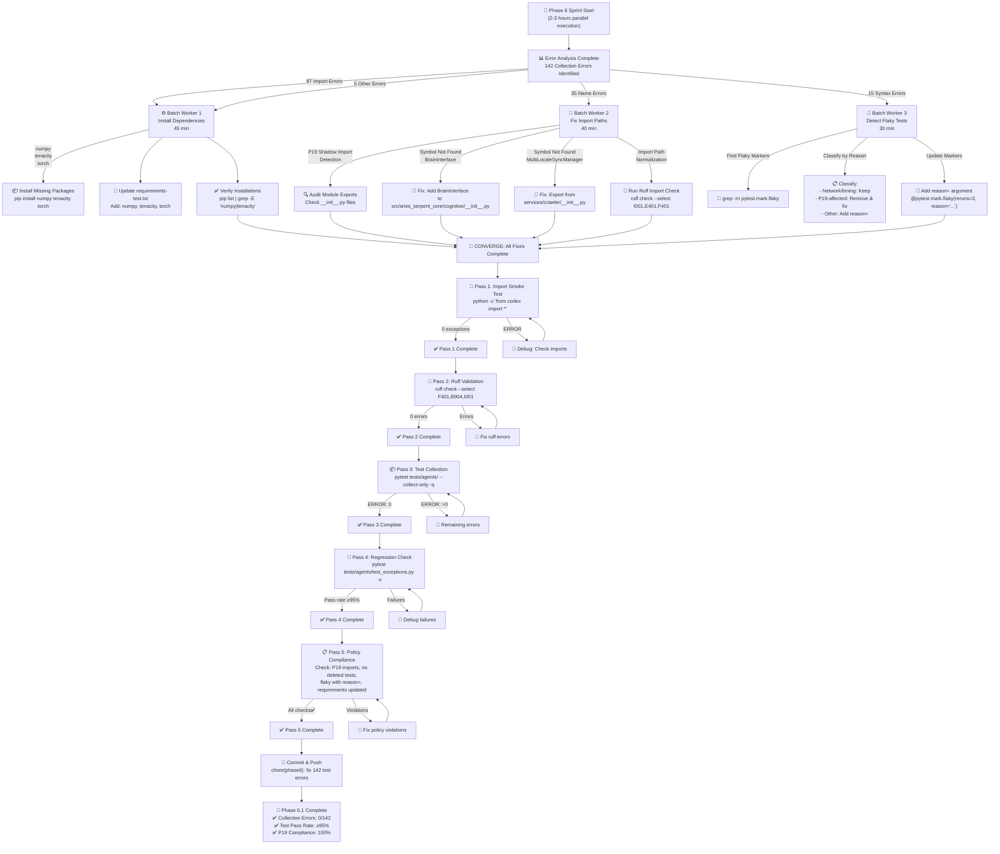
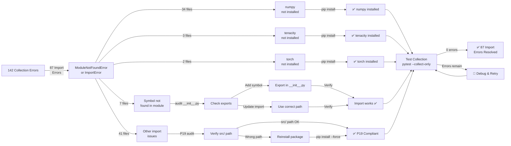
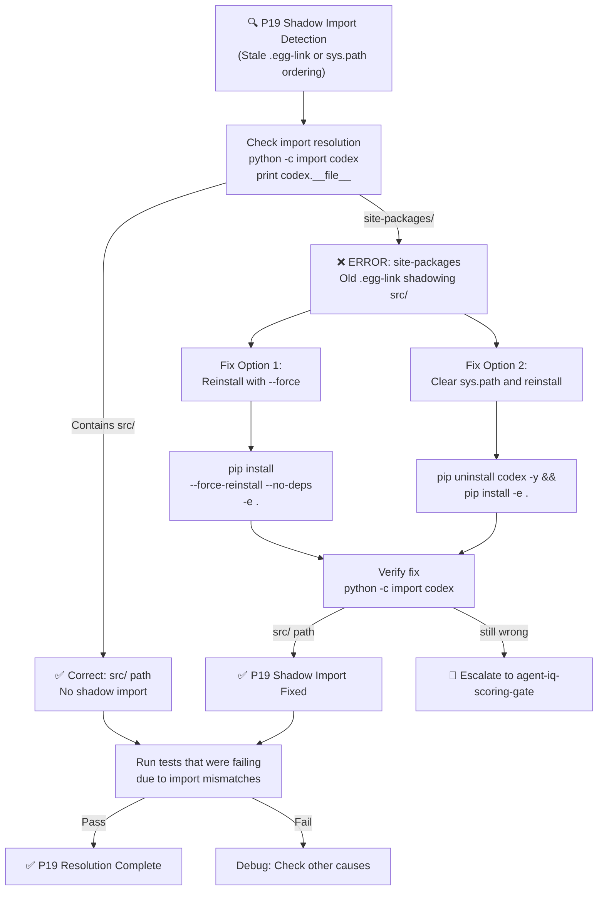
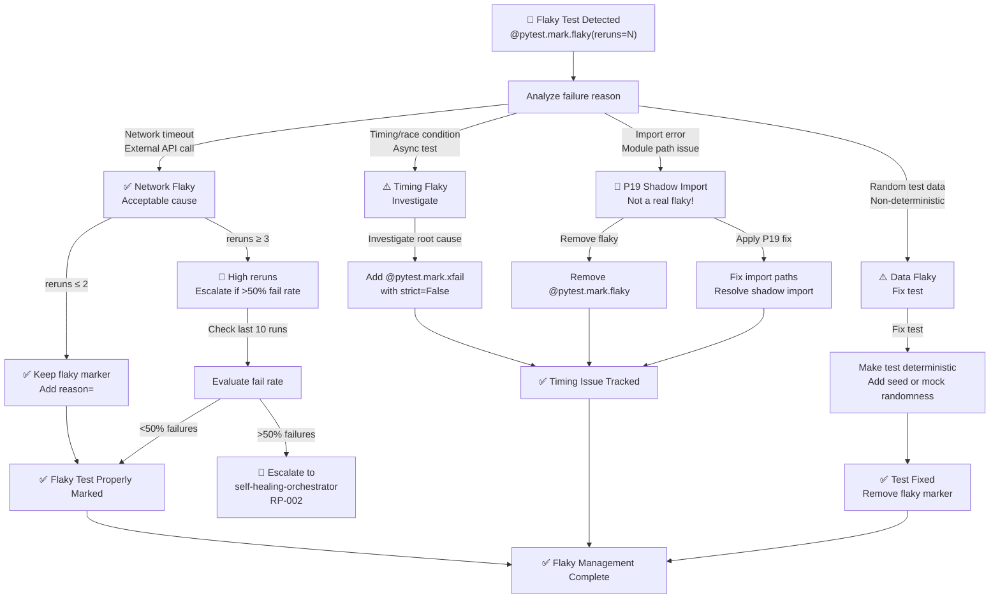
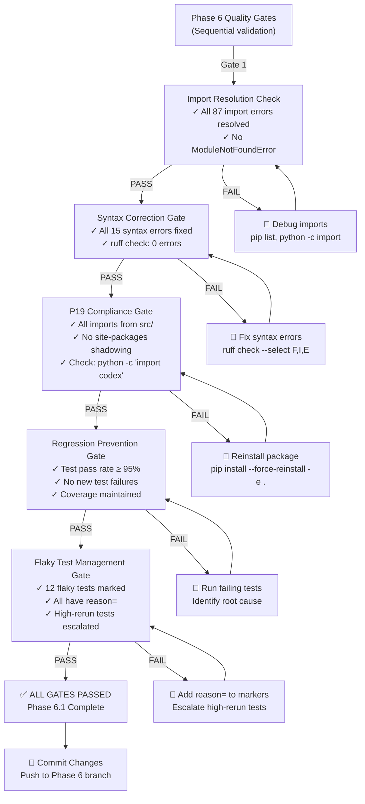
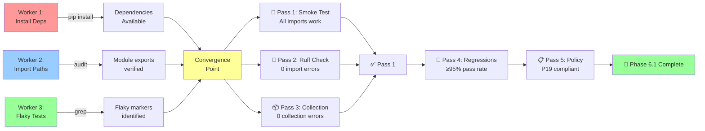
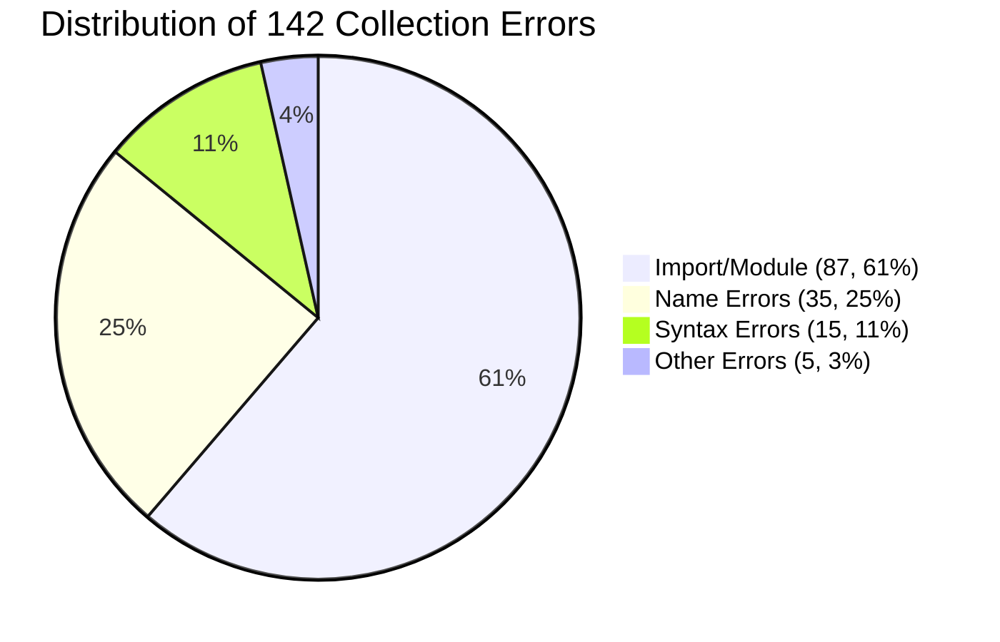

# Phase 6 Test-Cycle Dependency Diagrams

## Main Remediation Flow



---

## Import Error Resolution Flow



---

## P19 Shadow Import Detection & Resolution



---

## Flaky Test Classification & Escalation



---

## Quality Gate Sequential Checks



---

## Dependencies Between Fix Tasks



---

## Error Category Breakdown



---

## Remediation Progress Tracking

```mermaid
gantt
    title Phase 6 Sprint Execution (2-3 hours total)
    
    section Worker 1
    Install numpy (10 min) :w1_1, 0, 10m
    Install tenacity (5 min) :w1_2, 10m, 5m
    Install torch (10 min) :w1_3, 15m, 10m
    Update requirements (10 min) :w1_4, 25m, 10m
    Verify installations (10 min) :w1_5, 35m, 10m
    
    section Worker 2
    Audit P19 (10 min) :w2_1, 0, 10m
    Fix BrainInterface export (10 min) :w2_2, 10m, 10m
    Fix crawler exports (10 min) :w2_3, 20m, 10m
    Run ruff (5 min) :w2_4, 30m, 5m
    Apply fixes (10 min) :w2_5, 35m, 10m
    
    section Worker 3
    Find flaky markers (5 min) :w3_1, 0, 5m
    Classify tests (15 min) :w3_2, 5m, 15m
    Add reason= (5 min) :w3_3, 20m, 5m
    Generate report (5 min) :w3_4, 25m, 5m
    
    section Validation
    Convergence (5 min) :crit, conv, 45m, 5m
    Pass 1-2 (5 min) :crit, p12, after conv, 5m
    Pass 3-5 (10 min) :crit, p35, after p12, 10m
    Commit (5 min) :crit, commit, after p35, 5m
    
    section Overall
    Total Duration :overall, 0, 70m
```

---

## Notes

- All diagrams show parallel execution paths
- Workers 1-3 can run simultaneously
- Convergence point ensures all fixes complete before validation
- 5-pass review gates ensure no regressions
- Success criteria: 0 collection errors, ≥95% pass rate, 100% P19 compliance
