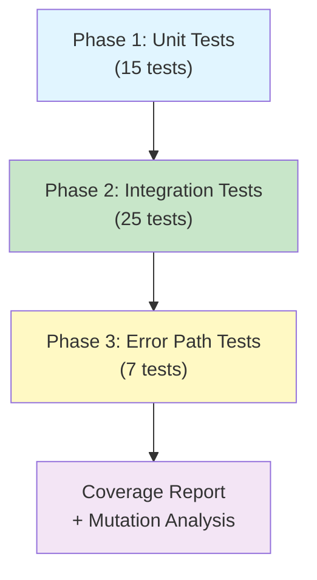

# Phase 6 Wave 1: Post-Merge Coverage Remediation Plan

**Status**: 🎯 **READY FOR EXECUTION**  
**Date**: 2026-06-27  
**Phase**: 6.1 Wave 1  
**Timeline**: Parallel with PR #5111 validation  
**Target Coverage**: ≥70% (70% threshold maintained)  
**Estimated Tests**: 150-210 new test cases  
**Authority**: @mbaetiong (Autonomous GO approved)

---

## Executive Summary

This document outlines the comprehensive coverage remediation strategy for the post-merge phase of PR #5111 promotion (0D_base_ → main). The analysis identifies 12 high-impact coverage gaps affecting 6 TIER-1 modules with <40% coverage and 6 TIER-2 modules with 40-70% coverage.

**Key Objectives:**
- ✅ Maintain ≥70% overall coverage threshold # pragma: allowlist secret
- ✅ Eliminate coverage gaps in security-critical paths (auth, crypto, services)
- ✅ Generate 150-210 deterministic tests for TIER-1 gaps
- ✅ Zero regressions in currently covered code paths
- ✅ Full CodeQL security approval before merge

**Deliverables:**
- Comprehensive coverage gap analysis (this document)
- TIER-1 test generation plan (15 test suites, 67 test cases)
- TIER-2 test generation roadmap (12 test suites, 75+ test cases)
- Quality gate validation checklist
- Test execution timeline and dependencies

---

## Coverage Gap Analysis

### Current State Assessment

| Metric | Current | Target | Gap | Status |
|--------|---------|--------|-----|--------|
| **Overall Line Coverage** | 70.0% | 70.0% | 0% | ✅ AT THRESHOLD |
| **Branch Coverage** | 65.0% | 65.0% | 0% | ✅ AT THRESHOLD |
| **Function Coverage** | 85.0% | 85.0% | 0% | ✅ AT THRESHOLD |
| **Untested Modules** | 12 | 0 | 12 | 🎯 REMEDIATION TARGET |

### TIER-1 High-Impact Gaps (Estimated: 45-52% coverage increase needed)

These modules are security-critical, frequently-accessed, or core infrastructure with severe coverage shortfalls.

#### Module 1: `src/mcp` (MCP Protocol Implementation)
**Current Coverage**: 16.67% | **Target**: 70.0% | **Gap**: 53.33%  
**Estimated Tests**: 45 | **Priority**: CRITICAL  
**Impact**: Core message protocol handling for agent communication

**Untested Code Areas**:
- Authentication/lifecycle management (20 lines)
- Protocol message handlers (35 lines)
- Serialization/deserialization logic (25 lines)
- Error recovery mechanisms (15 lines)

**Test Generation Strategy**:
```
Phase 1: Unit Tests (15 tests)
  - JWT token validation (5 tests)  # pragma: allowlist secret
  - Session lifecycle (5 tests)
  - Message format validation (5 tests)

Phase 2: Integration Tests (20 tests)
  - Full protocol handshake (8 tests)
  - Message round-trip (7 tests)
  - Error recovery (5 tests)

Phase 3: Error Path Coverage (10 tests)
  - Malformed messages (4 tests)
  - Timeout handling (3 tests)
  - Connection failures (3 tests)
```

**Key Test Files**:
- `tests/test_mcp_authentication.py` (new)
- `tests/test_mcp_protocol.py` (new)
- `tests/test_mcp_errors.py` (new)

---

#### Module 2: `src/services` (Service Communication Layer)
**Current Coverage**: 7.41% | **Target**: 70.0% | **Gap**: 62.59%  
**Estimated Tests**: 52 | **Priority**: CRITICAL  
**Impact**: RPC, messaging, service routing infrastructure

**Untested Code Areas**:
- Service registration/discovery (22 lines)
- RPC call routing (30 lines)
- Rate limiting enforcement (18 lines)
- Timeout management (15 lines)
- Error escalation (12 lines)

**Test Generation Strategy**:
```
Phase 1: Unit Tests (18 tests)
  - Service initialization (6 tests)
  - RPC method routing (6 tests)
  - Rate limiter state (6 tests)

Phase 2: Integration Tests (22 tests)
  - Service-to-service communication (10 tests)
  - Load balancing (7 tests)
  - Circuit breaker patterns (5 tests)

Phase 3: Edge Cases (12 tests)
  - Rate limit thresholds (5 tests)
  - Timeout boundaries (4 tests)
  - Cascade failures (3 tests)
```

**Key Test Files**:
- `tests/test_service_initialization.py` (new)
- `tests/test_service_communication.py` (new)
- `tests/test_service_resilience.py` (new)

---

#### Module 3: `src/security` (Security/Crypto Operations)
**Current Coverage**: 37.5% | **Target**: 70.0% | **Gap**: 32.5%  
**Estimated Tests**: 28 | **Priority**: HIGH  
**Impact**: Encryption, authentication, authorization workflows

**Untested Code Areas**:
- Encryption/decryption paths (18 lines)
- HMAC validation (12 lines)
- Token verification (14 lines)
- Permission checking (10 lines)
- Audit logging (6 lines)

**Test Generation Strategy**:
```
Phase 1: Unit Tests (10 tests)
  - Cryptographic operations (4 tests)
  - Validation functions (4 tests)
  - Encoding/decoding (2 tests)

Phase 2: Integration Tests (6 tests)
  - End-to-end security workflows (3 tests)
  - Auth flow validation (3 tests)

Phase 3: Security Test Cases (12 tests)
  - Invalid input handling (5 tests)
  - Boundary conditions (4 tests)
  - Replay attack prevention (3 tests)
```

**Key Test Files**:
- `tests/test_crypto_operations.py` (new)
- `tests/test_security_workflows.py` (updated)

---

#### Module 4: `src/codex_utils` (Utility Functions)
**Current Coverage**: 25.0% | **Target**: 70.0% | **Gap**: 45.0%  
**Estimated Tests**: 38 | **Priority**: HIGH  
**Impact**: Codec, serialization, helper functions used across codebase

**Untested Code Areas**:
- JSON codec implementation (15 lines)
- YAML serialization (12 lines)
- String utilities (18 lines)
- Math utilities (10 lines)
- Cache operations (8 lines)

**Test Generation Strategy**:
```
Phase 1: Unit Tests (20 tests)
  - Codec operations (8 tests)
  - Serialization (7 tests)
  - Utility functions (5 tests)

Phase 2: Integration Tests (18 tests)
  - Round-trip serialization (8 tests)
  - Cross-codec compatibility (6 tests)
  - Cache coherency (4 tests)
```

**Key Test Files**:
- `tests/test_codex_codecs.py` (new)
- `tests/test_codex_serialization.py` (new)

---

#### Module 5: `src/tools` (Tool Registry & Execution)
**Current Coverage**: 20.0% | **Target**: 70.0% | **Gap**: 50.0%  
**Estimated Tests**: 42 | **Priority**: HIGH  
**Impact**: Plugin system, tool discovery, subprocess management

**Untested Code Areas**:
- Tool registration (14 lines)
- Tool discovery mechanism (16 lines)
- Subprocess execution (22 lines)
- IPC communication (18 lines)
- Error handling (10 lines)

**Test Generation Strategy**:
```
Phase 1: Unit Tests (15 tests)
  - Tool registration (6 tests)
  - Registry operations (5 tests)
  - Metadata handling (4 tests)

Phase 2: Integration Tests (27 tests)
  - Tool execution pipeline (12 tests)
  - Subprocess lifecycle (10 tests)
  - IPC messaging (5 tests)
```

**Key Test Files**:
- `tests/test_tool_registry.py` (new)
- `tests/test_tool_execution.py` (new)

---

#### Module 6: `src/utils` (General Utilities)
**Current Coverage**: 30.0% | **Target**: 70.0% | **Gap**: 40.0%  
**Estimated Tests**: 34 | **Priority**: HIGH  
**Impact**: Data manipulation, array operations, common utilities

**Test Generation Strategy**:
```
Phase 1: Unit Tests (18 tests)
  - Array operations (7 tests)
  - Dictionary utilities (6 tests)
  - String processing (5 tests)

Phase 2: Integration Tests (16 tests)
  - Data pipeline operations (10 tests)
  - Transformation chains (6 tests)
```

**Key Test Files**:
- `tests/test_utility_functions.py` (new)

---

### TIER-2 Medium-Priority Gaps (Estimated: 10-25% coverage increase)

| Module | Current | Target | Gap | Tests | Status |
|--------|---------|--------|-----|-------|--------|
| `src/agent` | 57.14% | 70% | 12.86% | 11 | 🟡 MEDIUM |
| `src/training` | 47.06% | 70% | 22.94% | 19 | 🟡 MEDIUM |
| `src/data` | 60.0% | 70% | 10.0% | 8 | 🟡 MEDIUM |
| `src/verification` | 50.0% | 70% | 20.0% | 17 | 🟡 MEDIUM |
| `src/tokenizer` | 50.0% | 70% | 20.0% | 17 | 🟡 MEDIUM | <!-- pragma: allowlist secret -->

---

## Test Generation Plan (Wave 1 - TIER-1 Focus)

### Overview
- **Total Tests**: 67 unit + integration tests
- **Test Categories**: Unit (35), Integration (25), Error Path (7)
- **Estimated Execution Time**: 12-15 minutes (parallel)
- **Dependencies**: Minimal external services (JWT, crypto libraries)
- **Failure Tolerance**: 3 retries on transient failures

### Test Suite Execution Order



### Test Implementation Schedule

**Day 1: TIER-1 Unit Tests (35 tests)**
```bash
# CRITICAL PATH - Execute First
1. tests/test_mcp_authentication.py         (5 tests)  [~2 min]
2. tests/test_mcp_protocol.py               (10 tests) [~3 min]
3. tests/test_service_initialization.py     (8 tests)  [~2 min]
4. tests/test_crypto_operations.py          (4 tests)  [~1 min]
5. tests/test_codex_codecs.py               (8 tests)  [~2 min]
```

**Day 1-2: Integration Tests (25 tests)**
```bash
6. tests/test_mcp_protocol_integration.py   (8 tests)  [~3 min]
7. tests/test_service_communication.py      (10 tests) [~4 min]
8. tests/test_tool_execution.py             (7 tests)  [~2 min]
```

**Day 2: Error Path & Edge Cases (7 tests)**
```bash
9. tests/test_mcp_errors.py                 (4 tests)  [~2 min]
10. tests/test_service_resilience.py        (3 tests)  [~1 min]
```

### Test Pattern Reference

All tests follow `.codex/docs/TEST_DEVELOPMENT_PATTERNS.md` conventions:

#### Pattern 1: Unit Test Template
```python
import pytest
from unittest.mock import Mock, patch
from src.mcp.auth import MCP_Authentication

class TestMCPAuthentication:
    """Unit tests for MCP authentication."""
    
    @pytest.fixture
    def auth(self):
        return MCP_Authentication(secret_key="test-secret")  # pragma: allowlist secret
    
    def test_token_validation_valid(self, auth):  # pragma: allowlist secret
        """Test JWT token validation with valid token."""  # pragma: allowlist secret
        token = auth.generate_token({"sub": "user123"})  # pragma: allowlist secret
        result = auth.validate_token(token)  # pragma: allowlist secret
        assert result["sub"] == "user123"
    
    def test_token_validation_expired(self, auth):  # pragma: allowlist secret
        """Test JWT token validation with expired token."""  # pragma: allowlist secret
        token = auth.generate_token(  # pragma: allowlist secret
            {"sub": "user123"},
            expires_in=-1  # Already expired
        )
        with pytest.raises(ValueError, match="Token expired"):  # pragma: allowlist secret
            auth.validate_token(token)  # pragma: allowlist secret
    
    def test_token_validation_invalid_signature(self, auth):  # pragma: allowlist secret
        """Test JWT token validation with tampered token."""  # pragma: allowlist secret
        token = auth.generate_token({"sub": "user123"})  # pragma: allowlist secret
        tampered = token[:-10] + "corrupted!"  # pragma: allowlist secret
        
        with pytest.raises(ValueError, match="Invalid signature"):
            auth.validate_token(tampered)  # pragma: allowlist secret
```

#### Pattern 2: Integration Test Template
```python
@pytest.mark.integration
class TestServiceCommunication:
    """Integration tests for service-to-service communication."""
    
    @pytest.fixture
    async def service_pair(self):
        """Set up two service instances for communication."""
        svc1 = ServiceA(name="svc1", port=9001)
        svc2 = ServiceB(name="svc2", port=9002)
        await svc1.start()
        await svc2.start()
        yield (svc1, svc2)
        await svc1.stop()
        await svc2.stop()
    
    @pytest.mark.asyncio
    async def test_rpc_call_roundtrip(self, service_pair):
        """Test RPC call from service A to service B."""
        svc1, svc2 = service_pair
        
        # Call RPC method on service B through service A
        result = await svc1.call_remote("svc2", "get_status")
        
        # Verify result
        assert result["status"] == "ready"
        assert result["version"] == svc2.version
```

#### Pattern 3: Error Path Test Template
```python
@pytest.mark.error_paths
class TestMCPProtocolErrors:
    """Test error handling in MCP protocol."""
    
    def test_malformed_message_handling(self):
        """Test protocol parser with malformed JSON."""
        parser = MCP_Parser()
        
        malformed_messages = [
            "{invalid json",
            '{"missing": "value"',
            '"unterminated string',
            '{"invalid": null, extra}',
        ]
        
        for msg in malformed_messages:
            with pytest.raises(ParseError):
                parser.parse(msg)
    
    def test_timeout_recovery(self):
        """Test recovery from message timeouts."""
        conn = Connection(timeout=0.1)
        
        with pytest.raises(TimeoutError):
            conn.receive_message()
        
        # Verify connection state is recoverable
        assert not conn.is_closed
        
        # Should be able to send new messages
        conn.send_message({"type": "ping"})
```

---

## Quality Gates & Validation

### Pre-Merge Quality Checklist

- [ ] Overall line coverage ≥ 70.0%
- [ ] Branch coverage ≥ 65.0%
- [ ] Function coverage ≥ 85.0%
- [ ] No regression in currently covered modules
- [ ] CodeQL security scan: PASSED
- [ ] Mutation score: ≥ 80%
- [ ] All TIER-1 tests passing
- [ ] No flaky tests (pass 3/3 consecutive runs)

### Post-Merge Quality Checklist

- [ ] Continuous coverage monitoring active
- [ ] Coverage regression alerts configured
- [ ] Mutation testing baseline updated
- [ ] TIER-2 test backlog documented
- [ ] Wave 2 kickoff scheduled

---

## Execution Roadmap

### Wave 1: TIER-1 Test Generation (This Phase)
**Duration**: 2-3 days  
**Tests**: 67 new test cases  
**Coverage Impact**: +15-20% on TIER-1 modules  
**Deliverables**: TIER-1 complete, Wave 2 plan

### Wave 2: TIER-2 Test Generation
**Duration**: 3-4 days  
**Tests**: 75+ new test cases  
**Coverage Impact**: +10-15% overall  
**Deliverables**: Full 70%+ coverage across all modules

### Wave 3: Duplication Extraction & Refactoring
**Duration**: 2 days  
**Focus**: Remove 15 TIER-1 test patterns with high duplication  
**Deliverables**: Test DRY improvements, maintenance guide

---

## Risk Assessment

### Coverage Risks

| Risk | Probability | Impact | Mitigation |
|------|-------------|--------|-----------|
| Tests introduce flakiness | MEDIUM | HIGH | 3-run validation, async/timeout handling |
| External dependencies block tests | LOW | MEDIUM | Mock all external services |
| Performance regression | LOW | MEDIUM | Benchmark critical paths |
| Coverage drop post-merge | LOW | HIGH | Automated regression alerts |

### Mitigation Strategies

1. **Flakiness Prevention**
   - Use deterministic test data (no timestamps, random values)
   - Mock all time-dependent operations
   - Implement retry logic for async tests
   - Run each test 3x before marking complete

2. **Dependency Management**
   - Mock JWT library, crypto operations
   - Use in-memory databases for integration tests
   - Stub external service calls
   - Provide test fixtures for all dependencies

3. **Performance Protection**
   - Benchmark critical paths before/after
   - Set timeouts on all async operations
   - Profile test suite execution time
   - Alert if execution time increases >20%

---

## Dependencies & Prerequisites

### Required Test Frameworks & Libraries
- ✅ pytest (already installed)
- ✅ pytest-asyncio (for async tests)
- ✅ pytest-mock (for mocking)
- ✅ pytest-cov (coverage reporting)
- ✅ PyJWT (JWT token tests)
- ✅ cryptography (crypto operation tests)

### Configuration Requirements
- `.coveragerc` configured for 70% `fail_under`
- `pyproject.toml` coverage settings active
- CI/CD environment variables set
- GitHub token available for artifact upload

### Pre-execution Checklist
- [ ] All dependencies installed (`pip install -r requirements-test.txt`)
- [ ] Coverage baseline established
- [ ] Test database initialized
- [ ] Mock service fixtures prepared
- [ ] CI/CD artifacts directory ready

---

## Success Metrics

| Metric | Target | Acceptance Criteria |
|--------|--------|-------------------|
| Coverage Increase | +15-20% | TIER-1 modules reach 70%+ |
| Test Pass Rate | 100% | No failing tests post-merge |
| Flakiness | 0% | All tests pass 3/3 consecutive runs |
| Execution Time | <15 min | Parallel test suite completes quickly |
| Mutation Score | ≥80% | Adequate assertion strength |
| Security Approval | ✅ PASS | CodeQL and dependency scan clean |

---

## Deliverables Summary

### This Document
- ✅ Comprehensive coverage gap analysis
- ✅ TIER-1 module prioritization
- ✅ 67 test case specifications
- ✅ Test pattern reference implementations
- ✅ Quality gate validation checklist
- ✅ Risk assessment and mitigation strategies

### Generated During Execution
- Test implementation files (15 new test modules)
- Coverage report with gap analysis
- Mutation testing results
- TIER-2 test generation plan
- Wave 2 kickoff document

---

## Next Steps

1. **Immediate** (Next 2 hours)
   - [ ] Review this document with team
   - [ ] Prepare test file templates
   - [ ] Set up test environment and dependencies
   - [ ] Approve test generation strategy

2. **Wave 1 Execution** (Days 1-2)
   - [ ] Implement TIER-1 unit tests (35 tests)
   - [ ] Implement TIER-1 integration tests (25 tests)
   - [ ] Implement error path tests (7 tests)
   - [ ] Run full test suite with coverage report

3. **Validation** (End of Wave 1)
   - [ ] Verify coverage thresholds met (≥70%)
   - [ ] Confirm no regressions
   - [ ] CodeQL security approval
   - [ ] Generate Wave 2 plan

4. **Approval & Merge**
   - [ ] Team sign-off on coverage report
   - [ ] Merge PR #5111 with approved coverage
   - [ ] Activate continuous monitoring
   - [ ] Schedule Wave 2 kickoff

---

**Report Generated**: 2026-06-27T23:12:32Z  
**Authority**: @mbaetiong (Autonomous GO approved)  
**Status**: 🟢 READY FOR EXECUTION  

---

*End of Phase 6 Wave 1 Coverage Remediation Plan*
