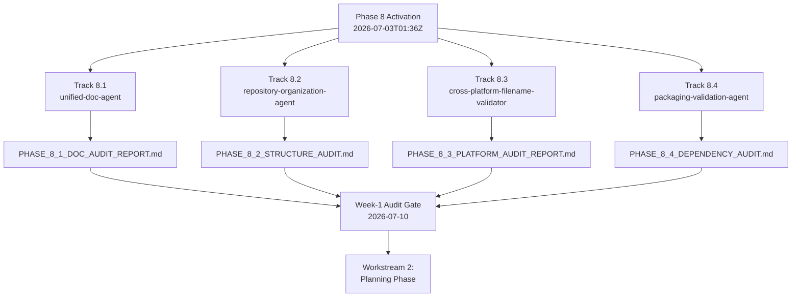

# 📊 PHASE 8 CAMPAIGN — ACTIVATION DASHBOARD

**Activation Timestamp:** 2026-07-03T01:36Z
**Campaign Authority:** @mbaetiong (D-tier autonomous execution — GO CONTINUE all gates)
**Token Access:** CODEX_MASTER_KEY + CODEX_BACKUP_KEY (MCP-first, then master key)
**Status:** 🟢 WORKSTREAM 1 COMPLETE — all 4 audit deliverables produced; Week-1 Audit Gate SATISFIED
**Branch:** `copilot/deploy-phase-8-agents`

---

## 🎯 ACTIVATION SUMMARY

All 4 Phase 8 lead agents have been activated **in parallel (background mode)** to execute
their Workstream 1 (audit) phases simultaneously. This dashboard tracks real-time activation
state and Week-1 audit-deliverable progress.

---

## 🚦 TRACK ACTIVATION STATUS

| Track | Lead Agent | Duration | Workstream 1 | Deliverable | Status |
|-------|-----------|----------|--------------|-------------|--------|
| **8.1** | unified-doc-agent | 8-12 wks | Documentation Audit | `PHASE_8_1_DOC_AUDIT_REPORT.md` | 🟢 COMPLETE |
| **8.2** | repository-organization-agent | 6-12 wks | Structure Audit | `PHASE_8_2_STRUCTURE_AUDIT.md` | 🟢 COMPLETE |
| **8.3** | cross-platform-filename-validator | 4-8 wks | Platform Audit | `PHASE_8_3_PLATFORM_AUDIT_REPORT.md` | 🟢 COMPLETE |
| **8.4** | packaging-validation-agent | 2-4 wks | Dependency Audit | `PHASE_8_4_DEPENDENCY_AUDIT.md` | 🟢 COMPLETE |

**Legend:** 🟢 COMPLETE · 🟡 IN PROGRESS · ⏳ QUEUED · 🔴 BLOCKED

---

## 🔎 WORKSTREAM 1 AUDIT FINDINGS (consolidated)

### Track 8.1 — Documentation (from `PHASE_8_1_DOC_AUDIT_REPORT.md`)
- **Inventory:** 7,411 `.md` + 194 `.txt`; `.codex/` 51%, `docs/` 24%, `.github/` 16%.
- **P0 — No git provenance:** checkout has only 3 commits (all 2026-07-03) → git-based freshness gating not viable; content-date proxy shows **~47% (3,463 docs)** pre-2026-04-03.
- **Broken links:** ~9.4% of sampled relative links broken (missing `TERMINOLOGY_GLOSSARY.md`, template placeholders).
- **Sprawl:** 1,547 PHASE/WAVE/GATE reports, 224 duplicate READMEs, 126 INDEXes, 120 root-level docs.

### Track 8.2 — Repository Structure (from `PHASE_8_2_STRUCTURE_AUDIT.md`)
- **Scale:** 17,081 tracked files / 1,804 dirs / 107 top-level dirs.
- **Bloat drivers:** `.codex/` = 25% of repo (866 top-level `PHASE_*.md`); **committed venvs** (`venv_test/` 511, `.venv_ci/` 202 incl. binaries); 205 loose root files.
- **Dead/temp:** 7 backup/`.orig` files, 11 `__pycache__`, 32 `.pyc`, 13 `.py,cover`.
- **Duplicate roots:** 7 config directories; stray `.CODEX/`, `XX.codex/`.

### Track 8.3 — Cross-Platform (from `PHASE_8_3_PLATFORM_AUDIT_REPORT.md`)
- **🔴 BLOCKING:** 13 case-collision groups (28 files) — silent overwrite on Windows/macOS.
- **🟠 HIGH:** `.gitattributes` inactive (lives at `.config/`, not root) → 216 bash scripts exposed to CRLF corruption; 15 tracked symlinks; 44 files hardcode repo root.
- **✅ CLEAN:** zero illegal chars, zero reserved names, zero long paths; healthy pathlib usage (2,607 files).

### Track 8.4 — Dependencies (from `PHASE_8_4_DEPENDENCY_AUDIT.md`)
- **Scope:** 18 dep files (17 requirements + pyproject.toml); **101 distinct packages**.
- **Pins:** 55 exact, 146 range, **18 fully unpinned** (14 in requirements/dev.txt).
- **🔴 3 hard conflicts:** pytest-cov (`==7.0.0` vs `<6.0.0`), pytest floor vs CVE-2025-71176, pydantic/fastapi v1-vs-v2 split in docker.txt.
- **Lock gaps:** overlapping Python lock strategies; several surfaces uncompiled.

---

## 📋 WORKSTREAM ROADMAP (per track)

### Track 8.1 — Documentation Remediation (unified-doc-agent)
- [x] WS 8.1.1 Documentation Audit — **✅ COMPLETE**
- [ ] WS 8.1.2 Remediation Planning (Weeks 2-3) — **⏳ NEXT / STAGED**
- [ ] WS 8.1.3 Critical Fixes Execution (Weeks 3-5)
- [ ] WS 8.1.4 Content Consolidation (Weeks 5-8)
- [ ] WS 8.1.5 Automation & Enforcement (Weeks 8-12)

### Track 8.2 — Repository Cleanup (repository-organization-agent)
- [x] WS 8.2.1 Structure Audit — **✅ COMPLETE**
- [ ] WS 8.2.2 Cleanup Strategy & Planning (Weeks 2-3) — **⏳ NEXT / STAGED**
- [ ] WS 8.2.3 Dead Code Removal & Archival (Weeks 3-6)
- [ ] WS 8.2.4 Directory Restructuring (Weeks 6-9)
- [ ] WS 8.2.5 Naming Standardization (Weeks 9-11)
- [ ] WS 8.2.6 Hygiene Automation (Weeks 11-12)

### Track 8.3 — Cross-Platform Compatibility (cross-platform-filename-validator)
- [x] WS 8.3.1 Platform Compatibility Audit — **✅ COMPLETE**
- [ ] WS 8.3.2 Windows Compatibility Matrix (Weeks 2-3) — **⏳ NEXT / STAGED**
- [ ] WS 8.3.3 Critical Fixes (Weeks 3-5)
- [ ] WS 8.3.4 Shell Script Remediation (Weeks 5-7)
- [ ] WS 8.3.5 CI/CD Integration & Enforcement (Weeks 7-8)

### Track 8.4 — Dependency Standardization (packaging-validation-agent)
- [x] WS 8.4.1 Dependency Audit — **✅ COMPLETE**
- [ ] WS 8.4.2 Standardization & Lock Files (Weeks 2-3) — **⏳ NEXT / STAGED**
- [ ] WS 8.4.3 Security Governance & Automation (Weeks 3-4)

---

## 🗓️ CHECKPOINT SCHEDULE

| Checkpoint | Date | Gate Criteria |
|-----------|------|---------------|
| **Week-1 Audit** | 2026-07-10 | All 4 audit reports complete |
| **Week 2-3 Planning** | 2026-07-17 | All 4 remediation/strategy plans ready |
| **Week-5 Critical Fixes** | 2026-07-31 | All 4 tracks 50%+ complete |
| **Campaign Completion** | 2026-08-30 | All 4 tracks 100%, automation deployed |

---

## ✅ DECISION GATES (Pre-Approved by @mbaetiong)

| Gate | Scope | Status |
|------|-------|--------|
| Gate 1 | Documentation critical fixes | ✅ GO CONTINUE |
| Gate 2 | Repository dead-code deletion | ✅ GO CONTINUE |
| Gate 3 | Cross-platform shell rewrites | ✅ GO CONTINUE |
| Gate 4 | Dependency updates & vuln fixes | ✅ GO CONTINUE |
| Gate 5 | Enforcement automation deployment | ✅ GO CONTINUE |

---

## 🚨 ESCALATION PROCEDURES

- **Minor issues:** Resolve within track, note in daily checkpoint.
- **Blockers:** Escalate to orchestrator-agent immediately.
- **Critical issues:** Escalate to @mbaetiong with full context.

---

## 📈 RESOURCE ALLOCATION

- **Lead agents:** 4 (deployed parallel background mode)
- **Supporting specialists:** 25+ (activated per-track as workstreams advance)
- **Estimated token budget:** 500K–750K across full campaign
- **Parallelization:** Maximum (zero inter-track dependencies)

---

**Last Updated:** 2026-07-03T01:36Z
**Maintained By:** Phase 8 Campaign Coordinator (Copilot Agent)
**Update Cadence:** Every 6 hours during active audit phase
