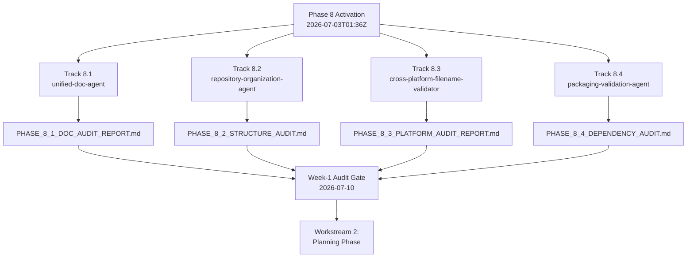

# 📊 PHASE 8 CAMPAIGN — ACTIVATION DASHBOARD

**Activation Timestamp:** 2026-07-03T01:36Z
**Campaign Authority:** @mbaetiong (D-tier autonomous execution — GO CONTINUE all gates)
**Token Access:** CODEX_MASTER_KEY + CODEX_BACKUP_KEY (MCP-first, then master key)
**Status:** 🟢 ACTIVATED — Workstream 1 (Audit Phase) in progress across all 4 tracks
**Branch:** `copilot/deploy-phase-8-agents`

---

## 🎯 ACTIVATION SUMMARY

All 4 Phase 8 lead agents have been activated **in parallel (background mode)** to execute
their Workstream 1 (audit) phases simultaneously. This dashboard tracks real-time activation
state and Week-1 audit-deliverable progress.

---

## 🚦 TRACK ACTIVATION STATUS

| Track | Lead Agent | Duration | Workstream 1 | Deliverable | Status |
|-------|-----------|----------|--------------|-------------|--------|
| **8.1** | unified-doc-agent | 8-12 wks | Documentation Audit | `PHASE_8_1_DOC_AUDIT_REPORT.md` | 🟡 IN PROGRESS |
| **8.2** | repository-organization-agent | 6-12 wks | Structure Audit | `PHASE_8_2_STRUCTURE_AUDIT.md` | 🟡 IN PROGRESS |
| **8.3** | cross-platform-filename-validator | 4-8 wks | Platform Audit | `PHASE_8_3_PLATFORM_AUDIT_REPORT.md` | 🟡 IN PROGRESS |
| **8.4** | packaging-validation-agent | 2-4 wks | Dependency Audit | `PHASE_8_4_DEPENDENCY_AUDIT.md` | 🟡 IN PROGRESS |

**Legend:** 🟢 COMPLETE · 🟡 IN PROGRESS · ⏳ QUEUED · 🔴 BLOCKED

---

## 📋 WORKSTREAM ROADMAP (per track)

### Track 8.1 — Documentation Remediation (unified-doc-agent)
- [x] WS 8.1.1 Documentation Audit — **ACTIVE**
- [ ] WS 8.1.2 Remediation Planning (Weeks 2-3)
- [ ] WS 8.1.3 Critical Fixes Execution (Weeks 3-5)
- [ ] WS 8.1.4 Content Consolidation (Weeks 5-8)
- [ ] WS 8.1.5 Automation & Enforcement (Weeks 8-12)

### Track 8.2 — Repository Cleanup (repository-organization-agent)
- [x] WS 8.2.1 Structure Audit — **ACTIVE**
- [ ] WS 8.2.2 Cleanup Strategy & Planning (Weeks 2-3)
- [ ] WS 8.2.3 Dead Code Removal & Archival (Weeks 3-6)
- [ ] WS 8.2.4 Directory Restructuring (Weeks 6-9)
- [ ] WS 8.2.5 Naming Standardization (Weeks 9-11)
- [ ] WS 8.2.6 Hygiene Automation (Weeks 11-12)

### Track 8.3 — Cross-Platform Compatibility (cross-platform-filename-validator)
- [x] WS 8.3.1 Platform Compatibility Audit — **ACTIVE**
- [ ] WS 8.3.2 Windows Compatibility Matrix (Weeks 2-3)
- [ ] WS 8.3.3 Critical Fixes (Weeks 3-5)
- [ ] WS 8.3.4 Shell Script Remediation (Weeks 5-7)
- [ ] WS 8.3.5 CI/CD Integration & Enforcement (Weeks 7-8)

### Track 8.4 — Dependency Standardization (packaging-validation-agent)
- [x] WS 8.4.1 Dependency Audit — **ACTIVE**
- [ ] WS 8.4.2 Standardization & Lock Files (Weeks 2-3)
- [ ] WS 8.4.3 Security Governance & Automation (Weeks 3-4)

---

## 🗓️ CHECKPOINT SCHEDULE

| Checkpoint | Date | Gate Criteria |
|-----------|------|---------------|
| **Week-1 Audit** | 2026-07-10 | All 4 audit reports complete |
| **Week 2-3 Planning** | 2026-07-17 | All 4 remediation/strategy plans ready |
| **Week-5 Critical Fixes** | 2026-07-31 | All 4 tracks 50%+ complete |
| **Campaign Completion** | 2026-08-30 | All 4 tracks 100%, automation deployed |

---

## ✅ DECISION GATES (Pre-Approved by @mbaetiong)

| Gate | Scope | Status |
|------|-------|--------|
| Gate 1 | Documentation critical fixes | ✅ GO CONTINUE |
| Gate 2 | Repository dead-code deletion | ✅ GO CONTINUE |
| Gate 3 | Cross-platform shell rewrites | ✅ GO CONTINUE |
| Gate 4 | Dependency updates & vuln fixes | ✅ GO CONTINUE |
| Gate 5 | Enforcement automation deployment | ✅ GO CONTINUE |

---

## 🚨 ESCALATION PROCEDURES

- **Minor issues:** Resolve within track, note in daily checkpoint.
- **Blockers:** Escalate to orchestrator-agent immediately.
- **Critical issues:** Escalate to @mbaetiong with full context.

---

## 📈 RESOURCE ALLOCATION

- **Lead agents:** 4 (deployed parallel background mode)
- **Supporting specialists:** 25+ (activated per-track as workstreams advance)
- **Estimated token budget:** 500K–750K across full campaign
- **Parallelization:** Maximum (zero inter-track dependencies)

---

**Last Updated:** 2026-07-03T01:36Z
**Maintained By:** Phase 8 Campaign Coordinator (Copilot Agent)
**Update Cadence:** Every 6 hours during active audit phase
