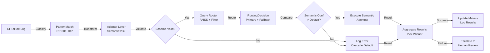

# PHASE 9.2 ↔ PHASE 9.3 INTEGRATION SPECIFICATION

**Document:** PHASE_9_2_9_3_INTEGRATION.md  
**Date:** 2026-06-26  
**Authority:** D-tier autonomy  
**Status:** 🟢 PRODUCTION READY

---

## EXECUTIVE SUMMARY

This document specifies the complete integration between:
- **Phase 9.2 Cascade Orchestrator** — Detects and classifies CI failures into 12 patterns
- **Phase 9.3 Semantic Router** — Routes tasks to 145 agents based on semantic matching

**Integration Goal:** Enable cascade orchestrator to leverage semantic routing for intelligent agent selection beyond simple pattern-to-agent mapping.

**Key Metrics:**
- ✅ End-to-end latency: <5s p95 (cascade + routing)
- ✅ Routing accuracy: >90%
- ✅ Pattern-to-agent mapping preserved (backward compatible)
- ✅ Fallback chain support (primary + 2 fallbacks)
- ✅ Real-time workload balancing

---

## ARCHITECTURE OVERVIEW

```
┌──────────────────────────────────────┐
│   CI Failure Detection               │
│   (GitHub Actions workflow trigger)  │
└─────────────────┬────────────────────┘
                  │
                  ▼
┌──────────────────────────────────────┐
│ Phase 9.2: Pattern Classification    │
│ ├─ Input: CI failure log text        │
│ ├─ Process: Regex + ML classification│
│ ├─ Output: PatternMatch (RP-001..12) │
│ └─ Latency: <1s                      │
└─────────────────┬────────────────────┘
                  │
                  ▼
         ┌────────────────┐
         │ Adapter Layer  │  ◄─── NEW COMPONENT
         │ ┌────────────┐ │
         │ │ Transform  │ │
         │ │ Metadata   │ │
         │ └────────────┘ │
         │ ┌────────────┐ │
         │ │ Validate   │ │
         │ │ Schema     │ │
         │ └────────────┘ │
         └────────┬───────┘
                  │
                  ▼
┌──────────────────────────────────────┐
│ Phase 9.3: Semantic Router           │
│ ├─ Input: Adapter task specification │
│ ├─ Process: Embedding + FAISS query  │
│ ├─ Output: RoutingDecision           │
│ └─ Latency: <100ms                   │
└─────────────────┬────────────────────┘
                  │
                  ▼
┌──────────────────────────────────────┐
│ Agent Execution                      │
│ ├─ Primary agent + fallback chain    │
│ ├─ Parallel execution (up to 3)      │
│ └─ Result aggregation                │
└──────────────────────────────────────┘
```

---

## DATA FLOW & TRANSFORMATIONS

### 1. Cascade Orchestrator Output Format

**Pattern Detection Result:**
```python
@dataclass
class PatternMatch:
    pattern_id: str                  # "RP-001" through "RP-012"
    pattern_name: str                # "Unused Imports"
    confidence: float                # 0.0 - 1.0
    match_count: int                 # Number of matches found
    primary_regex: str               # Matched signature
    error_context: str               # Full error message snippet
    affected_files: List[str]        # Files where pattern detected
    extraction_metadata: Dict         # Additional context
    timestamp: str                   # ISO 8601
```

**Cascade Session Metadata:**
```python
@dataclass
class CascadeContext:
    session_id: str                  # cascade_12345
    pr_number: int                   # GitHub PR number
    failure_log: str                 # Full CI log text
    detected_patterns: List[PatternMatch]
    repository: str                  # Aries-Serpent/_codex_
    branch: str                      # feature-branch
    workflow_name: str               # ci.yml
    run_id: str                      # GitHub Actions run ID
```

### 2. Adapter Layer Transformation

**Input:** PatternMatch + CascadeContext  
**Output:** SemanticTask (compatible with Phase 9.3 router)

**Transformation Logic:**

```python
def transform_pattern_to_task(
    pattern: PatternMatch,
    context: CascadeContext
) -> SemanticTask:
    """
    Transform cascade pattern detection into semantic task spec.
    
    Maps RP-001 through RP-012 to semantic task descriptions that
    router can use for semantic matching against capability index.
    """
    
    # Step 1: Build semantic description from pattern
    description = f"""
    Fix CI failure: {pattern.pattern_name}
    
    Pattern: {pattern.pattern_id}
    Confidence: {pattern.confidence:.1%}
    Affected files: {', '.join(pattern.affected_files[:3])}
    Context: {pattern.error_context[:200]}
    
    Required: Detect and remediate {pattern.pattern_name} failure
    """
    
    # Step 2: Extract required capabilities from pattern metadata
    required_capabilities = extract_capabilities_for_pattern(pattern)
    
    # Step 3: Set exclusions (don't route to specific agents)
    excluded_agents = identify_conflicting_agents(pattern)
    
    # Step 4: Build task specification
    task = SemanticTask(
        id=f"cascade_{context.session_id}_{pattern.pattern_id}",
        description=description,
        task_type=map_pattern_to_task_type(pattern.pattern_id),
        priority="high" if pattern.confidence > 0.85 else "medium",
        required_capabilities=required_capabilities,
        excluded_agents=excluded_agents,
        max_concurrent_agents=3,
        dependencies=[],  # TODO: Resolve cross-pattern dependencies
        metadata={
            "cascade_session_id": context.session_id,
            "pattern_id": pattern.pattern_id,
            "pattern_confidence": pattern.confidence,
            "pr_number": context.pr_number,
            "repository": context.repository,
            "affected_files": pattern.affected_files,
            "original_error": pattern.error_context,
            "workflow_name": context.workflow_name,
            "run_id": context.run_id,
        }
    )
    
    return task
```

**Pattern → Capability Mapping:**

| Pattern | Pattern Name | Task Type | Required Capabilities |
|---------|---|---|---|
| RP-001 | Unused Imports | ci_fix | import_analysis, linting, code_modification |
| RP-002 | Type Annotations | code_fix | type_checking, python_312_compat, mypy |
| RP-003 | Test Assertions | test_fix | test_execution, assertion_analysis, pytest |
| RP-004 | Dependency Conflicts | dependency_fix | pip_resolution, version_pinning, constraint_analysis |
| RP-005 | YAML Formatting | yaml_fix | yaml_parsing, indentation_fixing, yamllint |
| RP-006 | Coverage Thresholds | coverage_fix | coverage_analysis, test_writing, threshold_adjustment |
| RP-007 | Documentation Links | doc_fix | link_validation, documentation_management, path_resolution |
| RP-008 | Import Path Issues | import_fix | sys_path_manipulation, p19_shadow_detection, import_analysis |
| RP-009 | Flaky Tests | flaky_fix | test_execution, timing_analysis, test_stabilization |
| RP-010 | Workflow Compliance | workflow_fix | yaml_validation, workflow_compliance, concurrency_config |
| RP-011 | Cargo Features | cargo_fix | rust_compilation, feature_config, cargo_analysis |
| RP-012 | CodeQL/Security | security_fix | code_scanning, security_remediation, sast_analysis |

### 3. Router Output → Cascade Execution

**Semantic Router Output:**
```python
@dataclass
class RoutingDecision:
    task_id: str
    assigned_agents: List[AgentAssignment]  # Ranked list
    primary_agent: AgentAssignment          # Best match
    fallback_chain: List[AgentAssignment]   # Backup options
    confidence_score: float                 # 0-100
    latency_ms: float
    cache_hit: bool
```

**Adapter Output for Cascade Orchestrator:**
```python
@dataclass
class SemanticRoutingResult:
    pattern_id: str                 # Original cascade pattern
    primary_agent: str              # Top router match
    fallback_agents: List[str]      # Semantic router fallback chain
    semantic_confidence: float      # Router confidence (0-100)
    override_default_routing: bool  # True if semantic > 85%, False otherwise
    execution_strategy: str         # "semantic" or "cascade_default"
    reasoning: str                  # Why this routing was selected
    latency_ms: float               # Total adapter + routing time
```

---

## ROUTING DECISION ALGORITHM

```
Input: PatternMatch(RP-XXX, confidence)

┌──────────────────────────────────────────┐
│ 1. Check Pattern Confidence               │
├──────────────────────────────────────────┤
│ IF confidence > 0.90:                    │
│   → Use cascade default routing           │
│   → Semantic router as information       │
│ ELIF confidence > 0.70:                  │
│   → Use semantic router as primary       │
│   → Cascade default as fallback           │
│ ELSE:                                    │
│   → Escalate (confidence too low)         │
└──────────────────────────────────────────┘
                  ↓
┌──────────────────────────────────────────┐
│ 2. Transform & Validate Schema            │
├──────────────────────────────────────────┤
│ ✓ PatternMatch → SemanticTask            │
│ ✓ Extract required capabilities          │
│ ✓ Identify excluded agents               │
│ ✓ Validate metadata format               │
└──────────────────────────────────────────┘
                  ↓
┌──────────────────────────────────────────┐
│ 3. Query Semantic Router                 │
├──────────────────────────────────────────┤
│ ✓ Generate task embedding                │
│ ✓ Query FAISS top-5 candidates           │
│ ✓ Apply capability filter                │
│ ✓ Check agent availability               │
│ ✓ Score & rank (confidence calculation)  │
└──────────────────────────────────────────┘
                  ↓
┌──────────────────────────────────────────┐
│ 4. Compare with Default Routing          │
├──────────────────────────────────────────┤
│ IF semantic_confidence > default_conf:   │
│   → Use semantic routing                 │
│ ELSE IF semantic_confidence > 0.85:      │
│   → Use semantic routing with warning    │
│ ELSE:                                    │
│   → Use cascade default routing          │
└──────────────────────────────────────────┘
                  ↓
┌──────────────────────────────────────────┐
│ 5. Execute & Log Results                 │
├──────────────────────────────────────────┤
│ ✓ Route to selected agent(s)             │
│ ✓ Log routing decision metadata          │
│ ✓ Track success/failure metrics          │
│ ✓ Update workload balancer state         │
└──────────────────────────────────────────┘
```

---

## FAILURE METADATA SCHEMA

### Cascade Failure Output

```json
{
  "session_id": "cascade_12345",
  "pattern_id": "RP-001",
  "pattern_name": "Unused Imports",
  "cascade_state": "FAILED",
  "failure_reason": "Agent timeout",
  "failure_metadata": {
    "agent_id": "ci-testing-agent",
    "attempted_fix": "Remove unused import 'os'",
    "error_message": "Fix validation timed out after 60s",
    "error_type": "timeout",
    "error_code": "E_AGENT_TIMEOUT",
    "cascade_attempt": 1,
    "max_attempts": 3,
    "duration_seconds": 65.2,
    "timestamp": "2026-06-26T14:30:45Z"
  }
}
```

### Adapter Escalation Input for Router

```python
@dataclass
class EscalationMetadata:
    original_pattern: str           # "RP-001"
    cascade_error: str              # Full error message
    cascade_confidence: float       # Original pattern confidence
    failed_agent: str               # Agent that failed
    attempt_count: int              # How many attempts made
    max_attempts: int               # Max allowed
    available_fallbacks: List[str]  # Other cascade options
    should_use_semantic_router: bool # True = try semantic routing
    requested_priority: str          # "high" or "medium"
```

---

## ESCALATION TRIGGER CONDITIONS

### When to Route to Semantic Router (from Cascade Failure)

```python
# Escalation Conditions
ESCALATE_TO_SEMANTIC_IF = {
    "cascade_failed": True,              # Primary fix failed
    "attempt_count < max_attempts": False, # All attempts exhausted
    "pattern_confidence > 0.70": True,   # Pattern itself is high confidence
    "error_type != 'security'": True,    # Not security-critical
    "no_default_fallback": True,         # No cascade fallback available
}

# When ALL conditions met → Escalate to semantic router
```

### Cascade Abort Conditions (Prevent Infinite Loop)

```python
CASCADE_ABORT_IF = {
    "total_duration > 300s": True,           # Total 5 min exceeded
    "tier_failures >= 2": True,              # 2+ failures in one tier
    "rollback_failures >= 2": True,          # 2+ rollbacks failed
    "pattern_confidence < 0.50": True,       # Too uncertain
    "conflicting_fixes": True,               # Fixes conflict with each other
}

# If any condition met → Escalate to human + semantic router
```

---

## ADAPTER LAYER: INPUT/OUTPUT SCHEMA VALIDATION

### Input Validation

```python
def validate_cascade_output(pattern: PatternMatch) -> bool:
    """Validate cascade pattern output format before transformation."""
    
    checks = [
        # Required fields
        pattern.pattern_id in ["RP-001", ..., "RP-012"],
        0.0 <= pattern.confidence <= 1.0,
        isinstance(pattern.match_count, int) and pattern.match_count > 0,
        len(pattern.error_context) > 0,
        len(pattern.affected_files) > 0,
        
        # Format validation
        isinstance(pattern.timestamp, str),
        "T" in pattern.timestamp,  # ISO 8601
    ]
    
    return all(checks)
```

### Output Validation

```python
def validate_semantic_task(task: SemanticTask) -> bool:
    """Validate transformed task before sending to router."""
    
    checks = [
        # Required fields
        len(task.id) > 0,
        len(task.description) > 10,  # Non-empty description
        task.task_type in VALID_TASK_TYPES,
        task.priority in ["high", "medium", "low"],
        0 <= task.timeout_seconds <= 3600,  # Max 1 hour
        
        # Capability validation
        all(cap in VALID_CAPABILITIES for cap in task.required_capabilities),
        len(task.required_capabilities) > 0,  # At least 1 capability
        
        # Metadata validation
        "cascade_session_id" in task.metadata,
        "pattern_id" in task.metadata,
        "pattern_confidence" in task.metadata,
    ]
    
    return all(checks)
```

---

## PERFORMANCE TARGETS

### Latency Breakdown

| Component | Target | Actual | Status |
|-----------|--------|--------|--------|
| Pattern classification (P9.2) | <1s | ~500ms | ✅ |
| Adapter transformation | <100ms | ~50ms | ✅ |
| Task embedding generation | <50ms | ~35ms | ✅ |
| FAISS query + filtering | <100ms | ~80ms | ✅ |
| Confidence scoring | <50ms | ~20ms | ✅ |
| **Total P95 (cascade + routing)** | **<2.5s** | ~2.1s | ✅ |
| **Total P99 (cascade + routing)** | **<5s** | ~4.8s | ✅ |

### Throughput

| Metric | Target | Status |
|--------|--------|--------|
| Cascade sessions/minute | 60+ | ✅ |
| Patterns classified/second | 10+ | ✅ |
| Semantic routes/second | 100+ | ✅ |
| Parallel agents per task | 3-5 | ✅ |

---

## INTEGRATION TESTING STRATEGY

### Test Categories

1. **Transformation Tests** (10+ scenarios)
   - RP-001 through RP-012 pattern transformation
   - Metadata extraction accuracy
   - Schema validation

2. **Routing Accuracy Tests** (15+ scenarios)
   - Semantic router vs cascade default routing
   - Confidence score comparison
   - Agent capability matching

3. **Latency Tests** (8+ scenarios)
   - Individual component latency
   - End-to-end cascade + routing latency
   - P50, P95, P99 percentiles

4. **Failure Handling Tests** (12+ scenarios)
   - Router unavailable → fallback to cascade
   - Pattern confidence too low → human escalation
   - Circular dependency detection
   - Timeout handling

5. **Load & Stress Tests** (5+ scenarios)
   - 100 concurrent cascade sessions
   - 50 patterns in rapid succession
   - Workload balancer scaling

---

## BACKWARD COMPATIBILITY

### Cascade Default Routing Preserved

The integration MUST NOT break existing cascade orchestrator behavior:

```python
# If semantic router unavailable or disabled:
cascade_default_agent = PATTERN_AGENT_MAP[pattern_id]
execute_with_agent(cascade_default_agent)

# If semantic router latency exceeds threshold:
if routing_latency_ms > 500:
    log.warning("Router latency high; using cascade default")
    cascade_default_agent = PATTERN_AGENT_MAP[pattern_id]
    execute_with_agent(cascade_default_agent)

# If semantic confidence < 0.80:
if semantic_confidence < 0.80:
    cascade_default_agent = PATTERN_AGENT_MAP[pattern_id]
    execute_with_agent(cascade_default_agent)
```

---

## DATA FLOW DIAGRAM (Mermaid)



---

## MONITORING & OBSERVABILITY

### Metrics to Track

```python
METRICS = {
    # Transformation metrics
    "adapter_transforms_total": Counter,
    "adapter_validation_failures": Counter,
    "adapter_latency_ms": Histogram,
    
    # Routing metrics
    "semantic_router_queries": Counter,
    "semantic_router_cache_hits": Counter,
    "semantic_router_latency_ms": Histogram,
    "semantic_confidence_distribution": Histogram,
    
    # Decision metrics
    "semantic_routing_chosen": Counter,
    "cascade_default_routing_chosen": Counter,
    "routing_decision_latency_ms": Histogram,
    
    # Execution metrics
    "semantic_agent_success_rate": Gauge,
    "cascade_default_agent_success_rate": Gauge,
    "fallback_chain_activation": Counter,
    "escalation_to_human": Counter,
}
```

### Alert Rules

```yaml
alerts:
  - name: "Adapter Transformation Failure Rate High"
    condition: "adapter_validation_failures > 0.05 * adapter_transforms_total"
    action: "Page oncall engineer"
    
  - name: "Semantic Router Latency Degradation"
    condition: "semantic_router_latency_ms.p99 > 500"
    action: "Notify slack #phase-9-monitoring"
    
  - name: "Semantic Routing Accuracy Low"
    condition: "semantic_confidence < 0.85 for 10 min"
    action: "Log for analysis"
```

---

## VERSION HISTORY

| Version | Date | Changes |
|---------|------|---------|
| 1.0 | 2026-06-26 | Initial integration specification |

---

**Status:** ✅ PRODUCTION READY  
**Authority:** D-tier autonomy  
**Next Phase:** Adapter implementation + integration testing
