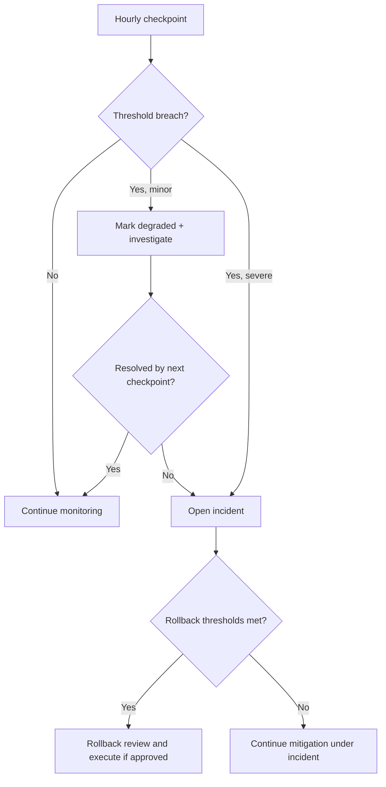

# Post-Deployment Validation Framework

**Session:** 6 — Phases 2-5 orchestration  
**Phase:** 4 — Post-Deployment Validation  
**Monitoring Window:** 2026-07-20T02:00:00Z → 2026-07-21T02:00:00Z  
**Scope:** 24-hour validation framework, checkpoints, and escalation rules

---

## 1. Objective

Validate that v0.2.0 remains stable, performant, secure, and rollback-safe for 24 hours after full production cutover.

## 2. Metrics Collection Strategy

### Hourly Checkpoints
- Record one checkpoint every hour for 24 hours.
- Capture baseline at full-cutover handoff (Hour 0).
- Compare each checkpoint against both hard thresholds and prior hour trend.
- Annotate incidents, mitigations, and owner decisions inline.

### Metrics Required Each Hour
- Request rate (RPS)
- Error rate (%)
- Latency p50 / p95 / p99
- CPU and memory peak / average
- Cache hit rate (%)
- DB connections and replication lag
- Healthy instances / restart count
- Active alerts and incidents
- Security / auth anomaly counts

## 3. Validation Checkpoint Template

```markdown
## Post-Deployment Checkpoint [HOUR N]
- Window: [START] → [END]
- Traffic level: 100%
- Decision owner: [NAME / AGENT]
- Status: [PASS / DEGRADED / FAIL]

| Metric | Baseline | Current | Allowed range | Status | Action |
|---|---:|---:|---:|---|---|
| Request rate (RPS) | [fill] | [fill] | expected band | PASS/DEGRADED/FAIL | |
| Error rate (%) | [fill] | [fill] | <0.05 warn / <1.0 hard | PASS/DEGRADED/FAIL | |
| Latency p95 (ms) | [fill] | [fill] | variance ≤5% | PASS/DEGRADED/FAIL | |
| Latency p99 (ms) | [fill] | [fill] | <2000 | PASS/DEGRADED/FAIL | |
| CPU peak (%) | [fill] | [fill] | <80 | PASS/DEGRADED/FAIL | |
| Memory peak (%) | [fill] | [fill] | <80 | PASS/DEGRADED/FAIL | |
| Cache hit rate (%) | [fill] | [fill] | ≥95 | PASS/DEGRADED/FAIL | |
| DB lag (ms) | [fill] | [fill] | <250 | PASS/DEGRADED/FAIL | |
| Healthy instances (%) | [fill] | [fill] | 100 / ≥95 min | PASS/DEGRADED/FAIL | |
| Active incidents | 0 | [fill] | 0 Sev-1/2 | PASS/DEGRADED/FAIL | |

- Observations:
  - [None / describe]
- Escalations triggered:
  - [None / describe]
- Gate decision:
  - [Continue / Intensify monitoring / Rollback review]
```

## 4. Daily Summary Report Structure

1. **Executive summary** — overall health and final decision
2. **24-hour metrics rollup** — average, min, max, and trend
3. **Incident summary** — counts by severity, MTTA, MTTR
4. **Notable anomalies** — what happened and what was done
5. **Security and compliance status** — auth, abuse, policy violations
6. **Rollback readiness status** — whether target remained viable throughout
7. **Recommendation** — close campaign / continue monitoring / remediate

## 5. Action Matrix

| Condition | Action | Escalation |
|---|---|---|
| Error rate >0.05% but <1.0% for one checkpoint | Mark DEGRADED, investigate immediately | High |
| Error rate ≥1.0% for 5 min | Open incident, evaluate rollback | Critical |
| p95 variance >5% but ≤10% | Continue monitoring + capacity review | Medium/High |
| p99 ≥2000ms for 5 min | Incident + rollback review | Critical |
| CPU or memory >80% for 10 min | Scale / tune / hold changes | High |
| Cache hit rate <95% for 10 min | Investigate cache path, check freshness | High |
| DB lag >250ms or pool >80% | Protect write path, evaluate rollback | Critical/High |
| Telemetry gap >10 min | Freeze decisions until visibility restored | Critical |
| Security event / policy violation | Security-led incident handling | Critical |

## 6. Incident Escalation Paths

- **Medium:** assigned responder investigates within 30 minutes.
- **High:** primary on-call + incident commander engaged within 5 minutes.
- **Critical:** primary + secondary paged immediately; rollback approver joins immediately.
- **Security-critical:** unified-security-scanner owner plus incident commander immediately.

## 7. Rollback Decision Thresholds

Rollback review becomes mandatory when any of the following occurs:

- Two consecutive hourly checkpoints marked `FAIL`
- One Critical incident with customer-visible impact
- Availability <99.5% in any active 1-hour window
- Error rate ≥1.0% for 5 minutes or repeated High alerts across 2 hours
- Evidence of data corruption, security compromise, or auth regression
- Monitoring blindness prevents trustworthy go-forward decisions

## 8. 24-Hour Monitoring Schedule

| Window | Cadence | Focus |
|---|---|---|
| Hours 0-6 | Hourly with live watch | ramp stabilization, immediate regressions |
| Hours 6-12 | Hourly | trend validation, capacity behavior |
| Hours 12-18 | Hourly | overnight / off-peak behavior |
| Hours 18-24 | Hourly + final rollup | closure readiness and residual risks |

### Required Summary Gates
- **T+6h:** continue / increase scrutiny / rollback review
- **T+12h:** stability trend confirmed or mitigation required
- **T+18h:** sustained healthy operations confirmed
- **T+24h:** final pass/fail recommendation for campaign closure

## 9. Final Validation Decision Tree



## 10. Exit Criteria

- [ ] 24 hourly checkpoints recorded
- [ ] T+6 / T+12 / T+18 / T+24 gates documented
- [ ] All incidents resolved or explicitly handed off
- [ ] Final summary report completed
- [ ] Campaign closure recommendation issued
