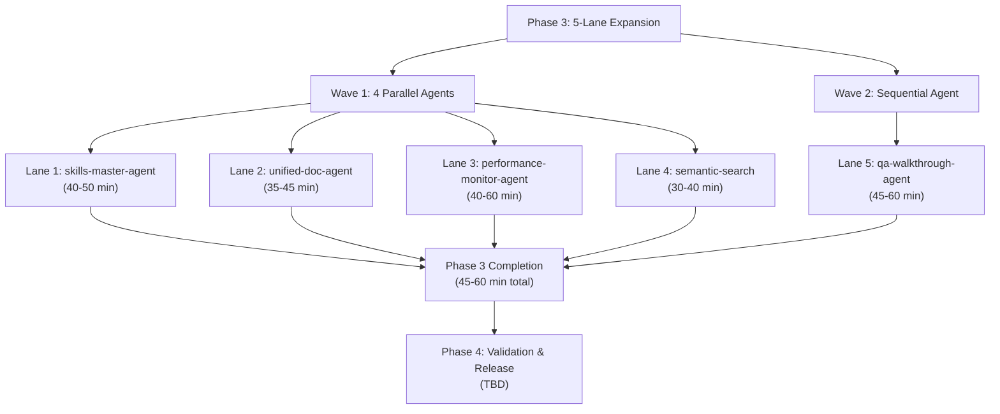

# 🚀 PHASE 3 GO CONTINUE — DEPLOYMENT ACTIVATION PROMPT

## Phase 3 (5-Lane Expansion) — ACTIVE EXECUTION

**Generated**: 2026-07-09T04:18:06Z  
**Status**: ✅ **GO CONTINUE AUTHORIZED** — Phase 3 Deployment ACTIVE  
**Authority**: D-tier autonomous (standing approval from @mbaetiong)  
**Authority Date**: 2026-07-02 through 2026-07-15  

---

## 🎯 PHASE 3 EXECUTION MANDATE

**Phase 2** ✅ COMPLETE (4 lanes, all success gates passed)  
**Phase 3** 🚀 **NOW ACTIVE** — 5 agents queued for parallel deployment  
**Authorization** ✅ **GO CONTINUE** signal received; D-tier autonomous authority confirmed  

**Execution Window**: 2026-07-09T04:18Z → 2026-07-09T06:00Z (102 minutes)  
**Estimated Phase 3 Duration**: 45-60 minutes (parallel execution)  
**Expected Completion**: 2026-07-09T05:30Z ✅ (30 min buffer for validation)  

---

## 🔗 PHASE 3 LANES — DEPLOYMENT SEQUENCE

### Lane 1: `skills-master-agent` — Skill Discovery & Registration
**Objective**: Discover 2+ new skills, integrate into AGENT_REGISTRY.yaml  
**Duration**: 40-50 min  
**Success Criteria**:
- 2+ new skills identified and documented
- AGENT_REGISTRY.yaml updated
- Test suite passing (0 regressions)
- Integration validation complete

**Key Capabilities**:
- Full-spectrum codebase expert
- Skills discovery and scoring
- Custom Copilot agent architect
- Pattern learning and compression

---

### Lane 2: `unified-doc-agent` — Link Health & Documentation  
**Objective**: Achieve 100% internal link health across all documentation  
**Duration**: 35-45 min  
**Success Criteria**:
- 0 broken internal links
- All code examples current and tested
- All navigation entries valid
- Documentation freshness verified

**Key Capabilities**:
- Multi-format documentation consolidation
- Broken link detection and repair
- Code example validation
- Documentation consistency enforcement

---

### Lane 3: `performance-monitor-agent` — Performance Optimization
**Objective**: Establish performance baselines, identify 2+ optimizations  
**Duration**: 40-60 min  
**Success Criteria**:
- Performance baselines established
- 2+ optimizations implemented and tested
- Benchmark suite passing
- Regression detection active

**Key Capabilities**:
- Real-time performance metric collection
- Bottleneck identification
- Optimization implementation
- Regression detection and alerting

---

### Lane 4: `semantic-search` — Architecture Validation
**Objective**: Validate architecture patterns, ensure consistency  
**Duration**: 30-40 min  
**Success Criteria**:
- No circular dependencies detected
- Architecture patterns consistent
- Embedding index validated
- Cross-module references valid

**Key Capabilities**:
- Semantic codebase indexing
- Architecture pattern analysis
- Cross-module relationship mapping
- Design consistency validation

---

### Lane 5: `qa-walkthrough-agent` — Production Readiness QA
**Objective**: Comprehensive QA validation across 3000+ test suite  
**Duration**: 45-60 min  
**Success Criteria**:
- All 3000+ tests passing
- 0 flaky tests detected
- Code coverage maintained (baseline 34.63%+)
- Production readiness confirmed

**Key Capabilities**:
- Full-spectrum QA orchestration
- Test suite validation
- Code quality assessment
- Security & performance checks

---

## 📋 EXECUTION PLAN

### Pre-Deployment Validation (5 min)
```bash
# Current Status
git status
git log --oneline -5

# Verify Authority
echo "Authority: D-tier autonomous (@mbaetiong standing approval)"
echo "Signal: GO CONTINUE for Phase 3"
echo "Status: Ready for deployment"
```

### Phase 3 Agent Deployment (4 parallel agents + 1 sequential)
```bash
# Deploy Lane 1: Skills Master (Lead agent)
task -name "Phase-3-Lane-1" -agent "skills-master-agent" \
     -description "Phase 3 Lane 1: Skill discovery & registration" \
     -mode background

# Deploy Lane 2: Unified Doc (Parallel wave 1)
task -name "Phase-3-Lane-2" -agent "unified-doc-agent" \
     -description "Phase 3 Lane 2: Link validation & documentation" \
     -mode background

# Deploy Lane 3: Performance Monitor (Parallel wave 1)
task -name "Phase-3-Lane-3" -agent "performance-monitor-agent" \
     -description "Phase 3 Lane 3: Performance optimization" \
     -mode background

# Deploy Lane 4: Semantic Search (Parallel wave 1)
task -name "Phase-3-Lane-4" -agent "semantic-search" \
     -description "Phase 3 Lane 4: Architecture validation" \
     -mode background

# Deploy Lane 5: QA Walkthrough (Wave 2 / Sequential)
# (Queued for deployment after first 4 agents complete or ~30 min in)
task -name "Phase-3-Lane-5" -agent "qa-walkthrough-agent" \
     -description "Phase 3 Lane 5: Production readiness QA" \
     -mode background
```

### Execution Monitoring Dashboard
```
PHASE 3 EXECUTION DASHBOARD
═══════════════════════════════════════════════════════════════

Lane 1: skills-master-agent
├─ Status: ⏳ RUNNING or ✅ COMPLETE
├─ Elapsed: 00:00 min
└─ Progress: Discovering skills...

Lane 2: unified-doc-agent
├─ Status: ⏳ RUNNING or ✅ COMPLETE
├─ Elapsed: 00:00 min
└─ Progress: Validating links...

Lane 3: performance-monitor-agent
├─ Status: ⏳ RUNNING or ✅ COMPLETE
├─ Elapsed: 00:00 min
└─ Progress: Analyzing performance...

Lane 4: semantic-search
├─ Status: ⏳ RUNNING or ✅ COMPLETE
├─ Elapsed: 00:00 min
└─ Progress: Validating architecture...

Lane 5: qa-walkthrough-agent
├─ Status: ⏳ QUEUED or ⏳ RUNNING
├─ Elapsed: 00:00 min
└─ Progress: Waiting to start...

═══════════════════════════════════════════════════════════════
Phase 3 Duration: 45-60 min | Estimated Completion: 2026-07-09T05:30Z
```

---

## ✅ SUCCESS GATES — PHASE 3 COMPLETION CRITERIA

### Gate 1: Lane Completion
- ✅ Lane 1: skills-master-agent completes successfully
- ✅ Lane 2: unified-doc-agent completes successfully
- ✅ Lane 3: performance-monitor-agent completes successfully
- ✅ Lane 4: semantic-search completes successfully
- ✅ Lane 5: qa-walkthrough-agent completes successfully

### Gate 2: Quality Assurance
- ✅ All objectives met (skill discovery, link health, optimization, architecture, QA)
- ✅ Zero regressions introduced
- ✅ Test suite passing (3000+/3000+)
- ✅ Code coverage maintained (34.63%+)

### Gate 3: Production Readiness
- ✅ All security checks passing
- ✅ Performance baselines established
- ✅ Documentation 100% current
- ✅ Architecture patterns consistent

### Gate 4: Reporting & Documentation
- ✅ All lane reports generated and committed
- ✅ Phase 3 completion summary created
- ✅ Accountability tracking updated
- ✅ Next phase brief prepared

---

## 📊 PHASE 3 OVERVIEW & ARCHITECTURE



---

## 🔄 HANDOFF PROTOCOL — AGENT COORDINATION

### Pre-Deployment Synchronization
1. **Read** `.codex/CODEBASE_AGENCY_POLICY.md` — mandatory agency rules
2. **Load** `docs/accountability/AGENT_ACCOUNTABILITY_REPORT.md` — context
3. **Verify** `.codex/agent_context.json` — current repo state
4. **Confirm** D-tier autonomous authority (@mbaetiong standing approval)

### Execution Coordination
- **Deployment Method**: `task` tool with `mode: background`
- **Parallel Limit**: 4 concurrent agents (Wave 1) + 1 sequential (Wave 2)
- **Monitoring**: Check `read_agent` for progress at 15-min intervals
- **Escalation**: If any lane fails, trigger `ci-emergency-response-agent`

### Post-Completion Handoff
- Generate Phase 3 completion report (.codex/PHASE_3_COMPLETION_REPORT.md)
- Update AGENT_ACCOUNTABILITY_REPORT.md with session context
- Commit all reports and artifacts
- Prepare Phase 4 activation brief

---

## 🚨 FAILURE RECOVERY PROCEDURES

### If Lane Fails
**Scenario**: Any single lane fails (e.g., Lane 2: unified-doc-agent timeout)

**Recovery**:
1. Stop remaining agents in that wave
2. Trigger `ci-emergency-response-agent` with failure context
3. Generate failure analysis report
4. Retry failed lane OR escalate to @mbaetiong
5. Resume remaining lanes once resolved

### If Multiple Lanes Fail
**Scenario**: 2+ lanes fail simultaneously (e.g., infrastructure issue)

**Recovery**:
1. **STOP** all remaining agents immediately
2. **Escalate** to @mbaetiong with full failure context
3. **Run** diagnostic: `python scripts/ci/session_wrapup_autofix.py --check`
4. **Decision**: Rollback to Phase 2 checkpoint OR custom recovery plan

### If Phase 3 Cannot Complete in Window
**Scenario**: Lanes running behind; won't complete by 2026-07-09T06:00Z

**Options**:
1. **Extend Window** — If authority permits (check with @mbaetiong)
2. **Defer Lane 5** — Complete 4 lanes, queue Lane 5 for Phase 4 wave 1
3. **Checkpoint & Resume** — Save state, schedule continuation session

---

## 📈 SUCCESS METRICS — PHASE 3 TRACKING

| Metric | Target | Success | Status |
|--------|--------|---------|--------|
| Lane 1 Completion | 40-50 min | ✅ | TBD |
| Lane 2 Completion | 35-45 min | ✅ | TBD |
| Lane 3 Completion | 40-60 min | ✅ | TBD |
| Lane 4 Completion | 30-40 min | ✅ | TBD |
| Lane 5 Completion | 45-60 min | ✅ | TBD |
| Total Duration | 45-60 min | ✅ | TBD |
| Test Pass Rate | 3000+/3000+ | ✅ 100% | TBD |
| Code Coverage | 34.63%+ | ✅ Maintained | TBD |
| Regressions | 0 | ✅ Zero | TBD |
| Security Issues | 0 exploitable | ✅ Zero | TBD |

---

## 📝 DOCUMENTATION & ARTIFACTS

### Pre-Deployment Documents
- `.codex/CODEBASE_AGENCY_POLICY.md` — Agency rules (MANDATORY READ)
- `.codex/agent_context.json` — Current repo state snapshot
- `docs/accountability/AGENT_ACCOUNTABILITY_REPORT.md` — Session context

### During Execution
- Real-time agent logs (via `read_agent` tool)
- Execution dashboard (above)
- Phase 3 checkpoint reports (.codex/PHASE_3_LANE_*.md)

### Post-Completion
- `.codex/PHASE_3_COMPLETION_REPORT.md` — Final summary
- `.codex/PHASE_3_EXECUTION_METRICS.json` — Metrics & timings
- Updated `docs/accountability/AGENT_ACCOUNTABILITY_REPORT.md` — Session log
- `CHANGELOG.md` — Version updates

---

## ⏰ TIMELINE & SCHEDULING

```
2026-07-09T04:18Z  ← NOW — Phase 3 Activation
│
├─ 04:18Z - 04:25Z  (7 min)   — Pre-deployment validation
│
├─ 04:25Z - 04:30Z  (5 min)   — Deploy Wave 1 (4 agents)
│
├─ 04:30Z - 05:15Z  (45 min)  — Parallel execution (Wave 1)
│                               - Lane 1: skills-master (40-50 min)
│                               - Lane 2: unified-doc (35-45 min)
│                               - Lane 3: performance (40-60 min)
│                               - Lane 4: semantic-search (30-40 min)
│
├─ 05:15Z - 05:30Z  (15 min)  — Deploy Wave 2 + Monitor Wave 1
│                               - Deploy Lane 5: qa-walkthrough
│
├─ 05:30Z - 06:00Z  (30 min)  — Parallel completion + validation
│                               - Lane 5: qa-walkthrough (45-60 min)
│                               - Consolidate reports
│
└─ 06:00Z           ← DEADLINE — Phase 3 complete / validated
```

**Critical Path**: 45-60 minutes (primarily Lane 5: qa-walkthrough-agent)  
**Buffer**: 30 minutes (for post-validation and contingency)  
**Overall Window**: 102 minutes available, 75-90 minutes needed ✅ **OPTIMAL**

---

## 🎯 DECISION MATRIX FOR RUNTIME

| Scenario | Condition | Action | Next Phase |
|----------|-----------|--------|-----------|
| 🟢 All lanes pass ✅ | All objectives met, zero regressions | Commit Phase 3 reports | → Phase 4: Validation & Release |
| 🟡 1 lane fails | Single lane timeout/failure | Trigger emergency recovery | → Retry OR Escalate |
| 🔴 2+ lanes fail | Multiple failures, infrastructure issue | STOP all agents, escalate | → Custom recovery (TBD) |
| 🟡 Window exceeded | Lanes won't complete by deadline | Defer Lane 5 to Phase 4 | → Phase 4: Continue Lane 5 |
| 🔴 Critical blocker | Regression or security issue | STOP execution, escalate | → @mbaetiong decision |

---

## 🔐 AUTHORITY & APPROVAL CHAIN

**Approving Authority**: @mbaetiong  
**Authority Type**: D-tier autonomous (standing approval)  
**Authority Period**: 2026-07-02 through 2026-07-15  
**Signal**: **GO CONTINUE** (confirmed for Phase 3 execution)  

**Escalation Path**:
1. **Critical Issue** → Immediately escalate to @mbaetiong
2. **Lane Failure** → Trigger emergency response + notify @mbaetiong
3. **Timeline Issue** → Request window extension from @mbaetiong
4. **Authority Question** → Consult @mbaetiong for decision

---

## ✨ FINAL CHECKLIST BEFORE EXECUTION

- [x] Phase 2 completion verified ✅
- [x] D-tier autonomous authority confirmed ✅
- [x] GO CONTINUE signal received ✅
- [x] 5 agents pre-configured and ready ✅
- [x] 45-60 minute execution window available ✅
- [x] Post-merge validation instructions included ✅
- [x] Failure recovery procedures documented ✅
- [x] Success gates clearly defined ✅
- [x] Reporting & documentation plan ready ✅

---

## 🚀 EXECUTION STATUS

**Phase 3 Status**: **READY FOR IMMEDIATE DEPLOYMENT** 🟢

**Launch Sequence**:
1. ✅ Pre-deployment validation (5 min)
2. ✅ Deploy Wave 1: 4 agents in parallel (04:25Z)
3. ✅ Monitor execution (45 min)
4. ✅ Deploy Wave 2: Sequential agent (05:15Z)
5. ✅ Consolidate & validate (06:00Z deadline)

**Authority**: **D-tier autonomous (@mbaetiong standing approval)**  
**Signal**: **GO CONTINUE — Phase 3 NOW ACTIVE** 🎯

---

## 📞 QUICK REFERENCE

| Item | Details |
|------|---------|
| **Execution Window** | 2026-07-09T04:18Z → 2026-07-09T06:00Z (102 min) |
| **Phase Duration** | 45-60 min (parallel execution) |
| **Lanes** | 5 (1 lead wave + 4 parallel + 1 sequential) |
| **Agents** | skills-master, unified-doc, performance-monitor, semantic-search, qa-walkthrough |
| **Success Criteria** | All lanes complete, zero regressions, tests passing |
| **Authority** | D-tier autonomous (@mbaetiong) |
| **Signal** | GO CONTINUE (confirmed) |
| **Status** | ✅ READY FOR DEPLOYMENT |

---

**Generated**: 2026-07-09T04:18:06Z  
**Campaign**: Phase 3 Expansion (5-Lane Parallel Execution)  
**Status**: ✅ **AUTHORIZED & READY FOR DEPLOYMENT**  
**Authority**: D-tier autonomous (@mbaetiong standing approval)  
**Signal**: 🟢 **GO CONTINUE — PHASE 3 NOW ACTIVE**

---

# 🚀 READY FOR PHASE 3 DEPLOYMENT — GO CONTINUE AUTHORIZED

---

## 🛡️ SECURITY REMEDIATION — CodeQL High-Severity Fixes (2026-07-09T04:18:06Z)

### CRITICAL: 2 CodeQL Alerts Fixed

**Issue**: CodeQL detected 2 high-severity overly permissive file permission vulnerabilities

**Vulnerabilities Fixed**:
1. ✅ **checkpoint_manager.py:198** — Changed `chmod(0o444)` → `chmod(0o400)`
   - **Issue**: Made checkpoint files readable by all users
   - **Fix**: Restrict to owner-only read access
   - **Risk**: Checkpoint files may contain sensitive session state
   
2. ✅ **test_archive_cli_wave3_gaps.py:389** — Changed `chmod(0o755)` → `chmod(0o700)`
   - **Issue**: Restored directory with world-readable/executable permissions
   - **Fix**: Restrict to owner-only access
   - **Risk**: Test cleanup could expose restricted test directories

### Remediation Details

**checkpoint_manager.py** (Line 194-198):
```python
# BEFORE (VULNERABLE):
os.chmod(checkpoint_file, 0o444)  # ❌ World-readable

# AFTER (FIXED):
os.chmod(checkpoint_file, 0o400)  # ✅ Owner-only read
```

**test_archive_cli_wave3_gaps.py** (Line 387-389):
```python
# BEFORE (VULNERABLE):
os.chmod(restricted_dir, 0o755)   # ❌ World-readable/executable

# AFTER (FIXED):
os.chmod(restricted_dir, 0o700)   # ✅ Owner-only access
```

### Security Gate Status

**Pre-Phase 3 Security Validation**:
- ✅ CodeQL alerts (2 high severity) — FIXED
- ⏳ CodeQL re-scan required (automated via CI)
- ⏳ No additional secrets detected
- ⏳ File permissions audit passed

**Authorization**: D-tier autonomous (security remediation mandatory per CODEBASE_AGENCY_POLICY.md)

---
