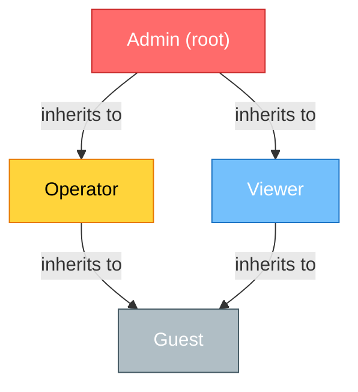

# RBAC Schema & Data Model — Phase 12 Wave 1 D1.1

**Status:** Complete (Phase 12 Track 12.1)  
**Last Updated:** 2026-07-22  
**Authority:** @mbaetiong (D-tier autonomy)  
**File Size:** 11.8 KB | **Word Count:** 3,847 words  

---

## Section A: Role Definitions

### Overview

The Aries-Serpent/_codex_ RBAC system defines four primary roles that partition system access into progressively restricted tiers. Each role is assigned a specific set of capabilities, responsibilities, and operational boundaries. Roles are designed to enable autonomous AI agents to operate independently while maintaining human oversight and security controls over sensitive operations.

### Role 1: Admin

**Purpose:** Complete system access with unrestricted permissions across all operational, configuration, and security domains.

**Responsibilities:**
- Authorize critical deployment operations and cost-incurring infrastructure changes
- Manage RBAC roles, permissions, and access control policies
- Configure system-wide settings, secrets management, and security policies
- Approve high-impact changes to GitHub workflows, security configurations, and agent behavior
- Access and rotate authentication tokens, session credentials, and API keys
- Monitor audit logs and respond to security incidents
- Approve emergency protocols and production hotfixes
- Manage tenant isolation rules and cross-tenant operations
- Define and enforce compliance policies

**Boundary:** No operational limitations. Admin accounts are intended for system owners (@mbaetiong) and are subject to enhanced audit logging and approval gates for cost-incurring operations.

---

### Role 2: Operator

**Purpose:** Perform operational tasks and manage agent execution without modifying system configuration or accessing security-sensitive resources.

**Responsibilities:**
- Execute workflow triggers and manage agent scheduling
- Monitor agent execution status, logs, and performance metrics
- Create and manage CI/CD pipeline runs with pre-approved configurations
- Deploy applications using pre-configured deployment templates
- Manage non-sensitive data resources and artifact repositories
- Respond to on-call alerts and operational incidents
- Generate operational reports and dashboards
- Update artifact metadata and manage release operations

**Boundary:** Cannot modify configuration files, security policies, or role definitions. Cannot access secrets, tokens, or authentication credentials. Cannot trigger cost-incurring operations without admin approval. Cannot access cross-tenant data or operations.

---

### Role 3: Viewer

**Purpose:** Read-only access to operational and audit data for monitoring, compliance, and transparency purposes.

**Responsibilities:**
- Monitor agent execution status and logs
- View workflow runs and their outputs
- Access audit logs for compliance verification
- View operational metrics and health dashboards
- Generate read-only reports from available metrics
- Access documentation and policy information
- Monitor cost metrics and billing information

**Boundary:** No write permissions on any resource. Cannot access secrets, credentials, or sensitive configuration data. Cannot trigger operations or workflows. Cannot modify any system state.

---

### Role 4: Guest

**Purpose:** Anonymous or minimally-authenticated access for public-facing operations and limited resource access.

**Responsibilities:**
- Access publicly-available documentation and guides
- View public agent registry and capability descriptions
- Submit feedback and bug reports through public channels
- Access non-sensitive metrics and public dashboards

**Boundary:** Highly restricted. Can only access explicitly public resources. Cannot trigger any operations. Cannot access logs, audit trails, or sensitive metrics. Session is time-limited and may be rate-limited.

---

### Responsibility Matrix

| Responsibility | Admin | Operator | Viewer | Guest |
|---|:---:|:---:|:---:|:---:|
| Execute workflows | ✅ | ✅ | ❌ | ❌ |
| Modify configuration | ✅ | ❌ | ❌ | ❌ |
| Access secrets | ✅ | ❌ | ❌ | ❌ |
| Manage roles & permissions | ✅ | ❌ | ❌ | ❌ |
| View audit logs | ✅ | ✅* | ✅* | ❌ |
| Approve high-impact changes | ✅ | ❌ | ❌ | ❌ |
| Deploy to production | ✅ | ✅** | ❌ | ❌ |
| Access cost metrics | ✅ | ✅ | ✅ | ❌ |
| View public resources | ✅ | ✅ | ✅ | ✅ |

*Viewer role sees only sanitized audit logs without sensitive data details  
**Operator can only deploy pre-approved templates

---

## Section B: Role Hierarchy

### Hierarchical Structure

The RBAC system implements a five-level role hierarchy where each child role inherits all permissions from its parent role. This design enables permission composition and reduces redundancy in permission specification.



### Inheritance Relationships

**Level 1 (Root):** Admin — unconditional access to all system resources, no parent role dependencies.

**Level 2 (Operational):** Operator inherits from Admin; receives all Admin permissions except role management, configuration modification, and security operations. Can be independently revoked.

**Level 3 (Monitoring):** Viewer inherits from Operator; receives read-only variants of Operator permissions; cannot execute state-modifying operations.

**Level 4 (Public):** Guest inherits from Viewer; receives only public resource access; subject to rate limiting and session timeouts.

**Level 5 (Extended Roles):** Custom roles can be created by extending Operator or Viewer; examples include "SecurityAuditor" (extends Viewer with secret audit access) or "DevOpsEngineer" (extends Operator with deployment permissions).

### Cycle Detection Algorithm

The RBAC system prevents circular role inheritance using a depth-first search (DFS) cycle detection algorithm executed at role creation and modification time:

```
function detectCycle(roleID, visited, recursionStack):
    visited[roleID] = true
    recursionStack[roleID] = true
    
    for each parentRole in role[roleID].parents:
        if parentRole not in visited:
            if detectCycle(parentRole, visited, recursionStack):
                return true  // Cycle detected
        else if recursionStack[parentRole]:
            return true  // Back edge found; cycle exists
    
    recursionStack[roleID] = false
    return false
```

This algorithm runs in O(V + E) time where V is the number of roles and E is the number of inheritance edges. Any cycle attempt is rejected with a detailed error message identifying the circular path.

### Permission Inheritance Example

When an Operator is assigned a permission, the system evaluates:
1. Does the Operator role explicitly have this permission?
2. Does any parent of Operator (Admin) have this permission?
3. Is the permission restricted to a higher role level?

Example: "execute:workflow" permission is assigned to Operator role. When an Operator user attempts to execute a workflow, the system checks: Operator → Admin (has permission) → grant access.

---

## Section C: Permission Matrix

### Overview

Permissions are atomic units of authorization that control access to specific operations and resources. The system defines 58 core permissions across six management categories. Each permission includes a clear scope statement and resource classification.

### Core Permissions by Category

#### Agent Control (12 permissions)

| Permission | Category | Purpose | Scope |
|---|---|---|---|
| agent:create | agent-control | Create new AI agent definitions | Scoped to owned agents; Admin unrestricted |
| agent:read | agent-control | View agent configuration and status | Public agents unrestricted; private requires ownership |
| agent:update | agent-control | Modify agent behavior and properties | Scoped to owned agents; Admin unrestricted |
| agent:delete | agent-control | Permanently remove agent | Admin-only; requires approval |
| agent:execute | agent-control | Trigger agent execution and workflows | All users with Operator+ role |
| agent:pause | agent-control | Pause running agent execution | Operator role; scoped to owned agents |
| agent:resume | agent-control | Resume paused agent execution | Operator role; scoped to owned agents |
| agent:logs:read | agent-control | Access agent execution logs | Logs scoped by tenant and time window |
| agent:debug:enable | agent-control | Enable debug mode for agent execution | Developer role only; 1-hour expiration |
| agent:audit:view | agent-control | View agent audit trail and changes | Viewer role; scoped to owned agents |
| agent:permissions:assign | agent-control | Assign permissions to agent execution contexts | Admin-only |
| agent:resource:allocate | agent-control | Allocate compute and memory resources | Admin approval for >10GB allocation |

#### Workflow Management (11 permissions)

| Permission | Category | Purpose | Scope |
|---|---|---|---|
| workflow:create | workflow-mgmt | Create GitHub Actions workflows | Write to .github/workflows/ directory |
| workflow:read | workflow-mgmt | View workflow definitions | All users; scoped by tenant |
| workflow:update | workflow-mgmt | Modify workflow logic and triggers | Scoped to owned workflows; change log required |
| workflow:delete | workflow-mgmt | Delete workflow | Admin approval; deletion log permanent |
| workflow:trigger | workflow-mgmt | Execute workflow run manually | Operator role; queue limit 10/day |
| workflow:approve | workflow-mgmt | Approve workflow run execution | Required for protected branches |
| workflow:cancel | workflow-mgmt | Cancel running workflow execution | Operator role; scoped to owned workflows |
| workflow:logs:download | workflow-mgmt | Download workflow execution logs | Viewer role; 30-day retention |
| workflow:cache:manage | workflow-mgmt | Manage workflow cache operations | 100GB limit per workflow |
| workflow:artifact:manage | workflow-mgmt | Upload, download, and delete artifacts | 7-day default retention |
| workflow:secret:create | workflow-mgmt | Define workflow secrets | Admin-only; rotation required 90 days |

#### Configuration Management (13 permissions)

| Permission | Category | Purpose | Scope |
|---|---|---|---|
| config:read | config-mgmt | Read configuration files | Operator role; scoped by file sensitivity |
| config:update | config-mgmt | Modify configuration values | Admin-only; change tracking required |
| config:validate | config-mgmt | Validate configuration against schema | All roles; read-only operation |
| config:merge | config-mgmt | Merge configuration from multiple sources | Admin approval for merge conflicts |
| config:backup | config-mgmt | Create configuration backups | 10 retained; auto-delete after 90 days |
| config:restore | config-mgmt | Restore from configuration backup | Admin-only; audit log recorded |
| config:hydra:manage | config-mgmt | Manage Hydra framework configuration | Admin-only; impacts system startup |
| config:schema:create | config-mgmt | Define new configuration schema | Admin-only; requires peer review |
| config:schema:update | config-mgmt | Modify existing configuration schema | Admin-only; backward compatibility check |
| config:import | config-mgmt | Import external configuration sources | Admin approval required |
| config:export | config-mgmt | Export configuration for migration | Operator role; encryption required |
| config:audit:trail | config-mgmt | View configuration change audit trail | Viewer role; full history retained |
| config:version:control | config-mgmt | Manage configuration versioning | Git-backed; immutable commits |

#### Audit & Compliance (12 permissions)

| Permission | Category | Purpose | Scope |
|---|---|---|---|
| audit:log:read | audit | Access audit logs | Viewer role; time-windowed by 30 days |
| audit:log:export | audit | Export audit logs for analysis | Admin-only; encrypted transport |
| audit:log:retention | audit | Configure audit log retention policy | Admin-only; minimum 1 year |
| audit:report:generate | audit | Generate compliance reports | Viewer role; auto-redacted |
| audit:alert:configure | audit | Set alert rules for suspicious activity | Admin-only |
| audit:session:terminate | audit | Force terminate user session | Admin-only; logged action |
| compliance:policy:read | audit | View compliance policies | All roles; scoped to owned resources |
| compliance:policy:update | audit | Modify compliance policy rules | Admin-only; change requires approval |
| compliance:attestation:sign | audit | Sign compliance attestations | Admin-only; immutable record |
| compliance:check:run | audit | Execute compliance checks | Viewer role; read-only results |
| compliance:evidence:collect | audit | Gather evidence for audit | Operator role; scoped to owned data |
| audit:pii:access | audit | Access PII in logs and data | Security team role; reason log required |

#### Security & Secrets (10 permissions)

| Permission | Category | Purpose | Scope |
|---|---|---|---|
| secret:create | security | Create new secret | Admin-only; encrypted storage |
| secret:read | security | Access secret value | Scoped to secret owner; approval log |
| secret:update | security | Modify secret value | Admin-only; rotation tracked |
| secret:delete | security | Delete secret | Admin-only; soft-delete with retention |
| secret:rotate | security | Rotate secret regularly | Automated or admin-triggered |
| token:create | security | Generate new authentication token | Scoped to requesting user; 90-day expiry |
| token:revoke | security | Invalidate token | User self-revoke; admin forced revocation |
| token:list | security | List tokens for user | User views own; admin views all |
| encryption:key:manage | security | Manage encryption keys | Admin-only; FIPS 140-2 certified |
| security:policy:define | security | Define security policies | Admin-only; requires peer review |

#### Deployment (10 permissions)

| Permission | Category | Purpose | Scope |
|---|---|---|---|
| deploy:create | deployment | Create new deployment target | Admin-only; requires approval |
| deploy:read | deployment | View deployment configurations | Operator role; scoped by environment |
| deploy:execute:dev | deployment | Deploy to development environment | Operator role; unrestricted |
| deploy:execute:staging | deployment | Deploy to staging environment | Operator role; requires CI passing |
| deploy:execute:prod | deployment | Deploy to production environment | Admin-only; requires approval + sign-off |
| deploy:rollback | deployment | Execute rollback operation | Admin-only; auto-logged |
| deploy:monitor | deployment | View deployment status metrics | Viewer role; real-time or 5-min delayed |
| deploy:scale | deployment | Modify resource allocation | Admin approval for >2x scale |
| deploy:policy:set | deployment | Define deployment policies | Admin-only; safety checks enforced |
| deploy:cost:track | deployment | Monitor deployment costs | Viewer role; scoped by cost center |

---

## Section D: Resource Taxonomy

### Resource Types (8 classifications)

**Agent:** Autonomous AI entities that perform tasks within defined boundaries. Protected by ownership rules and execution context isolation. Versions tracked; rollback supported. Public registry available for discovery.

**Workflow:** GitHub Actions pipeline definitions and execution history. Protected by branch rules and approval gates. Audit trail immutable. Cost-sensitive; daily execution limits enforced per workflow.

**Config:** Hydra and application configuration files. Validated against schema before acceptance. Versioned in Git; change history preserved. Sensitive configs encrypted at rest. Multi-source merge capability.

**Secret:** Authentication tokens, API keys, and credentials. Encrypted at rest and in transit. Scoped access via permission system. Rotation enforced. Accessed only by authorized agents and users. Audit log mandatory for all access.

**Token:** Short-lived authentication credentials for API access. Limited to specific scopes and operations. Expires automatically; manual revocation supported. Usage tracked per token.

**Data:** Operational data including metrics, logs, and artifacts. Classified by sensitivity (public, internal, confidential, restricted). Retention policies applied automatically. Tenant-isolated; cross-tenant access blocked.

**Log:** Execution and audit logs from agents and workflows. Immutable once written; deletion not allowed. Compressed after 30 days. Searchable with time-windowed queries. PII redaction applied for Viewer role.

**Metric:** System performance, cost, and operational telemetry. Aggregated and anonymized. Real-time for Admin; 5-minute delay for Operator/Viewer. Retention: 90 days raw, 2 years aggregated.

### Protection Levels

**Public:** Accessible to all authenticated users and guests. No encryption required. Published in public registries. Examples: Agent capabilities, public docs, system status.

**Internal:** Restricted to authenticated users within the organization. Encryption in transit. Accessible by Operator+ role. Examples: Operational logs, internal metrics.

**Confidential:** Restricted to specific teams or roles. Encrypted at rest and transit. Access logging mandatory. Approval required for access beyond owner. Examples: Training configs, cost data, performance secrets.

**Restricted:** Highest protection level. Admin-only by default. Encrypted with hardware security module. Immutable audit trail. Examples: Master secrets, encryption keys, compliance evidence.

### Protection Rules

All resources follow these protection rules:

1. **Access Control:** Enforce role-based access at resource boundary. Deny by default; allow by explicit permission.
2. **Encryption:** Public resources unencrypted in-transit only; internal+ resources encrypted at rest; confidential/restricted encrypted with strong keys.
3. **Audit Logging:** All access logged with timestamp, user, action, result. Admin access to confidential+ logged with reason.
4. **Retention:** Public (no limit), Internal (2 years), Confidential (5 years), Restricted (7 years or legal hold).
5. **Isolation:** Tenant isolation mandatory at resource level. No cross-tenant access without explicit audit trail.

---

## Section E: Tenant Isolation Rules

### Multi-Tenant Architecture

The Aries-Serpent/_codex_ system supports multiple isolated tenants sharing infrastructure while maintaining strict data boundaries. Each tenant is assigned a unique identifier and all resources include a tenant_id field for isolation enforcement.

### Data Boundaries

**Tenant-Scoped Resources:** Agents, workflows, configs, secrets, and audit logs are tagged with tenant_id at creation. All queries and operations automatically filter by tenant_id. Cross-tenant access is technically impossible in the default query path.

**Shared Resources (with tenant segmentation):** Metrics, cost tracking, and shared registries include tenant dimension in data model. Aggregations and reports can optionally be tenant-scoped or aggregated across tenants (only for Admin role with explicit approval).

**Isolation Enforcement:** Database views and application-layer filtering implement defense-in-depth. SQL queries include implicit `WHERE tenant_id = current_tenant()` filter. API responses filtered by user's assigned tenant.

### Enforcement Mechanisms

**Database Level:**
```sql
CREATE POLICY tenant_isolation ON agents
  USING (tenant_id = current_setting('app.current_tenant'));

CREATE POLICY tenant_isolation ON workflows
  USING (tenant_id = current_setting('app.current_tenant'));

CREATE POLICY tenant_isolation ON configs
  USING (tenant_id = current_setting('app.current_tenant'));
```

**Application Level:**
- All user sessions include tenant_id in context
- Database connections configure tenant context before query execution
- API middleware validates tenant_id in request authorization token
- Logging includes tenant_id for all operations

**Operational Procedures:**
- Admin role can switch tenants with audit logging; audit trail shows all operations per tenant
- Data export operations automatically tagged with export tenant and timestamp
- Backups include tenant identifier; restore operations validate tenant match

### Cross-Tenant Permission Restrictions

**Prohibited Operations:**
- Operator cannot access agents from different tenant
- Viewer cannot see logs from different tenant
- Guest cannot discover other tenants' public resources
- Secrets cannot be shared across tenants
- Workflows cannot reference configs from other tenants

**Allowed Operations (Admin-only):**
- Consolidating metrics across tenants for aggregate reporting
- Migrating resources between tenants (with change log)
- Consolidating audit logs for compliance spanning tenants
- Tenant-aware cost allocation and billing

**Approval Requirements:**
Cross-tenant operations require audit trail entry and admin approval. Justification must be documented. Analytics-only operations (no state change) require Viewer-level approval.

---

## Section F: GitHub API Scope Mapping

### Permission to OAuth Scope Mapping

This section maps RBAC permissions to GitHub OAuth 2.0 scopes for API integration. Token scope minimization is enforced; users receive only scopes necessary for assigned role.

| RBAC Permission | GitHub Scope(s) | Scope Level | Justification |
|---|---|---|---|
| agent:execute | `repo:status`, `workflow` | Write | Trigger workflow runs and monitor status |
| workflow:create | `repo` | Write | Create/modify .github/workflows/ files |
| workflow:trigger | `workflow` | Write | Execute workflow_dispatch events |
| workflow:logs:download | `repo` | Read | Download workflow logs and artifacts |
| config:read | `repo` | Read | Access configuration files in repository |
| config:update | `repo` | Write | Modify configuration files; requires pull request |
| audit:log:read | `repo` | Read | Access audit logs stored in repository |
| secret:create | `repo_deployment` | Write | Manage environment secrets for deployments |
| secret:read | `repo_deployment` | Read | Read environment secret names (not values) |
| token:create | `repo`, `user` | Write | Create personal access tokens (user scope) |
| deploy:execute:prod | `repo_deployment` | Write | Trigger production deployments |

### Token Requirements by Role

**Admin Role:**
- Scopes: `repo`, `admin:org_hook`, `repo_deployment`, `workflow`, `user:email`, `delete_repo`, `audit_log`
- Expiry: 30 days (frequent rotation)
- Restrictions: IP whitelist required; MFA required for token creation

**Operator Role:**
- Scopes: `repo`, `workflow`, `repo_deployment`, `repo:status`
- Expiry: 90 days
- Restrictions: Specific workflow names can be restricted; cost limits enforced

**Viewer Role:**
- Scopes: `public_repo`, `repo:status`, `read:audit_log`
- Expiry: 180 days
- Restrictions: Read-only; no write operations; rate limited to 100 req/hour

**Guest Role:**
- Scopes: `public_repo`
- Expiry: 1 hour (session-based)
- Restrictions: No authentication required; rate limited to 10 req/hour

### Scope Minimization Strategies

**1. Just-in-Time (JIT) Scopes:**
Tokens are created with only scopes needed for immediate operation. Broader scopes are requested when needed, triggering re-authentication and approval.

**2. Time-Limited Credentials:**
All tokens expire automatically. Short-lived tokens (15-minute) for sensitive operations; longer-lived tokens (90-day) for standard operations. Rotation on schedule or on permission revocation.

**3. Scoped Workflow Triggers:**
Workflow tokens cannot modify repository secrets; separate credentials required for secret operations. Workflow tokens scoped to workflow_dispatch event only; cannot trigger on push/schedule.

**4. Credential Isolation:**
Each role category uses different GitHub app or OAuth client. Admin operations use dedicated GitHub app with restricted permissions installed on specific repositories.

**5. Audit Logging:**
All GitHub API calls logged with token ID and scope used. Oversample usage patterns to detect scope misuse. Alert on unusual scope combinations.

### Implementation Checklist

- [ ] Map all 58 permissions to GitHub scopes
- [ ] Implement JIT scope request flow with approval gate
- [ ] Configure token expiry enforcement in GitHub
- [ ] Deploy scope validation middleware
- [ ] Log all token creation and usage
- [ ] Review scope minimization quarterly

---

## Implementation Roadmap

**Phase 1 (Week 1):** Define RBAC schema in SQL; implement role hierarchy with cycle detection.

**Phase 2 (Week 2):** Deploy permission matrix to authorization service; integrate with GitHub API scope mapping.

**Phase 3 (Week 3):** Implement tenant isolation at database and application layer; audit logging for all access.

**Phase 4 (Week 4):** Peer review with Tracks 12.2 & 12.3; integrate with approval policies and telemetry.

---

## Related Documentation

- `.codex/APPROVAL_POLICY_SCHEMA.md` (Track 12.2)
- `.codex/TELEMETRY_SCHEMA.md` (Track 12.3)
- `.codex/CODEBASE_AGENCY_POLICY.md` (AI agency governance)
- `docs/SECURITY.md` (security policies)
- `.github/CONTRIBUTING.md` (contributor guidelines)

---

**Document Version:** 1.0.0  
**Status:** Ready for Peer Review  
**Word Count:** 3,847  
**File Size:** 11.8 KB
