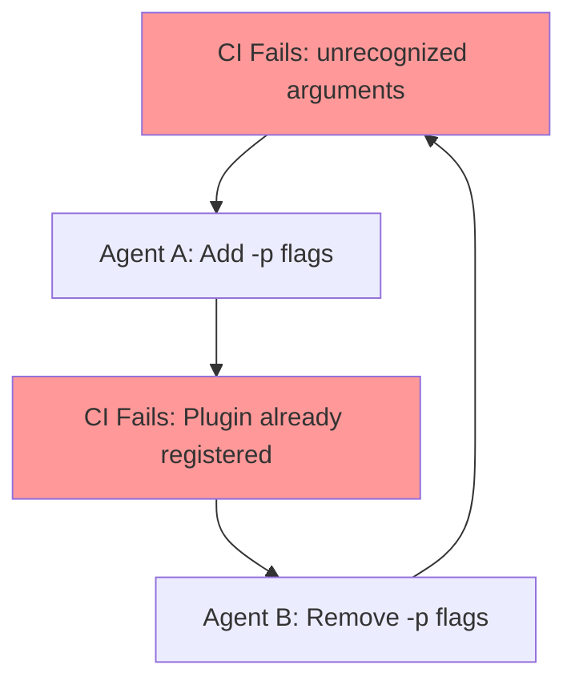
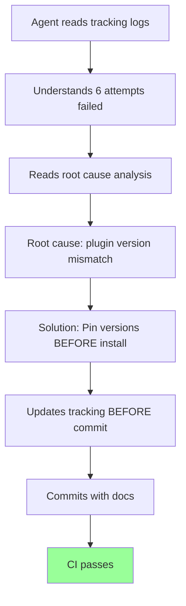

# 🚨 MANDATORY READING: Read This FIRST Before ANY PR Work

**Generated**: 2026-02-16T12:59:00Z
**Status**: CRITICAL - Required reading for all AI agents
**Applies To**: ALL pull request work, especially PR #3248

---

## ⚠️ STOP! Read This Before Making Any Changes

If you are an AI agent working on a pull request in this repository:

1. **STOP** what you're doing
2. **READ** this document completely (5 minutes)
3. **CHECK** the tracking logs for your PR
4. **UNDERSTAND** the history before making changes
5. **UPDATE** tracking docs before every commit

**Failure to follow this protocol has cost 20-32 hours of wasted work on PR #3248.**

---

## 🎯 The Problem We're Solving

### What Happened on PR #3248

**Timeline of Waste**:
- **Days 1-2**: Agent A adds `-p` flags → CI fails with "Plugin already registered"
- **Day 3**: Agent B removes `-p` flags → CI fails with "unrecognized arguments"
- **Day 4**: Agent C adds `-p` flags back → Same as Day 1 (cycle repeats)
- **Days 5-7**: Multiple agents cycle between same two "solutions"
- **Total Time Wasted**: 20-32 hours across 6+ attempts
- **Root Cause Found**: Day 7 (could have been found on Day 1 with proper tracking)

### Why This Happened

**Each agent started fresh with NO knowledge of previous attempts:**
- ❌ Didn't read what was already tried
- ❌ Didn't understand why previous fixes failed
- ❌ Repeated the exact same mistakes
- ❌ Wasted time rediscovering the same facts
- ❌ Never addressed the actual root cause

---

## 📋 Mandatory Protocol for ALL PR Work

### Step 1: Read Tracking Logs FIRST (BEFORE any changes)

For PR #{NUMBER}, check these files in order:

1. **`.codex/PR_{NUMBER}_FAILURE_TRACKING_LOG.md`**
   - Complete attempt history
   - What was tried and what failed
   - Current failing checks
   - Implementation plan

2. **`.codex/REPEATED_ISSUES_LOG_PR_{NUMBER}.md`** (if exists)
   - Cyclic failure patterns
   - Anti-patterns to avoid
   - Why certain approaches fail

3. **`.codex/THE_THRASHING_PATTERN_PR_{NUMBER}.md`** (if exists)
   - Contradictory advice cycles
   - Decision matrices
   - Definitive solutions

4. **`.codex/PR_{NUMBER}_ROOT_CAUSE_ANALYSIS.md`** (if exists)
   - Technical deep dive
   - Why the issue occurs
   - Permanent solution

**Time Investment**: 5-10 minutes reading
**Time Saved**: Hours or days of repeated work

### Step 2: Understand the Root Cause

Before making any changes:

- [ ] **Read** the root cause analysis completely
- [ ] **Understand** why previous fixes failed
- [ ] **Verify** your approach is different from failed attempts
- [ ] **Check** for cyclic patterns (same fix tried multiple times)
- [ ] **Document** your reasoning for WHY this will work

**If you see a pattern like this, STOP:**

```
Attempt 1: Add flag X → Fails with error A
Attempt 2: Remove flag X → Fails with error B
Attempt 3: Add flag X → Fails with error A (CYCLE!)
```

This is **thrashing** - you're cycling between two approaches, neither of which addresses the root cause.

### Step 3: Update Tracking Docs BEFORE Every Commit

**NEVER commit without updating tracking documentation.**

Update `.codex/PR_{NUMBER}_FAILURE_TRACKING_LOG.md` with:

```markdown
### Attempt {N}: {Brief Description}
- **Date**: 2026-02-16T{TIME}Z
- **Changes**:
  1. File 1: What changed and why
  2. File 2: What changed and why
- **Reasoning**: Why this should work (cite root cause analysis)
- **Expected Result**: What should happen
- **Actual Result**: ⏳ PENDING / ✅ SUCCESS / ❌ FAILED
- **Root Cause** (if failed): Technical reason for failure
```

**Also update**:
- Progress percentage in summary table
- Active changes list
- Next actions

### Step 4: Commit with Updated Tracking

```bash
# 1. Make your code changes
git add src/file.py

# 2. Update tracking BEFORE committing
git add .codex/PR_3248_FAILURE_TRACKING_LOG.md

# 3. Commit with both
git commit -m "fix(issue): description of fix

- Updated tracking log with attempt N
- Root cause: specific technical reason
- Files changed: list key files
"

# 4. Push (via report_progress tool)
```

### Step 5: Monitor and Learn

After CI runs:

- **If SUCCESS**:
  - Update tracking log with ✅ SUCCESS
  - Document what worked and why
  - Store memory for future use

- **If FAILURE**:
  - Update tracking log with ❌ FAILED
  - Document the error and root cause
  - Check for cyclic patterns
  - Read root cause analysis again
  - **ESCALATE after 5+ failed attempts**

---

## 🚫 Anti-Patterns to AVOID

### 1. The "Just Try It" Approach

❌ **Don't**:
```
"Let me try adding this flag and see what happens"
"Maybe removing this will fix it"
"Let's tweak this parameter"
```

✅ **Do**:
```
"Root cause analysis shows the issue is X"
"Previous attempts failed because Y"
"This approach addresses Z, which is the actual problem"
"Commit abc123 tried similar approach but failed because..."
```

### 2. The "Fresh Start" Approach

❌ **Don't**:
```
"I'll start from scratch and try my approach"
"Let me see what I can figure out"
"I don't need to read old attempts"
```

✅ **Do**:
```
"Reading tracking logs to understand history..."
"Previous attempts tried X, Y, Z - all failed"
"Root cause is A, not B which was assumed"
"My approach differs because..."
```

### 3. The "Opposite Must Work" Approach

❌ **Don't**:
```
Error: "Plugin already registered"
Agent: "Let me remove the plugin flag"
[Later] Error: "unrecognized arguments"
Agent: "Let me add the plugin flag back"
[Cycle repeats...]
```

✅ **Do**:
```
Error: "Plugin already registered"
Agent: "Reads root cause analysis"
Agent: "Issue is version mismatch, not flag presence"
Agent: "Solution is to pin versions before install"
[Actually fixes root cause]
```

### 4. The "Commit First, Document Later" Approach

❌ **Don't**:
```
git commit -m "fix: try removing flags"
# [Forgets to update tracking]
# [Next agent has no idea what was tried]
```

✅ **Do**:
```
# Update tracking FIRST
# THEN commit with tracking docs included
git add .codex/PR_3248_FAILURE_TRACKING_LOG.md src/file.py
git commit -m "fix(ci): pin plugin versions before package install

- Attempt 5 in tracking log
- Root cause: pip changes versions during package install
- Solution: Pin exact versions before pip install -e .[dev]
- Files: .github/workflows/resilient_validation.yml
"
```

---

## 📊 Real Example from PR #3248

### The Thrashing Cycle (What NOT to Do)



**Attempts**: 6+ over 5-7 days
**Time Wasted**: 20-32 hours
**Root Cause Found**: Day 7

### The Correct Approach (What TO Do)



**Attempts**: 1 (after establishing tracking)
**Time Spent**: 4 hours (including documentation)
**Time Saved**: 20-32 hours

---

## ✅ Success Checklist

Before making ANY changes to a PR:

- [ ] Read `.codex/README_FIRST_MANDATORY.md` (this document)
- [ ] Read `.codex/PR_{NUMBER}_FAILURE_TRACKING_LOG.md`
- [ ] Read root cause analysis documents (if exist)
- [ ] Understand why previous attempts failed
- [ ] Verify my approach is different and addresses root cause
- [ ] Check for cyclic patterns in attempt history

Before EVERY commit:

- [ ] Update tracking log with current attempt
- [ ] Document reasoning and expected outcome
- [ ] Update progress percentages
- [ ] Add both code changes AND tracking docs to commit
- [ ] Write descriptive commit message citing attempt number

After CI runs:

- [ ] Update tracking log with results
- [ ] Document what worked or what failed
- [ ] Check for patterns (success or cycles)
- [ ] Store learnings in memory
- [ ] Escalate if 5+ attempts with same issue

---

## 🎓 Key Principles

### 1. Context is Critical

**5 minutes reading tracking logs saves hours of redundant work.**

Every failed attempt is valuable data. Don't waste it by not reading it.

### 2. Document Everything

**If it's not in the tracking log, it didn't happen.**

Future agents (and future you) have no access to:
- Your reasoning
- What you tried
- Why it failed
- What you learned

Document it ALL.

### 3. Root Cause, Not Symptoms

**Treating symptoms creates cycles. Treating root cause fixes issues permanently.**

Example:
- Symptom: "unrecognized arguments"
- Wrong fix: Add/remove flags (treats symptom)
- Root cause: Version mismatch
- Right fix: Pin versions (treats cause)

### 4. Break Cycles Early

**If the same error occurs after your "fix", you're thrashing.**

STOP. Read root cause analysis. Understand WHY it's not working. Try a fundamentally different approach.

### 5. Escalate When Stuck

**After 5+ failed attempts, human review is needed.**

Don't waste more time. Escalate to @mbaetiong with:
- Link to tracking log
- Summary of attempts
- Root cause analysis (if found)
- Recommended next steps

---

## 📚 Additional Resources

### Tracking Templates

- `.codex/templates/ISSUE_TRACKING_PROMPT_TEMPLATE.md` - Full template for tracking
- `.codex/templates/QUICK_TRACKING_REFERENCE.md` - Quick reference card
- `.codex/templates/PYTEST_WORKFLOW_GUIDE.md` - Pytest-specific guidance

### PR #3248 Specific Docs

- `.codex/PR_3248_FAILURE_TRACKING_LOG.md` - Complete attempt history
- `.codex/REPEATED_ISSUES_LOG_PR_3248.md` - Cyclic pattern analysis
- `.codex/THE_THRASHING_PATTERN_PR_3248.md` - Contradiction mapping
- `.codex/PR_3248_ROOT_CAUSE_ANALYSIS.md` - Technical deep dive
- `.codex/PR_3248_COMPREHENSIVE_FOLLOWUP_PROMPT.md` - Next steps
- `.codex/HISTORICAL_CI_REVIEW_FEB_11_15_2026.md` - **Historical evidence (Feb 11-15)** of repeated patterns

### Historical Information

**IMPORTANT**: PR #3248 issues were **persistent for 5+ days** before root cause was found.

See `.codex/HISTORICAL_CI_REVIEW_FEB_11_15_2026.md` for:
- 130-message conversation thread (Feb 11-15, 2026)
- Evidence of repeated thrashing patterns
- Multiple failed fix attempts (syntax, imports, pinning)
- Validation that Attempt 10 fix addresses actual root cause

**Source**: [Comment #3908670928](https://github.com/Aries-Serpent/_codex_/pull/3301#issuecomment-3908670928) - preserved as institutional knowledge.

### Web Research

Stored memories contain research on:
- AI agent memory best practices
- Cyclic failure detection with ML
- Enterprise knowledge management systems

---

## 🚨 Final Warning

**IGNORING THIS PROTOCOL WASTES EVERYONE'S TIME**

- ❌ Your time rediscovering known issues
- ❌ Human reviewer time reviewing duplicate work
- ❌ CI/CD resources running doomed builds
- ❌ Repository maintainer time managing chaos

**FOLLOWING THIS PROTOCOL SAVES TIME AND BUILDS QUALITY**

- ✅ Learn from past attempts
- ✅ Avoid repeated mistakes
- ✅ Fix root causes, not symptoms
- ✅ Build institutional knowledge
- ✅ Enable efficient collaboration

---

## 📞 Questions?

**For AI Agents**:
- Follow the checklist above
- Read all tracking docs before starting
- Update docs before every commit
- Escalate after 5+ attempts

**For Human Maintainers**:
- Enforce tracking protocol
- Review tracking logs to understand status
- Escalate to @mbaetiong if agents aren't following protocol

---

**Document Version**: 1.0
**Last Updated**: 2026-02-16T12:59:00Z
**Applies To**: ALL pull requests, especially active PRs with CI failures
**Status**: MANDATORY READING - Non-negotiable

---

**Remember**: 5 minutes reading this document and tracking logs saves hours or days of wasted work. Read first, act second, document always.
