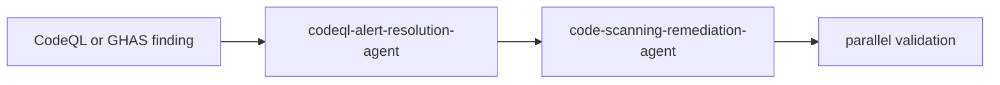

# Security Agent Chain

**Status:** Implemented initial chain selection via `chronicle agent-chain --focus codeql|security`



## CodeQL chain

1. `codeql-alert-resolution-agent`
   - First pass for concrete CodeQL findings
2. `code-scanning-remediation-agent`
   - Normalizes any remaining code scanning issues

## Security chain

1. `unified-security-scanner`
   - Broad finding aggregation
2. `code-scanning-remediation-agent`
   - Code-level remediation follow-up

## CLI example

```bash
python -m codex.cli chronicle agent-chain --focus codeql
python -m codex.cli chronicle agent-chain --focus security --json
```
