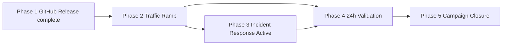

# Session 6 Phase 2-5 Orchestration Plan

**Campaign:** v0.2.0 production deployment  
**Session Scope:** Remaining phases after GitHub Release completion  
**Execution Mode:** Coordination / documentation only  
**Dependency:** Phase 1 (GitHub Release) must complete before Phase 2 begins

---

## 1. Mission Summary

This session prepares the execution framework for:
- **Phase 2:** Production Traffic Ramp
- **Phase 3:** Incident Response Activation
- **Phase 4:** Post-Deployment Validation
- **Phase 5:** Campaign Closure

## 2. Phase Timeline

| Phase | Window (UTC) | Primary outcome | Framework |
|---|---|---|---|
| Phase 2 | 2026-07-20T02:00:00Z → 2026-07-20T08:00:00Z | staged production traffic ramp | `.codex/PRODUCTION_TRAFFIC_RAMP_FRAMEWORK.md` |
| Phase 3 | 2026-07-20T02:00:00Z → 2026-07-20T10:00:00Z | active incident response readiness | `.codex/PHASE_12_INCIDENT_RESPONSE_FRAMEWORK.md` |
| Phase 4 | 2026-07-20T02:00:00Z → 2026-07-21T02:00:00Z | 24-hour validation and hourly checkpoints | `.codex/POST_DEPLOYMENT_VALIDATION_FRAMEWORK.md` |
| Phase 5 | 2026-07-21T02:00:00Z → 2026-07-21T06:00:00Z | closure, archive, accountability, transfer | `.codex/CAMPAIGN_CLOSURE_FRAMEWORK.md` |

## 3. Dependency Flow

## 4. Deliverables Prepared in This Session

- `.codex/PRODUCTION_TRAFFIC_RAMP_FRAMEWORK.md`
- `.codex/PHASE_12_INCIDENT_RESPONSE_FRAMEWORK.md`
- `.codex/POST_DEPLOYMENT_VALIDATION_FRAMEWORK.md`
- `.codex/CAMPAIGN_CLOSURE_FRAMEWORK.md`
- `.codex/SESSION_6_PHASE_2_5_ORCHESTRATION_PLAN.md`

## 5. Cross-Phase Success Criteria

- [ ] Phase 2 has documented PASS / HOLD / FAIL gates
- [ ] Phase 2 rollback triggers and procedures are explicit
- [ ] Phase 3 SLA targets are formalized (Critical <2m, High <5m, Medium <30m)
- [ ] Phase 3 alert rules and runbooks are execution-ready
- [ ] Phase 4 hourly checkpoint template supports 24-hour monitoring
- [ ] Phase 4 rollback thresholds and escalation matrix are explicit
- [ ] Phase 5 closure report, accountability, PDA, and transfer templates are ready

## 6. Ownership Map

| Area | Primary owner | Backup / partner |
|---|---|---|
| Traffic metrics and checkpointing | performance-monitor-agent | artifact-monitor-agent |
| Dashboard and alert operations | workflow-health-monitor | ci-emergency-response-agent |
| Incident command and rollback support | ci-emergency-response-agent | @mbaetiong |
| Security monitoring | unified-security-scanner | security-audit-agent |
| Closure evidence and PDA sync | memory-sync-agent | session-analysis-agent |

## 7. Execution Checklist by Phase

### Phase 2 — Traffic Ramp
- [ ] Confirm Phase 1 completion
- [ ] Record baseline at 0% / pre-cutover
- [ ] Execute 10% gate
- [ ] Execute 25% gate
- [ ] Execute 50% / 75% / 100% gate sequence
- [ ] Handoff to Phase 4 after 100% PASS

### Phase 3 — Incident Response
- [ ] Dashboards live and accessible
- [ ] Alert routing validated
- [ ] On-call rotation acknowledged
- [ ] Severity model and SLA timers active
- [ ] Rollback runbook linked from alerts

### Phase 4 — Post-Deployment Validation
- [ ] Hour 0 baseline captured
- [ ] 24 hourly checkpoints scheduled
- [ ] T+6 / T+12 / T+18 / T+24 summary gates planned
- [ ] Action matrix available for degraded / fail states

### Phase 5 — Campaign Closure
- [ ] Closure report template populated
- [ ] Accountability summary completed
- [ ] PDA pattern set drafted (4 patterns)
- [ ] Production playbook updated / outlined
- [ ] Archive and knowledge transfer tasks completed

## 8. Go / Hold / Stop Rules

| Decision | Meaning | Required action |
|---|---|---|
| GO | all required gates green | proceed to next milestone |
| HOLD | partial degradation without hard rollback trigger | stop promotions, investigate, reassess |
| STOP / ROLLBACK | customer-impacting or hard-threshold breach | execute rollback and incident procedures |

## 9. Final Preparedness Statement

Session 6 Phase 2-5 preparation is complete when all four frameworks exist, each phase has explicit metrics and decision gates, and the closure plan captures accountability, archival, and knowledge transfer requirements.
