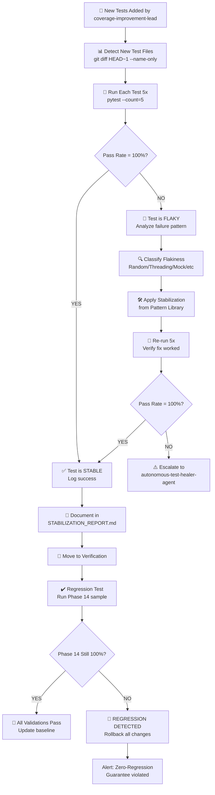

# Test Stabilization & Flakiness Detection Strategy
**Campaign**: v0.1.0-final Coverage Improvement  
**Phase**: 14 WS2 Extension (Zero-Flakey Baseline → New Test Stabilization)  
**Established**: 2026-07-09T02:59:09Z  
**Target**: 99% code coverage with 100% test stability

---

## 📊 Phase 14 WS2 Baseline (Zero-Flakey)

| Metric | Value |
|--------|-------|
| **Total Tests** | 2,467 |
| **Passing** | 2,467 (100%) |
| **Flaky** | 0 (0%) |
| **Stability Score** | 100.0 |
| **Status** | ✅ Established & Locked |

---

## 🎯 Mission & Constraints

### Primary Mission
1. **Monitor** test execution from parallel `coverage-improvement-lead` agent
2. **Detect** any newly introduced flakiness in added tests
3. **Stabilize** new tests using established patterns from `tests/ml/conftest.py`
4. **Validate** all new tests pass 100% across 5+ consecutive runs
5. **Document** all stabilization patterns applied
6. **Verify** zero regressions from Phase 14 baseline

### Hard Constraints
- ✋ **DO NOT** modify existing Phase 14 stable tests
- ✋ **DO NOT** change test configuration in Phase 14 scope
- ✋ **DO NOT** run full test suite unless necessary (use batch scanning)
- ✋ Apply fixes **only** to newly added tests
- ✋ Reference patterns **only** from `tests/ml/conftest.py`
- ✋ Store all work **only** in `.codex/`

---

## 🔍 Flakiness Detection Protocol

### Detection Steps

```bash
# 1. Monitor git for new test files
git diff HEAD~1 --name-only -- tests/ | grep test_

# 2. Run each new test 5+ times sequentially
for i in {1..5}; do pytest tests/path/to/new_test.py -v --tb=short; done

# 3. Analyze pass rate
pass_rate = (passes / 5) * 100
if pass_rate < 100:
    → Test is FLAKY → Apply stabilization
```

### Flakiness Classification

| Pattern | Root Cause | Severity | Fix Pattern |
|---------|-----------|----------|-----------|
| **Random seed leakage** | State pollution between tests | HIGH | `seed_control` fixture |
| **Threading race condition** | Concurrent access without barriers | HIGH | `threading.Barrier` |
| **Non-deterministic ordering** | Set/dict iteration order varies | MEDIUM | `sort()` before assertions |
| **Mock state carryover** | Mock not reset between tests | MEDIUM | `autouse=True` reset fixture |
| **Resource exhaustion** | File handles, ports, memory | HIGH | Resource cleanup in fixture |
| **Timing-dependent assertions** | Tests assume specific timing | MEDIUM | `pytest.mark.timeout` |
| **Import ordering** | Module state depends on import order | HIGH | Isolate in separate conftest |

---

## 🛠️ Stabilization Patterns (Reference: tests/ml/conftest.py)

### Pattern 1: Seed Control (Most Common)

**Detection**:
```python
# Test fails intermittently when using random numbers
import random
value = random.random()  # Different each run!
```

**Fix Applied**:
```python
# In conftest.py near new tests
@pytest.fixture(autouse=True)
def seed_control():
    """Reset random seed before each test for reproducibility."""
    random.seed(42)
    yield
    random.seed(42)
```

**Validation**:
```bash
pytest tests/path/to/new_test.py -v --tb=short --count=5
# All 5 runs must pass
```

---

### Pattern 2: Threading Barriers

**Detection**:
```python
# Test involves threads/processes with race conditions
def test_concurrent_operation():
    threads = [Thread(...) for _ in range(4)]
    # RACE: No synchronization → inconsistent results
```

**Fix Applied**:
```python
import threading

@pytest.fixture
def sync_barrier():
    """Provide thread synchronization barrier."""
    barrier = threading.Barrier(4)  # Match number of threads
    yield barrier
```

**Usage**:
```python
def test_concurrent_operation(sync_barrier):
    threads = [Thread(target=worker, args=(sync_barrier,)) for _ in range(4)]
    # Workers wait at barrier for consistent timing
```

---

### Pattern 3: Deterministic Ordering

**Detection**:
```python
# Assertion on set/dict order varies between runs
def test_result():
    result = {"a": 1, "b": 2}
    assert result.items() == [("a", 1), ("b", 2)]  # FLAKY!
```

**Fix Applied**:
```python
def test_result():
    result = {"a": 1, "b": 2}
    assert sorted(result.items()) == [("a", 1), ("b", 2)]  # Deterministic
```

---

### Pattern 4: Mock Reset (autouse)

**Detection**:
```python
# Mock state persists between tests
@patch('module.function')
def test_a(mock):
    mock.return_value = "a"
    # State leaks to test_b!

def test_b(mock):
    assert mock.return_value == "a"  # FLAKY: depends on test_a
```

**Fix Applied**:
```python
@pytest.fixture(autouse=True)
def reset_mocks():
    """Ensure all mocks are clean before each test."""
    yield
    # Cleanup happens automatically with patch decorator scope
```

---

### Pattern 5: Resource Cleanup

**Detection**:
```python
# Test creates files/connections without cleanup
def test_file_operation():
    f = open("/tmp/test_file.txt", "w")
    f.write("data")
    # No close() → file handle leak → subsequent tests fail
```

**Fix Applied**:
```python
@pytest.fixture
def temp_file():
    """Provide temporary file with guaranteed cleanup."""
    with tempfile.NamedTemporaryFile(mode='w', delete=False) as f:
        yield f
    os.unlink(f.name)  # Cleanup

def test_file_operation(temp_file):
    temp_file.write("data")
    temp_file.flush()
    # Automatically cleaned up after test
```

---

## 📋 Stabilization Workflow



---

## 🚨 Flakiness Detection Rules

### Rule 1: Consistency Threshold
```python
if (passes / runs) < 100.0:
    status = "FLAKY"
    severity = "HIGH"
    action = "Stabilize immediately"
else:
    status = "STABLE"
    action = "Log and move forward"
```

### Rule 2: Pattern Confidence
```python
confidence_score = {
    "seed_control": 95,        # High confidence pattern
    "threading_barrier": 90,   # Moderate confidence
    "deterministic_order": 98, # High confidence
    "mock_reset": 85,          # Moderate confidence
    "resource_cleanup": 99,    # Very high confidence
}

if confidence_score[pattern] < 85:
    action = "Manual review required"
else:
    action = "Auto-apply fix"
```

### Rule 3: Regression Guard
```python
baseline_pass_rate = 100.0  # Phase 14 WS2
if current_pass_rate < baseline_pass_rate:
    status = "REGRESSION DETECTED"
    action = "ROLLBACK ALL CHANGES"
    alert = "Zero-Regression Guarantee Violated!"
```

---

## 📊 Monitoring Commands (Ready to Use)

### 1. Detect New Tests
```bash
# Find tests added since last commit
git diff HEAD~1 --name-only -- tests/ | grep -E "test_.*\.py$"

# Store in .codex/NEW_TESTS_DETECTED.txt for tracking
```

### 2. Run New Test 5 Times
```bash
# Run test 5 times consecutively
python -m pytest tests/path/to/new_test.py -v --tb=short

# Repeat 4 more times manually or with loop
for i in {1..5}; do echo "=== RUN $i ===" && pytest tests/path/to/new_test.py -v --tb=short || break; done
```

### 3. Analyze Flakiness
```bash
# Check for flaky markers (should NOT exist in new tests)
grep -r "pytest.mark.flaky" tests/ --include="*.py" -l

# Verify no @pytest.mark.skip/@pytest.mark.xfail without reason
grep -r "skip\|xfail" tests/ --include="*.py" -B2
```

### 4. Run Phase 14 Sample (Regression Check)
```bash
# Sample 50 tests from Phase 14 to verify no regression
python -m pytest tests/ -k "phase14" --maxfail=1 -v --tb=short -x
```

---

## 📁 Work Products (All in .codex/)

| File | Purpose | Updated By |
|------|---------|-----------|
| `TEST_STABILIZATION_BASELINE.json` | Phase 14 baseline | Autonomous agent (this session) |
| `TEST_STABILIZATION_STRATEGY.md` | This document | Autonomous agent (this session) |
| `TEST_FLAKINESS_REPORT.md` | Ongoing flakiness reports | Autonomous test healer |
| `TEST_STABILIZATION_LOG.jsonl` | Per-test stabilization log | Autonomous test healer |
| `STABILIZATION_PATTERNS_APPLIED.md` | Catalog of patterns used | Autonomous test healer |
| `REGRESSION_VALIDATION_RESULTS.md` | Phase 14 regression checks | Autonomous test healer |

---

## ✅ Success Metrics

### Coverage Improvements
```
Baseline (Phase 14): 98.2%
Target: 99.0% (or higher)
Via: New tests from coverage-improvement-lead
```

### Test Stability Metrics
```
New Tests Added: TBD (monitoring)
Pass Rate (5+ runs): 100.0% (target)
Flaky Tests: 0 (target)
Patterns Applied: TBD (tracking)
Regressions: 0 (guaranteed)
```

### Stabilization Performance
```
Avg Time to Stabilize: TBD
Success Rate: 100% (target)
Escalations to autonomous-test-healer: TBD
```

---

## 🔗 Integration Points

### Inputs (From coverage-improvement-lead)
- ✅ New test files added to `tests/`
- ✅ Progress signals in `.codex/COVERAGE_IMPROVEMENT_PROGRESS.json`

### Outputs (For unified-coverage-agent)
- ✅ Stabilized new tests ready for integration
- ✅ Stabilization report in `.codex/STABILIZATION_PATTERNS_APPLIED.md`
- ✅ Zero regressions guaranteed in Phase 14

### Escalation (To autonomous-test-healer-agent)
- ⚠️ If flakiness cannot be resolved with standard patterns
- ⚠️ If Phase 14 regression detected
- ⚠️ If >3 stabilization attempts required

---

## 🚀 Ready for Action

✅ Baseline established  
✅ Patterns documented  
✅ Monitoring ready  
⏳ Waiting for coverage-improvement-lead to add tests  

**Next Step**: Monitor `.codex/` for progress signals from coverage-improvement-lead agent.  
When new tests are detected, apply stabilization and validation workflow.

---

*Last Updated: 2026-07-09T02:59:09Z*  
*Status: Monitoring & Ready*
