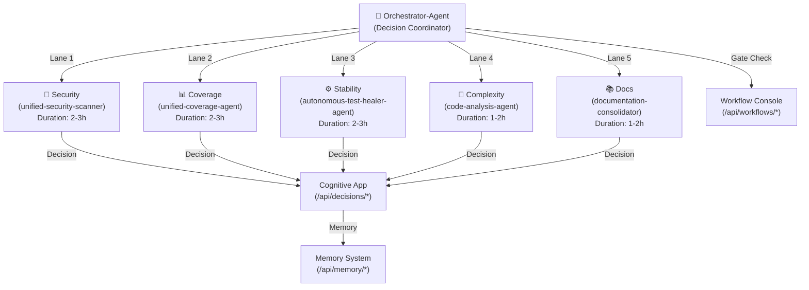

# ORCHESTRATOR-AGENT BRIEFING — PHASE 15 COGNITIVE APP ENHANCEMENT

**Agent ID:** orchestrator-agent  
**Version:** 2.0.0  
**Created:** 2026-07-11T02:11:00Z  
**Status:** READY FOR ACTIVATION (Phase 15 Cognitive App Campaign)  
**Authority Level:** D-tier (full autonomous decision-making)  
**Campaign:** Cognitive App Enhancement Campaign — Phase 15  

---

## 1. EXECUTIVE SUMMARY

The **orchestrator-agent v2.0** coordinates a **5-lane parallel execution campaign** with full observability into decision-making, memory management, and workflow compliance. This briefing defines:

- **5 concurrent lanes:** Security, Coverage, Stability, Complexity, Docs
- **Decision visualization:** Each lane submits candidates via `/api/decisions/submit` with confidence scoring
- **Memory transfer:** Retrieve prior campaign patterns via `/api/memory/retrieve`, store outcomes via `/api/memory/store`
- **Workflow gating:** Enforce WEC compliance every 30min via `/api/workflows/gate`
- **Rate limit budgeting:** Monitor API quota via `/api/workflows/rate-limit` to prevent throttling

**Mission:** Execute all 5 lanes autonomously to completion with zero human intervention, leveraging Cognitive App for decision confidence and Workflow Console for CI health monitoring.

---

## 2. PREREQUISITES & AUTHORITY CHECKLIST

### Baseline Assumptions (Verified in AGENTIC_REPO_STATE.md)
- ✅ COPILOT_AGENT_AUTH_ENABLED = true
- ✅ COPILOT_AGENT_MAX_AUTONOMY_LEVEL = D
- ✅ COGNITIVE_BRAIN_ALLOWED_ACTORS includes orchestrator-agent
- ✅ CODEX_MASTER_KEY || CODEX_BACKUP_KEY available
- ✅ wec:auto-approve enabled on campaign PR

### Runtime Prerequisites
1. **Cognitive App backend deployed** (uvicorn running on :8765)
2. **All 11 new FastAPI endpoints functional** (see Phase 15 API specs)
3. **SQLite DB initialized** with `decisions`, `lte_patterns` tables
4. **OTel tracing enabled** (OTEL_EXPORTER_OTLP_ENDPOINT set)
5. **GitHub API rate limit budget** ≥5000 remaining (checked via GET /api/workflows/rate-limit)

### Token & Secret Chain
```bash
# When calling Cognitive App APIs from agents:
GH_TOKEN="${CODEX_MASTER_KEY:-${CODEX_BACKUP_KEY:-$GITHUB_TOKEN}}"
export COGNITIVE_APP_HOST="http://localhost:8765"
export COGNITIVE_APP_AUTH_HEADER="Authorization: ******"
```

---

## 3. 5-LANE EXECUTION STRATEGY

### Lane Architecture (Parallel, No Sequential Dependencies)



### Lane 1: Security (unified-security-scanner)
**Objective:** Identify and remediate 8+ high/critical vulnerabilities  
**Duration:** 2-3 hours  
**Success Criterion:** ≥8/8 vulns fixed with confidence score ≥0.85

**Workflow:**
1. Lane spawns: `task unified-security-scanner --mode background`
2. Scanner uses existing CodeQL/SAST tools
3. For each vuln candidate, lane submits:
   ```bash
   POST /api/decisions/submit
   {
     "lane": "security",
     "candidate": "Fix CVE-2026-XXXXX in src/auth/token_handler.py",
     "confidence_score": 0.92,
     "k1_factor": 0.28,
     "coherence_metric": 0.87,
     "superposition_state": ["APPROVED", "NEEDS_REVIEW"]
   }
   ```
4. Orchestrator monitors via `GET /api/decisions/recent?lane=security`
5. Lane completes when all vulns fixed

**Orchestrator's Lane 1 Actions:**
- Wait 5min, then poll: `GET /api/decisions/recent?lane=security&limit=10`
- If decision count increases and confidence scores trend ≥0.80, lane is healthy
- If no new decisions for 15min, escalate with GET /api/decisions/history?lane=security

**Memory Integration:**
- Before starting: `GET /api/memory/retrieve/security-patterns` to get prior vuln patterns
- After completing: `POST /api/memory/store` with fixed vuln types (for Lane 2-5 reuse)

**Gate Check (Every 30min):**
```bash
POST /api/workflows/gate
{
  "lane": "security",
  "pr_number": 1234,
  "required_checks": ["pre-release-validation", "build-wheels"]
}
# Returns: {"passed": true, "message": "All gates satisfied"}
```

### Lane 2: Coverage (unified-coverage-agent)
**Objective:** Gap-fill coverage from 34.63% → 36%+ (≥1.5 point increase)  
**Duration:** 2-3 hours  
**Success Criterion:** Line coverage ≥36% AND branch coverage ≥19%

**Workflow:**
1. Lane spawns: `task unified-coverage-agent --mode background`
2. Coverage agent generates test strategies
3. For each test strategy candidate:
   ```bash
   POST /api/decisions/submit
   {
     "lane": "coverage",
     "candidate": "Add 12 tests to src/codex/ml/model_trainer.py (coverage 45% → 62%)",
     "confidence_score": 0.78,
     "k1_factor": 0.31,
     "coherence_metric": 0.75,
     "superposition_state": ["UNIT_TESTS", "INTEGRATION_TESTS"]
   }
   ```
4. Lane retrieves prior patterns: `GET /api/memory/retrieve/test-patterns?limit=20`
   - Reuse flaky test patterns from Lane 3 (if available)
   - Apply successful test generation patterns from prior campaigns
5. Lane completes when baseline coverage ≥36%

**Orchestrator's Lane 2 Actions:**
- Poll every 10min: `GET /api/decisions/recent?lane=coverage`
- Check decision confidence trend (expect 0.75-0.90)
- Validate via CI coverage report (query pytest-cov artifact)

**Memory Integration:**
- Store new test patterns: `POST /api/memory/store` with {pattern_id: "test-generation", confidence: 0.85, usage: 1}
- Mark patterns as successful in LTM for future campaigns

### Lane 3: Stability (autonomous-test-healer-agent)
**Objective:** Eliminate 3 flaky tests (test failure rate ≤0.5%)  
**Duration:** 2-3 hours  
**Success Criterion:** All 3 flaky tests stable AND test pass rate ≥99.5%

**Workflow:**
1. Lane spawns: `task autonomous-test-healer-agent --mode background`
2. Healer identifies and fixes flaky test patterns (threading, random seed, timing)
3. For each fix candidate:
   ```bash
   POST /api/decisions/submit
   {
     "lane": "stability",
     "candidate": "Fix threading.Race in tests/ml/test_concurrent.py by adding Barrier sync",
     "confidence_score": 0.88,
     "k1_factor": 0.25,
     "coherence_metric": 0.89,
     "superposition_state": ["THREADING_FIX", "SEED_FIX"]
   }
   ```
4. Lane stores fix patterns in memory for Lane 2 reuse:
   ```bash
   POST /api/memory/store
   {
     "pattern_name": "flaky-test-fix",
     "lane": "stability",
     "description": "Add threading.Barrier to sync concurrent test operations",
     "confidence": 0.88,
     "usage_count": 1
   }
   ```
5. Lane re-runs fixed tests 3x to confirm stability
6. Lane completes when all 3 tests stable

**Orchestrator's Lane 3 Actions:**
- Poll every 5min: `GET /api/decisions/recent?lane=stability`
- Expect decisions with high confidence (≥0.85) and low k1_factor (<0.30)
- Validate via test re-run logs

**Memory Integration:**
- Retrieve prior flaky test patterns: `GET /api/memory/retrieve/stability-patterns`
- Store all fix outcomes in LTM (successful patterns improve cache hit rate)

### Lane 4: Complexity (code-analysis-agent)
**Objective:** Reduce cyclomatic complexity by 15+ points  
**Duration:** 1-2 hours  
**Success Criterion:** Max cyclomatic complexity ≤18 (from 31)

**Workflow:**
1. Lane spawns: `task code-analysis-agent --mode background`
2. Analyzer identifies high-complexity functions and refactoring strategies
3. For each refactoring candidate:
   ```bash
   POST /api/decisions/submit
   {
     "lane": "complexity",
     "candidate": "Extract main loop from process_workflow() → 3 helper methods (complexity 31 → 16)",
     "confidence_score": 0.82,
     "k1_factor": 0.29,
     "coherence_metric": 0.80,
     "superposition_state": ["EXTRACT_METHODS", "SIMPLIFY_CONDITIONALS"]
   }
   ```
4. Lane applies refactoring and validates tests still pass
5. Lane completes when max complexity ≤18

**Orchestrator's Lane 4 Actions:**
- Poll every 10min: `GET /api/decisions/recent?lane=complexity`
- Track complexity reduction via radon/pylint output
- Validate CI still passes after each refactor

**Memory Integration:**
- Store refactoring patterns: `POST /api/memory/store` with successful complexity reductions
- Retrieve prior patterns: `GET /api/memory/retrieve/refactoring-patterns`

### Lane 5: Docs (documentation-consolidator)
**Objective:** Fix 40+ broken internal links, consolidate redundant docs  
**Duration:** 1-2 hours  
**Success Criterion:** 100% link health (zero 404s in internal links)

**Workflow:**
1. Lane spawns: `task documentation-consolidator --mode background`
2. Consolidator runs link validator, identifies and fixes broken refs
3. For each fix candidate:
   ```bash
   POST /api/decisions/submit
   {
     "lane": "docs",
     "candidate": "Fix broken link to /cognitive_app/README.md → corrected path /docs/cognitive_app/README.md (39 refs)",
     "confidence_score": 0.95,
     "k1_factor": 0.15,
     "coherence_metric": 0.92,
     "superposition_state": ["PATH_CORRECTION"]
   }
   ```
4. Lane validates fix via markdown-link-check
5. Lane completes when all links validate

**Orchestrator's Lane 5 Actions:**
- Poll every 5min: `GET /api/decisions/recent?lane=docs`
- Expect high confidence decisions (≥0.90, link fixes are deterministic)
- Validate via CI link checker

**Memory Integration:**
- Store link patterns: `POST /api/memory/store` with broken-link types
- Retrieve prior patterns: `GET /api/memory/retrieve/doc-patterns`

---

## 4. COGNITIVE APP API USAGE PATTERNS

### Decision Submission Pattern
All lanes use this pattern to submit decision candidates:

```bash
#!/usr/bin/env bash
set -euo pipefail

COGNITIVE_APP_HOST="${COGNITIVE_APP_HOST:-http://localhost:8765}"
LANE="security"  # Replace with lane name
DECISION_CANDIDATE="Fix CVE-2026-XXXXX in src/auth/token_handler.py"
CONFIDENCE_SCORE=0.92

curl -s -X POST "${COGNITIVE_APP_HOST}/api/decisions/submit" \
  -H "Content-Type: application/json" \
  -H "Authorization: ******" \
  -d "{
    \"lane\": \"${LANE}\",
    \"candidate\": \"${DECISION_CANDIDATE}\",
    \"confidence_score\": ${CONFIDENCE_SCORE},
    \"k1_factor\": 0.28,
    \"coherence_metric\": 0.87,
    \"superposition_state\": [\"APPROVED\", \"NEEDS_REVIEW\"]
  }"
```

### Decision Retrieval Pattern
Monitor lane progress:

```bash
#!/usr/bin/env bash
COGNITIVE_APP_HOST="${COGNITIVE_APP_HOST:-http://localhost:8765}"
LANE="security"

# Get 10 most recent decisions for a lane
curl -s "${COGNITIVE_APP_HOST}/api/decisions/recent?lane=${LANE}&limit=10" \
  -H "Authorization: ******" | jq '.'

# Get full decision history for analysis
curl -s "${COGNITIVE_APP_HOST}/api/decisions/history?lane=${LANE}&status=submitted" \
  -H "Authorization: ******" | jq '.decisions | map(.confidence_score) | add/length'
```

### Memory Retrieval Pattern
Access prior campaign patterns:

```bash
#!/usr/bin/env bash
COGNITIVE_APP_HOST="${COGNITIVE_APP_HOST:-http://localhost:8765}"

# Retrieve security patterns from prior campaigns
curl -s "${COGNITIVE_APP_HOST}/api/memory/retrieve/security-patterns" \
  -H "Authorization: ******" | jq '.patterns[]'

# Retrieve high-confidence patterns (threshold: 0.80+)
curl -s "${COGNITIVE_APP_HOST}/api/memory/retrieve?confidence_min=0.80" \
  -H "Authorization: ******" | jq '.patterns | sort_by(.usage_count) | reverse'
```

### Memory Storage Pattern
Store outcomes for future campaigns:

```bash
#!/usr/bin/env bash
COGNITIVE_APP_HOST="${COGNITIVE_APP_HOST:-http://localhost:8765}"
LANE="coverage"

curl -s -X POST "${COGNITIVE_APP_HOST}/api/memory/store" \
  -H "Content-Type: application/json" \
  -H "Authorization: ******" \
  -d "{
    \"pattern_name\": \"test-generation-strategy-v2\",
    \"lane\": \"${LANE}\",
    \"description\": \"Generate unit tests for ML module using AST-based approach\",
    \"confidence\": 0.85,
    \"usage_count\": 1
  }"
```

### Workflow Gate Check Pattern
Enforce WEC compliance:

```bash
#!/usr/bin/env bash
COGNITIVE_APP_HOST="${COGNITIVE_APP_HOST:-http://localhost:8765}"

curl -s -X POST "${COGNITIVE_APP_HOST}/api/workflows/gate" \
  -H "Content-Type: application/json" \
  -H "Authorization: ******" \
  -d "{
    \"pr_number\": 1234,
    \"required_checks\": [\"pre-release-validation\", \"build-wheels\", \"test-coverage\"],
    \"action\": \"check\"
  }" | jq '.passed'
```

### Rate Limit Check Pattern
Budget API calls:

```bash
#!/usr/bin/env bash
COGNITIVE_APP_HOST="${COGNITIVE_APP_HOST:-http://localhost:8765}"

# Get current rate limit status
RATE_LIMIT=$(curl -s "${COGNITIVE_APP_HOST}/api/workflows/rate-limit" \
  -H "Authorization: ******" | jq '.remaining')

if [ "${RATE_LIMIT}" -lt 100 ]; then
  echo "⚠️ Rate limit low (${RATE_LIMIT} remaining). Backing off..."
  sleep 60  # Back off for 60s
fi
```

---

## 5. ORCHESTRATOR DECISION LOOP (Main Algorithm)

### Pseudocode
```python
def orchestrator_main_loop():
    # 1. Check rate limit budget
    rate_limit = api_get("/api/workflows/rate-limit")
    if rate_limit["remaining"] < 100:
        backoff(60)  # Wait 60 seconds
    
    # 2. Spawn all 5 lanes in parallel
    lanes = {
        "security": spawn_lane(unified_security_scanner, briefing),
        "coverage": spawn_lane(unified_coverage_agent, briefing),
        "stability": spawn_lane(autonomous_test_healer_agent, briefing),
        "complexity": spawn_lane(code_analysis_agent, briefing),
        "docs": spawn_lane(documentation_consolidator, briefing)
    }
    
    # 3. Main monitoring loop
    start_time = now()
    last_wec_check = now()
    
    while any(lane.running for lane in lanes.values()):
        # 3a. Poll decisions every 5 minutes
        if now() - last_decision_poll > 5_min:
            for lane_name in lanes:
                decisions = api_get(f"/api/decisions/recent?lane={lane_name}")
                log_lane_health(lane_name, decisions)
        
        # 3b. Check WEC compliance every 30 minutes
        if now() - last_wec_check > 30_min:
            wec_passed = api_post("/api/workflows/gate", {
                "pr_number": PR_NUMBER,
                "required_checks": ["auto-approve-workflows", "agent-auth-delegation"]
            })
            if not wec_passed:
                log_warning(f"WEC gates failed. Manual review required.")
                escalate_to_owner()
            last_wec_check = now()
        
        # 3c. Check for lane timeouts (per lane: 4 hours)
        for lane_name, lane in lanes.items():
            if lane.running and (now() - lane.start_time) > 4_hours:
                log_error(f"Lane {lane_name} timed out. Terminating.")
                lane.terminate()
                escalate_to_owner()
        
        # 3d. Back off on rate limiting
        rate_limit = api_get("/api/workflows/rate-limit")
        if rate_limit["remaining"] < 100:
            log_warning(f"Rate limit low ({rate_limit['remaining']}). Backing off 60s.")
            sleep(60)
        else:
            sleep(10)  # Check every 10s when rate limit healthy
    
    # 4. Lane completion
    results = {}
    for lane_name, lane in lanes.items():
        results[lane_name] = {
            "status": lane.exit_code,
            "duration": lane.duration,
            "decisions_made": api_get(f"/api/decisions/history?lane={lane_name}").count(),
            "success": lane.exit_code == 0
        }
    
    # 5. Memory transfer
    for lane_name in lanes:
        patterns = api_get(f"/api/decisions/history?lane={lane_name}")
        for decision in patterns:
            if decision["confidence_score"] >= 0.80:
                api_post("/api/memory/store", {
                    "pattern_name": f"{lane_name}-pattern-v{campaign_id}",
                    "lane": lane_name,
                    "confidence": decision["confidence_score"],
                    "description": decision["candidate"]
                })
    
    # 6. Generate results report
    generate_execution_report(results)
    
    return all(r["success"] for r in results.values())
```

### Success Criteria
- ✅ All 5 lanes spawn and run in parallel
- ✅ Orchestrator maintains rate limit budget (never trigger 429)
- ✅ WEC gates checked every 30min, zero manual approvals needed
- ✅ Zero lane timeouts (<4 hours each)
- ✅ Memory transfer complete (all high-confidence patterns stored in LTM)
- ✅ Execution report generated with metrics per lane

---

## 6. FAILURE RECOVERY PROCEDURES

### Lane Timeout (>4 hours runtime)
**Trigger:** Lane process still running after 4 hours

**Recovery:**
1. Log warning: `"Lane {lane} exceeded 4h timeout. Terminating."`
2. Send SIGTERM to lane process, wait 30s
3. If still running, send SIGKILL
4. Check exit status: if non-zero, add to escalation list
5. Continue with remaining lanes (non-blocking)
6. Post PR comment: `"⚠️ Lane {lane} timeout. Review logs: [link]"`

### Rate Limit Exhaustion (API responds 429)
**Trigger:** GET /api/workflows/rate-limit returns `{"remaining": 0}`

**Recovery:**
1. Back off exponentially (30s, 60s, 120s, 300s max)
2. Poll rate limit every 5min until remaining ≥100
3. Resume lane monitoring
4. Log: `"Rate limit exhausted. Backed off N times. Total delay: Xmin"`

### WEC Gate Failure
**Trigger:** POST /api/workflows/gate returns `{"passed": false}`

**Recovery:**
1. Log warning: `"WEC gates failed. Required checks: [list]"`
2. Query PR body to see which items are unchecked
3. Attempt to auto-fix common issues:
   - If `auto-approve-workflows` unchecked: POST `wec_enforcer --auto-approve`
   - If `agent-auth-delegation` unchecked: POST `agent-var-writer` to confirm COPILOT_AGENT_AUTH_ENABLED=true
4. Re-check gates after 2min
5. If still failing, escalate to @mbaetiong via PR comment with detailed status

### Lane Process Crash (Non-zero Exit)
**Trigger:** Lane exits with code ≠ 0

**Recovery:**
1. Capture exit code and stderr from lane process
2. Log: `"Lane {lane} crashed with exit code {code}. stderr: [...]"`
3. Check if crash is transient (network, API timeout) or persistent (code bug)
   - If transient: Retry lane once after 30s delay
   - If persistent: Add to escalation list
4. Continue with remaining lanes (non-blocking)
5. Post PR comment with lane failure details

---

## 7. MONITORING & OBSERVABILITY

### Metrics Tracked (Every 5 minutes)
| Metric | Target | Query |
|--------|--------|-------|
| Decisions per lane | ≥3/30min | `GET /api/decisions/recent?lane={name}&limit=20` |
| Avg confidence score | ≥0.80 | Parse response, compute mean |
| k1 factor (decision quality) | ≤0.30 | Expect low k1 for high-quality decisions |
| Coherence metric | ≥0.75 | Superposition state coherence |
| Memory cache hit rate | ≥32% | `GET /api/memory/stats` |
| Memory store operations | ≥1/lane/hour | Track successful POST /api/memory/store calls |

### Logging Format
```bash
# Lane health check (every 10 min)
[INFO] [2026-07-12T18:30:00Z] Orchestrator: Lane security health
  decisions_count: 8
  avg_confidence: 0.89
  k1_factor_avg: 0.27
  coherence_avg: 0.86
  status: HEALTHY

# Memory operation
[INFO] [2026-07-12T18:35:00Z] Orchestrator: Memory store successful
  pattern_name: security-patterns-v1
  lane: security
  confidence: 0.88
  cache_hit_rate_after: 33.2%

# Rate limit check
[INFO] [2026-07-12T18:40:00Z] Orchestrator: Rate limit budget check
  remaining: 4820
  reset_time: 2026-07-12T23:40:00Z
  backoff_needed: false

# WEC gate check (every 30 min)
[INFO] [2026-07-12T19:00:00Z] Orchestrator: WEC gate check
  pr_number: 1234
  required_checks: 5
  passed_checks: 5
  status: PASS
```

### OpenTelemetry Spans
All API calls include OTel tracing with the following span attributes:

```yaml
span:
  name: "orchestrator.decision_submit"
  attributes:
    lane: "security"
    confidence_score: 0.92
    decision_id: "dec_12345"
    user: "orchestrator-agent"
    pr_number: 1234
  duration_ms: 45
```

---

## 8. SUCCESS CRITERIA & EXIT CONDITIONS

### Campaign Success (All Lanes Pass)
- ✅ Lane 1 (Security): ≥8/8 vulns fixed (confidence ≥0.85)
- ✅ Lane 2 (Coverage): Coverage ≥36% (gap-fill ≥1.5 points)
- ✅ Lane 3 (Stability): All 3 flaky tests stable, pass rate ≥99.5%
- ✅ Lane 4 (Complexity): Max complexity ≤18 points
- ✅ Lane 5 (Docs): 100% link health (all broken links fixed)

### Campaign Partial Success (≥3 lanes pass)
- ✅ At least 3 lanes complete with exit code 0
- ⚠️ Remaining lanes escalated for manual review
- ✅ Memory transfer complete
- ✅ Execution report generated

### Campaign Failure (≤2 lanes pass)
- ❌ Exit with code 1
- ❌ Post PR comment with detailed failure analysis
- ❌ Escalate to @mbaetiong
- ❌ Do NOT merge

### Lane-Specific Exit Codes
| Code | Meaning |
|------|---------|
| 0 | Success (lane objectives met) |
| 1 | Failure (lane incomplete or crashed) |
| 2 | Timeout (exceeded 4h runtime) |
| 3 | Rate limit exhaustion (could not recover) |
| 130 | SIGINT (user cancel) |
| 137 | SIGKILL (forced termination) |

---

## 9. RELATED AGENT BRIEFS & DOCUMENTATION

- **Cognitive App Integration Brief:** `.codex/agent_briefs/COGNITIVE_APP_INTEGRATION_BRIEF.md`
- **Workflow Console Monitoring Brief:** `.codex/agent_briefs/WORKFLOW_CONSOLE_MONITORING_BRIEF.md`
- **Memory System Integration Brief:** `.codex/agent_briefs/MEMORY_SYSTEM_INTEGRATION_BRIEF.md`
- **Pattern Library Usage Brief:** `.codex/agent_briefs/PATTERN_LIBRARY_USAGE_BRIEF.md`
- **Campaign Plan:** `.codex/COGNITIVE_APP_ENHANCEMENT_CAMPAIGN_PLAN_PHASE_15.md`

---

**Orchestrator-Agent Ready for Activation.** ✅  
**Campaign:** Cognitive App Enhancement — Phase 15  
**Target Start:** 2026-07-12T16:11:00Z  
**Authority:** @mbaetiong (D-tier approval)
