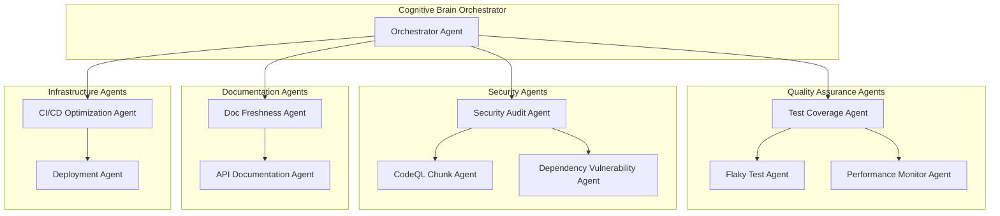
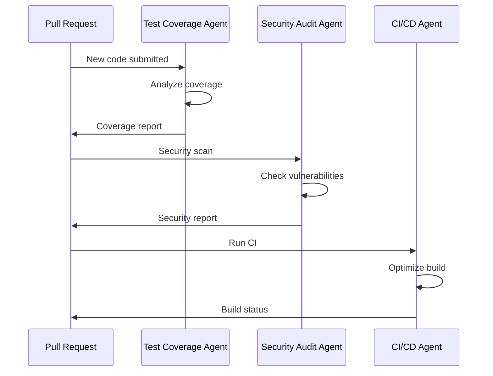
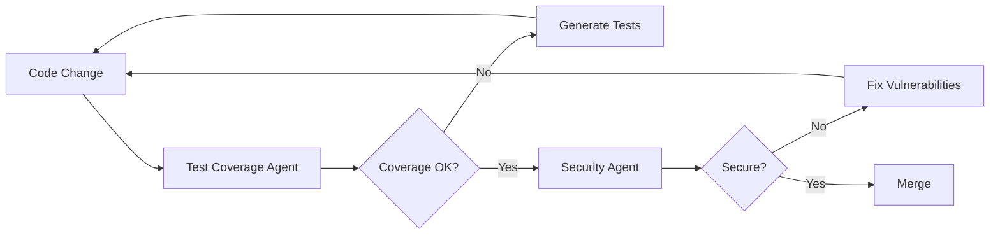

# Custom AI Agent Specifications

**Version:** 1.0.0  
**Created:** 2026-01-18  
**Source:** Phases 11-18 Implementation Patterns

---

## Overview

Based on the comprehensive work completed in Phases 11-18 (1425+ tests, 95% coverage threshold), the following custom AI agents should be produced to maintain and enhance the codebase quality.

---

## Agent Architecture



---

## Agent Specifications

### 1. Test Coverage Agent

**ID:** `test-coverage-agent`  
**Phase Origin:** 14.0-14.4  
**Priority:** Critical

#### Purpose
Automatically identify uncovered code paths and generate targeted tests to maintain and improve coverage thresholds.

#### Capabilities
- Analyze pytest coverage reports (XML, JSON, HTML)
- Identify uncovered lines, branches, and functions
- Generate test templates following repository patterns
- Prioritize tests by complexity and risk
- Track coverage trends over time

#### Inputs
- Coverage reports (`coverage.xml`, `.coverage`)
- Source code files
- Existing test patterns

#### Outputs
- Generated test files
- Coverage gap reports
- Priority matrix updates

#### Triggers
- Coverage drops below threshold
- New code without tests
- PR review requests

#### Implementation Notes
```yaml
# .github/agents/test-coverage-agent.yml
name: test-coverage-agent
description: Monitors test coverage, identifies gaps, generates targeted tests
tools:
  - grep
  - glob
  - view
  - create
  - bash
triggers:
  - coverage_threshold_breach
  - new_code_without_tests
  - scheduled_weekly
```

---

### 2. Security Audit Agent

**ID:** `security-audit-agent`  
**Phase Origin:** 14.2, 16.3  
**Priority:** Critical

#### Purpose
Continuous security scanning, vulnerability detection, and remediation guidance.

#### Capabilities
- CVE monitoring for all dependencies
- Denylist pattern management
- Input sanitization validation
- Secret detection and rotation alerts
- Security test generation

#### Inputs
- `pyproject.toml`, `requirements.txt`
- GitHub Security Advisories
- CodeQL SARIF results
- pip-audit reports

#### Outputs
- Vulnerability reports
- Remediation PRs
- Security test updates
- Denylist updates

#### Triggers
- New dependency added
- CVE published
- Security scan failure
- Scheduled daily

#### Implementation Notes
```yaml
# .github/agents/security-audit-agent.yml
name: security-audit-agent
description: Scans for vulnerabilities, manages denylists, validates sanitization
tools:
  - gh-advisory-database
  - grep
  - view
  - edit
  - bash
triggers:
  - dependency_change
  - cve_published
  - scheduled_daily
```

---

### 3. CodeQL Chunk Agent

**ID:** `codeql-chunk-agent`  
**Phase Origin:** 19.0  
**Priority:** High

#### Purpose
Manage CodeQL analysis for large repositories exceeding the 10MB function size limit.

#### Capabilities
- Calculate directory sizes
- Determine optimal chunk boundaries
- Execute chunked CodeQL scans
- Merge SARIF results
- Monitor chunk growth and warn on threshold

#### Inputs
- Repository file structure
- Size limit configuration (10MB)
- CodeQL configuration

#### Outputs
- Chunk configuration
- Merged SARIF reports
- Size monitoring alerts
- Optimized workflow files

#### Triggers
- CodeQL size limit exceeded
- Repository structure changes
- Scheduled weekly scan

#### Implementation Notes
```yaml
# .github/agents/codeql-chunk-agent.yml
name: codeql-chunk-agent
description: Manages CodeQL chunked analysis for large repositories
tools:
  - bash
  - view
  - create
  - edit
triggers:
  - codeql_size_exceeded
  - repository_growth
  - scheduled_weekly
config:
  size_limit_bytes: 10000000
  warning_threshold_bytes: 8000000
  chunk_paths:
    - src/codex/
    - src/codex_ml/
    - agents/
    - training/
    - scripts/
```

---

### 4. Performance Monitor Agent

**ID:** `performance-monitor-agent`  
**Phase Origin:** 15.0, 17.3  
**Priority:** Medium

#### Purpose
Track and optimize test and code performance, identifying bottlenecks and regressions.

#### Capabilities
- Benchmark test execution times
- Detect slow tests (>5s)
- Monitor memory usage patterns
- Identify parallelization opportunities
- Track performance trends

#### Inputs
- pytest timing reports
- CI job durations
- Memory profiles
- Historical performance data

#### Outputs
- Performance dashboards
- Slow test reports
- Optimization recommendations
- Benchmark baselines

#### Triggers
- Test suite >10% slower
- Memory usage spike
- Scheduled weekly

#### Implementation Notes
```yaml
# .github/agents/performance-monitor-agent.yml
name: performance-monitor-agent
description: Tracks test performance, identifies slow tests, recommends optimizations
tools:
  - bash
  - view
  - grep
triggers:
  - performance_regression
  - scheduled_weekly
thresholds:
  slow_test_seconds: 5
  suite_slowdown_percent: 10
```

---

### 5. Flaky Test Agent (Reliability Agent)

**ID:** `flaky-test-agent`  
**Phase Origin:** 17.2  
**Priority:** High

#### Purpose
Detect, track, and remediate flaky tests that cause intermittent CI failures.

#### Capabilities
- Track test pass/fail history
- Identify flaky patterns (pass rate <95%)
- Categorize flakiness causes
- Implement retry strategies
- Generate stability dashboards

#### Inputs
- pytest-rerunfailures reports
- CI job history
- Test execution logs

#### Outputs
- Flaky test reports
- Stability metrics
- Quarantine recommendations
- Fix suggestions

#### Triggers
- Test fails then passes on rerun
- Pass rate drops below threshold
- Scheduled analysis

#### Implementation Notes
```yaml
# .github/agents/flaky-test-agent.yml
name: flaky-test-agent
description: Detects and manages flaky tests, tracks reliability metrics
tools:
  - bash
  - view
  - grep
  - github-mcp-server-actions_list
triggers:
  - test_rerun_passed
  - reliability_threshold_breach
thresholds:
  min_pass_rate: 0.95
  flaky_detection_window_days: 7
```

---

### 6. Documentation Freshness Agent

**ID:** `doc-freshness-agent`  
**Phase Origin:** 16.0, 17.0  
**Priority:** Medium

#### Purpose
Ensure documentation stays current with code changes.

#### Capabilities
- Validate code examples in documentation
- Check for stale API references
- Verify link integrity
- Detect outdated configuration examples
- Generate freshness reports

#### Inputs
- docs/ directory
- README.md
- API source code
- mkdocs.yml

#### Outputs
- Freshness reports
- Broken link lists
- Update recommendations
- Auto-fix PRs for simple issues

#### Triggers
- Code changes without doc updates
- MkDocs build warnings
- Scheduled weekly

#### Implementation Notes
```yaml
# .github/agents/doc-freshness-agent.yml
name: doc-freshness-agent
description: Validates documentation freshness, checks links, verifies examples
tools:
  - view
  - grep
  - glob
  - bash
triggers:
  - code_change_without_doc
  - mkdocs_warnings
  - scheduled_weekly
```

---

### 7. Dependency Vulnerability Agent

**ID:** `dependency-vulnerability-agent`  
**Phase Origin:** 17.4, 18.2  
**Priority:** Critical

#### Purpose
Automated dependency vulnerability scanning and update management.

#### Capabilities
- Scan dependencies for known CVEs
- Generate update recommendations
- Detect breaking changes
- Validate compatibility
- Create update PRs

#### Inputs
- pyproject.toml
- requirements.txt
- pip-audit reports
- GitHub Dependabot alerts

#### Outputs
- Vulnerability reports
- Safe update PRs
- Breaking change warnings
- Compatibility matrices

#### Triggers
- New CVE published
- Dependency update available
- Scheduled daily

#### Implementation Notes
```yaml
# .github/agents/dependency-vulnerability-agent.yml
name: dependency-vulnerability-agent
description: Scans dependencies for vulnerabilities, manages updates
tools:
  - gh-advisory-database
  - bash
  - view
  - edit
triggers:
  - cve_published
  - dependency_outdated
  - scheduled_daily
```

---

### 8. CI/CD Optimization Agent

**ID:** `cicd-optimization-agent`  
**Phase Origin:** 18.2, 18.3  
**Priority:** Medium

#### Purpose
Optimize CI/CD pipeline performance, reduce build times, improve reliability.

#### Capabilities
- Cache hit rate optimization
- Parallel job scheduling
- Failure root cause analysis
- Build time trending
- Resource utilization monitoring

#### Inputs
- Workflow run logs
- Cache statistics
- Job timing data
- Failure patterns

#### Outputs
- Optimization recommendations
- Cache key suggestions
- Parallelization plans
- Failure analysis reports

#### Triggers
- Build time regression
- Cache miss rate increase
- Repeated failures
- Scheduled weekly

#### Implementation Notes
```yaml
# .github/agents/cicd-optimization-agent.yml
name: cicd-optimization-agent
description: Optimizes CI/CD pipelines, improves cache usage, analyzes failures
tools:
  - github-mcp-server-actions_list
  - github-mcp-server-get_job_logs
  - view
  - edit
triggers:
  - build_time_regression
  - cache_miss_spike
  - repeated_failure
```

---

## Agent Interaction Patterns

### Cascade Pattern


### Feedback Loop Pattern


---

## Implementation Priority

| Priority | Agent | Phase | Effort |
|----------|-------|-------|--------|
| 1 | Security Audit Agent | 19.1 | High |
| 2 | CodeQL Chunk Agent | 19.0 | Medium |
| 3 | Test Coverage Agent | 19.1 | High |
| 4 | Dependency Vulnerability Agent | 19.1 | Medium |
| 5 | Flaky Test Agent | 19.2 | Medium |
| 6 | Performance Monitor Agent | 19.2 | Low |
| 7 | Doc Freshness Agent | 19.3 | Low |
| 8 | CI/CD Optimization Agent | 19.3 | Medium |

---

## Success Metrics

| Agent | Metric | Target |
|-------|--------|--------|
| Test Coverage | Coverage % | ≥95% |
| Security Audit | CVE response time | <24h |
| CodeQL Chunk | Scan success rate | 100% |
| Performance Monitor | Slow test count | <10 |
| Flaky Test | Pass rate | ≥99% |
| Doc Freshness | Stale doc count | 0 |
| Dependency | Update lag | <7 days |
| CI/CD | Build time | <10 min |

---

**Owner:** AI Agent Development Team  
**Review Cadence:** Weekly  
**Last Updated:** 2026-01-18
