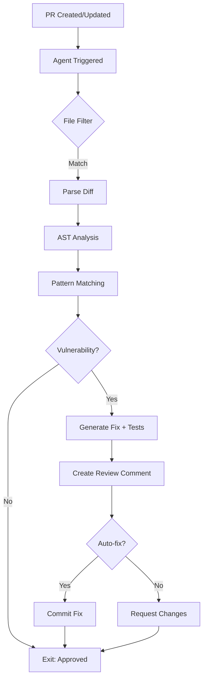

# Custom Agent: Security Input Validator
**Version**: 1.0.0  
**Status**: Design Complete - Ready for Implementation  
**Priority**: P0 (Critical)  
**Owner**: Security Team

## Agent Specification

### Overview
Autonomous agent that validates all user inputs across the codebase for security risks including command injection, path traversal, SQL injection, XSS, and other OWASP Top 10 vulnerabilities.

### Capabilities
1. **Command Injection Detection** - Pattern matching for shell metacharacters, subprocess usage analysis
2. **Path Traversal Detection** - Relative path patterns, absolute path validation
3. **SQL Injection Detection** - SQL keyword patterns, parameterized query validation
4. **XSS Prevention** - HTML/JavaScript payload detection, output encoding verification
5. **LDAP Injection Detection** - LDAP filter metacharacters, DN validation patterns

---

## Quick Start

### Usage in GitHub Actions
```yaml
- name: Security Input Validator
  uses: ./.github/agents/security-input-validator
  with:
    severity-threshold: MEDIUM
    auto-fix: true
```

### Pre-commit Hook
```bash
pip install pre-commit
pre-commit install
```

---

## Architecture Diagram



---

## Example Detection

### Command Injection
```python
# BEFORE (Vulnerable)
subprocess.run(f"echo {user_input}", shell=True)

# AFTER (Fixed by Agent)
_validate_input(user_input)  # Added validation
subprocess.run(["echo", user_input], check=True)  # List args, no shell
```

### Generated Test
```python
def test_command_injection_blocked():
    with pytest.raises(ValueError, match="shell metacharacters"):
        run_command("; rm -rf /")
```

---

## Configuration

See [SPEC.md](./SPEC.md) for full specification and configuration options.

### Quick Config
```yaml
# .codex/agents/security-input-validator.yaml
enabled: true
severity_thresholds:
  block_merge: [CRITICAL, HIGH]
auto_fix:
  enabled: true
test_generation:
  enabled: true
  coverage_target: 95
```

---

## Success Metrics
- **Detection Rate**: 95%+ of OWASP Top 10 vulnerabilities
- **False Positive Rate**: < 5%
- **Mean Time to Fix**: < 1 hour (with auto-fix)

---

**Status**: ⏳ Ready for Implementation  
**Full Spec**: [SPEC.md](./SPEC.md)
