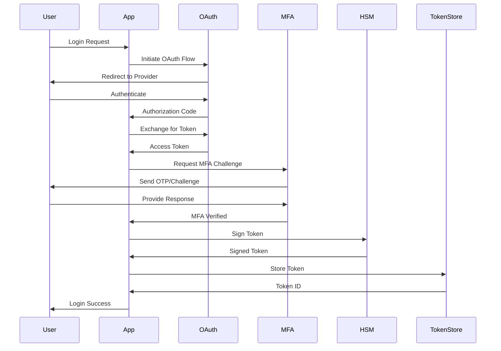
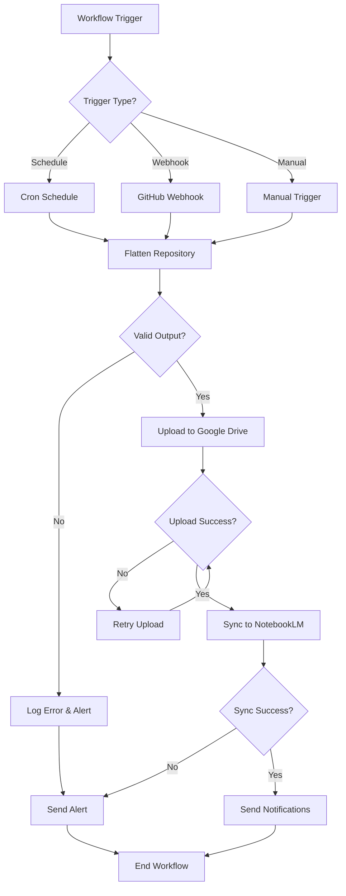
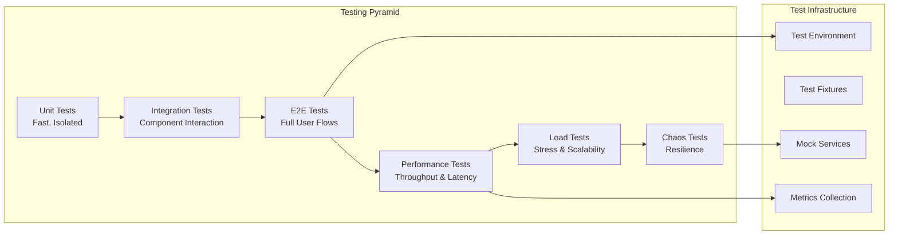
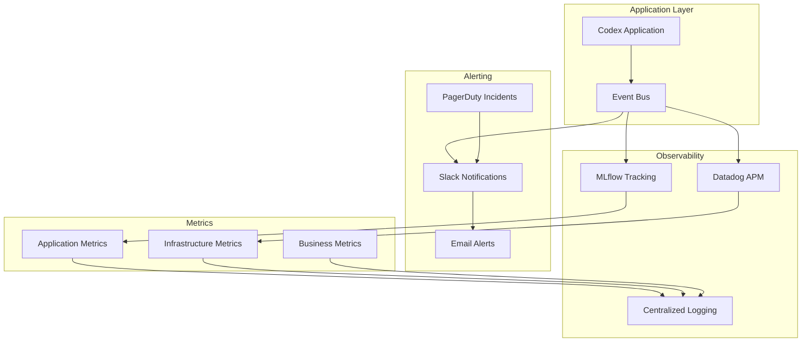

# Phase 11.x - Advanced Features & Integrations - Comprehensive Planning

**Status**: Planning Phase  
**Target Duration**: 56-71 hours total  
**Priority**: High (4 initiatives) + Medium (3 initiatives)  
**Prerequisites**: Phase 10.2 complete ✅  
**Start Date**: TBD (Post Phase 10.2 merge)

---

## Executive Summary

Phase 11.x represents a significant expansion of the _codex_ platform with advanced authentication, workflow automation, comprehensive testing, and enterprise integrations. This document provides complete planning artifacts for seamless execution.

### Key Objectives

1. **Advanced Authentication** - OAuth2, MFA, HSM integration (8-10 hours)
2. **Workflow Automation** - Google Drive, NotebookLM sync (8-10 hours)
3. **Testing Expansion** - E2E, performance, chaos testing (8-10 hours)
4. **Integration Expansion** - MLflow, Slack, PagerDuty, Datadog (8-10 hours)
5. **Security Enhancements** - Rotation, compliance, auditing (8-10 hours)
6. **Custom Agent Development** - 4 specialized agents (8-11 hours)
7. **Production Deployment** - Automation & monitoring (8-10 hours)

---

## Architecture Overview

```mermaid
graph TB
    subgraph "Phase 11.x Architecture"
        Auth[Advanced Authentication]
        Workflow[Workflow Automation]
        Testing[Testing Framework]
        Integration[Enterprise Integrations]
        Security[Security Layer]
        Agents[Custom Agents]
        Deploy[Deployment Pipeline]

        Auth --> Security
        Workflow --> Integration
        Testing --> Deploy
        Agents --> Integration
        Security --> Deploy
    end

    subgraph "Authentication Layer"
        OAuth[OAuth2 Provider]
        MFA[MFA Service]
        HSM[HSM Integration]
        TokenMgr[Token Manager]

        OAuth --> TokenMgr
        MFA --> TokenMgr
        HSM --> TokenMgr
    end

    subgraph "Workflow Layer"
        GDrive[Google Drive API]
        NotebookLM[NotebookLM Sync]
        Scheduler[Workflow Scheduler]
        Webhooks[Webhook Handler]

        GDrive --> Scheduler
        NotebookLM --> Scheduler
        Webhooks --> Scheduler
    end

    subgraph "Testing Layer"
        E2E[E2E Tests]
        Perf[Performance Tests]
        Chaos[Chaos Engineering]
        Load[Load Testing]

        E2E --> Load
        Perf --> Load
        Chaos --> Perf
    end

    subgraph "Integration Layer"
        MLflow[MLflow Tracking]
        Slack[Slack Notifications]
        PagerDuty[PagerDuty Alerts]
        Datadog[Datadog Metrics]

        MLflow --> Datadog
        Slack --> PagerDuty
    end
```

---

## Priority 1: Advanced Authentication (8-10 hours)

### Overview
Implement enterprise-grade authentication with OAuth2, MFA, and HSM support for production security.

### System Design

### Implementation Plan

#### Files to Create
1. **`src/codex/auth/oauth_manager.py`** (300 lines)
   - OAuth2 flow implementation
   - Provider configuration (Google, GitHub, Azure AD)
   - Token exchange and refresh
   - PKCE support

2. **`src/codex/auth/mfa_provider.py`** (200 lines)
   - TOTP generation and validation
   - SMS/Email OTP support
   - Backup codes generation
   - Recovery mechanisms

3. **`src/codex/auth/token_manager.py`** (250 lines)
   - JWT generation and validation
   - Token rotation and expiry
   - Revocation list management
   - Session management

4. **`src/codex/auth/hsm_integration.py`** (150 lines)
   - HSM connection management
   - Key signing operations
   - Certificate management
   - PKCS#11 interface

5. **`tests/auth/test_oauth_flow.py`** (400 lines)
   - OAuth flow testing
   - Token lifecycle tests
   - Error handling validation
   - Security edge cases

6. **`tests/auth/test_mfa_provider.py`** (300 lines)
   - MFA challenge tests
   - TOTP validation
   - Backup code tests
   - Recovery flow validation

#### Configuration
- **OAuth Providers**: Google, GitHub, Azure AD, Okta
- **MFA Methods**: TOTP (Google Authenticator), SMS, Email
- **HSM**: AWS CloudHSM, Azure Key Vault, On-premise PKCS#11
- **Token Expiry**: Access (15 min), Refresh (7 iterations), Session (30 iterations)

#### Security Considerations
- PKCE for public clients
- State parameter for CSRF protection
- Secure token storage (encrypted at rest)
- Rate limiting on authentication endpoints
- Audit logging for all auth events

---

## Priority 2: Workflow Automation (8-10 hours)

### Overview
Automate repository flattening, Google Drive uploads, and NotebookLM synchronization for seamless knowledge management.

### System Design

### Implementation Plan

#### Files to Create
1. **`.github/workflows/flatten-repo-auto-sync.yml`** (350 lines)
   - per-phase scheduled runs
   - Webhook triggers on push/PR
   - Manual workflow dispatch
   - Multi-format generation (XML, MD, TXT)

2. **`.github/workflows/notebooklm-integration.yml`** (280 lines)
   - Automatic sync after flatten
   - Incremental update support
   - Conflict resolution
   - Version tracking

3. **`scripts/phase11/auto_upload_gdrive.py`** (400 lines)
   - Google Drive API integration
   - OAuth2 authentication
   - Folder organization
   - Version management
   - Cleanup old versions

4. **`scripts/phase11/notebooklm_sync.py`** (350 lines)
   - NotebookLM API client
   - Document indexing
   - Metadata management
   - Sync status tracking

5. **`src/codex/workflow/scheduler.py`** (300 lines)
   - Workflow orchestration
   - Dependency management
   - Error handling
   - Retry logic with exponential backoff

6. **`src/codex/workflow/webhook_handler.py`** (250 lines)
   - GitHub webhook validation
   - Event filtering
   - Workflow triggering
   - Security signature verification

#### Integration Points
- **Google Drive API**: v3, OAuth2 scopes (drive.file)
- **NotebookLM API**: Custom integration
- **GitHub Actions**: Workflow dispatch events
- **Slack/Email**: Notification channels

#### Automation Features
- **Scheduled Runs**: Weekly on Sunday 2 AM UTC
- **Incremental Updates**: Only changed files
- **Conflict Resolution**: Last-write-wins with audit
- **Retention**: Keep last 10 versions, 90 iteration cleanup

---

## Priority 3: Testing Expansion (8-10 hours)

### Overview
Comprehensive testing framework with E2E, performance, load, and chaos engineering tests.

### System Design

### Implementation Plan

#### Files to Create
1. **`tests/e2e/test_secrets_workflow.py`** (500 lines)
   - Full secrets management flow
   - User authentication scenarios
   - Secret rotation end-to-end
   - Error recovery paths

2. **`tests/e2e/test_agent_workflows.py`** (450 lines)
   - Custom agent execution
   - Multi-step workflows
   - Agent communication
   - Result validation

3. **`tests/performance/benchmark_suite.py`** (600 lines)
   - Throughput benchmarks
   - Latency measurements
   - Resource utilization
   - Baseline comparison

4. **`tests/performance/load_test_scenarios.py`** (550 lines)
   - Concurrent user simulation
   - Spike load testing
   - Sustained load testing
   - Graceful degradation

5. **`tests/chaos/resilience_tests.py`** (500 lines)
   - Network partition simulation
   - Service failure injection
   - Resource exhaustion
   - Recovery validation

6. **`.github/workflows/performance-tests.yml`** (300 lines)
   - Performance test automation
   - Benchmark comparison
   - Regression detection
   - Alert on degradation

#### Testing Tools
- **E2E**: Playwright, Selenium
- **Performance**: Locust, JMeter
- **Load**: Artillery, K6
- **Chaos**: Chaos Monkey, Pumba
- **Metrics**: Prometheus, Grafana

#### Test Coverage Targets
- **Unit Tests**: 90%+ coverage
- **Integration Tests**: 80%+ coverage
- **E2E Tests**: Critical user paths (100%)
- **Performance**: <200ms p95 latency
- **Load**: 1000+ concurrent users

---

## Priority 4: Integration Expansion (8-10 hours)

### Overview
Enterprise integrations for observability, alerting, and experiment tracking.

### System Design

### Implementation Plan

#### Files to Create
1. **`src/codex/integrations/mlflow_tracker.py`** (400 lines)
   - Experiment tracking
   - Parameter logging
   - Metric recording
   - Artifact management
   - Model registry integration

2. **`src/codex/integrations/slack_notifier.py`** (300 lines)
   - Webhook integration
   - Message formatting
   - Thread management
   - Rich media attachments
   - Interactive components

3. **`src/codex/integrations/pagerduty_client.py`** (280 lines)
   - Incident creation
   - Severity mapping
   - Escalation policies
   - Acknowledgment tracking
   - Auto-resolution

4. **`src/codex/integrations/datadog_metrics.py`** (350 lines)
   - Custom metrics
   - APM tracing
   - Log aggregation
   - Dashboard creation
   - Alert configuration

5. **`.github/workflows/monitoring-setup.yml`** (250 lines)
   - Integration deployment
   - Configuration validation
   - Health checks
   - Rollback procedures

6. **`tests/integrations/test_mlflow_tracking.py`** (400 lines)
   - Experiment tracking tests
   - Metric validation
   - Artifact upload tests
   - Error handling

#### Integration Configuration
- **MLflow**: Self-hosted or Databricks
- **Slack**: Workspace with app permissions
- **PagerDuty**: Service integration keys
- **Datadog**: API key and app key

#### Metrics & Alerts
- **Application Metrics**: Request rate, error rate, latency
- **Infrastructure Metrics**: CPU, memory, disk, network
- **Business Metrics**: User signups, task completions, errors
- **Alert Thresholds**: Error rate >1%, latency >500ms, failure >5%

---

## Priority 5: Security Enhancements (8-10 hours)

### Overview
Advanced security features including automated secret rotation, vulnerability scanning, and compliance reporting.

### Implementation Plan

#### Files to Create
1. **`src/codex/security/secret_rotation.py`** (350 lines)
   - Automated rotation scheduler
   - Zero-downtime rotation
   - Rollback mechanisms
   - Audit logging

2. **`src/codex/security/vulnerability_scanner.py`** (400 lines)
   - Snyk/Trivy integration
   - Dependency scanning
   - Container scanning
   - Report generation

3. **`src/codex/security/compliance_reporter.py`** (450 lines)
   - SOC 2 compliance checks
   - GDPR audit reports
   - HIPAA validation
   - Evidence collection

4. **`scripts/phase11/penetration_test.py`** (500 lines)
   - Automated pen testing
   - OWASP Top 10 checks
   - SQL injection tests
   - XSS validation

---

## Priority 6: Custom Agent Development (8-11 hours)

### Overview
Four specialized agents for code migration, merge conflicts, documentation, and performance optimization.

### Agents to Create

#### 1. Code Migration Agent
- **Purpose**: Automate codebase migrations (Python 2→3, framework upgrades)
- **File**: `.github/agents/code-migration-agent.agent.yml`
- **Lines**: ~2000 lines (including scripts)

#### 2. Merge Conflict Resolver Agent
- **Purpose**: Intelligent merge conflict resolution with context awareness
- **File**: `.github/agents/merge-conflict-resolver-agent.agent.yml`
- **Lines**: ~1800 lines

#### 3. Documentation Generator Agent
- **Purpose**: Automated API docs, README generation, changelog
- **File**: `.github/agents/documentation-generator-agent.agent.yml`
- **Lines**: ~1500 lines

#### 4. Performance Optimization Agent
- **Purpose**: Identify performance bottlenecks, suggest optimizations
- **File**: `.github/agents/performance-optimizer-agent.agent.yml`
- **Lines**: ~1600 lines

---

## Priority 7: Production Deployment (8-10 hours)

### Overview
Automated deployment pipeline with blue-green deployments, canary releases, and comprehensive monitoring.

### Implementation Plan

#### Files to Create
1. **`.github/workflows/production-deploy.yml`** (500 lines)
2. **`scripts/phase11/deploy_manager.py`** (600 lines)
3. **`infrastructure/kubernetes/deployments.yaml`** (400 lines)
4. **`infrastructure/terraform/main.tf`** (500 lines)

---

## Execution Timeline

### Week 1 (16-20 hours)
- Days 1-2: Advanced Authentication
- Days 3-4: Workflow Automation

### Week 2 (16-20 hours)
- Days 1-2: Testing Expansion
- Days 3-4: Integration Expansion

### Week 3 (16-20 hours)
- Days 1-2: Security Enhancements
- Days 3-4: Custom Agent Development

### Week 4 (8-11 hours)
- Days 1-2: Production Deployment
- Day 3: Integration testing & validation

---

## Success Criteria

### Functional Requirements
- ✅ All authentication flows working (OAuth, MFA, HSM)
- ✅ Automated workflow execution (flatten, upload, sync)
- ✅ Comprehensive test coverage (E2E, performance, chaos)
- ✅ All integrations operational (MLflow, Slack, PagerDuty, Datadog)
- ✅ Security enhancements deployed (rotation, scanning, compliance)
- ✅ 4 custom agents functional
- ✅ Production deployment automated

### Non-Functional Requirements
- ✅ <200ms p95 latency
- ✅ 99.9% uptime
- ✅ Zero-downtime deployments
- ✅ Automated rollback on failures
- ✅ Comprehensive monitoring and alerting
- ✅ SOC 2 / GDPR compliant

---

## Risk Mitigation

### High-Risk Areas
1. **OAuth Integration**: Test with multiple providers
2. **HSM Integration**: Fallback to software keys
3. **Google Drive API**: Rate limiting and quotas
4. **Chaos Testing**: Isolated test environment
5. **Production Deployment**: Staged rollout

### Mitigation Strategies
- Feature flags for gradual rollout
- Comprehensive integration tests
- Staging environment validation
- Automated rollback procedures
- 24/7 monitoring and alerts

---

## Dependencies & Prerequisites

### External Services
- Google Cloud Platform (Drive API, OAuth)
- AWS (CloudHSM, S3)
- MLflow (self-hosted or Databricks)
- Slack workspace
- PagerDuty account
- Datadog account

### Internal Dependencies
- Phase 10.2 merged ✅
- Security utilities operational ✅
- CI/CD pipeline stable ✅
- Test infrastructure ready ✅

---

## Next Steps

1. **Review & Approval**: Stakeholder sign-off on plan
2. **Environment Setup**: Provision required services
3. **Sprint Planning**: Break down into 2 phase sprints
4. **Team Assignment**: Assign owners to each priority
5. **Kickoff Meeting**: Align on goals and timeline

---

**Document Version**: 1.0  
**Last Updated**: 2026-01-15  
**Author**: GitHub Copilot  
**Status**: Ready for Execution
